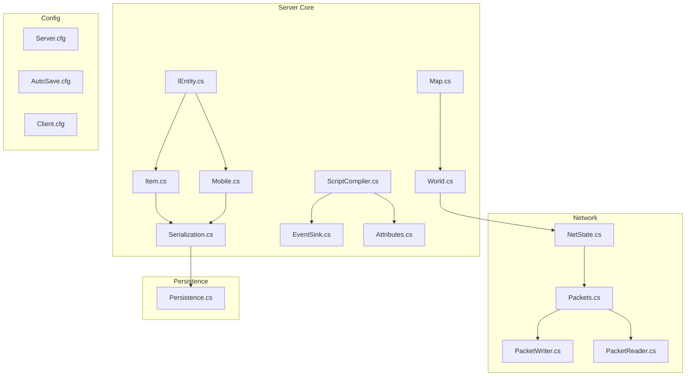
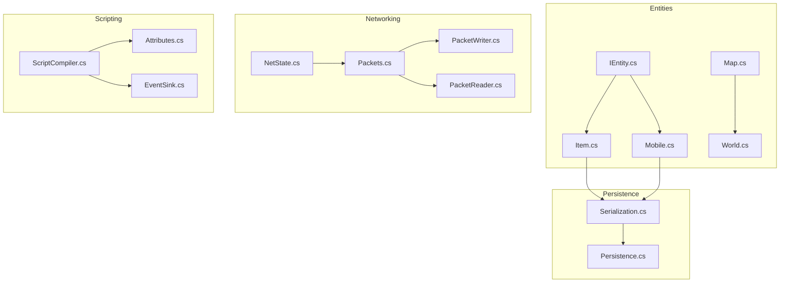
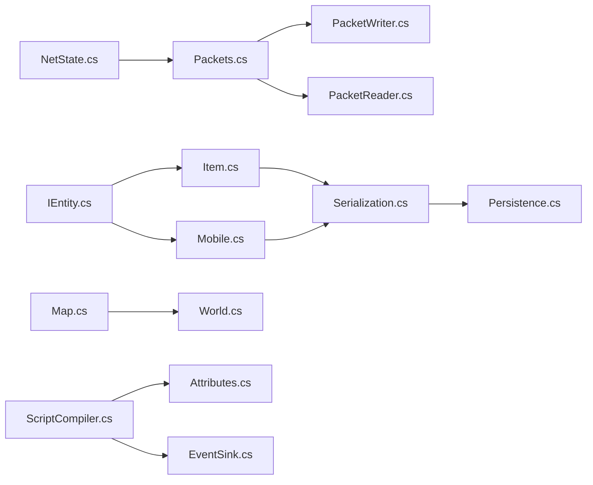
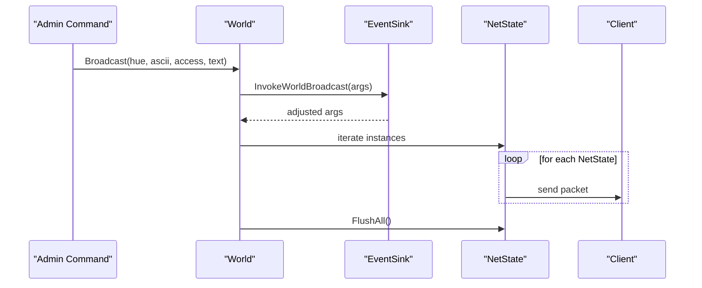
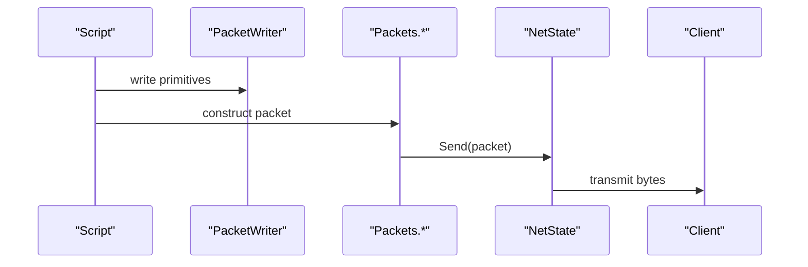
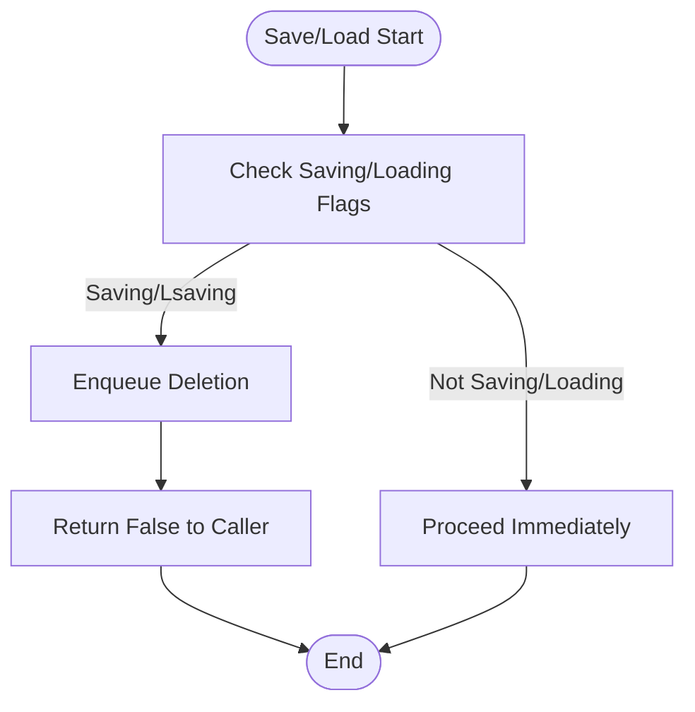

# API Reference

<cite>
**Referenced Files in This Document**
- [README.md](file://README.md)
- [IEntity.cs](file://Server/IEntity.cs)
- [Item.cs](file://Server/Item.cs)
- [Mobile.cs](file://Server/Mobile.cs)
- [Map.cs](file://Server/Map.cs)
- [World.cs](file://Server/World.cs)
- [NetState.cs](file://Server/Network/NetState.cs)
- [Packets.cs](file://Server/Network/Packets.cs)
- [PacketWriter.cs](file://Server/Network/PacketWriter.cs)
- [PacketReader.cs](file://Server/Network/PacketReader.cs)
- [Serialization.cs](file://Server/Serialization.cs)
- [Persistence.cs](file://Server/Persistence/Persistence.cs)
- [ScriptCompiler.cs](file://Server/ScriptCompiler.cs)
- [EventSink.cs](file://Server/EventSink.cs)
- [Attributes.cs](file://Server/Attributes.cs)
- [Server.cfg](file://Config/Server.cfg)
- [AutoSave.cfg](file://Config/AutoSave.cfg)
- [Client.cfg](file://Config/Client.cfg)
</cite>

## Table of Contents
1. [Introduction](#introduction)
2. [Project Structure](#project-structure)
3. [Core Components](#core-components)
4. [Architecture Overview](#architecture-overview)
5. [Detailed Component Analysis](#detailed-component-analysis)
6. [Dependency Analysis](#dependency-analysis)
7. [Performance Considerations](#performance-considerations)
8. [Troubleshooting Guide](#troubleshooting-guide)
9. [Conclusion](#conclusion)
10. [Appendices](#appendices)

## Introduction
This document provides API documentation for ServUO’s core server APIs and extension points. It covers:
- Public interfaces for entity manipulation (items and mobiles)
- World management functions (broadcast, save/load coordination)
- Network communication methods (packet encoding, throttling, client versioning)
- Persistence operations (serialization/deserialization, save strategies)
- Scripting API surface (compilation, invocation, attributes, events)
- Protocol-specific examples and client implementation guidelines
- Versioning, compatibility, and migration guidance

The goal is to enable developers to integrate with the server, extend functionality via scripts, and implement clients that interoperate reliably with ServUO.

## Project Structure
ServUO is organized into core runtime libraries, configuration, data definitions, and script assemblies. The most relevant API surfaces for this document reside under:
- Server: core runtime (entities, world, networking, persistence, scripting)
- Server/Network: packet pipeline, throttling, client state
- Server/Persistence: save strategies and file I/O helpers
- Scripts: extensibility and gameplay logic
- Config: server configuration files

**Diagram sources**
- [IEntity.cs](file://Server/IEntity.cs#L1-L106)
- [Item.cs](file://Server/Item.cs#L1-L200)
- [Mobile.cs](file://Server/Mobile.cs#L1-L200)
- [Map.cs](file://Server/Map.cs#L1-L200)
- [World.cs](file://Server/World.cs#L1-L200)
- [Serialization.cs](file://Server/Serialization.cs#L1-L200)
- [ScriptCompiler.cs](file://Server/ScriptCompiler.cs#L1-L200)
- [EventSink.cs](file://Server/EventSink.cs#L605-L673)
- [NetState.cs](file://Server/Network/NetState.cs#L1-L200)
- [Packets.cs](file://Server/Network/Packets.cs#L1-L200)
- [PacketWriter.cs](file://Server/Network/PacketWriter.cs#L1-L200)
- [PacketReader.cs](file://Server/Network/PacketReader.cs#L1-L200)
- [Persistence.cs](file://Server/Persistence/Persistence.cs#L1-L119)
- [Server.cfg](file://Config/Server.cfg)
- [AutoSave.cfg](file://Config/AutoSave.cfg)
- [Client.cfg](file://Config/Client.cfg)

**Section sources**
- [README.md](file://README.md#L1-L60)

## Core Components
This section outlines the primary public interfaces and their responsibilities.

- IEntity and Entity: Base contract for serializable world objects with position, hue, deletion semantics, and property invalidation hooks.
- Item: Extends entity with layers, properties, OPL caching, and container behavior.
- Mobile: Player/NPC abstraction with skills, stats, targeting, prompts, and effects.
- Map: Spatial indexing, pooled enumerators, and range-based queries for entities, clients, and items.
- World: Global registry of items/mobiles, save/load coordination, broadcast, and disk-wait synchronization.
- NetState: Per-client connection state, client version detection, protocol change flags, and packet encoder/encryptor hooks.
- Packets: Built-in packet classes for damage, secure trade, arrows, and more.
- PacketWriter/PacketReader: Binary primitives for constructing and parsing packets efficiently.
- Serialization: GenericReader/GenericWriter abstractions for typed persistence.
- Persistence: Helper methods to serialize/deserialize to/from files with robust error handling.
- ScriptCompiler: Dynamic compilation of scripts, assembly discovery, and method invocation across assemblies.
- EventSink: Event model for connect/disconnect, logout, animate requests, and more.

**Section sources**
- [IEntity.cs](file://Server/IEntity.cs#L1-L106)
- [Item.cs](file://Server/Item.cs#L1-L200)
- [Item.cs](file://Server/Item.cs#L2231-L2279)
- [Mobile.cs](file://Server/Mobile.cs#L1-L200)
- [Map.cs](file://Server/Map.cs#L1-L200)
- [Map.cs](file://Server/Map.cs#L615-L747)
- [World.cs](file://Server/World.cs#L1-L200)
- [NetState.cs](file://Server/Network/NetState.cs#L1-L200)
- [Packets.cs](file://Server/Network/Packets.cs#L1-L200)
- [PacketWriter.cs](file://Server/Network/PacketWriter.cs#L1-L200)
- [PacketReader.cs](file://Server/Network/PacketReader.cs#L1-L200)
- [Serialization.cs](file://Server/Serialization.cs#L1-L200)
- [Persistence.cs](file://Server/Persistence/Persistence.cs#L1-L119)
- [ScriptCompiler.cs](file://Server/ScriptCompiler.cs#L1-L200)
- [EventSink.cs](file://Server/EventSink.cs#L605-L673)

## Architecture Overview
The server exposes a layered API:
- Entities: Items and Mobiles implement IEntity and participate in Map spatial queries and World registries.
- Networking: NetState manages per-client state and protocol changes; Packets and PacketWriter/Reader handle binary encoding.
- Persistence: Serialization abstractions and Persistence helpers coordinate file writes/read with error handling.
- Scripting: ScriptCompiler compiles and invokes methods across loaded assemblies, using attributes and event sinks.

**Diagram sources**
- [IEntity.cs](file://Server/IEntity.cs#L1-L106)
- [Item.cs](file://Server/Item.cs#L1-L200)
- [Mobile.cs](file://Server/Mobile.cs#L1-L200)
- [Map.cs](file://Server/Map.cs#L1-L200)
- [World.cs](file://Server/World.cs#L1-L200)
- [NetState.cs](file://Server/Network/NetState.cs#L1-L200)
- [Packets.cs](file://Server/Network/Packets.cs#L1-L200)
- [PacketWriter.cs](file://Server/Network/PacketWriter.cs#L1-L200)
- [PacketReader.cs](file://Server/Network/PacketReader.cs#L1-L200)
- [Serialization.cs](file://Server/Serialization.cs#L1-L200)
- [Persistence.cs](file://Server/Persistence/Persistence.cs#L1-L119)
- [ScriptCompiler.cs](file://Server/ScriptCompiler.cs#L1-L200)
- [EventSink.cs](file://Server/EventSink.cs#L605-L673)
- [Attributes.cs](file://Server/Attributes.cs#L1-L67)

## Detailed Component Analysis

### Entity Manipulation APIs
- IEntity contract
  - Properties: Serial, Location, Map, Direction, Name, Hue, NoMoveHS, Deleted.
  - Methods: Delete(), ProcessDelta(), InvalidateProperties(), OnStatsQuery(Mobile).
- Entity base implementation
  - Implements comparison, deletion sets location/map to null.
- Item
  - Layers enumeration and layer constants.
  - Property list caching and child property propagation.
  - Example path: [OPL and PropertyList](file://Server/Item.cs#L2231-L2279)
- Mobile
  - Skill mods, targeting callbacks, prompt callbacks, and related delegates.
  - Example path: [SkillMod hierarchy](file://Server/Mobile.cs#L1-L200)

Common use cases:
- Move an entity: update Location and trigger resend via Map range queries.
- Delete an entity: call Delete(); World coordinates deletions during save/load.
- Invalidate properties: call InvalidateProperties() to refresh tooltips/client display.

Parameters and return values:
- Delete(): void; marks deleted and clears location/map.
- InvalidateProperties(): void; recomputes and caches property list.
- GetProperties/AppendChildProperties: invoked internally by PropertyList.

Error conditions:
- Deleting an already deleted entity is safe (idempotent).
- Accessing PropertyList/OPLPacket after deletion is undefined; avoid.

**Section sources**
- [IEntity.cs](file://Server/IEntity.cs#L1-L106)
- [Item.cs](file://Server/Item.cs#L1-L200)
- [Item.cs](file://Server/Item.cs#L2231-L2279)
- [Mobile.cs](file://Server/Mobile.cs#L1-L200)

### World Management Functions
- Registry and lifecycle
  - Mobiles, Items dictionaries and Data for customs.
  - Saving/Loading flags and disk-write synchronization.
- Deletion safety queue
  - OnDelete queues deletions during save/load to prevent corruption.
- Broadcast
  - World.Broadcast supports ASCII/Unicode messages filtered by access level.

Example path:
- [Broadcast flow](file://Server/World.cs#L106-L164)

Common use cases:
- Announce global message to online players above a minimum access level.
- Coordinate bulk deletions during maintenance windows.

Parameters and return values:
- Broadcast(hue, ascii, access, text): void.
- OnDelete(entity): bool; returns false when deferred to queue.

Error conditions:
- Empty or whitespace text is ignored.
- During save/load, immediate deletion returns false; caller must retry later.

**Section sources**
- [World.cs](file://Server/World.cs#L1-L200)
- [World.cs](file://Server/World.cs#L106-L164)

### Network Communication Methods
- NetState
  - Client version detection and ProtocolChanges flags.
  - Packet encoder/encryptor hooks via IPacketEncoder/IPacketEncryptor.
  - Properties for address, connection time, auth/seed, flags, encrypted state.
- Packets
  - Built-in packet classes for damage, secure trade, targeting arrows, etc.
- PacketWriter/PacketReader
  - Primitive write/read methods for binary data, fixed-length strings, and safe Unicode reads.

Protocol-specific examples:
- Damage packet construction: see [DamagePacket](file://Server/Network/Packets.cs#L82-L116)
- Secure trade display/close: see [DisplaySecureTrade](file://Server/Network/Packets.cs#L164-L184), [CloseSecureTrade](file://Server/Network/Packets.cs#L186-L196)
- Target arrow toggle: see [SetArrow/CancelArrow](file://Server/Network/Packets.cs#L129-L162)

Client implementation guidelines:
- Respect client version and apply corresponding ProtocolChanges.
- Use PacketWriter for efficient binary construction; reuse instances via pooling.
- Validate PacketReader bounds to avoid exceptions on malformed input.

**Section sources**
- [NetState.cs](file://Server/Network/NetState.cs#L1-L200)
- [Packets.cs](file://Server/Network/Packets.cs#L1-L200)
- [PacketWriter.cs](file://Server/Network/PacketWriter.cs#L1-L200)
- [PacketReader.cs](file://Server/Network/PacketReader.cs#L1-L200)

### Persistence Operations
- Serialization
  - GenericReader/GenericWriter define typed read/write methods for primitives, dates, geometry, and entity references.
- Persistence
  - Serialize(path, serializer) and Deserialize(path, deserializer) helpers with directory creation and error handling.
  - Throws meaningful exceptions on missing files when not ensured.

Common use cases:
- Save guilds, items, mobiles, and custom data to binary files.
- Load persisted data with robust error handling.

Parameters and return values:
- Serialize(path, serializer): void; creates directories and files as needed.
- Deserialize(file, deserializer, ensure): void; throws if file missing and ensure is false.

Error conditions:
- DirectoryNotFoundException if ensure is false and directory does not exist.
- FileNotFoundException if ensure is false and file does not exist.
- EndOfStreamException indicates truncated data; logged and rethrown.

**Section sources**
- [Serialization.cs](file://Server/Serialization.cs#L1-L200)
- [Persistence.cs](file://Server/Persistence/Persistence.cs#L1-L119)

### Scripting API
- ScriptCompiler
  - Dynamic compilation toggle via config; loads Scripts.dll and verifies serialization.
  - Invoke(method) finds and invokes static methods across assemblies with prioritized call order.
  - Type lookup by full name and hash computation for fast resolution.
- Attributes
  - PropertyObject, NoSort, CallPriority, and related comparer for invocation ordering.
- EventSink
  - Connect/disconnect, logout, animate request, and socket connect events.

Common use cases:
- Initialize scripts at startup by invoking specific static methods.
- Register handlers for lifecycle events.

Parameters and return values:
- Invoke(method): void; executes all matching static methods found across loaded assemblies.
- FindTypeByFullName(name): Type?; returns null if not found.

Error conditions:
- Exceptions during compilation or invocation are logged and returned as failure.

**Section sources**
- [ScriptCompiler.cs](file://Server/ScriptCompiler.cs#L1-L200)
- [Attributes.cs](file://Server/Attributes.cs#L1-L67)
- [EventSink.cs](file://Server/EventSink.cs#L605-L673)

## Dependency Analysis
The following diagram shows key dependencies among core components:

**Diagram sources**
- [IEntity.cs](file://Server/IEntity.cs#L1-L106)
- [Item.cs](file://Server/Item.cs#L1-L200)
- [Mobile.cs](file://Server/Mobile.cs#L1-L200)
- [Map.cs](file://Server/Map.cs#L1-L200)
- [World.cs](file://Server/World.cs#L1-L200)
- [NetState.cs](file://Server/Network/NetState.cs#L1-L200)
- [Packets.cs](file://Server/Network/Packets.cs#L1-L200)
- [PacketWriter.cs](file://Server/Network/PacketWriter.cs#L1-L200)
- [PacketReader.cs](file://Server/Network/PacketReader.cs#L1-L200)
- [Serialization.cs](file://Server/Serialization.cs#L1-L200)
- [Persistence.cs](file://Server/Persistence/Persistence.cs#L1-L119)
- [ScriptCompiler.cs](file://Server/ScriptCompiler.cs#L1-L200)
- [Attributes.cs](file://Server/Attributes.cs#L1-L67)
- [EventSink.cs](file://Server/EventSink.cs#L605-L673)

**Section sources**
- [Map.cs](file://Server/Map.cs#L615-L747)
- [World.cs](file://Server/World.cs#L1-L200)

## Performance Considerations
- Spatial queries
  - Map.GetObjectsInRange/GetItemsInRange/GetClientsInRange use pooled enumerables and configurable ranges. Prefer bounds-based queries to limit allocations.
- Packet I/O
  - PacketWriter supports pooling; reuse instances to reduce GC pressure.
  - PacketReader enforces bounds checks; always validate sizes before reads.
- Save/load
  - World maintains saving/loading flags and a disk-wait handle. Defer deletions during save/load to avoid corruption.
- Protocol changes
  - NetState.Version maps to ProtocolChanges; conditionally apply client-specific packet formats to minimize overhead.

[No sources needed since this section provides general guidance]

## Troubleshooting Guide
- Network
  - PacketReader.Trace logs unhandled packets for diagnostics; check logs for unexpected opcodes.
  - PacketWriter.ReleaseInstance guards against double-release; errors are logged to diagnose misuse.
- Persistence
  - Persistence.Deserialize throws on missing files when ensure is false; ensure directories and files exist or set ensure true.
  - EndOfStreamException indicates corrupted or truncated data; verify file integrity.
- Scripting
  - ScriptCompiler.Compile logs build output and exceptions; confirm Scripts.csproj builds successfully.
  - Invoke(method) executes all matches; ensure static methods exist and are public.

**Section sources**
- [PacketReader.cs](file://Server/Network/PacketReader.cs#L1-L200)
- [PacketWriter.cs](file://Server/Network/PacketWriter.cs#L1-L200)
- [Persistence.cs](file://Server/Persistence/Persistence.cs#L1-L119)
- [ScriptCompiler.cs](file://Server/ScriptCompiler.cs#L1-L200)

## Conclusion
ServUO exposes a cohesive set of APIs for entity lifecycle, world management, networking, persistence, and scripting. By leveraging pooled enumerators, structured serialization, and protocol-aware packet handling, developers can implement robust extensions and clients. Adhering to save/load coordination and error-handling patterns ensures stability and maintainability.

[No sources needed since this section summarizes without analyzing specific files]

## Appendices

### API Quick Reference

- Entity Lifecycle
  - Delete(): void
  - InvalidateProperties(): void
  - OnStatsQuery(Mobile): void
  - Example path: [Entity methods](file://Server/IEntity.cs#L83-L104)

- Item Properties
  - Layer enumeration and property list caching
  - Example path: [Layers](file://Server/Item.cs#L20-L197), [OPL/PropertyList](file://Server/Item.cs#L2231-L2279)

- Mobile Capabilities
  - Skill mods, targeting/prompt callbacks
  - Example path: [SkillMod hierarchy](file://Server/Mobile.cs#L1-L200)

- World Operations
  - Broadcast(hue, ascii, access, text): void
  - OnDelete(entity): bool
  - Example path: [Broadcast](file://Server/World.cs#L106-L164)

- Networking
  - NetState.Version -> ProtocolChanges
  - PacketWriter primitives
  - PacketReader safe reads
  - Example paths: [NetState](file://Server/Network/NetState.cs#L1-L200), [PacketWriter](file://Server/Network/PacketWriter.cs#L1-L200), [PacketReader](file://Server/Network/PacketReader.cs#L1-L200)

- Persistence
  - Serialize(path, serializer): void
  - Deserialize(file, deserializer, ensure): void
  - Example path: [Persistence](file://Server/Persistence/Persistence.cs#L1-L119)

- Scripting
  - ScriptCompiler.Invoke(method): void
  - Attributes: PropertyObject, NoSort, CallPriority
  - Example paths: [ScriptCompiler](file://Server/ScriptCompiler.cs#L1-L200), [Attributes](file://Server/Attributes.cs#L1-L67)

### Configuration Access
- Server.cfg: core server settings
- AutoSave.cfg: autosave intervals and policies
- Client.cfg: client-related settings

**Section sources**
- [Server.cfg](file://Config/Server.cfg)
- [AutoSave.cfg](file://Config/AutoSave.cfg)
- [Client.cfg](file://Config/Client.cfg)

### Sequence Diagram: World Broadcast Flow

**Diagram sources**
- [World.cs](file://Server/World.cs#L106-L164)
- [EventSink.cs](file://Server/EventSink.cs#L605-L673)

### Sequence Diagram: Packet Construction and Dispatch

**Diagram sources**
- [PacketWriter.cs](file://Server/Network/PacketWriter.cs#L1-L200)
- [Packets.cs](file://Server/Network/Packets.cs#L1-L200)
- [NetState.cs](file://Server/Network/NetState.cs#L1-L200)

### Flowchart: Save/Load Coordination

**Diagram sources**
- [World.cs](file://Server/World.cs#L72-L104)

### API Versioning and Compatibility
- Client version detection in NetState maps to ProtocolChanges for packet differences across client versions.
- Use PacketWriter/PacketReader primitives consistently to maintain binary compatibility.
- When introducing breaking changes, gate behavior behind ProtocolChanges and keep defaults aligned with widely used clients.

**Section sources**
- [NetState.cs](file://Server/Network/NetState.cs#L100-L175)