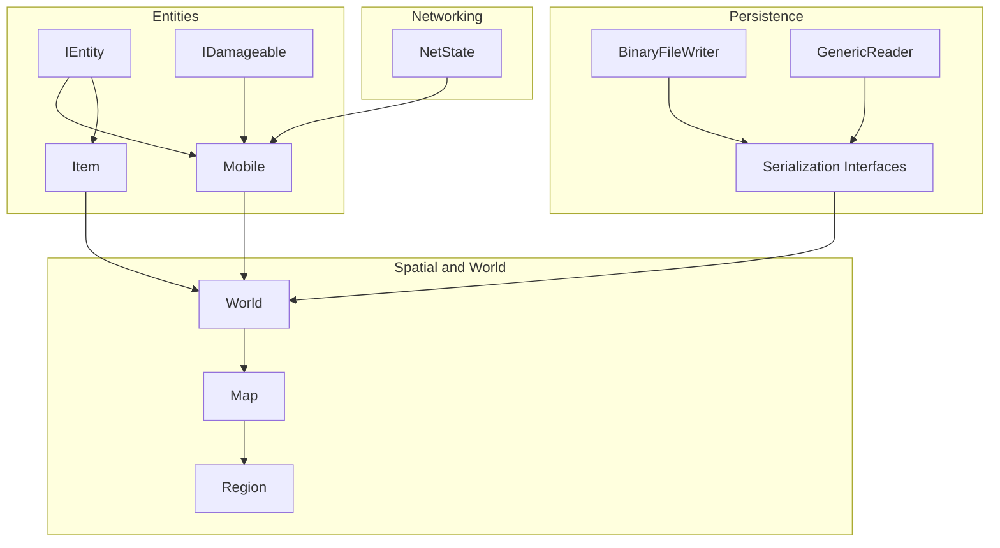
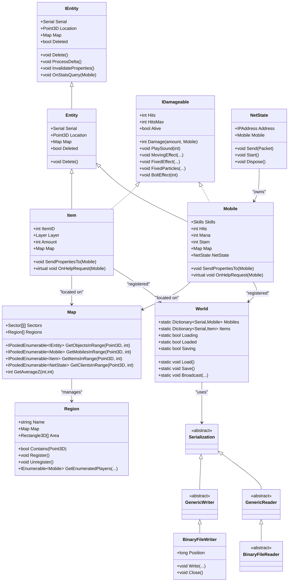
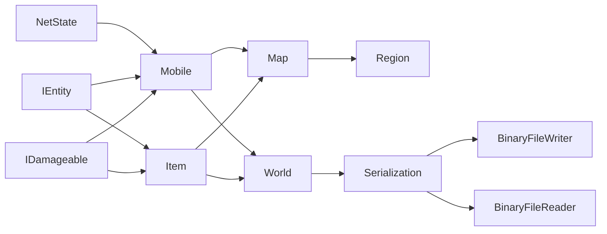

# Core Server APIs

<cite>
**Referenced Files in This Document**
- [Mobile.cs](file://Server/Mobile.cs)
- [Item.cs](file://Server/Item.cs)
- [World.cs](file://Server/World.cs)
- [Map.cs](file://Server/Map.cs)
- [Serialization.cs](file://Server/Serialization.cs)
- [NetState.cs](file://Server/Network/NetState.cs)
- [IEntity.cs](file://Server/IEntity.cs)
- [Interfaces.cs](file://Server/Interfaces.cs)
- [Region.cs](file://Server/Region.cs)
</cite>

## Table of Contents
1. [Introduction](#introduction)
2. [Project Structure](#project-structure)
3. [Core Components](#core-components)
4. [Architecture Overview](#architecture-overview)
5. [Detailed Component Analysis](#detailed-component-analysis)
6. [Dependency Analysis](#dependency-analysis)
7. [Performance Considerations](#performance-considerations)
8. [Troubleshooting Guide](#troubleshooting-guide)
9. [Conclusion](#conclusion)

## Introduction
This document provides comprehensive API documentation for ServUO’s core server interfaces. It focuses on:
- The Mobile and Item base classes, including properties, methods, and lifecycle management
- World management APIs for entity creation, deletion, and persistence
- Map system APIs for tile access, region queries, and spatial operations
- Serialization interfaces for binary data handling and entity state management
- Networking APIs via NetState for client connection management and packet processing
- Practical examples, performance considerations, thread-safety, and memory management best practices

## Project Structure
ServUO organizes core server interfaces primarily under the Server namespace. Key areas include:
- Entities: Mobile, Item, and IEntity base abstractions
- Spatial and world management: World, Map, Region
- Networking: NetState and related packet handling
- Persistence: Serialization interfaces and binary readers/writers
- Interfaces: Shared contracts for skills, spells, vendors, and damageable entities

**Diagram sources**
- [IEntity.cs](file://Server/IEntity.cs#L1-L106)
- [Mobile.cs](file://Server/Mobile.cs#L535-L590)
- [Item.cs](file://Server/Item.cs#L674-L740)
- [Interfaces.cs](file://Server/Interfaces.cs#L107-L145)
- [World.cs](file://Server/World.cs#L1-L120)
- [Map.cs](file://Server/Map.cs#L367-L420)
- [Region.cs](file://Server/Region.cs#L123-L170)
- [NetState.cs](file://Server/Network/NetState.cs#L580-L636)
- [Serialization.cs](file://Server/Serialization.cs#L1-L90)

**Section sources**
- [IEntity.cs](file://Server/IEntity.cs#L1-L106)
- [Mobile.cs](file://Server/Mobile.cs#L535-L590)
- [Item.cs](file://Server/Item.cs#L674-L740)
- [Interfaces.cs](file://Server/Interfaces.cs#L107-L145)
- [World.cs](file://Server/World.cs#L1-L120)
- [Map.cs](file://Server/Map.cs#L367-L420)
- [Region.cs](file://Server/Region.cs#L123-L170)
- [NetState.cs](file://Server/Network/NetState.cs#L580-L636)
- [Serialization.cs](file://Server/Serialization.cs#L1-L90)

## Core Components
This section outlines the primary interfaces and classes that define the core server behavior.

- IEntity and Entity: Defines the base contract for serializable, map-positioned entities and provides shared deletion and comparison semantics.
- Mobile: The base class for player-controlled and NPC entities, including stats, skills, equipment, combat, and networking linkage.
- Item: The base class for world objects, including layers, stacking, properties, and container support.
- IDamageable: Contract for entities that sustain damage and emit effects.
- World: Central manager for loading, saving, and enumerating Mobiles, Items, Guilds, and custom save data.
- Map: Spatial grid abstraction with sectors, pooled enumerators, and region management.
- Region: Hierarchical spatial regions with area rectangles, priority, and event hooks.
- NetState: Client connection state, packet encoding/encryption, and send/receive queues.
- Serialization: GenericReader/GenericWriter and BinaryFileWriter/BinaryFileReader for binary persistence.

**Section sources**
- [IEntity.cs](file://Server/IEntity.cs#L1-L106)
- [Mobile.cs](file://Server/Mobile.cs#L535-L590)
- [Item.cs](file://Server/Item.cs#L674-L740)
- [Interfaces.cs](file://Server/Interfaces.cs#L107-L145)
- [World.cs](file://Server/World.cs#L1-L120)
- [Map.cs](file://Server/Map.cs#L367-L420)
- [Region.cs](file://Server/Region.cs#L123-L170)
- [NetState.cs](file://Server/Network/NetState.cs#L580-L636)
- [Serialization.cs](file://Server/Serialization.cs#L1-L90)

## Architecture Overview
The core architecture connects entities to spatial and persistence layers, with networking bridging to clients.

**Diagram sources**
- [IEntity.cs](file://Server/IEntity.cs#L1-L106)
- [Mobile.cs](file://Server/Mobile.cs#L535-L590)
- [Item.cs](file://Server/Item.cs#L674-L740)
- [Interfaces.cs](file://Server/Interfaces.cs#L107-L145)
- [World.cs](file://Server/World.cs#L1-L120)
- [Map.cs](file://Server/Map.cs#L367-L420)
- [Region.cs](file://Server/Region.cs#L123-L170)
- [NetState.cs](file://Server/Network/NetState.cs#L580-L636)
- [Serialization.cs](file://Server/Serialization.cs#L1-L90)

## Detailed Component Analysis

### Mobile Base Class
- Purpose: Base class for player and NPC entities with stats, skills, equipment, combat, and networking.
- Key properties and behaviors:
  - Stats and vitalities: Hits, Mana, Stam, Strength/Dex/Int, Fame/Karma
  - Skills: Skills collection, skill mods, stat caps
  - Equipment: Items list, layering, holding/bouncing mechanics
  - Combat: Aggressor lists, combatant, virtual armor, resistances
  - Networking: NetState linkage, gump/menu/trade tracking
  - Lifecycle: Delete(), ProcessDelta(), InvalidateProperties(), OnStatsQuery()
- Notable methods:
  - SendPropertiesTo(Mobile): Sends OPL to a viewer
  - OnHelpRequest(Mobile): Help request hook
  - InLOS(target): Line-of-sight checks
  - BeginAction/CanBeginAction/EndAction: Action locking
  - ComputeResistances()/GetResistance(): Resistance computation and bounds
- Exception handling:
  - Throws ArgumentException in CompareTo(object)
  - Various timers and state machines guard against invalid transitions

Practical example paths:
- [Mobile.cs](file://Server/Mobile.cs#L1118-L1150) for sending properties
- [Mobile.cs](file://Server/Mobile.cs#L1474-L1514) for line-of-sight checks
- [Mobile.cs](file://Server/Mobile.cs#L1535-L1571) for action locking

**Section sources**
- [Mobile.cs](file://Server/Mobile.cs#L535-L590)
- [Mobile.cs](file://Server/Mobile.cs#L830-L900)
- [Mobile.cs](file://Server/Mobile.cs#L900-L1120)
- [Mobile.cs](file://Server/Mobile.cs#L1118-L1150)
- [Mobile.cs](file://Server/Mobile.cs#L1474-L1514)
- [Mobile.cs](file://Server/Mobile.cs#L1535-L1571)

### Item Base Class
- Purpose: Base class for world objects with layers, stacking, properties, and container support.
- Key properties and behaviors:
  - Identity: Serial, ItemID, Hue, Amount, Layer
  - Location: Point3D, Map, Parent (Mobile/Item/null)
  - Flags: ImplFlag bits for visibility, movability, stackable, insured, etc.
  - CompactInfo: Deferred storage for name, items, bounce info, held-by, blessed-for, spawner, temp/saved flags, and computed weight
  - Properties: ObjectPropertyList integration, name properties, loot type, resistances, weight display
  - Lifecycle: Delete(), ProcessDelta(), InvalidateProperties()
- Notable methods:
  - SendPropertiesTo(Mobile): Sends OPL to a viewer
  - OnHelpRequest(Mobile): Help request hook
  - AllowSecureTrade/OnSecureTrade: Trade lifecycle
  - CheckPropertyConfliction(Mobile): Resistance conflict detection
  - GetProperties/AddNameProperties/AddLootTypeProperty/AddResistanceProperties/etc.: Property list composition
  - Bounce/MoveToWorld/RecordBounce/ClearBounce: Pickup/drop mechanics
- Exception handling:
  - Throws ArgumentException in CompareTo(object)
  - Defensive checks in GridLocation assignment and container access

Practical example paths:
- [Item.cs](file://Server/Item.cs#L1219-L1280) for property confliction
- [Item.cs](file://Server/Item.cs#L1280-L1380) for property list composition
- [Item.cs](file://Server/Item.cs#L1534-L1599) for bounce mechanics

**Section sources**
- [Item.cs](file://Server/Item.cs#L674-L740)
- [Item.cs](file://Server/Item.cs#L800-L1016)
- [Item.cs](file://Server/Item.cs#L1017-L1218)
- [Item.cs](file://Server/Item.cs#L1219-L1380)
- [Item.cs](file://Server/Item.cs#L1380-L1599)

### World Management APIs
- Responsibilities:
  - Maintain dictionaries of Mobiles and Items
  - Coordinate loading and saving of entities and custom data
  - Enforce safe deletion during load/save cycles
  - Broadcast messages to clients
- Key methods:
  - Load(): Reads indices, type tables, constructs entities, deserializes state, handles failures
  - Save(): Writes indices, type tables, and binary data streams
  - OnDelete(entity)/OnDelete(customs): Queues deletions during save/load
  - Broadcast(hue, ascii, access, text/format): Sends world-wide messages
  - WaitForWriteCompletion/NotifyDiskWriteComplete: Synchronization for disk writes
- Persistence:
  - Index and type files per entity category
  - Binary data streams with position/length metadata
  - Type resolution via ScriptCompiler and constructor invocation

Practical example paths:
- [World.cs](file://Server/World.cs#L348-L420) for Load() mobile index/type reading
- [World.cs](file://Server/World.cs#L643-L700) for Load() item deserialization loop
- [World.cs](file://Server/World.cs#L106-L153) for Broadcast() implementation
- [World.cs](file://Server/World.cs#L70-L87) for safe deletion queueing

**Section sources**
- [World.cs](file://Server/World.cs#L1-L120)
- [World.cs](file://Server/World.cs#L348-L420)
- [World.cs](file://Server/World.cs#L643-L700)
- [World.cs](file://Server/World.cs#L106-L153)
- [World.cs](file://Server/World.cs#L70-L87)

### Map System APIs
- Responsibilities:
  - Spatial partitioning via sectors and pooled enumerators
  - Range-based queries for entities, items, mobiles, and clients
  - Average Z computation for terrain
  - Region management and registration
- Key methods:
  - GetObjectsInRange/GetMobilesInRange/GetItemsInRange/GetClientsInRange: Range queries with optional bounds
  - GetAverageZ/GetAverageZ(x,y,ref z,ref avg,ref top): Terrain height calculation
  - Region lookup and containment via Sector rectangles
  - PooledEnumeration selectors and enumerators for performance
- Thread-safety:
  - Pooled enumerables and buffers reduce allocations and contention
  - Sector boundaries and enumeration guarded by internal checks

Practical example paths:
- [Map.cs](file://Server/Map.cs#L611-L688) for GetObjectsInRange/GetMobilesInRange
- [Map.cs](file://Server/Map.cs#L689-L693) for GetMultiTilesAt
- [Map.cs](file://Server/Map.cs#L543-L595) for GetAverageZ
- [Map.cs](file://Server/Map.cs#L145-L200) for PooledEnumeration selectors

**Section sources**
- [Map.cs](file://Server/Map.cs#L367-L420)
- [Map.cs](file://Server/Map.cs#L543-L595)
- [Map.cs](file://Server/Map.cs#L611-L688)
- [Map.cs](file://Server/Map.cs#L689-L693)
- [Map.cs](file://Server/Map.cs#L145-L200)

### Region Queries and Spatial Operations
- Responsibilities:
  - Hierarchical region management with priority and dynamic vs static regions
  - Area containment and child/parent relationships
  - Player/mobile/item enumeration within regions
  - Event hooks for movement, aggression, and spawning
- Key methods:
  - Region.Find(p, map): Resolve region for a point
  - Contains(p): Check containment across 3D areas
  - GetEnumeratedPlayers/GetEnumeratedMobiles/GetEnumeratedItems: Distinct enumeration
  - Register/Unregister: Attach/detach region to map and sectors
  - OnMoveInto/OnEnter/OnExit: Movement and presence events

Practical example paths:
- [Region.cs](file://Server/Region.cs#L130-L151) for Region.Find
- [Region.cs](file://Server/Region.cs#L365-L378) for Contains
- [Region.cs](file://Server/Region.cs#L494-L521) for GetEnumeratedPlayers
- [Region.cs](file://Server/Region.cs#L533-L569) for GetEnumeratedMobiles
- [Region.cs](file://Server/Region.cs#L572-L609) for GetEnumeratedItems

**Section sources**
- [Region.cs](file://Server/Region.cs#L123-L170)
- [Region.cs](file://Server/Region.cs#L130-L151)
- [Region.cs](file://Server/Region.cs#L365-L378)
- [Region.cs](file://Server/Region.cs#L494-L521)
- [Region.cs](file://Server/Region.cs#L533-L569)
- [Region.cs](file://Server/Region.cs#L572-L609)

### Serialization Interfaces
- Purpose: Provide a unified binary persistence layer for entities and custom data.
- Components:
  - GenericReader/GenericWriter: Abstract interfaces for reading/writing primitives and collections
  - BinaryFileWriter: Buffered binary writer with UTF-8 string handling and encoded integers
  - BinaryFileReader: Reader for indexed binary streams used by World.Load/Save
- Typical usage:
  - Write/Read methods for strings, dates, points, rectangles, maps, races, and typed collections
  - Encoded integers for compactness
  - Position tracking for streaming reads

Practical example paths:
- [Serialization.cs](file://Server/Serialization.cs#L1-L90) for GenericReader/GenericWriter abstract methods
- [Serialization.cs](file://Server/Serialization.cs#L198-L270) for BinaryFileWriter.WriteEncodedInt
- [Serialization.cs](file://Server/Serialization.cs#L339-L420) for BinaryFileWriter.Write(string)
- [Serialization.cs](file://Server/Serialization.cs#L640-L707) for BinaryFileWriter.Write(Item/Mobile/Guild/Data)
- [Serialization.cs](file://Server/Serialization.cs#L708-L800) for list writing helpers

**Section sources**
- [Serialization.cs](file://Server/Serialization.cs#L1-L90)
- [Serialization.cs](file://Server/Serialization.cs#L198-L270)
- [Serialization.cs](file://Server/Serialization.cs#L339-L420)
- [Serialization.cs](file://Server/Serialization.cs#L640-L707)
- [Serialization.cs](file://Server/Serialization.cs#L708-L800)

### NetState Networking APIs
- Responsibilities:
  - Manage client connections, packet encoding/encryption, and send/receive queues
  - Track gumps, hue pickers, menus, trades, and secure trade containers
  - Enforce caps and timeouts; handle asynchronous I/O
- Key methods:
  - Send(Packet): Compiles and sends packets with optional encoder/encryptor
  - Start(): Initiates async receive loop
  - AddGump/RemoveGump/ClearGumps: Gump lifecycle management
  - AddHuePicker/RemoveHuePicker/ClearHuePickers: Hue picker lifecycle management
  - AddMenu/RemoveMenu/ClearMenus: Menu lifecycle management
  - AddTrade/FindTrade/CancelAllTrades/ValidateAllTrades: Secure trading
  - Dispose(): Cleans up resources and instances
- Concurrency:
  - Send lock and send queue synchronization
  - Concurrent dictionary of instances for enumeration
  - Buffer pools for send/receive buffers

Practical example paths:
- [NetState.cs](file://Server/Network/NetState.cs#L642-L773) for Send(Packet)
- [NetState.cs](file://Server/Network/NetState.cs#L775-L800) for Start()
- [NetState.cs](file://Server/Network/NetState.cs#L409-L558) for gump/menu/hue picker lifecycle
- [NetState.cs](file://Server/Network/NetState.cs#L292-L357) for trade management
- [NetState.cs](file://Server/Network/NetState.cs#L580-L636) for instance tracking and buffer pools

**Section sources**
- [NetState.cs](file://Server/Network/NetState.cs#L580-L636)
- [NetState.cs](file://Server/Network/NetState.cs#L642-L773)
- [NetState.cs](file://Server/Network/NetState.cs#L775-L800)
- [NetState.cs](file://Server/Network/NetState.cs#L409-L558)
- [NetState.cs](file://Server/Network/NetState.cs#L292-L357)

## Dependency Analysis
This section maps dependencies among core components and highlights coupling and cohesion.

**Diagram sources**
- [Mobile.cs](file://Server/Mobile.cs#L535-L590)
- [Item.cs](file://Server/Item.cs#L674-L740)
- [World.cs](file://Server/World.cs#L1-L120)
- [Map.cs](file://Server/Map.cs#L367-L420)
- [Region.cs](file://Server/Region.cs#L123-L170)
- [NetState.cs](file://Server/Network/NetState.cs#L580-L636)
- [Serialization.cs](file://Server/Serialization.cs#L1-L90)

**Section sources**
- [Mobile.cs](file://Server/Mobile.cs#L535-L590)
- [Item.cs](file://Server/Item.cs#L674-L740)
- [World.cs](file://Server/World.cs#L1-L120)
- [Map.cs](file://Server/Map.cs#L367-L420)
- [Region.cs](file://Server/Region.cs#L123-L170)
- [NetState.cs](file://Server/Network/NetState.cs#L580-L636)
- [Serialization.cs](file://Server/Serialization.cs#L1-L90)

## Performance Considerations
- Pooled enumerators and buffers:
  - Map’s PooledEnumeration and BufferPool reduce allocations and GC pressure during frequent spatial queries and packet sends.
- Deferred property storage:
  - Item’s CompactInfo defers storage until needed, minimizing memory footprint for common cases.
- Range and bounds:
  - Map’s Get*InRange methods default to a bounded range; enabling Map_UseMaxRange increases visibility and effects range.
- Serialization efficiency:
  - BinaryFileWriter uses encoded integers and buffered writes to minimize disk I/O overhead.
- Concurrency:
  - NetState uses locks and send queues to serialize outbound packets safely; buffer pools cap memory usage.
- Recommendations:
  - Prefer pooled enumerables for large-area queries
  - Avoid unnecessary property list recomputation; use InvalidateProperties judiciously
  - Limit excessive broadcasts; use targeted NetState filtering
  - Tune UpdateRange per shard needs to balance bandwidth and responsiveness

[No sources needed since this section provides general guidance]

## Troubleshooting Guide
Common issues and diagnostics:
- Serialization errors during load:
  - World.Load validates positions and throws exceptions for bad serialization lengths; review failed type, serial, and position logs.
- Safe deletion during save/load:
  - Use World.OnDelete to queue deletions; ensure entities are not deleted mid-save.
- Client disconnections:
  - NetState logs “Too much data pending” when send queue exceeds capacity; investigate packet bursts or missing SendQueue completion.
- Null buffer send:
  - NetState logs and traces null buffer sends; inspect packet compilation and encoder/encryptor usage.
- Region registration:
  - Ensure Region.Register is called and sectors are populated; unregistered regions may miss events.

Practical example paths:
- [World.cs](file://Server/World.cs#L614-L640) for position validation and exception handling
- [World.cs](file://Server/World.cs#L70-L87) for safe deletion queueing
- [NetState.cs](file://Server/Network/NetState.cs#L738-L768) for null buffer handling
- [NetState.cs](file://Server/Network/NetState.cs#L740-L748) for capacity exceeded handling
- [Region.cs](file://Server/Region.cs#L276-L326) for register/unregister lifecycle

**Section sources**
- [World.cs](file://Server/World.cs#L614-L640)
- [World.cs](file://Server/World.cs#L70-L87)
- [NetState.cs](file://Server/Network/NetState.cs#L738-L768)
- [NetState.cs](file://Server/Network/NetState.cs#L740-L748)
- [Region.cs](file://Server/Region.cs#L276-L326)

## Conclusion
ServUO’s core server interfaces provide a robust foundation for entity lifecycle, spatial operations, persistence, and networking. By leveraging pooled enumerators, deferred property storage, and efficient serialization, the server achieves strong performance and scalability. Proper use of World, Map, Region, Mobile, Item, NetState, and Serialization APIs ensures maintainable and extensible gameplay systems.

[No sources needed since this section summarizes without analyzing specific files]