# Administrative Tools

<cite>
**Referenced Files in This Document**
- [Commands.cs](file://Server/Commands.cs)
- [Handlers.cs](file://Scripts/Commands/Handlers.cs)
- [Logging.cs](file://Scripts/Commands/Logging.cs)
- [BaseCommand.cs](file://Scripts/Commands/Generic/Commands/BaseCommand.cs)
- [BaseCommandImplementor.cs](file://Scripts/Commands/Generic/Implementors/BaseCommandImplementor.cs)
- [Interface.cs](file://Scripts/Commands/Generic/Commands/Interface.cs)
- [Batch.cs](file://Scripts/Commands/Batch.cs)
- [Properties.cs](file://Scripts/Commands/Properties.cs)
- [VisibilityList.cs](file://Scripts/Commands/VisibilityList.cs)
- [WebStatus.cs](file://Scripts/Misc/WebStatus.cs)
- [ServerList.cs](file://Scripts/Misc/ServerList.cs)
- [EventLog.cs](file://Server/EventLog.cs)
- [PacketHandlers.cs](file://Scripts/Services/RemoteAdmin/PacketHandlers.cs)
- [RemoteAdminLogging.cs](file://Scripts/Services/RemoteAdmin/RemoteAdminLogging.cs)
- [Account.cs](file://Scripts/Accounting/Account.cs)
- [IAccount.cs](file://Server/IAccount.cs)
- [AccountHandler.cs](file://Scripts/Accounting/AccountHandler.cs)
- [Attributes.cs](file://Server/Attributes.cs)
- [TaskPollingTimer.cs](file://Scripts/Misc/TaskPollingTimer.cs)
</cite>

## Table of Contents
1. [Introduction](#introduction)
2. [Project Structure](#project-structure)
3. [Core Components](#core-components)
4. [Architecture Overview](#architecture-overview)
5. [Detailed Component Analysis](#detailed-component-analysis)
6. [Dependency Analysis](#dependency-analysis)
7. [Performance Considerations](#performance-considerations)
8. [Troubleshooting Guide](#troubleshooting-guide)
9. [Conclusion](#conclusion)
10. [Appendices](#appendices)

## Introduction
This document explains ServUO’s administrative tools and command system with a focus on the command framework, permission model, command execution pipeline, web administration interface, server list management, logging systems, player management, monitoring tools, and automated administrative tasks. It synthesizes the repository’s implementation to help administrators operate safely and efficiently, with practical examples and diagrams mapped to actual source files.

## Project Structure
ServUO organizes administrative functionality across several subsystems:
- Command framework and handlers in Server and Scripts/Commands
- Web status page generation in Scripts/Misc
- Remote administration protocol in Scripts/Services/RemoteAdmin
- Logging infrastructure in Scripts/Commands and Scripts/Services/RemoteAdmin
- Account and access control in Scripts/Accounting and Server
- Server list publishing in Scripts/Misc

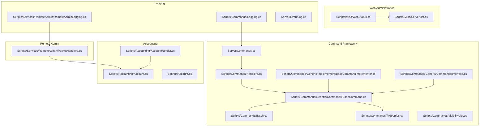

**Diagram sources**
- [Commands.cs](file://Server/Commands.cs#L1-L288)
- [Handlers.cs](file://Scripts/Commands/Handlers.cs#L55-L78)
- [BaseCommand.cs](file://Scripts/Commands/Generic/Commands/BaseCommand.cs#L52-L111)
- [BaseCommandImplementor.cs](file://Scripts/Commands/Generic/Implementors/BaseCommandImplementor.cs#L86-L123)
- [Interface.cs](file://Scripts/Commands/Generic/Commands/Interface.cs#L1-L42)
- [Batch.cs](file://Scripts/Commands/Batch.cs#L1-L120)
- [Properties.cs](file://Scripts/Commands/Properties.cs#L1-L120)
- [VisibilityList.cs](file://Scripts/Commands/VisibilityList.cs#L1-L80)
- [WebStatus.cs](file://Scripts/Misc/WebStatus.cs#L1-L195)
- [ServerList.cs](file://Scripts/Misc/ServerList.cs#L1-L96)
- [Logging.cs](file://Scripts/Commands/Logging.cs#L1-L158)
- [RemoteAdminLogging.cs](file://Scripts/Services/RemoteAdmin/RemoteAdminLogging.cs#L1-L83)
- [EventLog.cs](file://Server/EventLog.cs#L1-L50)
- [PacketHandlers.cs](file://Scripts/Services/RemoteAdmin/PacketHandlers.cs#L1-L120)
- [Account.cs](file://Scripts/Accounting/Account.cs#L379-L559)
- [IAccount.cs](file://Server/IAccount.cs#L252-L285)
- [AccountHandler.cs](file://Scripts/Accounting/AccountHandler.cs#L152-L194)

**Section sources**
- [Commands.cs](file://Server/Commands.cs#L1-L288)
- [WebStatus.cs](file://Scripts/Misc/WebStatus.cs#L1-L195)
- [ServerList.cs](file://Scripts/Misc/ServerList.cs#L1-L96)

## Core Components
- CommandSystem: Parses chat input, validates access level, dispatches to registered handlers, and emits events.
- Command handlers: Register commands with access levels and handlers; examples include broadcast, bank, echo, speedboost, and others.
- BaseCommand and BaseCommandImplementor: Define command metadata, access levels, supports flags, and implementors that interpret command modifiers and scopes.
- Properties and Props command: Provide a property inspection and modification interface with access-controlled reads/writes.
- Batch command: Enables running multiple commands against matched objects with optional conditions.
- WebStatus: Periodically generates a server status page and serves it via HTTP listener.
- ServerList: Publishes server information to client server lists with address resolution logic.
- Logging: Centralized command logging and remote admin logging with per-access-level directories and safe filename handling.
- RemoteAdmin: Packet-based administrative protocol for server info, account search, deletion, and updates with strict access checks.
- Account and AccessControl: Account properties, access levels, restrictions, and password management with administrative controls.

**Section sources**
- [Commands.cs](file://Server/Commands.cs#L130-L288)
- [Handlers.cs](file://Scripts/Commands/Handlers.cs#L55-L78)
- [BaseCommand.cs](file://Scripts/Commands/Generic/Commands/BaseCommand.cs#L52-L111)
- [BaseCommandImplementor.cs](file://Scripts/Commands/Generic/Implementors/BaseCommandImplementor.cs#L131-L171)
- [Properties.cs](file://Scripts/Commands/Properties.cs#L48-L120)
- [Batch.cs](file://Scripts/Commands/Batch.cs#L1-L120)
- [WebStatus.cs](file://Scripts/Misc/WebStatus.cs#L1-L120)
- [ServerList.cs](file://Scripts/Misc/ServerList.cs#L1-L96)
- [Logging.cs](file://Scripts/Commands/Logging.cs#L1-L158)
- [PacketHandlers.cs](file://Scripts/Services/RemoteAdmin/PacketHandlers.cs#L1-L120)
- [Account.cs](file://Scripts/Accounting/Account.cs#L379-L559)
- [IAccount.cs](file://Server/IAccount.cs#L252-L285)
- [AccountHandler.cs](file://Scripts/Accounting/AccountHandler.cs#L152-L194)

## Architecture Overview
The administrative architecture centers on a command pipeline with layered permissions and extensible command implementations.

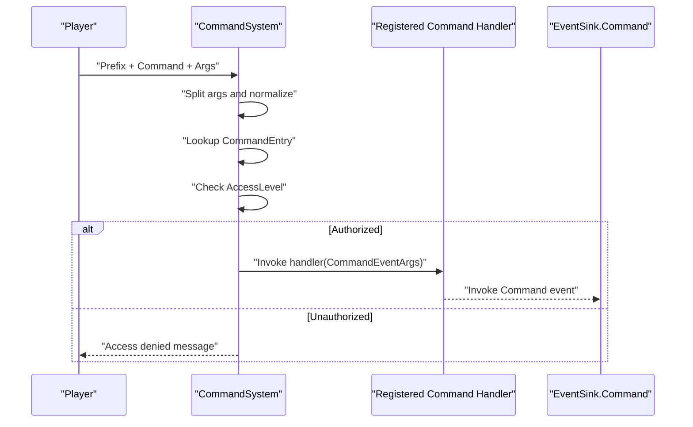

**Diagram sources**
- [Commands.cs](file://Server/Commands.cs#L214-L288)
- [Handlers.cs](file://Scripts/Commands/Handlers.cs#L55-L78)

## Detailed Component Analysis

### Command Framework and Execution Pipeline
- Registration: Commands register with CommandSystem.Register using command name, AccessLevel, and handler.
- Parsing: CommandSystem.Split handles quoted arguments and whitespace separation.
- Dispatch: CommandSystem.Handle resolves command, validates AccessLevel, constructs CommandEventArgs, invokes handler, and fires EventSink.Command.
- Permission enforcement: AccessLevel checks occur during lookup and parsing stages.

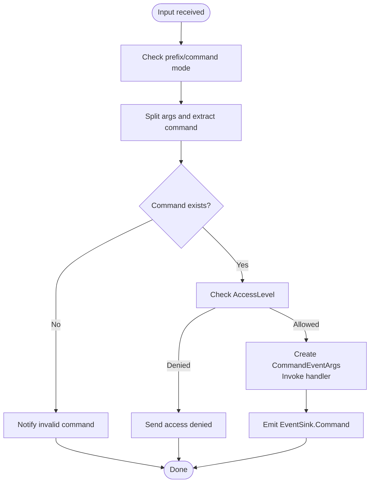

**Diagram sources**
- [Commands.cs](file://Server/Commands.cs#L130-L288)

**Section sources**
- [Commands.cs](file://Server/Commands.cs#L130-L288)
- [Handlers.cs](file://Scripts/Commands/Handlers.cs#L55-L78)

### Permission Systems and Access Levels
- AccessLevel constants define hierarchical permissions.
- Command handlers specify minimum AccessLevel required.
- Property access controlled via CommandPropertyAttribute with separate read/write thresholds.
- RemoteAdmin enforces strict access checks for account operations.

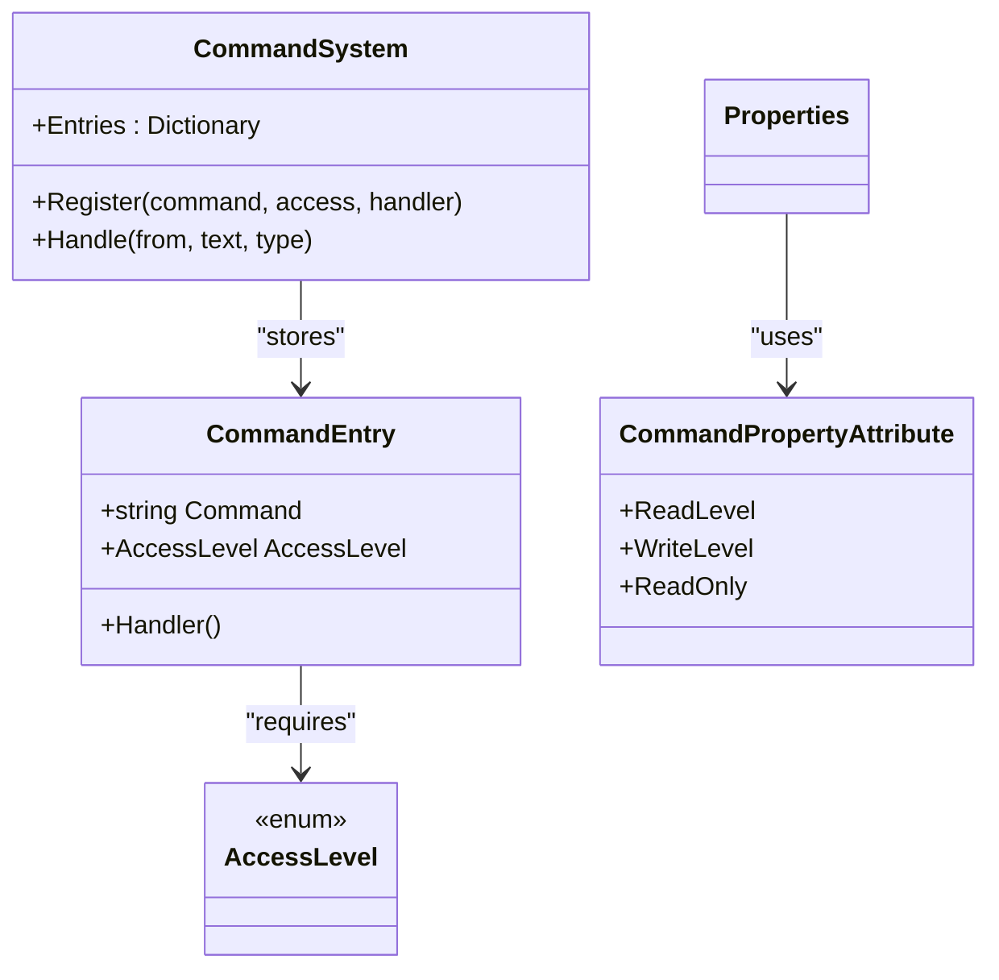

**Diagram sources**
- [Commands.cs](file://Server/Commands.cs#L88-L127)
- [Attributes.cs](file://Server/Attributes.cs#L177-L206)
- [Properties.cs](file://Scripts/Commands/Properties.cs#L177-L206)

**Section sources**
- [Attributes.cs](file://Server/Attributes.cs#L177-L206)
- [Properties.cs](file://Scripts/Commands/Properties.cs#L177-L206)
- [PacketHandlers.cs](file://Scripts/Services/RemoteAdmin/PacketHandlers.cs#L104-L166)

### Command Implementors and Modifiers
- BaseCommandImplementor manages command modifiers and registers implementors for region/global/online/single/serial scopes.
- Implements command selection and argument processing for modifiers.

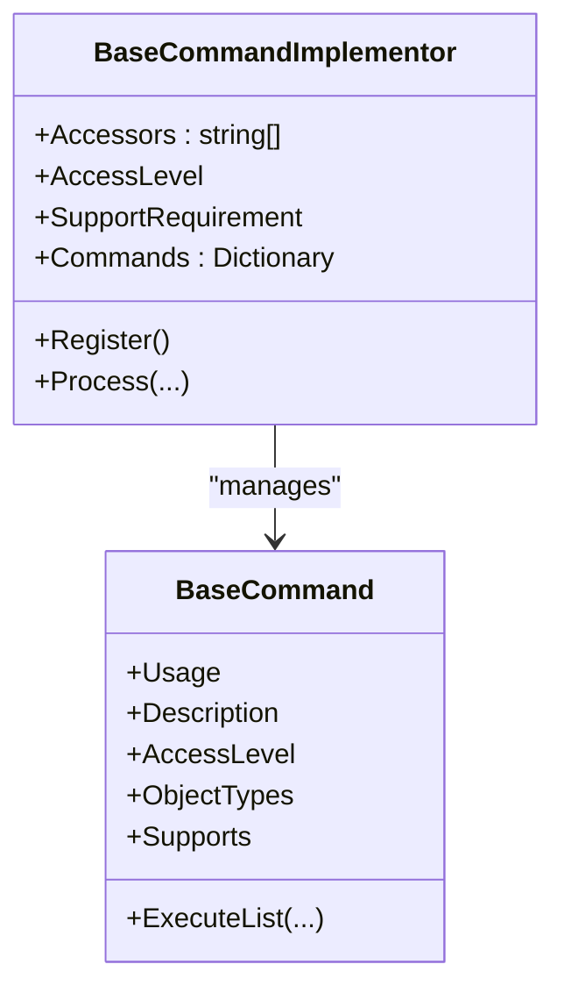

**Diagram sources**
- [BaseCommandImplementor.cs](file://Scripts/Commands/Generic/Implementors/BaseCommandImplementor.cs#L86-L171)
- [BaseCommand.cs](file://Scripts/Commands/Generic/Commands/BaseCommand.cs#L52-L111)

**Section sources**
- [BaseCommandImplementor.cs](file://Scripts/Commands/Generic/Implementors/BaseCommandImplementor.cs#L131-L171)
- [BaseCommand.cs](file://Scripts/Commands/Generic/Commands/BaseCommand.cs#L52-L111)

### Properties Command and Automated Property Management
- Properties command builds property chains respecting CommandPropertyAttribute read/write access.
- Supports reading, writing, increasing/decreasing numeric properties with validation and logging.

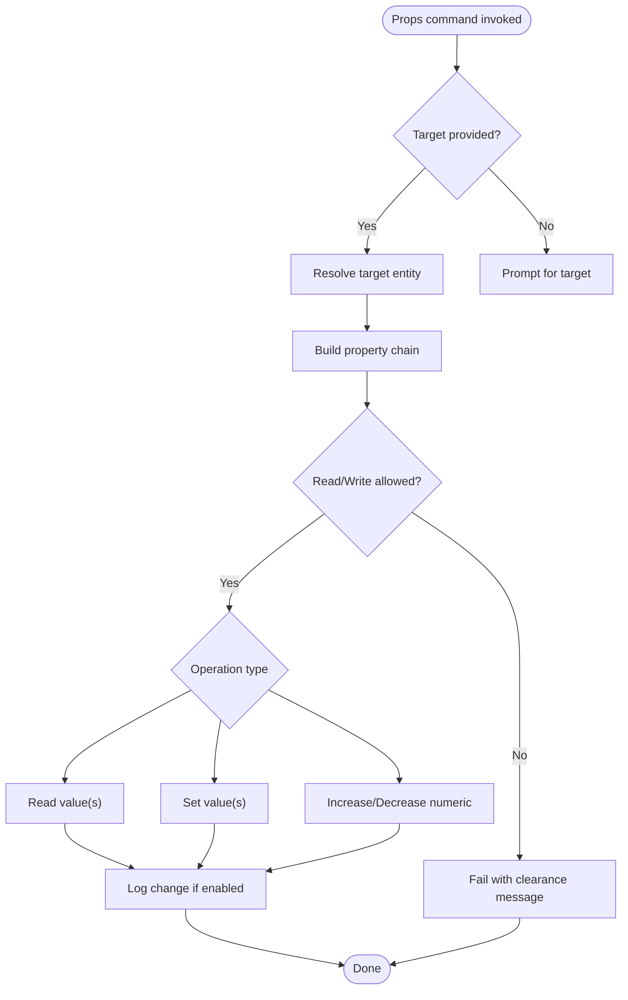

**Diagram sources**
- [Properties.cs](file://Scripts/Commands/Properties.cs#L1-L120)
- [Properties.cs](file://Scripts/Commands/Properties.cs#L120-L220)
- [Properties.cs](file://Scripts/Commands/Properties.cs#L303-L454)
- [Logging.cs](file://Scripts/Commands/Logging.cs#L78-L112)

**Section sources**
- [Properties.cs](file://Scripts/Commands/Properties.cs#L1-L120)
- [Properties.cs](file://Scripts/Commands/Properties.cs#L303-L454)
- [Logging.cs](file://Scripts/Commands/Logging.cs#L78-L112)

### Batch Command and Automated Tasks
- Batch enables grouping multiple commands, selecting scope (implementor), and applying optional where conditions.
- Validates each command’s access and arguments before execution.

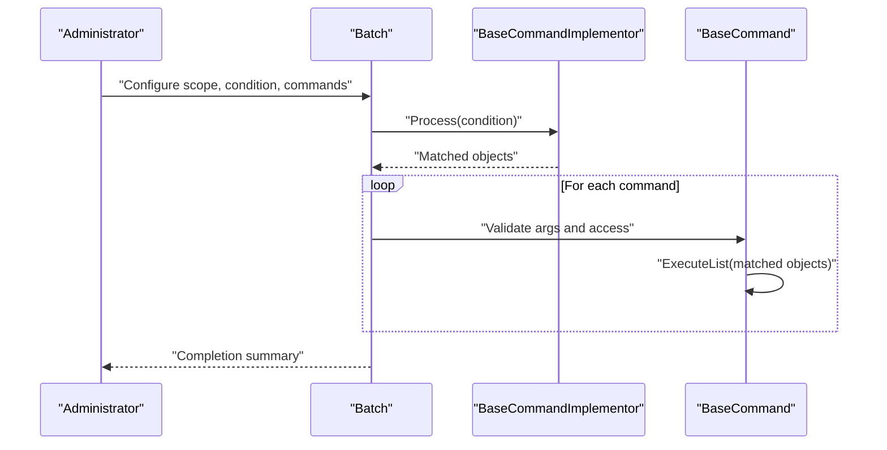

**Diagram sources**
- [Batch.cs](file://Scripts/Commands/Batch.cs#L1-L120)
- [Batch.cs](file://Scripts/Commands/Batch.cs#L120-L205)

**Section sources**
- [Batch.cs](file://Scripts/Commands/Batch.cs#L1-L205)

### Web Administration Interface and Server Monitoring
- WebStatus periodically writes status.html and serves it via HttpListener on http://*:80/status/.
- ServerList publishes server entries to client server lists, adjusting external addresses for non-private networks.

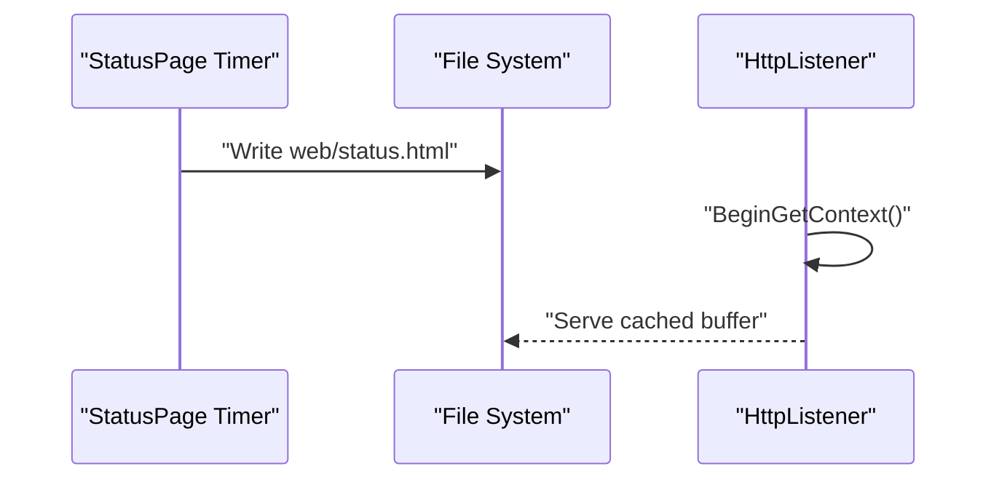

**Diagram sources**
- [WebStatus.cs](file://Scripts/Misc/WebStatus.cs#L1-L120)
- [WebStatus.cs](file://Scripts/Misc/WebStatus.cs#L120-L195)
- [ServerList.cs](file://Scripts/Misc/ServerList.cs#L1-L96)

**Section sources**
- [WebStatus.cs](file://Scripts/Misc/WebStatus.cs#L1-L195)
- [ServerList.cs](file://Scripts/Misc/ServerList.cs#L1-L96)

### Remote Administration Protocol
- PacketHandlers defines commands for server info, account search, delete, and update.
- Enforces access level checks and access-level limits for modifications.
- RemoteAdminLogging centralizes logging for remote admin actions.

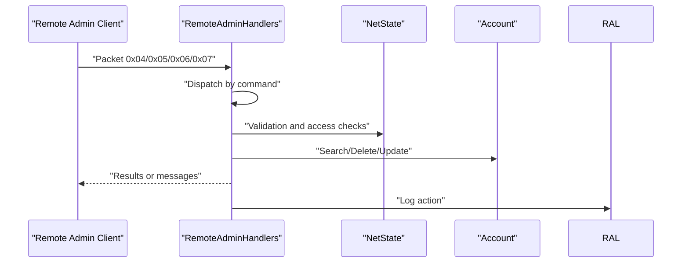

**Diagram sources**
- [PacketHandlers.cs](file://Scripts/Services/RemoteAdmin/PacketHandlers.cs#L1-L120)
- [PacketHandlers.cs](file://Scripts/Services/RemoteAdmin/PacketHandlers.cs#L120-L239)
- [RemoteAdminLogging.cs](file://Scripts/Services/RemoteAdmin/RemoteAdminLogging.cs#L1-L83)

**Section sources**
- [PacketHandlers.cs](file://Scripts/Services/RemoteAdmin/PacketHandlers.cs#L1-L239)
- [RemoteAdminLogging.cs](file://Scripts/Services/RemoteAdmin/RemoteAdminLogging.cs#L1-L83)

### Player Management Capabilities
- VisibilityList allows adding/removing players to a visibility list for persistent visibility.
- AccountHandler.Password_OnCommand changes the account password with IP verification.
- Account properties expose access level, email, age, total game time, and restrictions.

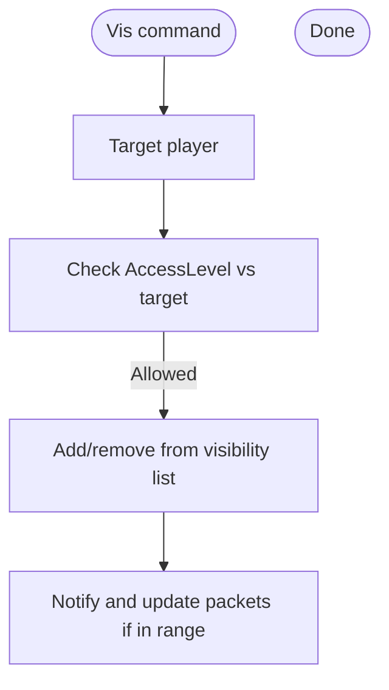

**Diagram sources**
- [VisibilityList.cs](file://Scripts/Commands/VisibilityList.cs#L1-L155)
- [AccountHandler.cs](file://Scripts/Accounting/AccountHandler.cs#L152-L194)
- [Account.cs](file://Scripts/Accounting/Account.cs#L379-L559)
- [IAccount.cs](file://Server/IAccount.cs#L252-L285)

**Section sources**
- [VisibilityList.cs](file://Scripts/Commands/VisibilityList.cs#L1-L155)
- [AccountHandler.cs](file://Scripts/Accounting/AccountHandler.cs#L152-L194)
- [Account.cs](file://Scripts/Accounting/Account.cs#L379-L559)
- [IAccount.cs](file://Server/IAccount.cs#L252-L285)

### Logging Systems
- CommandLogging logs all command usage and property changes with per-access-level subfolders and safe filenames.
- RemoteAdminLogging initializes lazily and logs remote admin actions with date-based filenames.
- EventLog integrates with Windows Event Log for server-level diagnostics.

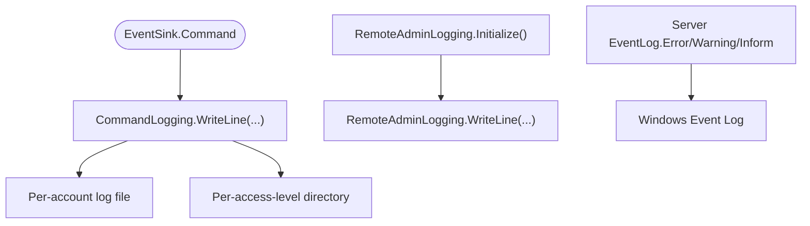

**Diagram sources**
- [Logging.cs](file://Scripts/Commands/Logging.cs#L1-L158)
- [RemoteAdminLogging.cs](file://Scripts/Services/RemoteAdmin/RemoteAdminLogging.cs#L1-L83)
- [EventLog.cs](file://Server/EventLog.cs#L1-L50)

**Section sources**
- [Logging.cs](file://Scripts/Commands/Logging.cs#L1-L158)
- [RemoteAdminLogging.cs](file://Scripts/Services/RemoteAdmin/RemoteAdminLogging.cs#L1-L83)
- [EventLog.cs](file://Server/EventLog.cs#L1-L50)

## Dependency Analysis
- CommandSystem depends on Handlers for registration and delegates to BaseCommand implementations.
- Properties relies on CommandPropertyAttribute and CommandLogging for access control and auditing.
- WebStatus depends on ServerList for server name and address resolution.
- RemoteAdminHandlers depends on Accounts and NetState for secure operations.
- Logging is centralized and consumed by both command and remote admin subsystems.

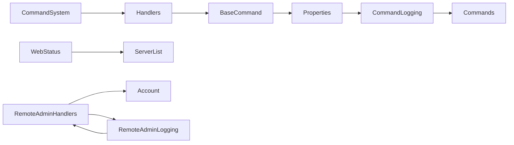

**Diagram sources**
- [Commands.cs](file://Server/Commands.cs#L130-L288)
- [Handlers.cs](file://Scripts/Commands/Handlers.cs#L55-L78)
- [BaseCommand.cs](file://Scripts/Commands/Generic/Commands/BaseCommand.cs#L52-L111)
- [Properties.cs](file://Scripts/Commands/Properties.cs#L1-L120)
- [Logging.cs](file://Scripts/Commands/Logging.cs#L1-L158)
- [WebStatus.cs](file://Scripts/Misc/WebStatus.cs#L1-L120)
- [ServerList.cs](file://Scripts/Misc/ServerList.cs#L1-L96)
- [PacketHandlers.cs](file://Scripts/Services/RemoteAdmin/PacketHandlers.cs#L1-L120)
- [RemoteAdminLogging.cs](file://Scripts/Services/RemoteAdmin/RemoteAdminLogging.cs#L1-L83)

**Section sources**
- [Commands.cs](file://Server/Commands.cs#L130-L288)
- [Handlers.cs](file://Scripts/Commands/Handlers.cs#L55-L78)
- [Properties.cs](file://Scripts/Commands/Properties.cs#L1-L120)
- [Logging.cs](file://Scripts/Commands/Logging.cs#L1-L158)
- [WebStatus.cs](file://Scripts/Misc/WebStatus.cs#L1-L120)
- [ServerList.cs](file://Scripts/Misc/ServerList.cs#L1-L96)
- [PacketHandlers.cs](file://Scripts/Services/RemoteAdmin/PacketHandlers.cs#L1-L120)
- [RemoteAdminLogging.cs](file://Scripts/Services/RemoteAdmin/RemoteAdminLogging.cs#L1-L83)

## Performance Considerations
- Command parsing and dictionary lookups are O(n) for argument splitting and O(1) average for command lookup.
- Batch command disables logging for large object sets to reduce I/O overhead.
- WebStatus caches HTML content and serves via OutputStream to minimize latency.
- RemoteAdmin packet handling is stateless and bounded by search result limits.

[No sources needed since this section provides general guidance]

## Troubleshooting Guide
- Invalid command or insufficient access: CommandSystem.Handle returns access-denied messages when AccessLevel is insufficient or command is unknown.
- Property access denied: Properties command validates read/write thresholds via CommandPropertyAttribute and returns clearance errors.
- RemoteAdmin access exceptions: PacketHandlers enforce Administrator-only deletions and access-level limits; messages are sent for invalid operations.
- Logging failures: CommandLogging and RemoteAdminLogging handle initialization exceptions and disable logging if file creation fails.
- EventLog integration: EventLog writes to Windows Event Log; ensure source creation succeeds on startup.

**Section sources**
- [Commands.cs](file://Server/Commands.cs#L214-L288)
- [Properties.cs](file://Scripts/Commands/Properties.cs#L100-L140)
- [PacketHandlers.cs](file://Scripts/Services/RemoteAdmin/PacketHandlers.cs#L104-L166)
- [Logging.cs](file://Scripts/Commands/Logging.cs#L30-L60)
- [RemoteAdminLogging.cs](file://Scripts/Services/RemoteAdmin/RemoteAdminLogging.cs#L33-L64)
- [EventLog.cs](file://Server/EventLog.cs#L1-L50)

## Conclusion
ServUO’s administrative tools form a robust, permission-driven system centered on a flexible command framework, comprehensive logging, and secure remote administration. Administrators can manage players, automate tasks with Batch and Properties, monitor the server via WebStatus, and publish accurate server list entries through ServerList. Strict access checks and audit trails ensure safe operation across diverse administrative scenarios.

[No sources needed since this section summarizes without analyzing specific files]

## Appendices

### Practical Examples (by file path)
- Command registration and handler invocation:
  - [Handlers.cs](file://Scripts/Commands/Handlers.cs#L55-L78)
- Command execution pipeline:
  - [Commands.cs](file://Server/Commands.cs#L214-L288)
- Property inspection and modification:
  - [Properties.cs](file://Scripts/Commands/Properties.cs#L548-L573)
  - [Properties.cs](file://Scripts/Commands/Properties.cs#L303-L310)
- Batch command usage:
  - [Batch.cs](file://Scripts/Commands/Batch.cs#L58-L66)
  - [Batch.cs](file://Scripts/Commands/Batch.cs#L120-L205)
- Web status page generation:
  - [WebStatus.cs](file://Scripts/Misc/WebStatus.cs#L103-L192)
- Server list publishing:
  - [ServerList.cs](file://Scripts/Misc/ServerList.cs#L22-L53)
- Remote administration:
  - [PacketHandlers.cs](file://Scripts/Services/RemoteAdmin/PacketHandlers.cs#L142-L239)
- Logging commands and property changes:
  - [Logging.cs](file://Scripts/Commands/Logging.cs#L78-L112)
  - [RemoteAdminLogging.cs](file://Scripts/Services/RemoteAdmin/RemoteAdminLogging.cs#L75-L83)
- Account management:
  - [Account.cs](file://Scripts/Accounting/Account.cs#L379-L559)
  - [IAccount.cs](file://Server/IAccount.cs#L252-L285)
  - [AccountHandler.cs](file://Scripts/Accounting/AccountHandler.cs#L152-L194)