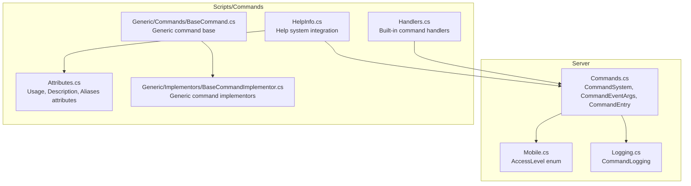
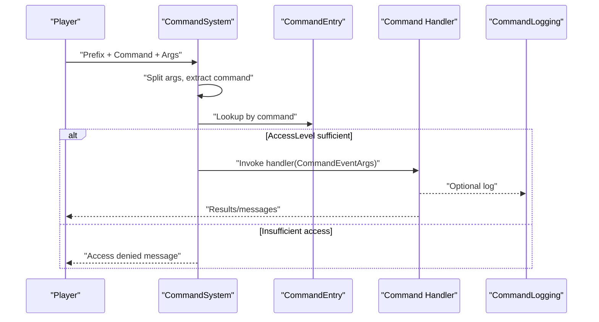
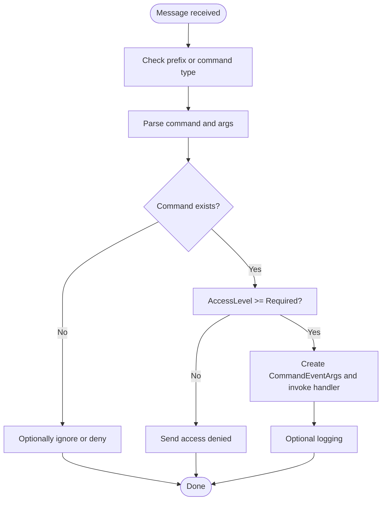
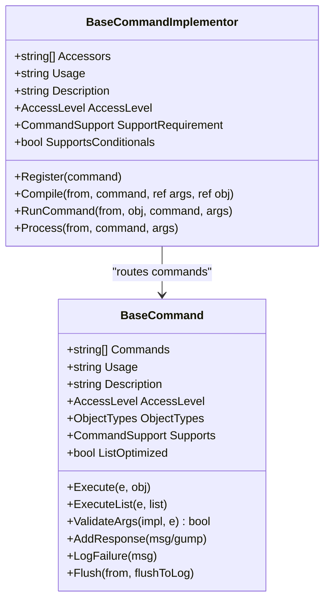
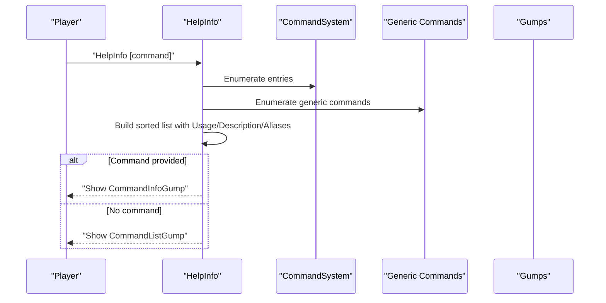
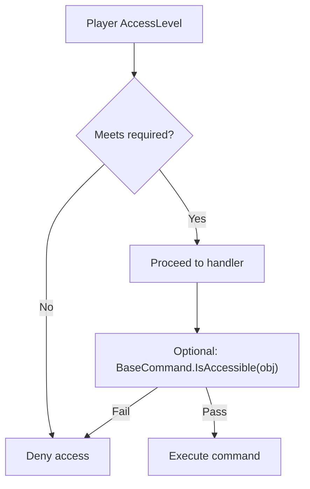
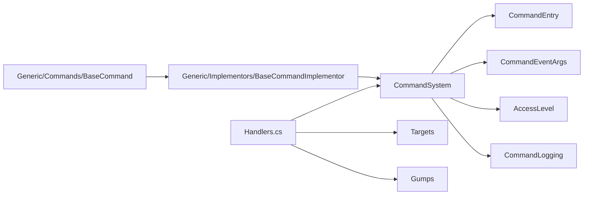

# Command System

<cite>
**Referenced Files in This Document**
- [Commands.cs](file://Server/Commands.cs)
- [Handlers.cs](file://Scripts/Commands/Handlers.cs)
- [HelpInfo.cs](file://Scripts/Commands/HelpInfo.cs)
- [BaseCommand.cs](file://Scripts/Commands/Generic/Commands/BaseCommand.cs)
- [BaseCommandImplementor.cs](file://Scripts/Commands/Generic/Implementors/BaseCommandImplementor.cs)
- [Attributes.cs](file://Scripts/Commands/Attributes.cs)
- [Logging.cs](file://Scripts/Commands/Logging.cs)
- [Mobile.cs](file://Server/Mobile.cs)
</cite>

## Table of Contents
1. [Introduction](#introduction)
2. [Project Structure](#project-structure)
3. [Core Components](#core-components)
4. [Architecture Overview](#architecture-overview)
5. [Detailed Component Analysis](#detailed-component-analysis)
6. [Dependency Analysis](#dependency-analysis)
7. [Performance Considerations](#performance-considerations)
8. [Troubleshooting Guide](#troubleshooting-guide)
9. [Conclusion](#conclusion)

## Introduction
This document explains ServUO’s command system architecture with a focus on the command registration framework, access level permissions, and the command execution pipeline. It documents the CommandSystem class, command handlers, and permission validation mechanisms. It also covers the generic command framework for automated operations, command aliases, and help system integration. Administrative command categories, security models, and best practices for implementing robust custom commands are included.

## Project Structure
ServUO organizes command-related logic across two primary areas:
- Core command infrastructure resides in the Server assembly under the Commands namespace.
- Command handlers and help integration live in Scripts/Commands, including the generic command framework for batch operations.

**Diagram sources**
- [Commands.cs](file://Server/Commands.cs#L1-L288)
- [Handlers.cs](file://Scripts/Commands/Handlers.cs#L1-L1012)
- [HelpInfo.cs](file://Scripts/Commands/HelpInfo.cs#L1-L437)
- [BaseCommand.cs](file://Scripts/Commands/Generic/Commands/BaseCommand.cs#L1-L237)
- [BaseCommandImplementor.cs](file://Scripts/Commands/Generic/Implementors/BaseCommandImplementor.cs#L1-L372)
- [Attributes.cs](file://Scripts/Commands/Attributes.cs#L1-L55)
- [Logging.cs](file://Scripts/Commands/Logging.cs#L1-L133)
- [Mobile.cs](file://Server/Mobile.cs#L430-L500)

**Section sources**
- [Commands.cs](file://Server/Commands.cs#L1-L288)
- [Handlers.cs](file://Scripts/Commands/Handlers.cs#L1-L100)
- [HelpInfo.cs](file://Scripts/Commands/HelpInfo.cs#L1-L120)
- [BaseCommand.cs](file://Scripts/Commands/Generic/Commands/BaseCommand.cs#L1-L120)
- [BaseCommandImplementor.cs](file://Scripts/Commands/Generic/Implementors/BaseCommandImplementor.cs#L1-L120)
- [Attributes.cs](file://Scripts/Commands/Attributes.cs#L1-L55)
- [Logging.cs](file://Scripts/Commands/Logging.cs#L1-L133)
- [Mobile.cs](file://Server/Mobile.cs#L430-L500)

## Core Components
- CommandSystem: Central dispatcher that registers commands, parses input, validates access level, and invokes handlers.
- CommandEventArgs: Provides parsed arguments and helpers to convert to typed values.
- CommandEntry: Stores command metadata (name, handler, access level).
- Command handlers: Methods registered via CommandSystem.Register or CommandHandlers.Initialize.
- AccessLevel: Enumerated permission tiers used for access checks.
- Generic command framework: BaseCommand and BaseCommandImplementor enable batch operations with modifiers (Single, Global, Online, Area, Region, etc.).
- Help system: Collects Usage/Description/Aliases attributes and exposes a searchable command list and per-command details.
- CommandLogging: Optional audit trail for commands executed by players.

**Section sources**
- [Commands.cs](file://Server/Commands.cs#L88-L288)
- [Handlers.cs](file://Scripts/Commands/Handlers.cs#L1-L100)
- [BaseCommand.cs](file://Scripts/Commands/Generic/Commands/BaseCommand.cs#L1-L120)
- [BaseCommandImplementor.cs](file://Scripts/Commands/Generic/Implementors/BaseCommandImplementor.cs#L1-L120)
- [HelpInfo.cs](file://Scripts/Commands/HelpInfo.cs#L1-L120)
- [Logging.cs](file://Scripts/Commands/Logging.cs#L1-L133)
- [Mobile.cs](file://Server/Mobile.cs#L430-L500)

## Architecture Overview
The command pipeline begins when a player sends a message prefixed with the configured prefix. CommandSystem parses the command, validates access level, and invokes the registered handler. For built-in commands, handlers are registered during initialization. For generic commands, BaseCommandImplementor routes arguments to BaseCommand implementations supporting various modifiers.

**Diagram sources**
- [Commands.cs](file://Server/Commands.cs#L214-L288)
- [Handlers.cs](file://Scripts/Commands/Handlers.cs#L1-L100)
- [Logging.cs](file://Scripts/Commands/Logging.cs#L60-L120)

## Detailed Component Analysis

### CommandSystem and Command Pipeline
- Registration: Commands are registered with a name, access level, and handler delegate. Registration is centralized in CommandSystem.Entries.
- Prefix handling: CommandSystem.Prefix determines the trigger prefix; commands can also be invoked with MessageType.Command.
- Parsing: CommandSystem.Split supports quoted strings and whitespace-delimited tokens.
- Dispatch: CommandSystem.Handle validates access level, constructs CommandEventArgs, and invokes the handler. It also raises EventSink.InvokeCommand after invocation.

**Diagram sources**
- [Commands.cs](file://Server/Commands.cs#L135-L288)

**Section sources**
- [Commands.cs](file://Server/Commands.cs#L135-L288)

### Built-in Command Handlers (Registration and Examples)
- Registration pattern: CommandHandlers.Initialize sets the prefix and registers commands with AccessLevel and handler delegates. Many commands also define Usage and Description attributes for help integration.
- Example handlers demonstrate:
  - Parameter parsing and validation (e.g., Sound, Echo, Light, Stats).
  - Target selection via targets (e.g., ViewEquip, Bank, Stuck).
  - Bulk operations with warnings and confirmations (e.g., ClearFacet).
  - Teleportation logic with accessibility checks (e.g., Go).

Concrete examples:
- Command registration and aliases: See the initial registration block and alias usage on a staff broadcast command.
- Parameter parsing: Sound and Echo handlers show typed argument retrieval and format validation.
- Target selection: ViewEquip and Bank handlers set a Target on the invoking Mobile.
- Bulk confirmation: ClearFacet builds a list of objects and prompts the player with a warning gump before deletion.

**Section sources**
- [Handlers.cs](file://Scripts/Commands/Handlers.cs#L1-L100)
- [Handlers.cs](file://Scripts/Commands/Handlers.cs#L354-L420)
- [Handlers.cs](file://Scripts/Commands/Handlers.cs#L425-L440)
- [Handlers.cs](file://Scripts/Commands/Handlers.cs#L447-L457)
- [Handlers.cs](file://Scripts/Commands/Handlers.cs#L565-L571)
- [Handlers.cs](file://Scripts/Commands/Handlers.cs#L572-L578)
- [Handlers.cs](file://Scripts/Commands/Handlers.cs#L579-L592)
- [Handlers.cs](file://Scripts/Commands/Handlers.cs#L617-L800)

### Generic Command Framework (Automated Operations)
The generic command framework enables automated operations over collections of objects with modifiers:
- BaseCommand: Defines Commands, Usage, Description, AccessLevel, ObjectTypes, Supports, and methods to execute on single or lists of objects. Includes response aggregation and failure logging.
- BaseCommandImplementor: Provides modifiers (Single, Global, Online, Area, Region, Contained, IPAddress, etc.) and routing logic. It compiles arguments into an object or list and executes BaseCommand methods.

**Diagram sources**
- [BaseCommand.cs](file://Scripts/Commands/Generic/Commands/BaseCommand.cs#L1-L237)
- [BaseCommandImplementor.cs](file://Scripts/Commands/Generic/Implementors/BaseCommandImplementor.cs#L1-L372)

**Section sources**
- [BaseCommand.cs](file://Scripts/Commands/Generic/Commands/BaseCommand.cs#L1-L237)
- [BaseCommandImplementor.cs](file://Scripts/Commands/Generic/Implementors/BaseCommandImplementor.cs#L1-L372)

### Help System Integration
- Attributes: Usage, Description, and Aliases decorate command handlers and generic commands.
- HelpInfo: Scans registered handlers and generic commands, extracts attributes, and builds a searchable command list. It supports per-command details and filtering by AccessLevel.
- CommandListGump and CommandInfoGump: Render paginated command listings and detailed command pages with usage, aliases, and access level.

**Diagram sources**
- [HelpInfo.cs](file://Scripts/Commands/HelpInfo.cs#L1-L200)
- [Attributes.cs](file://Scripts/Commands/Attributes.cs#L1-L55)

**Section sources**
- [HelpInfo.cs](file://Scripts/Commands/HelpInfo.cs#L1-L200)
- [Attributes.cs](file://Scripts/Commands/Attributes.cs#L1-L55)

### Access Level Permissions and Security Model
- AccessLevel enum defines hierarchical permission tiers used across the system.
- CommandSystem.Handle enforces AccessLevel checks before invoking handlers.
- BaseCommand.IsAccessible centralizes visibility checks for generic commands, preventing actions on higher-tier targets.
- CommandLogging provides optional auditing of command usage.

**Diagram sources**
- [Commands.cs](file://Server/Commands.cs#L248-L288)
- [BaseCommand.cs](file://Scripts/Commands/Generic/Commands/BaseCommand.cs#L109-L127)
- [Mobile.cs](file://Server/Mobile.cs#L430-L500)

**Section sources**
- [Commands.cs](file://Server/Commands.cs#L248-L288)
- [BaseCommand.cs](file://Scripts/Commands/Generic/Commands/BaseCommand.cs#L109-L127)
- [Mobile.cs](file://Server/Mobile.cs#L430-L500)

## Dependency Analysis
- CommandSystem depends on:
  - CommandEventArgs for argument extraction and typed conversion.
  - AccessLevel for permission checks.
  - CommandLogging for optional audit trails.
- Built-in handlers depend on:
  - CommandSystem for registration and dispatch.
  - Targeting subsystem for interactive commands.
  - Gumps for UI-driven workflows.
- Generic framework depends on:
  - BaseCommandImplementor modifiers to compile and route arguments.
  - BaseCommand for execution semantics and response aggregation.

**Diagram sources**
- [Commands.cs](file://Server/Commands.cs#L1-L288)
- [Handlers.cs](file://Scripts/Commands/Handlers.cs#L1-L100)
- [BaseCommand.cs](file://Scripts/Commands/Generic/Commands/BaseCommand.cs#L1-L237)
- [BaseCommandImplementor.cs](file://Scripts/Commands/Generic/Implementors/BaseCommandImplementor.cs#L1-L372)

**Section sources**
- [Commands.cs](file://Server/Commands.cs#L1-L288)
- [Handlers.cs](file://Scripts/Commands/Handlers.cs#L1-L100)
- [BaseCommand.cs](file://Scripts/Commands/Generic/Commands/BaseCommand.cs#L1-L237)
- [BaseCommandImplementor.cs](file://Scripts/Commands/Generic/Implementors/BaseCommandImplementor.cs#L1-L372)

## Performance Considerations
- Argument parsing: CommandSystem.Split handles quoted strings efficiently; avoid excessive nested quoting in long argument lists.
- Bulk operations: Generic commands can process lists; for large sets, consider enabling CommandLogging only when necessary to reduce I/O overhead.
- Target-based commands: Interactive targets (e.g., ViewEquip, Bank) trigger UI flows; keep target callbacks minimal and defer heavy work to background tasks when appropriate.
- Help system: Building the command list scans all registered commands and generic commands; cache where feasible in custom integrations.

[No sources needed since this section provides general guidance]

## Troubleshooting Guide
Common issues and resolutions:
- Invalid command or insufficient access:
  - Symptom: “That is not a valid command.” or “You do not have access to that command.”
  - Cause: Command not registered or AccessLevel mismatch.
  - Resolution: Verify registration and AccessLevel in CommandSystem.Entries; ensure handler attributes match intended AccessLevel.
- Parameter parsing errors:
  - Symptom: Format messages for commands expecting typed parameters.
  - Cause: Missing or incorrect argument types.
  - Resolution: Use CommandEventArgs typed getters; validate lengths and types before processing.
- Target selection failures:
  - Symptom: “That is not a player.” or similar feedback.
  - Cause: Incorrect targeting or visibility checks.
  - Resolution: Use BaseCommand.IsAccessible for generic commands; ensure AccessLevel comparisons are correct.
- Bulk operation warnings:
  - Symptom: Confirmation prompt before bulk deletion.
  - Cause: Intentional safety measure.
  - Resolution: Review the generated list and confirm the action.
- Logging and auditing:
  - Symptom: Missing logs.
  - Cause: CommandLogging disabled or exceptions during write.
  - Resolution: Enable CommandLogging.Enabled; check Logs/Commands directory permissions.

**Section sources**
- [Commands.cs](file://Server/Commands.cs#L248-L288)
- [Handlers.cs](file://Scripts/Commands/Handlers.cs#L166-L225)
- [BaseCommand.cs](file://Scripts/Commands/Generic/Commands/BaseCommand.cs#L109-L127)
- [Logging.cs](file://Scripts/Commands/Logging.cs#L1-L133)

## Conclusion
ServUO’s command system combines a robust dispatcher with flexible permission enforcement and a powerful generic framework for batch operations. Built-in handlers demonstrate practical patterns for parameter parsing, target selection, and UI integration. The help system leverages attributes to provide discoverability and clarity. By following the outlined best practices—ensuring proper AccessLevel checks, validating arguments, leveraging BaseCommandImplementor modifiers, and using CommandLogging—you can implement secure, maintainable, and user-friendly custom commands.