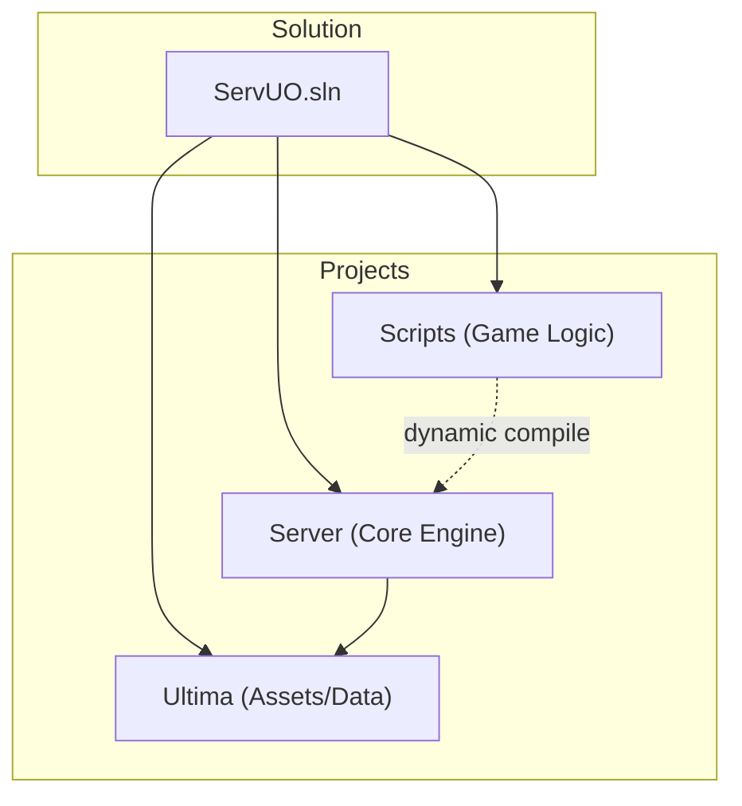
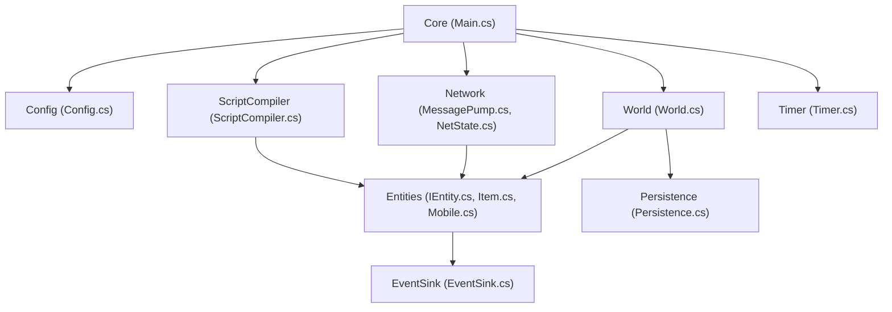
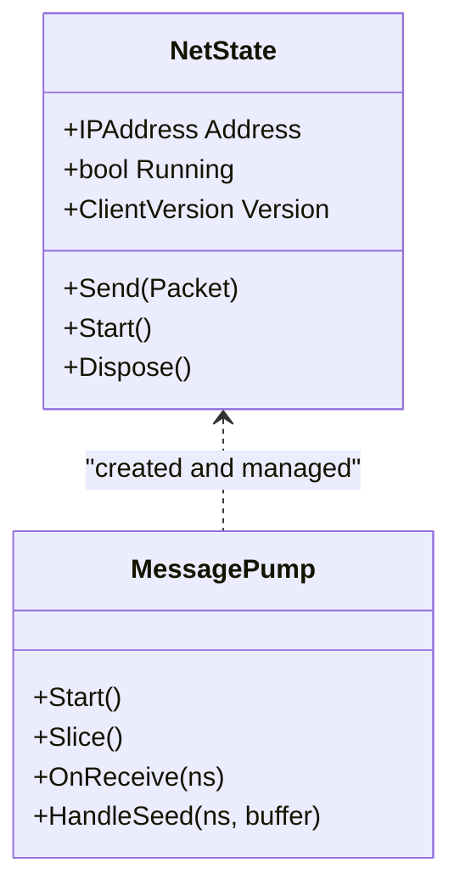
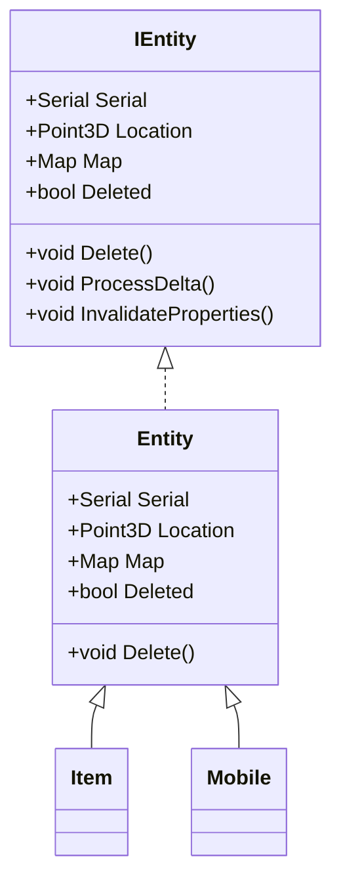
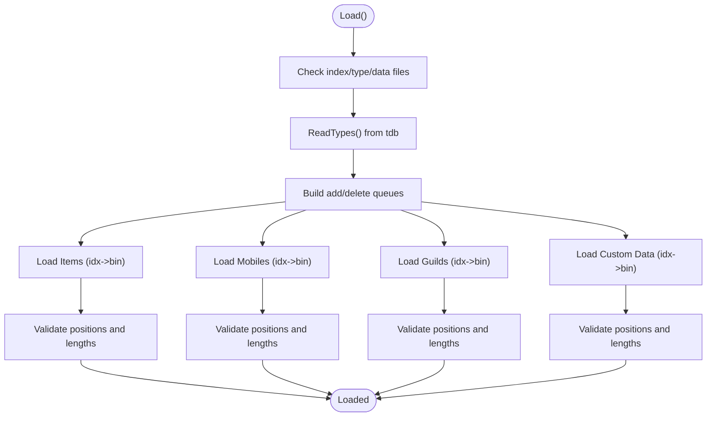
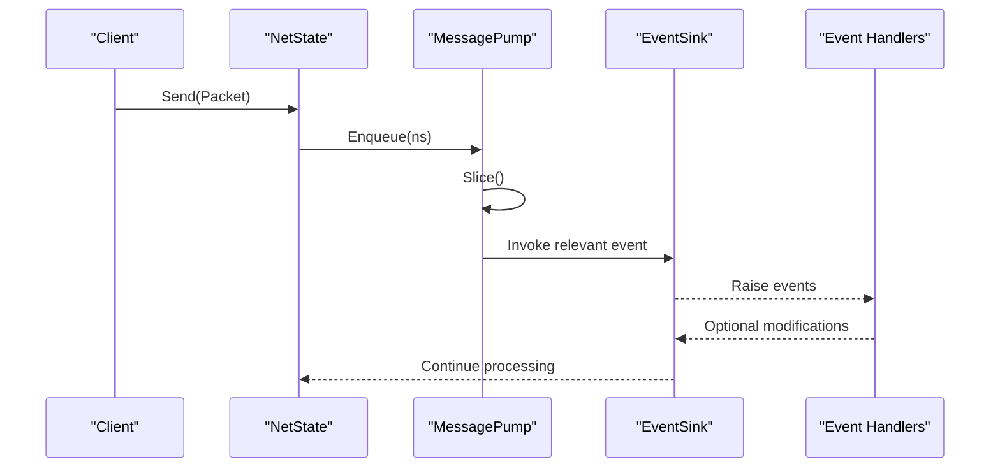
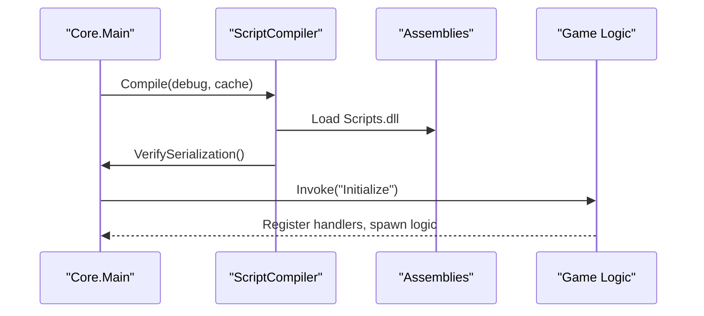
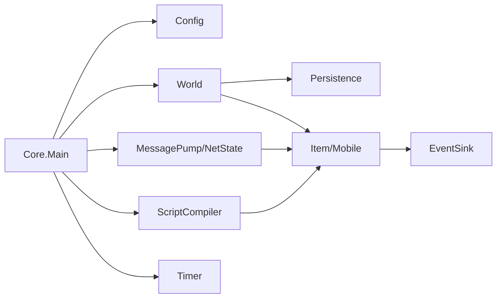

# Architecture Overview

<cite>
**Referenced Files in This Document**
- [Main.cs](file://Server/Main.cs)
- [Config.cs](file://Server/Config.cs)
- [World.cs](file://Server/World.cs)
- [NetState.cs](file://Server/Network/NetState.cs)
- [MessagePump.cs](file://Server/Network/MessagePump.cs)
- [Persistence.cs](file://Server/Persistence.cs)
- [IEntity.cs](file://Server/IEntity.cs)
- [Item.cs](file://Server/Item.cs)
- [Mobile.cs](file://Server/Mobile.cs)
- [ScriptCompiler.cs](file://Server/ScriptCompiler.cs)
- [EventSink.cs](file://Server/EventSink.cs)
- [Timer.cs](file://Server/Timer.cs)
- [README.md](file://README.md)
- [ServUO.exe.config](file://ServUO.exe.config)
- [Server.csproj](file://Server/Server.csproj)
- [ServUO.sln](file://ServUO.sln)
</cite>

## Table of Contents
1. [Introduction](#introduction)
2. [Project Structure](#project-structure)
3. [Core Components](#core-components)
4. [Architecture Overview](#architecture-overview)
5. [Detailed Component Analysis](#detailed-component-analysis)
6. [Dependency Analysis](#dependency-analysis)
7. [Performance Considerations](#performance-considerations)
8. [Troubleshooting Guide](#troubleshooting-guide)
9. [Conclusion](#conclusion)
10. [Appendices](#appendices)

## Introduction
This document presents ServUO’s system architecture and component relationships. The server follows a layered design separating the core engine, networking layer, and game logic. It implements an Entity Component System (ECS)-inspired model via an entity interface and concrete types, uses an event-driven design through a central event sink, and supports a plugin-style customization framework via dynamic script compilation. Cross-cutting concerns include security, monitoring, and scalability. The technology stack targets .NET Framework 4.8 with optional Mono compatibility and Windows Performance Counters support.

## Project Structure
ServUO is organized into three primary projects:
- Server: Core engine, world persistence, networking, timers, and ECS entities
- Scripts: Game logic plugins compiled dynamically at runtime
- Ultima: Client assets and data access



**Diagram sources**
- [ServUO.sln](file://ServUO.sln#L1-L55)
- [Server.csproj](file://Server/Server.csproj#L1-L28)

**Section sources**
- [ServUO.sln](file://ServUO.sln#L1-L55)
- [Server.csproj](file://Server/Server.csproj#L1-L28)

## Core Components
- Core engine bootstrap and main loop: initializes runtime, loads configuration, compiles scripts, starts networking and timers, and runs the main simulation loop
- Networking layer: listener management, connection handling, packet receive/send, throttling, and per-client state
- ECS entities: base entity interface and concrete types for items and mobiles
- Persistence: binary serialization/deserialization for world, items, mobiles, guilds, and custom data
- Event system: centralized event sink for game events and lifecycle hooks
- Scripting: dynamic compilation of scripts and invocation of initialization routines
- Timers: priority-based scheduling for periodic and delayed actions

**Section sources**
- [Main.cs](file://Server/Main.cs#L329-L606)
- [NetState.cs](file://Server/Network/NetState.cs#L595-L800)
- [MessagePump.cs](file://Server/Network/MessagePump.cs#L1-L200)
- [IEntity.cs](file://Server/IEntity.cs#L1-L106)
- [Item.cs](file://Server/Item.cs#L1-L200)
- [Mobile.cs](file://Server/Mobile.cs#L1-L200)
- [Persistence.cs](file://Server/Persistence.cs#L1-L119)
- [EventSink.cs](file://Server/EventSink.cs#L1-L200)
- [ScriptCompiler.cs](file://Server/ScriptCompiler.cs#L1-L120)
- [Timer.cs](file://Server/Timer.cs#L1-L120)

## Architecture Overview
ServUO’s architecture is layered and event-driven:
- Core layer: entry point, configuration, script compilation, world load/save, and main loop
- Networking layer: listeners, per-connection state, packet queues, and throttling
- Game logic layer: ECS entities (items and mobiles), persistence, timers, and event-driven handlers



**Diagram sources**
- [Main.cs](file://Server/Main.cs#L329-L606)
- [Config.cs](file://Server/Config.cs#L220-L320)
- [ScriptCompiler.cs](file://Server/ScriptCompiler.cs#L1-L120)
- [World.cs](file://Server/World.cs#L1-L120)
- [MessagePump.cs](file://Server/Network/MessagePump.cs#L1-L120)
- [NetState.cs](file://Server/Network/NetState.cs#L595-L773)
- [IEntity.cs](file://Server/IEntity.cs#L1-L106)
- [Item.cs](file://Server/Item.cs#L1-L200)
- [Mobile.cs](file://Server/Mobile.cs#L1-L200)
- [Persistence.cs](file://Server/Persistence.cs#L1-L119)
- [Timer.cs](file://Server/Timer.cs#L1-L120)
- [EventSink.cs](file://Server/EventSink.cs#L1-L120)

## Detailed Component Analysis

### Main Loop and Control Flow
The core entry point initializes runtime settings, loads configuration, compiles scripts, loads regions/world, starts networking and timers, and enters the main loop. The loop coordinates delta processing, timers, network slices, and periodic metrics.

```mermaid
sequenceDiagram
participant Core as "Core.Main"
participant Config as "Config.Load"
participant Compiler as "ScriptCompiler.Compile"
participant World as "World.Load"
participant Net as "MessagePump.Start"
participant Timer as "Timer.Thread"
participant Loop as "Core.Main Loop"
Core->>Config : Load()
Core->>Compiler : Compile(debug, cache)
Compiler-->>Core : success/failure
Core->>World : Load()
Core->>Net : Start()
Core->>Timer : Start()
Loop->>Loop : ProcessDeltaQueue()
Loop->>Timer : Slice()
Loop->>Net : Slice(), FlushAll()
Loop->>Loop : Periodic CPS sampling
```

**Diagram sources**
- [Main.cs](file://Server/Main.cs#L329-L606)
- [Config.cs](file://Server/Config.cs#L220-L320)
- [ScriptCompiler.cs](file://Server/ScriptCompiler.cs#L1-L120)
- [World.cs](file://Server/World.cs#L348-L590)
- [MessagePump.cs](file://Server/Network/MessagePump.cs#L22-L83)
- [Timer.cs](file://Server/Timer.cs#L131-L200)

**Section sources**
- [Main.cs](file://Server/Main.cs#L329-L606)

### Networking Layer
The networking layer manages listeners, per-connection state, receive/send queues, compression/encryption hooks, and throttling. It integrates with the main loop via a slice mechanism and maintains per-client state such as protocol changes and caps.



**Diagram sources**
- [NetState.cs](file://Server/Network/NetState.cs#L595-L800)
- [MessagePump.cs](file://Server/Network/MessagePump.cs#L1-L120)

**Section sources**
- [NetState.cs](file://Server/Network/NetState.cs#L595-L800)
- [MessagePump.cs](file://Server/Network/MessagePump.cs#L1-L200)

### Entity Component System (ECS) Pattern
ServUO employs an ECS-inspired model:
- Entity interface defines identity, location, direction, deletion, and lifecycle hooks
- Item and Mobile derive from a shared entity base and implement ECS-like composition via components and behaviors
- World manages collections of entities and coordinates serialization/deserialization



**Diagram sources**
- [IEntity.cs](file://Server/IEntity.cs#L1-L106)
- [Item.cs](file://Server/Item.cs#L1-L200)
- [Mobile.cs](file://Server/Mobile.cs#L1-L200)

**Section sources**
- [IEntity.cs](file://Server/IEntity.cs#L1-L106)
- [Item.cs](file://Server/Item.cs#L1-L200)
- [Mobile.cs](file://Server/Mobile.cs#L1-L200)

### Persistence System
World persistence reads type indices and binary streams to reconstruct entities and custom data. It coordinates type discovery, construction via serialization constructors, and safe handling of load errors.



**Diagram sources**
- [World.cs](file://Server/World.cs#L348-L774)

**Section sources**
- [World.cs](file://Server/World.cs#L348-L774)
- [Persistence.cs](file://Server/Persistence.cs#L1-L119)

### Event-Driven Design
The event sink provides a central hub for game events (login, logout, movement, speech, etc.). Handlers subscribe to events and can modify outcomes or trigger side effects.



**Diagram sources**
- [MessagePump.cs](file://Server/Network/MessagePump.cs#L106-L134)
- [EventSink.cs](file://Server/EventSink.cs#L1-L200)

**Section sources**
- [EventSink.cs](file://Server/EventSink.cs#L1-L200)
- [MessagePump.cs](file://Server/Network/MessagePump.cs#L106-L134)

### Plugin Architecture via Custom Framework
ServUO integrates a Custom Framework (referred to as “Customs Framework” in code comments and references). Scripts are compiled dynamically at startup and invoked through the compiler’s reflection-based invocation routine. This enables a plugin-style extension of game logic without recompiling the core.



**Diagram sources**
- [ScriptCompiler.cs](file://Server/ScriptCompiler.cs#L1-L120)
- [Main.cs](file://Server/Main.cs#L525-L563)

**Section sources**
- [ScriptCompiler.cs](file://Server/ScriptCompiler.cs#L1-L120)
- [Main.cs](file://Server/Main.cs#L525-L563)

## Dependency Analysis
- Core depends on configuration, scripting, world, networking, and timers
- Networking depends on entity state and diagnostics
- Entities depend on persistence and event sinks
- Scripts depend on the core APIs exposed to plugins



**Diagram sources**
- [Main.cs](file://Server/Main.cs#L329-L606)
- [Config.cs](file://Server/Config.cs#L220-L320)
- [ScriptCompiler.cs](file://Server/ScriptCompiler.cs#L1-L120)
- [World.cs](file://Server/World.cs#L1-L120)
- [MessagePump.cs](file://Server/Network/MessagePump.cs#L1-L120)
- [NetState.cs](file://Server/Network/NetState.cs#L595-L773)
- [Persistence.cs](file://Server/Persistence.cs#L1-L119)
- [IEntity.cs](file://Server/IEntity.cs#L1-L106)
- [EventSink.cs](file://Server/EventSink.cs#L1-L120)

**Section sources**
- [Main.cs](file://Server/Main.cs#L329-L606)
- [ScriptCompiler.cs](file://Server/ScriptCompiler.cs#L1-L120)
- [World.cs](file://Server/World.cs#L1-L120)

## Performance Considerations
- Main loop cadence and cycle sampling: the core measures cycles-per-second to monitor performance
- Threading model: a dedicated timer thread and asynchronous socket I/O
- Buffer pooling: send/receive buffers are pooled to reduce allocations
- Compression and encryption: optional encoder/encryptor pipeline for outgoing packets
- Garbage collection: server GC mode is detected and logged
- Profiling: optional profiling of timers and packets via diagnostics

Practical guidance:
- Monitor CPS and average CPS to detect performance regressions
- Tune update ranges and caps to balance visibility and bandwidth
- Enable profiling selectively for diagnostics and disable otherwise
- Ensure server GC mode is active in production environments

**Section sources**
- [Main.cs](file://Server/Main.cs#L273-L321)
- [NetState.cs](file://Server/Network/NetState.cs#L586-L631)
- [Timer.cs](file://Server/Timer.cs#L131-L200)
- [README.md](file://README.md#L34-L60)

## Troubleshooting Guide
Common areas to inspect:
- Crash handling and shutdown: unhandled exceptions route through the core crash handler and invoke shutdown events
- Configuration load failures: configuration loader reports errors and allows continuing or exiting
- Script compilation failures: compilation loops until resolved or service mode exits
- World load errors: robust handling with prompts to delete problematic objects
- Network throttling and capacity: excessive pending data triggers disconnection

Operational tips:
- Use service mode logs for headless environments
- Review console logs for invalid values and warnings
- Validate serialization constructors and methods for all entity types
- Investigate packet send failures and null buffer sends

**Section sources**
- [Main.cs](file://Server/Main.cs#L183-L233)
- [Config.cs](file://Server/Config.cs#L220-L320)
- [ScriptCompiler.cs](file://Server/ScriptCompiler.cs#L1-L120)
- [World.cs](file://Server/World.cs#L590-L800)
- [NetState.cs](file://Server/Network/NetState.cs#L740-L773)

## Conclusion
ServUO’s architecture cleanly separates concerns across core, networking, and game logic layers. Its ECS-inspired entity model, event-driven design, and dynamic scripting framework enable extensibility and maintainability. The system emphasizes performance monitoring, robust persistence, and scalable networking, while supporting both Windows and Mono environments.

## Appendices

### Technology Stack and Runtime
- Target framework: .NET Framework 4.8
- Executable manifest and runtime configuration specify the supported runtime
- Solution targets x64 platform and uses unsafe blocks for performance-sensitive code
- Mono compatibility indicated by platform detection and build instructions

**Section sources**
- [ServUO.exe.config](file://ServUO.exe.config#L1-L6)
- [Server.csproj](file://Server/Server.csproj#L1-L28)
- [Main.cs](file://Server/Main.cs#L471-L520)
- [README.md](file://README.md#L34-L60)