# Core Engine Design

<cite>
**Referenced Files in This Document**
- [Main.cs](file://Server/Main.cs)
- [Config.cs](file://Server/Config.cs)
- [World.cs](file://Server/World.cs)
- [Timer.cs](file://Server/Timer.cs)
- [MessagePump.cs](file://Server/Network/MessagePump.cs)
- [EventSink.cs](file://Server/EventSink.cs)
- [Persistence.cs](file://Server/Persistence/Persistence.cs)
- [ScriptCompiler.cs](file://Server/ScriptCompiler.cs)
- [Server.cfg](file://Config/Server.cfg)
- [Map.cs](file://Server/Map.cs)
</cite>

## Table of Contents
1. [Introduction](#introduction)
2. [Project Structure](#project-structure)
3. [Core Components](#core-components)
4. [Architecture Overview](#architecture-overview)
5. [Detailed Component Analysis](#detailed-component-analysis)
6. [Dependency Analysis](#dependency-analysis)
7. [Performance Considerations](#performance-considerations)
8. [Troubleshooting Guide](#troubleshooting-guide)
9. [Conclusion](#conclusion)
10. [Appendices](#appendices)

## Introduction
This document explains ServUO’s core engine architecture with emphasis on the main entry point, initialization sequence, configuration loading, core service initialization, the main game loop, timer system, and process management including graceful shutdown. It also covers architectural patterns such as singleton services, event-driven communication, and dependency injection via the configuration system. The document highlights thread management, memory/resource cleanup, performance characteristics, error handling, crash recovery, and practical extension points for customization.

## Project Structure
ServUO is organized around a central entry point and several foundational subsystems:
- Entry point and lifecycle orchestration: Server/Main.cs
- Configuration system: Server/Config.cs
- World persistence and lifecycle: Server/World.cs
- Timing and scheduling: Server/Timer.cs
- Networking and message pump: Server/Network/MessagePump.cs
- Event bus: Server/EventSink.cs
- Persistence helpers: Server/Persistence/Persistence.cs
- Script compilation and discovery: Server/ScriptCompiler.cs
- Example configuration: Config/Server.cfg
- Spatial/map utilities: Server/Map.cs

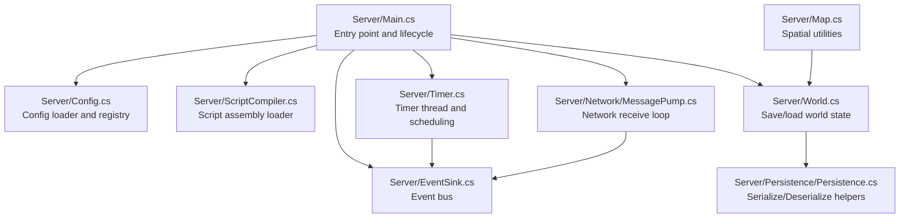

**Diagram sources**
- [Main.cs](file://Server/Main.cs#L290-L605)
- [Config.cs](file://Server/Config.cs#L220-L320)
- [ScriptCompiler.cs](file://Server/ScriptCompiler.cs#L18-L85)
- [World.cs](file://Server/World.cs#L348-L590)
- [Timer.cs](file://Server/Timer.cs#L131-L380)
- [MessagePump.cs](file://Server/Network/MessagePump.cs#L22-L64)
- [EventSink.cs](file://Server/EventSink.cs#L1-L120)
- [Persistence.cs](file://Server/Persistence/Persistence.cs#L1-L119)
- [Map.cs](file://Server/Map.cs#L118-L140)

**Section sources**
- [Main.cs](file://Server/Main.cs#L290-L605)
- [Config.cs](file://Server/Config.cs#L220-L320)
- [ScriptCompiler.cs](file://Server/ScriptCompiler.cs#L18-L85)
- [World.cs](file://Server/World.cs#L348-L590)
- [Timer.cs](file://Server/Timer.cs#L131-L380)
- [MessagePump.cs](file://Server/Network/MessagePump.cs#L22-L64)
- [EventSink.cs](file://Server/EventSink.cs#L1-L120)
- [Persistence.cs](file://Server/Persistence/Persistence.cs#L1-L119)
- [Map.cs](file://Server/Map.cs#L118-L140)

## Core Components
- Core lifecycle and main loop: Orchestrates startup, initializes services, runs the primary game loop, and handles shutdown.
- Configuration system: Loads, validates, and exposes configuration entries scoped by folders/files.
- World persistence: Manages save/load of entities and custom data, with safety queues and write completion signaling.
- Timer system: Implements a priority-sorted scheduler with a dedicated timer thread and queue-based execution.
- Networking: Accepts connections, manages receive buffers, throttling, and dispatches packets to handlers.
- Event bus: Centralized event sink for lifecycle, crash, shutdown, and gameplay events.
- Script compiler: Builds and loads script assemblies, discovers types, and invokes lifecycle hooks.
- Persistence helpers: Streamlined serialization/deserialization with robust error handling.

**Section sources**
- [Main.cs](file://Server/Main.cs#L290-L605)
- [Config.cs](file://Server/Config.cs#L220-L320)
- [World.cs](file://Server/World.cs#L348-L590)
- [Timer.cs](file://Server/Timer.cs#L131-L380)
- [MessagePump.cs](file://Server/Network/MessagePump.cs#L113-L134)
- [EventSink.cs](file://Server/EventSink.cs#L1-L120)
- [ScriptCompiler.cs](file://Server/ScriptCompiler.cs#L18-L85)
- [Persistence.cs](file://Server/Persistence/Persistence.cs#L1-L119)

## Architecture Overview
ServUO follows a layered, event-driven architecture:
- Entry point initializes platform, logging, configuration, script compilation, world load, network listeners, and starts the timer thread.
- The main loop coordinates delta processing, timers, network slices, and periodic metrics.
- World coordinates save/load and maintains safe queues for add/delete operations during saving/loading.
- Timer thread schedules timers by priority and signals the core thread to wake up and execute queued timers.
- Message pump drives network IO, throttling, and packet dispatching.
- EventSink provides centralized hooks for lifecycle and crash/shutdown handling.

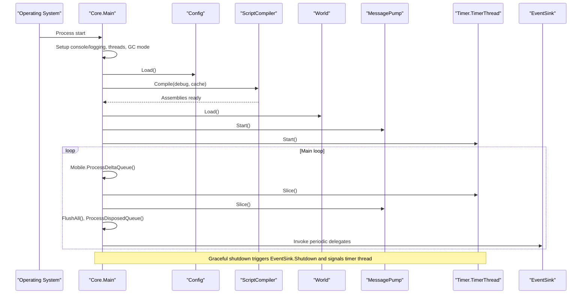

**Diagram sources**
- [Main.cs](file://Server/Main.cs#L330-L605)
- [Config.cs](file://Server/Config.cs#L220-L320)
- [ScriptCompiler.cs](file://Server/ScriptCompiler.cs#L18-L85)
- [World.cs](file://Server/World.cs#L348-L590)
- [MessagePump.cs](file://Server/Network/MessagePump.cs#L22-L64)
- [Timer.cs](file://Server/Timer.cs#L314-L380)
- [EventSink.cs](file://Server/EventSink.cs#L760-L775)

## Detailed Component Analysis

### Entry Point and Lifecycle Orchestration
- Parses command-line arguments, sets runtime flags, configures console output, and initializes process/thread priorities.
- Starts the timer thread and prints environment/runtime diagnostics.
- Loads configuration, compiles scripts, loads regions/world, invokes script initialization hooks, starts network listeners, and begins the main loop.
- Implements graceful shutdown via signal handling and a closing flag, ensuring disk writes complete and timers are signaled.

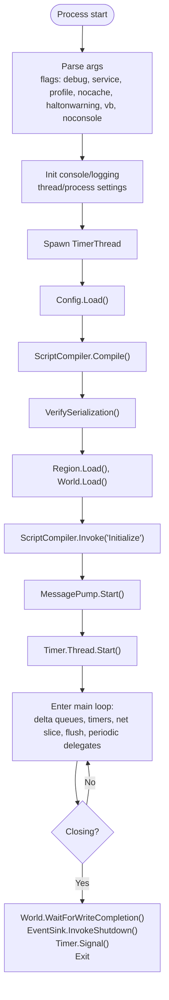

**Diagram sources**
- [Main.cs](file://Server/Main.cs#L330-L605)

**Section sources**
- [Main.cs](file://Server/Main.cs#L330-L605)

### Configuration System
- Scans Config directory recursively for *.cfg files and parses key=value pairs with optional descriptions and default markers.
- Provides strongly-typed getters and setters, change notifications, and scoped keys.
- Supports dumping current configuration and selective save per scope.

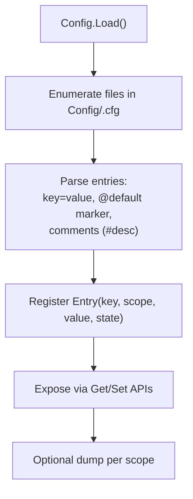

**Diagram sources**
- [Config.cs](file://Server/Config.cs#L220-L320)
- [Config.cs](file://Server/Config.cs#L324-L409)
- [Config.cs](file://Server/Config.cs#L411-L464)
- [Config.cs](file://Server/Config.cs#L501-L517)

**Section sources**
- [Config.cs](file://Server/Config.cs#L220-L320)
- [Config.cs](file://Server/Config.cs#L324-L409)
- [Config.cs](file://Server/Config.cs#L411-L464)
- [Config.cs](file://Server/Config.cs#L501-L517)
- [Server.cfg](file://Config/Server.cfg#L1-L19)

### World Persistence and Lifecycle
- Maintains dictionaries for items, mobiles, and custom save data.
- Coordinates safe add/delete operations during save/load using queues and write completion events.
- Reads type indices and binary data, invoking deserialization and validating positions.
- Provides broadcast utilities and synchronization primitives for safe shutdown.

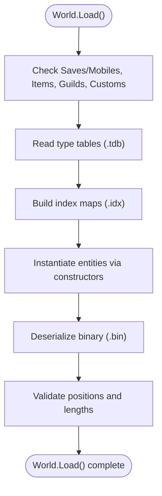

**Diagram sources**
- [World.cs](file://Server/World.cs#L348-L590)
- [World.cs](file://Server/World.cs#L592-L800)

**Section sources**
- [World.cs](file://Server/World.cs#L348-L590)
- [World.cs](file://Server/World.cs#L592-L800)
- [Persistence.cs](file://Server/Persistence/Persistence.cs#L1-L119)

### Timer System
- Implements a priority-sorted timer thread with fixed intervals per priority tier.
- Uses a shared queue to execute timers in bounded batches per slice.
- Supports dynamic priority changes and signals the core thread to wake up when timers are enqueued.

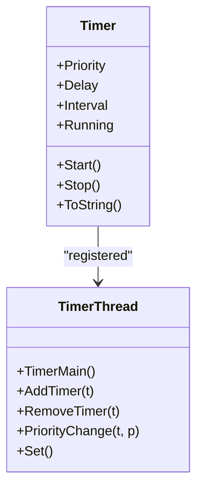

**Diagram sources**
- [Timer.cs](file://Server/Timer.cs#L36-L120)
- [Timer.cs](file://Server/Timer.cs#L131-L380)
- [Timer.cs](file://Server/Timer.cs#L382-L420)

**Section sources**
- [Timer.cs](file://Server/Timer.cs#L36-L120)
- [Timer.cs](file://Server/Timer.cs#L131-L380)
- [Timer.cs](file://Server/Timer.cs#L382-L420)

### Networking and Message Pump
- Starts listeners bound to configured endpoints and retries on failure.
- Drives accept loops, enqueues accepted sockets, and processes receive buffers.
- Handles seed/encryption checks, throttling, and dispatches to packet handlers.
- Uses buffer pooling and profiles packet receive paths when profiling is enabled.

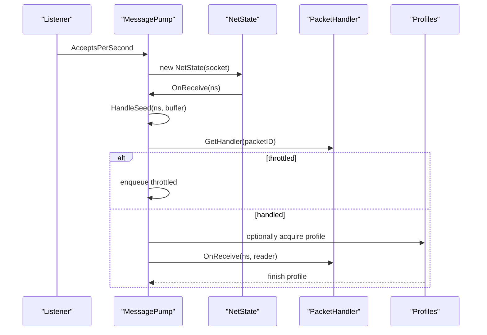

**Diagram sources**
- [MessagePump.cs](file://Server/Network/MessagePump.cs#L22-L64)
- [MessagePump.cs](file://Server/Network/MessagePump.cs#L106-L134)
- [MessagePump.cs](file://Server/Network/MessagePump.cs#L139-L205)
- [MessagePump.cs](file://Server/Network/MessagePump.cs#L206-L364)

**Section sources**
- [MessagePump.cs](file://Server/Network/MessagePump.cs#L22-L64)
- [MessagePump.cs](file://Server/Network/MessagePump.cs#L106-L134)
- [MessagePump.cs](file://Server/Network/MessagePump.cs#L139-L205)
- [MessagePump.cs](file://Server/Network/MessagePump.cs#L206-L364)

### Event-Driven Communication
- Centralized event sink with typed delegates for lifecycle, crash, shutdown, and gameplay events.
- Used for broadcasting, world save/load hooks, and crash handling.

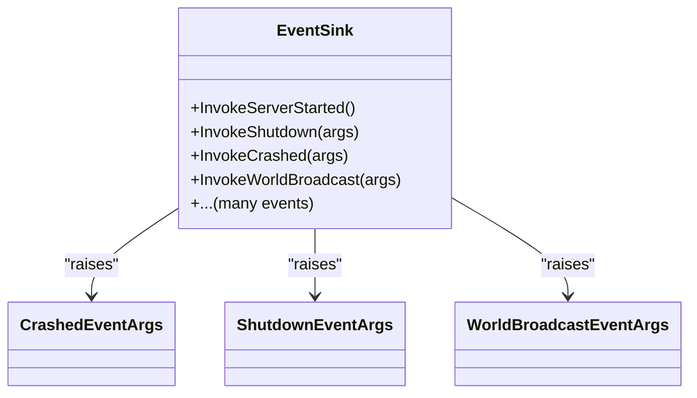

**Diagram sources**
- [EventSink.cs](file://Server/EventSink.cs#L1-L120)
- [EventSink.cs](file://Server/EventSink.cs#L760-L775)
- [EventSink.cs](file://Server/EventSink.cs#L243-L257)

**Section sources**
- [EventSink.cs](file://Server/EventSink.cs#L1-L120)
- [EventSink.cs](file://Server/EventSink.cs#L760-L775)
- [EventSink.cs](file://Server/EventSink.cs#L243-L257)

### Script Compilation and Discovery
- Optionally builds script projects and loads the resulting assembly.
- Verifies serialization constructors and methods for all script types.
- Discovers and invokes static methods by name across all loaded assemblies.

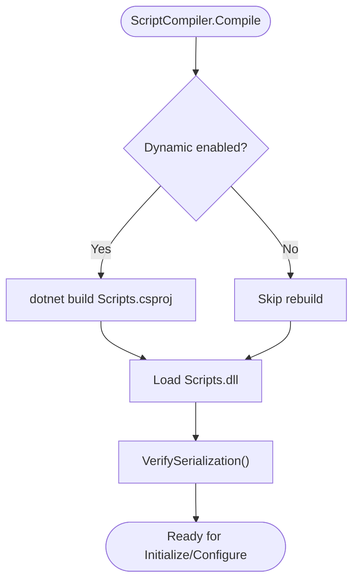

**Diagram sources**
- [ScriptCompiler.cs](file://Server/ScriptCompiler.cs#L18-L85)
- [ScriptCompiler.cs](file://Server/ScriptCompiler.cs#L87-L112)

**Section sources**
- [ScriptCompiler.cs](file://Server/ScriptCompiler.cs#L18-L85)
- [ScriptCompiler.cs](file://Server/ScriptCompiler.cs#L87-L112)

### Spatial Utilities and Map Integration
- Provides pooled enumerables and spatial selection utilities for efficient iteration over nearby entities.
- Integrates with global update ranges and configurable behaviors.

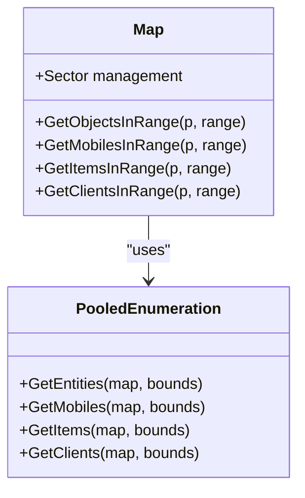

**Diagram sources**
- [Map.cs](file://Server/Map.cs#L146-L273)
- [Map.cs](file://Server/Map.cs#L367-L541)

**Section sources**
- [Map.cs](file://Server/Map.cs#L146-L273)
- [Map.cs](file://Server/Map.cs#L367-L541)

## Dependency Analysis
- Core.Main depends on Config, ScriptCompiler, World, MessagePump, Timer, and EventSink.
- World depends on Persistence for file operations and uses EventSink for save/load hooks.
- Timer depends on World state to pause scheduling during save/load.
- MessagePump depends on NetState and PacketHandlers; integrates with EventSink for throttling and encryption checks.
- ScriptCompiler depends on Config for dynamic build toggles and exposes types to the rest of the engine.

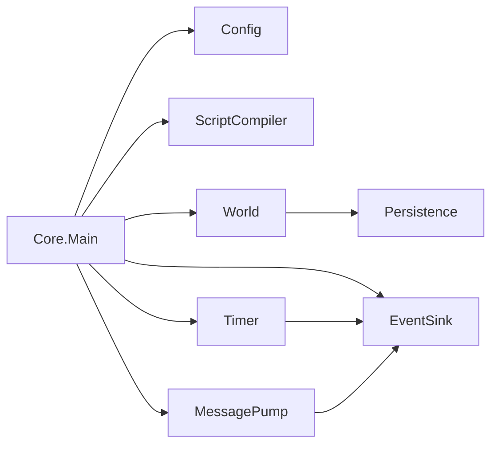

**Diagram sources**
- [Main.cs](file://Server/Main.cs#L330-L605)
- [Config.cs](file://Server/Config.cs#L220-L320)
- [ScriptCompiler.cs](file://Server/ScriptCompiler.cs#L18-L85)
- [World.cs](file://Server/World.cs#L348-L590)
- [Timer.cs](file://Server/Timer.cs#L131-L380)
- [MessagePump.cs](file://Server/Network/MessagePump.cs#L22-L64)
- [EventSink.cs](file://Server/EventSink.cs#L1-L120)
- [Persistence.cs](file://Server/Persistence/Persistence.cs#L1-L119)

**Section sources**
- [Main.cs](file://Server/Main.cs#L330-L605)
- [Config.cs](file://Server/Config.cs#L220-L320)
- [ScriptCompiler.cs](file://Server/ScriptCompiler.cs#L18-L85)
- [World.cs](file://Server/World.cs#L348-L590)
- [Timer.cs](file://Server/Timer.cs#L131-L380)
- [MessagePump.cs](file://Server/Network/MessagePump.cs#L22-L64)
- [EventSink.cs](file://Server/EventSink.cs#L1-L120)
- [Persistence.cs](file://Server/Persistence/Persistence.cs#L1-L119)

## Performance Considerations
- Timer batching: The timer slice processes a capped number of timers per pass to avoid starvation.
- Buffer pooling: MessagePump uses a buffer pool for packet reads to reduce allocations.
- Profiling hooks: Timer and packet receive paths support optional profiling for diagnostics.
- Threading model: Dedicated timer thread and core thread synchronize via AutoResetEvent and queues.
- Disk I/O: World saves use asynchronous-ready patterns and manual reset events to coordinate write completion.

[No sources needed since this section provides general guidance]

## Troubleshooting Guide
- Crash handling: Unhandled exceptions route through Core’s crash handler, triggering EventSink.Crashed and optionally prompting user input before termination.
- Graceful shutdown: Closing flag prevents new saves, waits for disk write completion, invokes shutdown events, and signals the timer thread.
- Configuration errors: Config loader supports interactive continue/exit on parse failures and warns on invalid values.
- Script compilation failures: Compile loop allows retry or exit depending on environment and flags.

**Section sources**
- [Main.cs](file://Server/Main.cs#L183-L233)
- [Main.cs](file://Server/Main.cs#L297-L320)
- [Config.cs](file://Server/Config.cs#L250-L280)
- [Config.cs](file://Server/Config.cs#L654-L704)

## Conclusion
ServUO’s core engine is a cohesive, event-driven system centered on a robust entry point that orchestrates configuration, script loading, world persistence, networking, and timing. The design emphasizes separation of concerns, deterministic lifecycle hooks, and safe resource management. Developers can extend functionality through the event bus, configuration system, and script lifecycle hooks, while relying on built-in mechanisms for graceful shutdown, crash recovery, and performance diagnostics.

[No sources needed since this section summarizes without analyzing specific files]

## Appendices

### Practical Extension Points
- Configuration-driven behavior: Use Config.Get/Set to expose modifiable settings and react to changes via OnEntryChanged.
- Script lifecycle: Implement Configure and Initialize in scripts to register handlers and initialize systems after Core has finished bootstrapping.
- Event hooks: Subscribe to EventSink events for world save/load, server start, shutdown, and crash scenarios.
- Timer scheduling: Use Timer.DelayCall variants to schedule recurring or one-shot tasks with appropriate priorities.
- Networking: Add packet handlers and throttling callbacks through MessagePump and PacketHandlers.

**Section sources**
- [Config.cs](file://Server/Config.cs#L166-L167)
- [ScriptCompiler.cs](file://Server/ScriptCompiler.cs#L87-L112)
- [EventSink.cs](file://Server/EventSink.cs#L1-L120)
- [Timer.cs](file://Server/Timer.cs#L509-L678)
- [MessagePump.cs](file://Server/Network/MessagePump.cs#L206-L364)