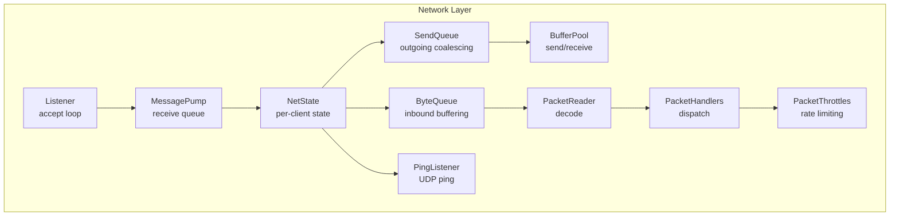
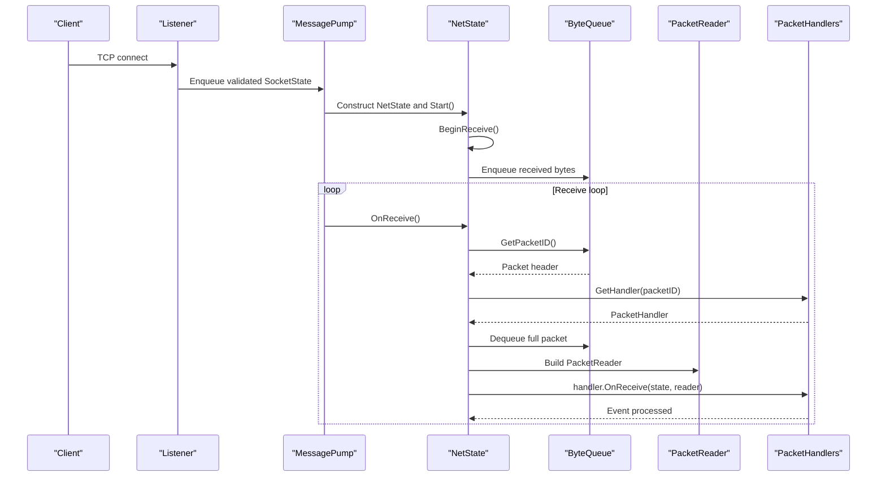
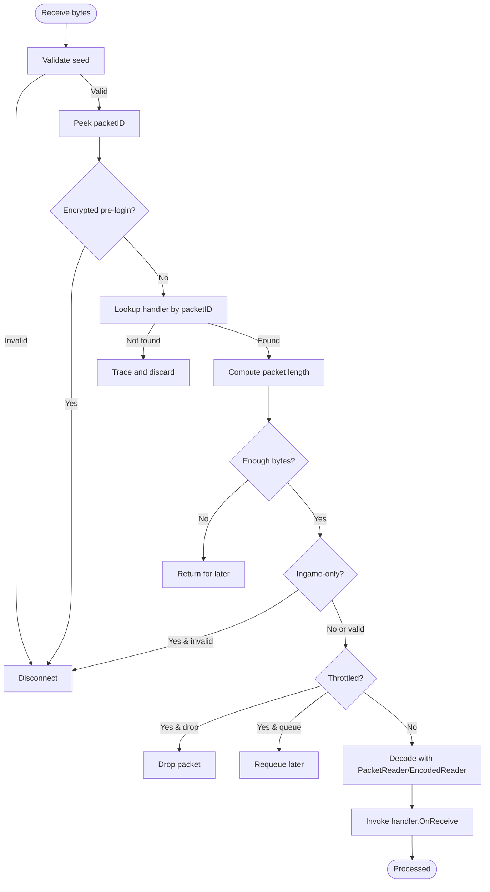
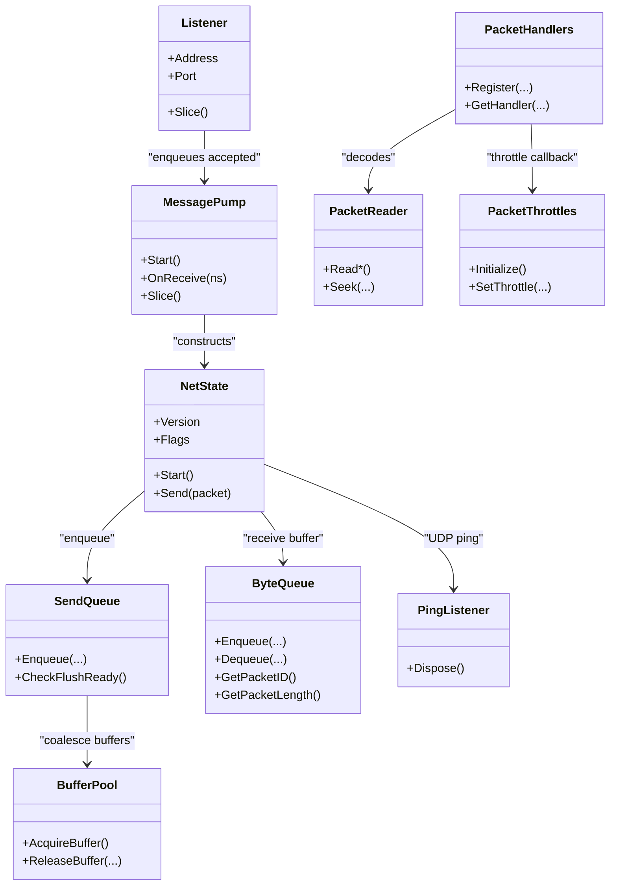

# Network Layer Architecture

<cite>
**Referenced Files in This Document**
- [NetState.cs](file://Server/Network/NetState.cs)
- [Listener.cs](file://Server/Network/Listener.cs)
- [MessagePump.cs](file://Server/Network/MessagePump.cs)
- [PacketHandlers.cs](file://Server/Network/PacketHandlers.cs)
- [PacketHandler.cs](file://Server/Network/PacketHandler.cs)
- [EncodedPacketHandler.cs](file://Server/Network/EncodedPacketHandler.cs)
- [EncodedReader.cs](file://Server/Network/EncodedReader.cs)
- [PacketReader.cs](file://Server/Network/PacketReader.cs)
- [PacketWriter.cs](file://Server/Network/PacketWriter.cs)
- [SendQueue.cs](file://Server/Network/SendQueue.cs)
- [ByteQueue.cs](file://Server/Network/ByteQueue.cs)
- [BufferPool.cs](file://Server/Network/BufferPool.cs)
- [PacketThrottles.cs](file://Server/Network/PacketThrottles.cs)
- [Packets.cs](file://Server/Network/Packets.cs)
- [PingListener.cs](file://Server/Network/PingListener.cs)
</cite>

## Table of Contents
1. [Introduction](#introduction)
2. [Project Structure](#project-structure)
3. [Core Components](#core-components)
4. [Architecture Overview](#architecture-overview)
5. [Detailed Component Analysis](#detailed-component-analysis)
6. [Dependency Analysis](#dependency-analysis)
7. [Performance Considerations](#performance-considerations)
8. [Troubleshooting Guide](#troubleshooting-guide)
9. [Conclusion](#conclusion)

## Introduction
This document explains ServUO’s network layer architecture with a focus on TCP socket handling, connection state management via NetState, protocol negotiation, and the packet processing pipeline from raw bytes to event routing. It also covers the message pump for asynchronous operations, the listener system for accepting clients, security measures (client verification, packet throttling, connection limits), and how different protocol versions are supported. Practical examples illustrate network event handling, connection lifecycle management, and error recovery strategies. Finally, it addresses performance optimization, memory management for buffers, and scalability considerations for handling many concurrent clients.

## Project Structure
ServUO organizes networking code under Server/Network, separating concerns into:
- Listener and accept loop for inbound TCP connections
- MessagePump orchestrating asynchronous receive processing
- NetState representing per-client state and IO
- PacketHandlers and handlers for decoding and dispatching packets
- SendQueue and buffer pools for efficient outbound IO
- Throttling and ping listener for security and monitoring

**Diagram sources**
- [Listener.cs](file://Server/Network/Listener.cs#L1-L120)
- [MessagePump.cs](file://Server/Network/MessagePump.cs#L1-L120)
- [NetState.cs](file://Server/Network/NetState.cs#L580-L640)
- [SendQueue.cs](file://Server/Network/SendQueue.cs#L1-L120)
- [BufferPool.cs](file://Server/Network/BufferPool.cs#L1-L99)
- [ByteQueue.cs](file://Server/Network/ByteQueue.cs#L1-L148)
- [PacketReader.cs](file://Server/Network/PacketReader.cs#L1-L120)
- [PacketHandlers.cs](file://Server/Network/PacketHandlers.cs#L1-L120)
- [PacketThrottles.cs](file://Server/Network/PacketThrottles.cs#L1-L120)
- [PingListener.cs](file://Server/Network/PingListener.cs#L1-L60)

**Section sources**
- [Listener.cs](file://Server/Network/Listener.cs#L1-L120)
- [MessagePump.cs](file://Server/Network/MessagePump.cs#L1-L120)
- [NetState.cs](file://Server/Network/NetState.cs#L580-L640)

## Core Components
- Listener: Binds TCP sockets, accepts connections asynchronously, validates initial sequences, enqueues validated sockets for processing.
- MessagePump: Manages listeners, slices accepted sockets, constructs NetState instances, and drives receive processing.
- NetState: Per-connection state, IO buffers, send queue, compression/encryption hooks, client version flags, and protocol change detection.
- PacketHandlers: Registry of packet handlers keyed by packet ID, including extended and encoded handlers, plus throttling registration.
- PacketReader/EncodedReader: Decoders for fixed-size and variable-length encoded packets.
- SendQueue: Outgoing packet coalescing and capacity control with a dedicated buffer pool.
- BufferPool: Reusable byte[] pools for send/receive and coalesced sends.
- ByteQueue: Circular buffer for inbound data aggregation.
- PacketThrottles: Global rate-limiting policy for selected packet IDs.
- PingListener: UDP listener responding to periodic pings.

**Section sources**
- [Listener.cs](file://Server/Network/Listener.cs#L1-L200)
- [MessagePump.cs](file://Server/Network/MessagePump.cs#L1-L200)
- [NetState.cs](file://Server/Network/NetState.cs#L1-L200)
- [PacketHandlers.cs](file://Server/Network/PacketHandlers.cs#L1-L200)
- [PacketReader.cs](file://Server/Network/PacketReader.cs#L1-L120)
- [EncodedReader.cs](file://Server/Network/EncodedReader.cs#L1-L63)
- [SendQueue.cs](file://Server/Network/SendQueue.cs#L1-L120)
- [BufferPool.cs](file://Server/Network/BufferPool.cs#L1-L99)
- [ByteQueue.cs](file://Server/Network/ByteQueue.cs#L1-L148)
- [PacketThrottles.cs](file://Server/Network/PacketThrottles.cs#L1-L120)
- [PingListener.cs](file://Server/Network/PingListener.cs#L1-L98)

## Architecture Overview
The network stack follows an asynchronous IO model:
- Listener binds and accepts TCP sockets using overlapped IO.
- Accepted sockets are validated (initial seed/packet checks) and queued.
- MessagePump slices queues, creates NetState, and starts receive processing.
- NetState maintains receive/send buffers and queues, and delegates decoding and dispatch to PacketHandlers.
- PacketHandlers consult throttling policies and route to event sinks or handlers.
- Outbound packets are compressed/encoded, enqueued to SendQueue, and sent asynchronously.

**Diagram sources**
- [Listener.cs](file://Server/Network/Listener.cs#L200-L320)
- [MessagePump.cs](file://Server/Network/MessagePump.cs#L100-L220)
- [NetState.cs](file://Server/Network/NetState.cs#L775-L840)
- [ByteQueue.cs](file://Server/Network/ByteQueue.cs#L50-L120)
- [PacketReader.cs](file://Server/Network/PacketReader.cs#L1-L120)
- [PacketHandlers.cs](file://Server/Network/PacketHandlers.cs#L170-L220)

## Detailed Component Analysis

### TCP Socket Handling and Listener System
- Binding and listening: The Listener binds a TCP socket to configured endpoints, sets timeouts and TCP_NODELAY, and listens with a backlog.
- Accept loop: Uses overlapped IO to accept connections asynchronously, resetting SocketAsyncEventArgs per accept.
- Validation: Validates incoming data by peeking initial bytes and checking for known login seeds or HTTP-like prefixes; supports encrypted client detection prior to handshake.
- Queueing: Enqueues validated SocketState into a concurrent queue for processing by MessagePump.

Security highlights:
- HTTP prefix filtering prevents web scraping/bot traffic.
- Encrypted client detection blocks unsupported encrypted protocols before login.
- Controlled accept rate via accept limiter and slice-based dequeue.

**Section sources**
- [Listener.cs](file://Server/Network/Listener.cs#L80-L170)
- [Listener.cs](file://Server/Network/Listener.cs#L230-L320)
- [Listener.cs](file://Server/Network/Listener.cs#L320-L420)
- [Listener.cs](file://Server/Network/Listener.cs#L420-L520)

### NetState: Connection State Management and Protocol Negotiation
- Per-connection state: Stores remote address, socket, receive/send buffers, send queue, gump/menu/trade collections, client flags, compression/encryption hooks, and client version.
- Protocol changes: Version property maps client version to a bitmask of protocol changes, enabling feature toggles across expansions.
- Lifecycle: Start() initiates asynchronous receive; Send() compiles packets, applies encoder/encryptor, enqueues to SendQueue, and triggers async send if needed.
- Security: Tracks Seeded state and validates initial seed; guards against invalid or unsupported encrypted packets before login.

Protocol negotiation:
- ClientVersion and ClientFlags determine capabilities and feature availability.
- Version-dependent handler sets (e.g., 6.0.1.7 variants) are registered separately and selected by handlers registry.

**Section sources**
- [NetState.cs](file://Server/Network/NetState.cs#L1-L200)
- [NetState.cs](file://Server/Network/NetState.cs#L200-L420)
- [NetState.cs](file://Server/Network/NetState.cs#L420-L640)
- [NetState.cs](file://Server/Network/NetState.cs#L640-L840)

### Packet Processing Pipeline: From Bytes to Events
- Receive orchestration: MessagePump.HandleReceive coordinates per-NetState receive processing.
- Seed handling: Ensures a valid seed is present before parsing further packets; supports legacy and new seed mechanisms.
- Encrypted packet check: Blocks unsupported encrypted packets prior to login.
- Handler lookup: PacketHandlers.GetHandler(packetID) selects the appropriate handler; extended and encoded handlers are supported.
- Length determination: Fixed-length handlers use predeclared lengths; variable-length handlers compute length from the buffer.
- In-game validation: Handlers enforce ingame-only constraints by checking NetState.Mobile.
- Throttling: PacketThrottles applies global delays and reserved packet protections.
- Dispatch: Handler invokes event sink or game logic; PacketReader decodes primitives and strings; EncodedReader handles compact encodings.

**Diagram sources**
- [MessagePump.cs](file://Server/Network/MessagePump.cs#L136-L220)
- [MessagePump.cs](file://Server/Network/MessagePump.cs#L220-L366)
- [PacketHandlers.cs](file://Server/Network/PacketHandlers.cs#L170-L220)
- [PacketReader.cs](file://Server/Network/PacketReader.cs#L1-L120)
- [EncodedReader.cs](file://Server/Network/EncodedReader.cs#L1-L63)
- [PacketThrottles.cs](file://Server/Network/PacketThrottles.cs#L120-L203)

**Section sources**
- [MessagePump.cs](file://Server/Network/MessagePump.cs#L136-L366)
- [PacketHandlers.cs](file://Server/Network/PacketHandlers.cs#L1-L200)
- [PacketReader.cs](file://Server/Network/PacketReader.cs#L1-L200)
- [EncodedReader.cs](file://Server/Network/EncodedReader.cs#L1-L63)
- [PacketThrottles.cs](file://Server/Network/PacketThrottles.cs#L1-L120)

### Message Pump and Asynchronous Operations
- Listener orchestration: MessagePump.Start initializes Listener instances for configured endpoints.
- Accept throughput: Slice() iterates accepted sockets and yields up to a bounded count per tick.
- Receive scheduling: OnReceive enqueues NetState into a concurrent queue; Slice drains the queue and calls HandleReceive.
- Throttled queue: Messages re-enqueued during throttling are deferred to the next slice.

Operational benefits:
- Backpressure via queue draining and throttling prevents overload.
- Separation of accept and processing reduces contention.

**Section sources**
- [MessagePump.cs](file://Server/Network/MessagePump.cs#L1-L120)
- [MessagePump.cs](file://Server/Network/MessagePump.cs#L120-L220)

### Packet Handler System and Protocol Versions
- Handler registration: PacketHandlers statically registers handlers for classic and 6.0.1.7 variants, extended commands, and encoded commands.
- Version support: Handlers are registered for multiple protocol versions; selection logic is handled by the handlers registry and NetState version mapping.
- Encoded packets: EncodedPacketHandler and EncodedReader enable compact encodings for specific command groups.

Examples of handler registration and usage:
- Classic packets: Movement, speech, equipment, menus, gumps, trades, etc.
- Extended packets: Screen size, party messages, context menus, abilities, quests.
- Encoded packets: Guild gump requests, quest gump requests, set ability.

**Section sources**
- [PacketHandlers.cs](file://Server/Network/PacketHandlers.cs#L1-L200)
- [PacketHandlers.cs](file://Server/Network/PacketHandlers.cs#L200-L420)
- [EncodedPacketHandler.cs](file://Server/Network/EncodedPacketHandler.cs#L1-L24)
- [EncodedReader.cs](file://Server/Network/EncodedReader.cs#L1-L63)

### Security Measures
- Client verification:
  - HTTP prefix filtering rejects non-game clients early.
  - Encrypted client detection blocks unsupported encrypted protocols before login.
  - Seed validation ensures a valid login seed is present.
- Packet throttling:
  - Global delays for noisy packets (speech, toggles, vendor responses).
  - Reserved packets cannot be overridden by throttling.
  - Access level exemptions for staff.
- Connection limits:
  - Accept limiter and slice-based dequeue cap throughput.
  - SendQueue capacity guard prevents memory exhaustion.

**Section sources**
- [Listener.cs](file://Server/Network/Listener.cs#L170-L320)
- [MessagePump.cs](file://Server/Network/MessagePump.cs#L170-L220)
- [PacketThrottles.cs](file://Server/Network/PacketThrottles.cs#L1-L120)
- [SendQueue.cs](file://Server/Network/SendQueue.cs#L120-L205)

### Memory Management and Buffer Pools
- BufferPool: Preallocates reusable byte[] buffers for send/receive and coalesced sends; tracks misses and capacity.
- NetState buffers: Uses BufferPool for send/receive buffers and maintains separate pools for each direction.
- SendQueue coalescing: Gram objects aggregate small writes into larger segments to reduce syscalls; capacity enforced to prevent overflow.
- Reader/writer: PacketWriter uses an internal MemoryStream and pooling to minimize allocations.

**Section sources**
- [BufferPool.cs](file://Server/Network/BufferPool.cs#L1-L99)
- [NetState.cs](file://Server/Network/NetState.cs#L580-L640)
- [SendQueue.cs](file://Server/Network/SendQueue.cs#L1-L120)
- [PacketWriter.cs](file://Server/Network/PacketWriter.cs#L1-L120)

### Scalability Considerations
- Concurrency model: Overlapped IO for accept and send, concurrent queues for receive scheduling and throttling.
- Backpressure: SendQueue capacity exception and throttling prevent unbounded growth.
- Batching: SendQueue coalesces small packets; BufferPool reduces GC pressure.
- Monitoring: AcceptsPerSecond counters and logging aid tuning.

**Section sources**
- [SendQueue.cs](file://Server/Network/SendQueue.cs#L120-L205)
- [MessagePump.cs](file://Server/Network/MessagePump.cs#L1-L120)

## Dependency Analysis
The following diagram shows key dependencies among network components:

**Diagram sources**
- [Listener.cs](file://Server/Network/Listener.cs#L1-L120)
- [MessagePump.cs](file://Server/Network/MessagePump.cs#L1-L120)
- [NetState.cs](file://Server/Network/NetState.cs#L580-L640)
- [SendQueue.cs](file://Server/Network/SendQueue.cs#L1-L120)
- [BufferPool.cs](file://Server/Network/BufferPool.cs#L1-L99)
- [ByteQueue.cs](file://Server/Network/ByteQueue.cs#L1-L148)
- [PacketHandlers.cs](file://Server/Network/PacketHandlers.cs#L1-L120)
- [PacketReader.cs](file://Server/Network/PacketReader.cs#L1-L120)
- [PacketThrottles.cs](file://Server/Network/PacketThrottles.cs#L1-L120)
- [PingListener.cs](file://Server/Network/PingListener.cs#L1-L60)

**Section sources**
- [Listener.cs](file://Server/Network/Listener.cs#L1-L120)
- [MessagePump.cs](file://Server/Network/MessagePump.cs#L1-L120)
- [NetState.cs](file://Server/Network/NetState.cs#L580-L640)
- [SendQueue.cs](file://Server/Network/SendQueue.cs#L1-L120)
- [BufferPool.cs](file://Server/Network/BufferPool.cs#L1-L99)
- [ByteQueue.cs](file://Server/Network/ByteQueue.cs#L1-L148)
- [PacketHandlers.cs](file://Server/Network/PacketHandlers.cs#L1-L120)
- [PacketReader.cs](file://Server/Network/PacketReader.cs#L1-L120)
- [PacketThrottles.cs](file://Server/Network/PacketThrottles.cs#L1-L120)
- [PingListener.cs](file://Server/Network/PingListener.cs#L1-L60)

## Performance Considerations
- Prefer coalescing small sends via SendQueue to reduce syscall overhead.
- Use BufferPool to avoid frequent allocations for send/receive buffers.
- Tune SendQueue capacity and throttling to balance responsiveness and memory usage.
- Keep packet sizes reasonable; leverage compression where enabled by NetState.
- Monitor AcceptsPerSecond and adjust listener thread priority and accept limits as needed.

[No sources needed since this section provides general guidance]

## Troubleshooting Guide
Common issues and recovery strategies:
- Invalid client or HTTP request: Listener rejects early; verify client type and ensure seed negotiation completes.
- Encrypted client unsupported: MessagePump.CheckEncrypted blocks unsupported encrypted packets; update client or server encryption settings.
- Excessive pending data: SendQueue throws CapacityExceededException; investigate slow consumers or misbehaving clients.
- Unhandled packets: PacketReader.Trace logs packet dumps for diagnostics; register handlers or update PacketHandlers.
- Throttled packets: PacketThrottles drops or defers noisy packets; adjust delays or exempt trusted clients.

**Section sources**
- [Listener.cs](file://Server/Network/Listener.cs#L320-L420)
- [MessagePump.cs](file://Server/Network/MessagePump.cs#L170-L220)
- [SendQueue.cs](file://Server/Network/SendQueue.cs#L150-L205)
- [PacketReader.cs](file://Server/Network/PacketReader.cs#L20-L60)
- [PacketThrottles.cs](file://Server/Network/PacketThrottles.cs#L120-L203)

## Conclusion
ServUO’s network layer combines asynchronous IO, robust connection validation, and a flexible packet handling system. NetState encapsulates per-client state and IO, while MessagePump and Listener coordinate accept and receive processing. PacketHandlers and throttling provide structured dispatch and protection against abuse. Buffer pools and coalescing optimize memory and CPU usage, supporting scalability under heavy load. Together, these components deliver a secure, maintainable, and high-performance networking foundation.