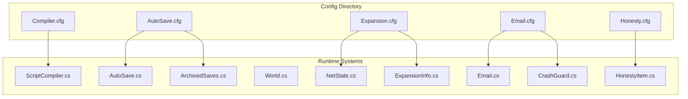
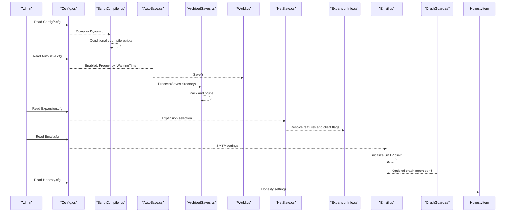
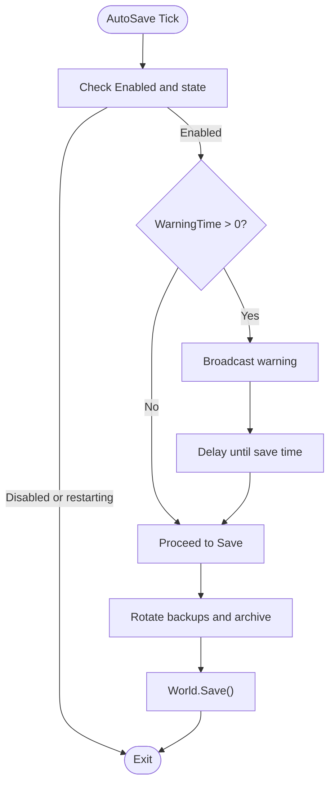
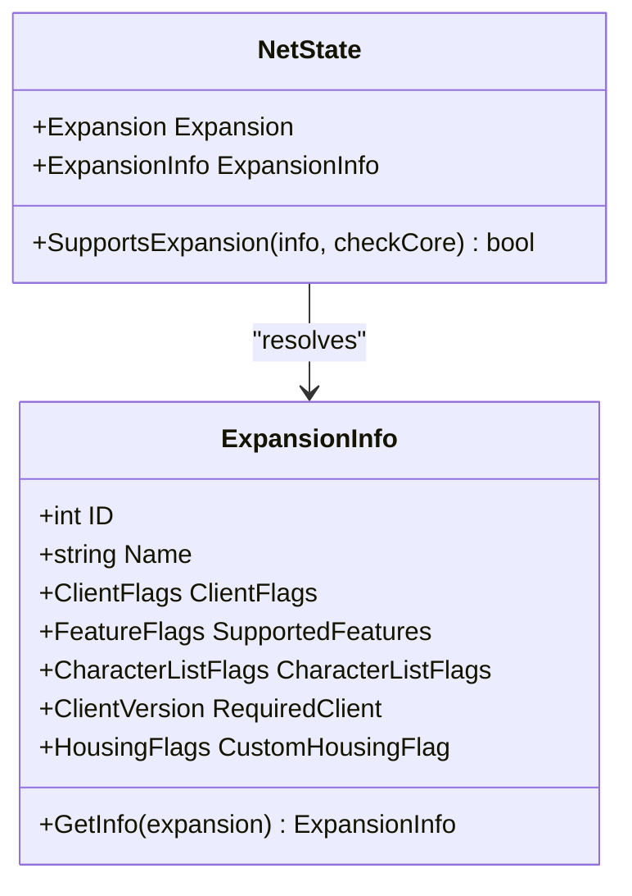
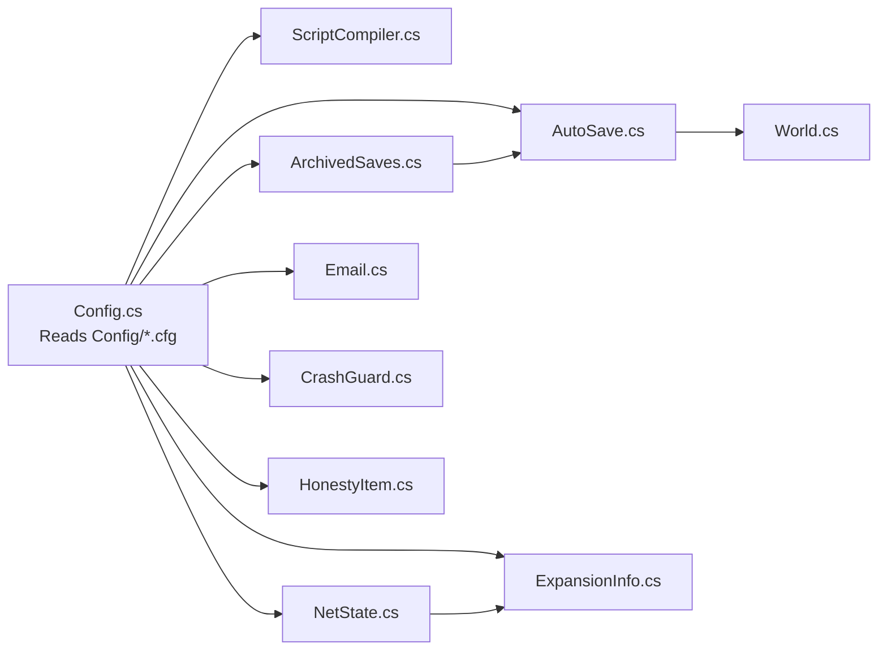

# Advanced Configuration Options

<cite>
**Referenced Files in This Document**
- [Compiler.cfg](file://Config/Compiler.cfg)
- [AutoSave.cfg](file://Config/AutoSave.cfg)
- [Expansion.cfg](file://Config/Expansion.cfg)
- [Email.cfg](file://Config/Email.cfg)
- [Honesty.cfg](file://Config/Honesty.cfg)
- [Config.cs](file://Server/Config.cs)
- [ScriptCompiler.cs](file://Server/ScriptCompiler.cs)
- [AutoSave.cs](file://Scripts/Misc/AutoSave.cs)
- [ArchivedSaves.cs](file://Scripts/Misc/ArchivedSaves.cs)
- [World.cs](file://Server/World.cs)
- [NetState.cs](file://Server/Network/NetState.cs)
- [ExpansionInfo.cs](file://Server/ExpansionInfo.cs)
- [Email.cs](file://Scripts/Misc/Email.cs)
- [CrashGuard.cs](file://Scripts/Misc/CrashGuard.cs)
- [HonestyItem.cs](file://Scripts/Items/Internal/ItemSockets/HonestyItem.cs)
</cite>

## Table of Contents
1. [Introduction](#introduction)
2. [Project Structure](#project-structure)
3. [Core Components](#core-components)
4. [Architecture Overview](#architecture-overview)
5. [Detailed Component Analysis](#detailed-component-analysis)
6. [Dependency Analysis](#dependency-analysis)
7. [Performance Considerations](#performance-considerations)
8. [Troubleshooting Guide](#troubleshooting-guide)
9. [Conclusion](#conclusion)

## Introduction
This document explains ServUO’s advanced configuration categories that control specialized server features and behaviors. It focuses on:
- Compiler.cfg: script compilation settings and development environment controls
- AutoSave.cfg: world persistence policies, save intervals, backup strategies, and recovery options
- Expansion.cfg: client compatibility settings, expansion-specific features, and protocol variations
- Email.cfg: administrative notifications, automated alerts, and server health monitoring
- Honesty.cfg: anti-griefing measures, player protection systems, and server policy enforcement

It provides configuration examples, highlights parameter interdependencies, and offers troubleshooting guidance for common conflicts and performance implications.

## Project Structure
ServUO organizes configuration files under the Config directory and reads them via a centralized configuration system. Runtime behavior is implemented in dedicated scripts and server subsystems.

**Diagram sources**
- [Compiler.cfg](file://Config/Compiler.cfg#L1-L4)
- [AutoSave.cfg](file://Config/AutoSave.cfg#L1-L47)
- [Expansion.cfg](file://Config/Expansion.cfg#L1-L15)
- [Email.cfg](file://Config/Email.cfg#L1-L20)
- [Honesty.cfg](file://Config/Honesty.cfg#L1-L9)
- [ScriptCompiler.cs](file://Server/ScriptCompiler.cs#L1-L41)
- [AutoSave.cs](file://Scripts/Misc/AutoSave.cs#L1-L183)
- [ArchivedSaves.cs](file://Scripts/Misc/ArchivedSaves.cs#L1-L285)
- [World.cs](file://Server/World.cs#L1069-L1129)
- [NetState.cs](file://Server/Network/NetState.cs#L152-L1299)
- [ExpansionInfo.cs](file://Server/ExpansionInfo.cs#L262-L314)
- [Email.cs](file://Scripts/Misc/Email.cs#L1-L63)
- [CrashGuard.cs](file://Scripts/Misc/CrashGuard.cs#L1-L46)
- [HonestyItem.cs](file://Scripts/Items/Internal/ItemSockets/HonestyItem.cs#L1-L146)

**Section sources**
- [Compiler.cfg](file://Config/Compiler.cfg#L1-L4)
- [AutoSave.cfg](file://Config/AutoSave.cfg#L1-L47)
- [Expansion.cfg](file://Config/Expansion.cfg#L1-L15)
- [Email.cfg](file://Config/Email.cfg#L1-L20)
- [Honesty.cfg](file://Config/Honesty.cfg#L1-L9)
- [Config.cs](file://Server/Config.cs#L1-L1849)

## Core Components
This section summarizes each configuration category and its primary runtime effects.

- Compiler.cfg
  - Controls whether scripts are compiled at runtime via dotnet build.
  - Key parameter: Dynamic (boolean).
  - Interacts with ScriptCompiler.cs to conditionally compile scripts during startup.

- AutoSave.cfg
  - Controls automatic world saving, warning timing, and backup rotation.
  - Key parameters: Enabled (boolean), Frequency (timespan), WarningTime (timespan), ArchivesEnabled (boolean), ArchivesAsync (boolean), ArchivesExpire (timespan), ArchivesMerging (enum), ArchivesPath (string).
  - Interacts with AutoSave.cs (scheduler and save invocation), ArchivedSaves.cs (archiving and pruning), and World.cs (actual persistence).

- Expansion.cfg
  - Selects the server’s expansion level and associated feature flags.
  - Key parameter: CurrentExpansion (enumeration).
  - Interacts with NetState.cs and ExpansionInfo.cs to enforce client compatibility and feature availability.

- Email.cfg
  - Enables SMTP-based administrative notifications and crash reporting.
  - Key parameters: EmailServer (string), EmailPort (integer), EmailSsl (boolean), FromAddress (string), CrashAddresses (string), SpeechLogPageAddresses (string), EmailUsername (string), EmailPassword (string).
  - Interacts with Email.cs (SMTP client initialization) and CrashGuard.cs (optional crash report delivery).

- Honesty.cfg
  - Enables Honesty virtue mechanics and item tracking timers.
  - Key parameters: Enabled (boolean), MaxGeneration (integer), TrammelGeneration (boolean).
  - Interacts with HonestyItem.cs (item socket timer and owner assignment).

**Section sources**
- [Compiler.cfg](file://Config/Compiler.cfg#L1-L4)
- [ScriptCompiler.cs](file://Server/ScriptCompiler.cs#L1-L41)
- [AutoSave.cfg](file://Config/AutoSave.cfg#L1-L47)
- [AutoSave.cs](file://Scripts/Misc/AutoSave.cs#L1-L183)
- [ArchivedSaves.cs](file://Scripts/Misc/ArchivedSaves.cs#L1-L285)
- [World.cs](file://Server/World.cs#L1069-L1129)
- [Expansion.cfg](file://Config/Expansion.cfg#L1-L15)
- [NetState.cs](file://Server/Network/NetState.cs#L152-L1299)
- [ExpansionInfo.cs](file://Server/ExpansionInfo.cs#L262-L314)
- [Email.cfg](file://Config/Email.cfg#L1-L20)
- [Email.cs](file://Scripts/Misc/Email.cs#L1-L63)
- [CrashGuard.cs](file://Scripts/Misc/CrashGuard.cs#L1-L46)
- [Honesty.cfg](file://Config/Honesty.cfg#L1-L9)
- [HonestyItem.cs](file://Scripts/Items/Internal/ItemSockets/HonestyItem.cs#L1-L146)

## Architecture Overview
The configuration system reads human-readable Config/*.cfg files and exposes typed values to runtime systems. Each category integrates with dedicated subsystems to enforce policies and behaviors.

**Diagram sources**
- [Config.cs](file://Server/Config.cs#L1-L1849)
- [ScriptCompiler.cs](file://Server/ScriptCompiler.cs#L1-L41)
- [AutoSave.cs](file://Scripts/Misc/AutoSave.cs#L1-L183)
- [ArchivedSaves.cs](file://Scripts/Misc/ArchivedSaves.cs#L1-L285)
- [World.cs](file://Server/World.cs#L1069-L1129)
- [NetState.cs](file://Server/Network/NetState.cs#L152-L1299)
- [ExpansionInfo.cs](file://Server/ExpansionInfo.cs#L262-L314)
- [Email.cs](file://Scripts/Misc/Email.cs#L1-L63)
- [CrashGuard.cs](file://Scripts/Misc/CrashGuard.cs#L1-L46)
- [HonestyItem.cs](file://Scripts/Items/Internal/ItemSockets/HonestyItem.cs#L1-L146)

## Detailed Component Analysis

### Compiler.cfg
Compiler.cfg controls dynamic script compilation at startup. When enabled, the server invokes dotnet build against the Scripts project to compile scripts on demand.

- Key parameter
  - Dynamic: Boolean. When true, scripts are compiled at runtime.

- Behavior
  - ScriptCompiler.cs reads the Compiler.Dynamic configuration and conditionally executes the compilation process during startup.
  - Compilation uses dotnet CLI with Debug or Release based on the debug flag.

- Configuration example
  - Set Dynamic to true to enable runtime compilation.

- Interdependencies
  - Requires dotnet SDK on the host system.
  - Impacts startup time; disabling can reduce initial overhead but requires precompiled assemblies.

**Section sources**
- [Compiler.cfg](file://Config/Compiler.cfg#L1-L4)
- [ScriptCompiler.cs](file://Server/ScriptCompiler.cs#L1-L41)
- [Config.cs](file://Server/Config.cs#L1-L1849)

### AutoSave.cfg
AutoSave.cfg governs automatic world persistence, warning messages, and backup archival. It also integrates with archived save management.

- Key parameters
  - Enabled: Boolean. Enables/disables automatic saving.
  - Frequency: Timespan. Interval between saves.
  - WarningTime: Timespan. Advance broadcast before save.
  - ArchivesEnabled: Boolean. Enable save archiving.
  - ArchivesAsync: Boolean. Run archiving in background.
  - ArchivesExpire: Timespan. Age threshold to prune archives.
  - ArchivesMerging: Enum (Months/Days/Hours/Minutes). Archive grouping strategy.
  - ArchivesPath: String. Destination path for archives (empty means default).

- Behavior
  - AutoSave.cs schedules periodic saves and optionally warns players prior to saving.
  - During save, AutoSave.cs rotates backups and delegates zipping to ArchivedSaves.cs.
  - ArchivedSaves.cs compresses the Saves directory into dated zip archives, prunes old ones, and supports asynchronous operations.

- Configuration example
  - Enable automatic saves every 15 minutes with a 15-second warning.
  - Enable archives with asynchronous compression and monthly merging.

- Interdependencies
  - WarningTime affects player experience; larger intervals reduce broadcast noise.
  - ArchivesAsync trades CPU for reduced save duration; disabling increases save time.
  - ArchivesExpire and ArchivesMerging influence storage usage and recovery granularity.

**Diagram sources**
- [AutoSave.cs](file://Scripts/Misc/AutoSave.cs#L1-L183)
- [ArchivedSaves.cs](file://Scripts/Misc/ArchivedSaves.cs#L1-L285)
- [World.cs](file://Server/World.cs#L1069-L1129)

**Section sources**
- [AutoSave.cfg](file://Config/AutoSave.cfg#L1-L47)
- [AutoSave.cs](file://Scripts/Misc/AutoSave.cs#L1-L183)
- [ArchivedSaves.cs](file://Scripts/Misc/ArchivedSaves.cs#L1-L285)
- [World.cs](file://Server/World.cs#L1069-L1129)

### Expansion.cfg
Expansion.cfg selects the server’s expansion level and influences client compatibility and feature availability.

- Key parameter
  - CurrentExpansion: Enumeration. Supported values include multiple expansions.

- Behavior
  - NetState.cs resolves the effective expansion for connected clients and determines protocol changes and feature flags.
  - ExpansionInfo.cs maps the selected expansion to feature flags, client flags, and required client versions.

- Configuration example
  - Set CurrentExpansion to the desired expansion (e.g., a modern expansion).

- Interdependencies
  - Expansion selection impacts client version checks and feature availability.
  - Ensure client versions meet required thresholds to avoid connectivity issues.

**Diagram sources**
- [NetState.cs](file://Server/Network/NetState.cs#L152-L1299)
- [ExpansionInfo.cs](file://Server/ExpansionInfo.cs#L262-L314)

**Section sources**
- [Expansion.cfg](file://Config/Expansion.cfg#L1-L15)
- [NetState.cs](file://Server/Network/NetState.cs#L152-L1299)
- [ExpansionInfo.cs](file://Server/ExpansionInfo.cs#L262-L314)

### Email.cfg
Email.cfg enables SMTP-based administrative notifications and optional crash reporting.

- Key parameters
  - EmailServer: String. SMTP server hostname.
  - EmailPort: Integer. SMTP port (25, 465, or 587).
  - EmailSsl: Boolean. Enable SSL/TLS.
  - FromAddress: String. Sender address.
  - CrashAddresses: String. Comma-separated recipient addresses for crash reports.
  - SpeechLogPageAddresses: String. Comma-separated recipients for speech log pages.
  - EmailUsername: String. Optional credentials.
  - EmailPassword: String. Optional credentials.

- Behavior
  - Email.cs initializes an SmtpClient based on configuration and validates addresses.
  - CrashGuard.cs optionally generates crash reports and sends emails to configured recipients.

- Configuration example
  - Configure server, port, SSL, sender, and recipient lists for crash and speech log notifications.

- Interdependencies
  - EmailSsl requires a compatible port (465 or 587).
  - Authentication is optional; anonymous SMTP is supported.

**Section sources**
- [Email.cfg](file://Config/Email.cfg#L1-L20)
- [Email.cs](file://Scripts/Misc/Email.cs#L1-L63)
- [CrashGuard.cs](file://Scripts/Misc/CrashGuard.cs#L1-L46)

### Honesty.cfg
Honesty.cfg enables Honesty virtue mechanics and item tracking timers for anti-griefing.

- Key parameters
  - Enabled: Boolean. Enables Honesty virtue behavior.
  - MaxGeneration: Integer. Maximum Honesty items that can spawn.
  - TrammelGeneration: Boolean. Allows Honesty item drops in Trammel region.

- Behavior
  - HonestyItem.cs implements an item socket that tracks pickup time, region, and owner.
  - When an Honesty item is dropped, the system assigns ownership and starts a timer; if not claimed within the expiration window, the item expires.

- Configuration example
  - Enable Honesty, set spawn cap, and allow drops in Trammel.

- Interdependencies
  - Honesty generation depends on Honesty virtue being enabled in the virtue service.
  - Expiration and owner assignment are handled by HonestyItem.cs.

**Section sources**
- [Honesty.cfg](file://Config/Honesty.cfg#L1-L9)
- [HonestyItem.cs](file://Scripts/Items/Internal/ItemSockets/HonestyItem.cs#L1-L146)

## Dependency Analysis
The configuration system centralizes reading and parsing of Config/*.cfg files. Each category interacts with specific runtime subsystems.

**Diagram sources**
- [Config.cs](file://Server/Config.cs#L1-L1849)
- [ScriptCompiler.cs](file://Server/ScriptCompiler.cs#L1-L41)
- [AutoSave.cs](file://Scripts/Misc/AutoSave.cs#L1-L183)
- [ArchivedSaves.cs](file://Scripts/Misc/ArchivedSaves.cs#L1-L285)
- [World.cs](file://Server/World.cs#L1069-L1129)
- [NetState.cs](file://Server/Network/NetState.cs#L152-L1299)
- [ExpansionInfo.cs](file://Server/ExpansionInfo.cs#L262-L314)
- [Email.cs](file://Scripts/Misc/Email.cs#L1-L63)
- [CrashGuard.cs](file://Scripts/Misc/CrashGuard.cs#L1-L46)
- [HonestyItem.cs](file://Scripts/Items/Internal/ItemSockets/HonestyItem.cs#L1-L146)

**Section sources**
- [Config.cs](file://Server/Config.cs#L1-L1849)

## Performance Considerations
- Compiler.cfg
  - Enabling dynamic compilation adds startup overhead due to invoking dotnet build. Disable for production builds requiring minimal startup latency.

- AutoSave.cfg
  - Shorter Frequency increases disk I/O and CPU usage. WarningTime broadcasts occur before save; tune to balance awareness and noise.
  - ArchivesAsync reduces save duration but increases background CPU load. Adjust based on available resources.

- Expansion.cfg
  - Higher expansion levels may require newer client versions and additional feature checks. Ensure clients meet thresholds to prevent rejections.

- Email.cfg
  - SMTP operations add network overhead. Use secure ports and credentials judiciously. Limit recipient lists to necessary administrators.

- Honesty.cfg
  - Honesty item tracking incurs minor overhead per dropped Honesty item. Tune MaxGeneration to control spawn rates.

[No sources needed since this section provides general guidance]

## Troubleshooting Guide
- Compiler.cfg
  - Symptom: Startup fails due to missing dotnet SDK.
  - Resolution: Install dotnet SDK or disable Dynamic compilation.

- AutoSave.cfg
  - Symptom: Saves take unexpectedly long.
  - Resolution: Disable ArchivesAsync or increase Frequency to reduce concurrent operations.
  - Symptom: Backups not rotating.
  - Resolution: Verify ArchivesEnabled and ArchivesPath; ensure write permissions to destination.

- Expansion.cfg
  - Symptom: Clients cannot connect or receive feature errors.
  - Resolution: Align CurrentExpansion with client versions and required flags; verify NetState resolution.

- Email.cfg
  - Symptom: Crash or speech log emails not sent.
  - Resolution: Confirm EmailServer, EmailPort, EmailSsl, FromAddress, and CrashAddresses/SpeechLogPageAddresses. Validate network and credentials.

- Honesty.cfg
  - Symptom: Honesty items not spawning or expiring prematurely.
  - Resolution: Verify Enabled, MaxGeneration, and TrammelGeneration. Ensure Honesty virtue is active in the virtue service.

**Section sources**
- [AutoSave.cs](file://Scripts/Misc/AutoSave.cs#L1-L183)
- [ArchivedSaves.cs](file://Scripts/Misc/ArchivedSaves.cs#L1-L285)
- [NetState.cs](file://Server/Network/NetState.cs#L152-L1299)
- [Email.cs](file://Scripts/Misc/Email.cs#L1-L63)
- [CrashGuard.cs](file://Scripts/Misc/CrashGuard.cs#L1-L46)
- [HonestyItem.cs](file://Scripts/Items/Internal/ItemSockets/HonestyItem.cs#L1-L146)

## Conclusion
ServUO’s advanced configuration categories provide fine-grained control over script compilation, world persistence, client compatibility, administrative notifications, and anti-griefing features. By understanding parameter interdependencies and integrating with their respective runtime systems, administrators can tailor server behavior to their operational needs while maintaining stability and performance.

[No sources needed since this section summarizes without analyzing specific files]