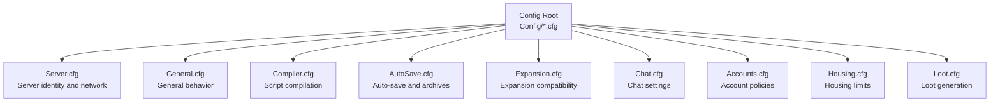
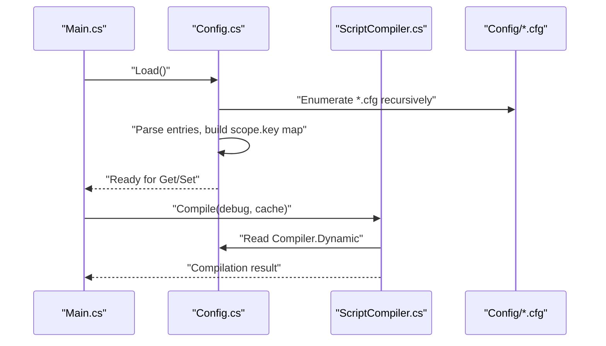
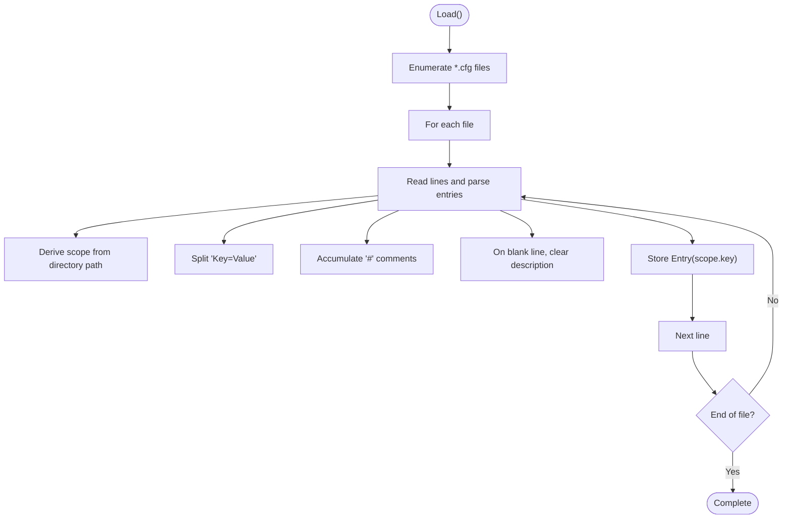
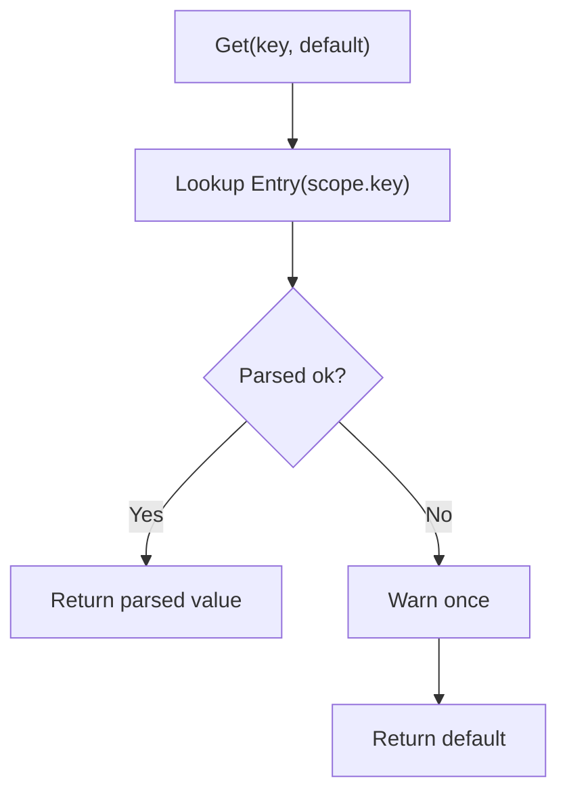
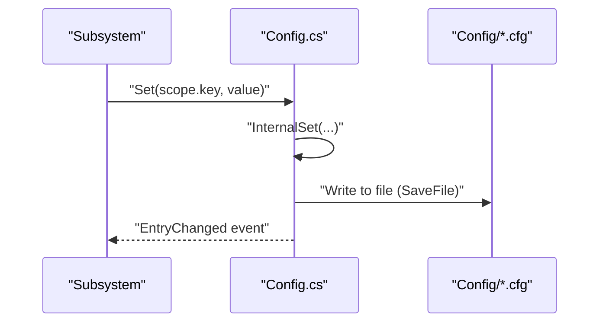
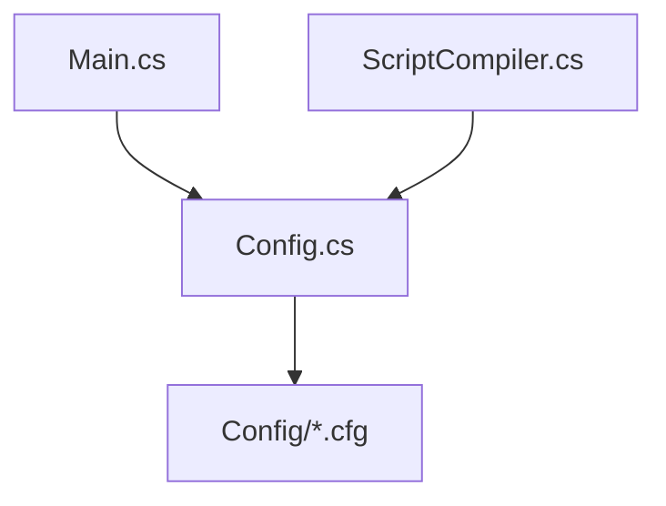

# Configuration System

<cite>
**Referenced Files in This Document**
- [Config.cs](file://Server/Config.cs)
- [Main.cs](file://Server/Main.cs)
- [README.md](file://Config/README.md)
- [Server.cfg](file://Config/Server.cfg)
- [General.cfg](file://Config/General.cfg)
- [Compiler.cfg](file://Config/Compiler.cfg)
- [AutoSave.cfg](file://Config/AutoSave.cfg)
- [Expansion.cfg](file://Config/Expansion.cfg)
- [Chat.cfg](file://Config/Chat.cfg)
- [Accounts.cfg](file://Config/Accounts.cfg)
- [Housing.cfg](file://Config/Housing.cfg)
- [Loot.cfg](file://Config/Loot.cfg)
- [ScriptCompiler.cs](file://Server/ScriptCompiler.cs)
</cite>

## Table of Contents
1. [Introduction](#introduction)
2. [Project Structure](#project-structure)
3. [Core Components](#core-components)
4. [Architecture Overview](#architecture-overview)
5. [Detailed Component Analysis](#detailed-component-analysis)
6. [Dependency Analysis](#dependency-analysis)
7. [Performance Considerations](#performance-considerations)
8. [Troubleshooting Guide](#troubleshooting-guide)
9. [Conclusion](#conclusion)
10. [Appendices](#appendices)

## Introduction
This document explains ServUO’s hierarchical configuration system centered around .cfg files located under the Config directory. It covers the configuration hierarchy, loading process, parameter validation, default value handling, runtime changes, and practical guidance for common scenarios. It also documents major configuration categories such as server identity and networking, expansion compatibility, auto-save policies, logging and metrics, and performance-related settings.

## Project Structure
ServUO organizes configuration in a hierarchical directory structure under Config/. Each .cfg file contributes key-value pairs that are loaded into a unified configuration store. The loader supports nested scopes via directory layout and per-file scoping. The primary files in scope are:
- Essential server identity and network: Server.cfg
- General behavior and UI: General.cfg
- Script compilation policy: Compiler.cfg
- Auto-save and archival: AutoSave.cfg
- Expansion compatibility: Expansion.cfg
- Additional subsystems: Chat.cfg, Accounts.cfg, Housing.cfg, Loot.cfg

**Diagram sources**
- [Server.cfg](file://Config/Server.cfg#L1-L19)
- [General.cfg](file://Config/General.cfg#L1-L20)
- [Compiler.cfg](file://Config/Compiler.cfg#L1-L4)
- [AutoSave.cfg](file://Config/AutoSave.cfg#L1-L47)
- [Expansion.cfg](file://Config/Expansion.cfg#L1-L15)
- [Chat.cfg](file://Config/Chat.cfg#L1-L5)
- [Accounts.cfg](file://Config/Accounts.cfg#L1-L26)
- [Housing.cfg](file://Config/Housing.cfg#L1-L4)
- [Loot.cfg](file://Config/Loot.cfg#L1-L23)

**Section sources**
- [Config.cs](file://Server/Config.cs#L154-L175)
- [README.md](file://Config/README.md#L1-L17)

## Core Components
- Configuration loader and store: Loads all .cfg files recursively, builds a flat key-to-entry mapping with scope-aware keys, and exposes typed getters/setters.
- Typed parsing and defaults: Validates and converts values to target types, falls back to defaults on parse errors, and warns on invalid values.
- Runtime change support: Allows updating values at runtime and persisting them back to the appropriate .cfg file.
- Scope and nesting: Directory layout under Config/ becomes part of the scope, enabling hierarchical grouping (e.g., nested folders produce dotted scopes).

Key behaviors:
- Loading: Enumerates files, reads lines, parses comments/descriptions, and records entries with scope and key.
- Saving: Writes back entries grouped by file, preserving descriptions and honoring @ prefixes for default suppression.
- Defaults and @ syntax: Prefixing a key with @ forces the system to treat it as defaulted, suppressing warnings and restoring default behavior.
- Error handling: On load/save failures, prints contextual messages and allows continuing or aborting.

**Section sources**
- [Config.cs](file://Server/Config.cs#L220-L293)
- [Config.cs](file://Server/Config.cs#L295-L322)
- [Config.cs](file://Server/Config.cs#L324-L409)
- [Config.cs](file://Server/Config.cs#L411-L464)
- [Config.cs](file://Server/Config.cs#L466-L499)
- [Config.cs](file://Server/Config.cs#L501-L517)
- [Config.cs](file://Server/Config.cs#L520-L547)
- [README.md](file://Config/README.md#L1-L17)

## Architecture Overview
The configuration system is initialized during server startup and integrates with script compilation and runtime services.

**Diagram sources**
- [Main.cs](file://Server/Main.cs#L520-L527)
- [Config.cs](file://Server/Config.cs#L220-L293)
- [ScriptCompiler.cs](file://Server/ScriptCompiler.cs#L10-L15)

## Detailed Component Analysis

### Configuration Loading and Parsing
- File discovery: Recursively enumerates Config/*.cfg and loads each file.
- Scope derivation: Directory path segments become dotted scope segments; filename without extension becomes the final scope component.
- Comments and descriptions: Lines starting with # are treated as descriptions; blank lines terminate current descriptions.
- Key-value syntax: Keys must be present and followed by =; empty values are treated as null for nullable types, otherwise default fallback applies.
- @ prefix: Marks a key as defaulted, suppressing warnings and restoring default behavior.
- Error handling: Exceptions during load/print relative path, prompt to continue or exit.

**Diagram sources**
- [Config.cs](file://Server/Config.cs#L233-L281)
- [Config.cs](file://Server/Config.cs#L324-L409)
- [README.md](file://Config/README.md#L1-L17)

**Section sources**
- [Config.cs](file://Server/Config.cs#L220-L293)
- [Config.cs](file://Server/Config.cs#L295-L322)
- [Config.cs](file://Server/Config.cs#L324-L409)
- [README.md](file://Config/README.md#L1-L17)

### Parameter Validation and Default Handling
- Typed getters: Support for multiple numeric and string types; arrays and enums are supported via reflection-based parsers.
- Validation: On parse failure, logs a warning and returns the default value; warnings are deduplicated.
- Default suppression: Using @Key=value marks the value as defaulted, preventing warnings and restoring defaults.
- Type coercion: Strings are trimmed and optionally quoted; arrays and enums parsed via dedicated handlers.

**Diagram sources**
- [Config.cs](file://Server/Config.cs#L684-L700)
- [Config.cs](file://Server/Config.cs#L1150-L1260)

**Section sources**
- [Config.cs](file://Server/Config.cs#L684-L700)
- [Config.cs](file://Server/Config.cs#L1150-L1260)
- [README.md](file://Config/README.md#L1-L17)

### Runtime Configuration Changes
- Setters: Allow updating values at runtime; if the entry does not exist, a new one is created in the appropriate file path derived from the key’s scope.
- Persistence: Save() writes all entries grouped by file, preserving descriptions and honoring @ prefixes.
- Change notifications: An event is raised when an entry changes, enabling subsystems to react to updates.

**Diagram sources**
- [Config.cs](file://Server/Config.cs#L520-L547)
- [Config.cs](file://Server/Config.cs#L466-L499)

**Section sources**
- [Config.cs](file://Server/Config.cs#L520-L547)
- [Config.cs](file://Server/Config.cs#L466-L499)

### Configuration Categories and Examples

#### Server Identity and Networking (Server.cfg)
- Purpose: Defines shard name, listening IP, advertised address, and port.
- Typical keys: Name, Listen, Address, Port.
- Example scenario: Host publicly with a specific port and advertise a DDoS-protected IP.

**Section sources**
- [Server.cfg](file://Config/Server.cfg#L1-L19)

#### General Behavior (General.cfg)
- Purpose: Controls general gameplay and UI behavior.
- Typical keys: Metrics, ShowStaffOffline, SupportEmail, SupportWebsite, DefaultItemDecayTime, RestrictRedsToFel.
- Example scenario: Enable performance counters on Windows, customize help messaging, restrict reds to Felucca.

**Section sources**
- [General.cfg](file://Config/General.cfg#L1-L20)

#### Script Compilation Policy (Compiler.cfg)
- Purpose: Controls whether scripts are compiled at runtime.
- Typical key: Dynamic.
- Example scenario: Disable dynamic compilation for production stability.

**Section sources**
- [Compiler.cfg](file://Config/Compiler.cfg#L1-L4)
- [ScriptCompiler.cs](file://Server/ScriptCompiler.cs#L10-L15)

#### Auto-Save and Archives (AutoSave.cfg)
- Purpose: Controls automatic world saving, warning timing, and archive retention.
- Typical keys: Enabled, Frequency, WarningTime, ArchivesEnabled, ArchivesAsync, ArchivesExpire, ArchivesMerging, ArchivesPath.
- Example scenario: Enable auto-save every 15 minutes with a 15-second warning, enable asynchronous archives, merge by minute, and set an expiry of 30 days.

**Section sources**
- [AutoSave.cfg](file://Config/AutoSave.cfg#L1-L47)

#### Expansion Compatibility (Expansion.cfg)
- Purpose: Sets the current expansion level used by the server.
- Typical key: CurrentExpansion.
- Example scenario: Set to a specific expansion to enable client features and content.

**Section sources**
- [Expansion.cfg](file://Config/Expansion.cfg#L1-L15)

#### Chat System (Chat.cfg)
- Purpose: Enables/disables global chat and channel creation policy.
- Typical keys: Enabled, AllowCreateChannels.
- Example scenario: Enable global chat and allow players to create channels.

**Section sources**
- [Chat.cfg](file://Config/Chat.cfg#L1-L5)

#### Account Policies (Accounts.cfg)
- Purpose: Controls account/IP limits, auto-account creation, deletion restrictions, and password protection.
- Typical keys: AccountsPerIp, AutoCreateAccounts, RestrictDeletion, DeleteDelay, PasswordCommandEnabled, ProtectPasswords.
- Example scenario: Limit accounts per IP, auto-create accounts on first login, enforce a 7-day deletion delay.

**Section sources**
- [Accounts.cfg](file://Config/Accounts.cfg#L1-L26)

#### Housing Limits (Housing.cfg)
- Purpose: Controls per-account house limits.
- Typical key: AccountHouseLimit.
- Example scenario: Allow one house per account.

**Section sources**
- [Housing.cfg](file://Config/Housing.cfg#L1-L4)

#### Loot Generation (Loot.cfg)
- Purpose: Controls luck and budget parameters for loot generation, property caps, and special rules.
- Typical keys: FeluccaLuckBonus, FeluccaBudgetBonus, MaxBaseBudget, MinBaseBudget, MaxAdjustedBudget, MinAdjustedBudget, MaxProps, CanPOFJewelry.
- Example scenario: Adjust budgets and property caps for balanced loot distribution.

**Section sources**
- [Loot.cfg](file://Config/Loot.cfg#L1-L23)

## Dependency Analysis
- Startup dependency: Main.cs invokes Config.Load() early in startup to ensure configuration is available before subsystems initialize.
- Script compilation dependency: ScriptCompiler.cs reads Compiler.Dynamic via Config.Get/Set to decide whether to compile scripts at runtime.
- Scope-driven persistence: Setters derive file paths from the dotted scope portion of the key, ensuring runtime changes persist to the correct .cfg file.

**Diagram sources**
- [Main.cs](file://Server/Main.cs#L520-L527)
- [Config.cs](file://Server/Config.cs#L501-L517)
- [ScriptCompiler.cs](file://Server/ScriptCompiler.cs#L10-L15)

**Section sources**
- [Main.cs](file://Server/Main.cs#L520-L527)
- [Config.cs](file://Server/Config.cs#L501-L517)
- [ScriptCompiler.cs](file://Server/ScriptCompiler.cs#L10-L15)

## Performance Considerations
- Metrics: General.cfg supports enabling Windows performance counters for world save metrics; requires administrative privileges.
- Async archives: AutoSave.cfg supports asynchronous archive creation to reduce save latency.
- Logging overhead: Excessive warnings on invalid values can occur; use @ to suppress warnings for defaulted values and avoid unnecessary churn.

**Section sources**
- [General.cfg](file://Config/General.cfg#L1-L3)
- [AutoSave.cfg](file://Config/AutoSave.cfg#L24-L28)

## Troubleshooting Guide
Common issues and resolutions:
- Invalid value warnings: Occur when a value cannot be parsed to the expected type. The system logs a warning and returns the default. Fix by correcting the value or using @ to mark as defaulted.
- Missing configuration files: Loader enumerates Config/*.cfg; missing files are ignored if others load successfully. Ensure the file exists and is readable.
- Load/save errors: On exceptions, the system prints the relative path and prompts to continue or exit. Review permissions and disk availability.
- Scope mismatch: Keys are resolved by scope.key; ensure the dotted scope matches the intended file path under Config/.
- Dynamic compilation: If scripts fail to compile, verify Compiler.Dynamic and environment prerequisites (e.g., dotnet CLI availability).

**Section sources**
- [Config.cs](file://Server/Config.cs#L233-L281)
- [Config.cs](file://Server/Config.cs#L411-L464)
- [README.md](file://Config/README.md#L1-L17)

## Conclusion
ServUO’s configuration system provides a robust, hierarchical, and extensible mechanism for managing server settings. It supports typed parsing, default handling, runtime updates, and organized persistence across multiple .cfg files. By understanding the scope model, syntax rules, and validation behavior, administrators can reliably configure servers, troubleshoot issues, and adapt settings for diverse deployment needs.

## Appendices

### Configuration Syntax and Semantics
- Comment lines: Begin with # and act as inline descriptions for the next key.
- Blank lines: Terminate current descriptions.
- Key-value syntax: Key=Value; empty value implies null for nullable types, otherwise default.
- Default suppression: Prefix Key with @ to mark as defaulted and suppress warnings.

**Section sources**
- [README.md](file://Config/README.md#L1-L17)