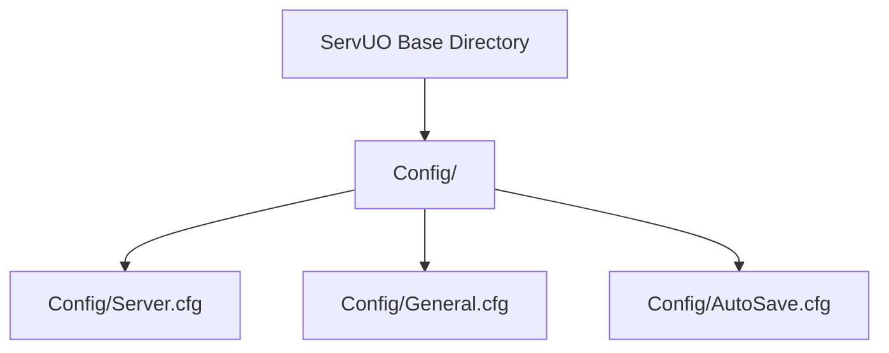
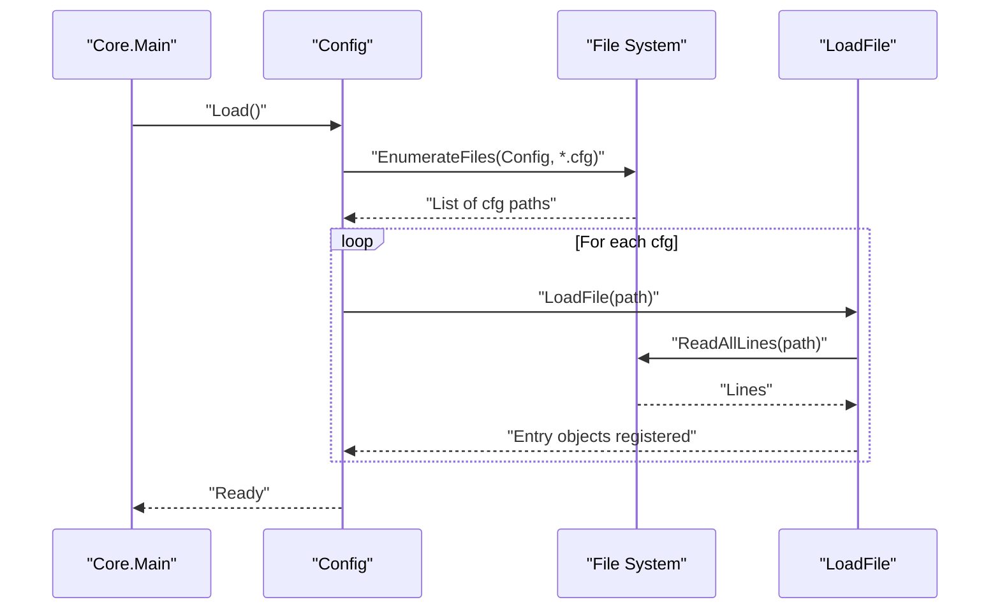
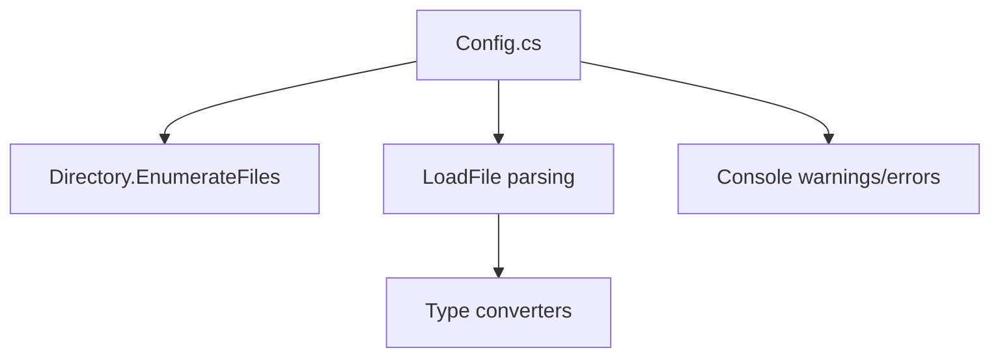

# Essential Configuration Files

<cite>
**Referenced Files in This Document**
- [Server.cfg](file://Config/Server.cfg)
- [General.cfg](file://Config/General.cfg)
- [Config.cs](file://Server/Config.cs)
- [Main.cs](file://Server/Main.cs)
- [README.md](file://Config/README.md)
- [AutoSave.cfg](file://Config/AutoSave.cfg)
</cite>

## Table of Contents
1. [Introduction](#introduction)
2. [Project Structure](#project-structure)
3. [Core Components](#core-components)
4. [Architecture Overview](#architecture-overview)
5. [Detailed Component Analysis](#detailed-component-analysis)
6. [Dependency Analysis](#dependency-analysis)
7. [Performance Considerations](#performance-considerations)
8. [Troubleshooting Guide](#troubleshooting-guide)
9. [Conclusion](#conclusion)
10. [Appendices](#appendices)

## Introduction
This document explains ServUO’s essential configuration files that define server startup and general behavior. It focuses on:
- Server.cfg: the primary startup configuration controlling server name, IP binding, and port.
- General.cfg: general server behavior settings such as logging, performance metrics, world save intervals, and administrative options.
It also documents the configuration file hierarchy, syntax rules, parameter validation, and the relationship between these files. Practical examples, troubleshooting tips, and best practices for deployment are included, along with guidance on configuration file location, loading order, and the impact of missing or malformed entries on server startup.

## Project Structure
ServUO loads configuration from the Config directory under the server base directory. The configuration loader enumerates all .cfg files recursively and parses them according to a strict syntax. Comments begin with #, keys are assigned with Key=Value, and optional default markers (@) can force defaults.

**Diagram sources**
- [Server.cfg](file://Config/Server.cfg#L1-L19)
- [General.cfg](file://Config/General.cfg#L1-L20)
- [AutoSave.cfg](file://Config/AutoSave.cfg#L1-L47)

**Section sources**
- [Main.cs](file://Server/Main.cs#L520-L523)
- [Config.cs](file://Server/Config.cs#L156-L156)
- [README.md](file://Config/README.md#L1-L17)

## Core Components
- Server.cfg
  - Defines the server’s display name, listening IP, advertised address, and port.
  - Critical for network accessibility and client discovery.
- General.cfg
  - Controls general server behavior including metrics, help system, item decay, and red-related restrictions.
  - Influences runtime diagnostics and gameplay mechanics.

These two files are foundational to server operation and are loaded early in startup.

**Section sources**
- [Server.cfg](file://Config/Server.cfg#L1-L19)
- [General.cfg](file://Config/General.cfg#L1-L20)

## Architecture Overview
ServUO initializes by loading all .cfg files from the Config directory. The configuration system:
- Discovers files recursively.
- Parses comments, keys, and values.
- Supports default markers (@) to force defaults.
- Validates types and warns on invalid values.
- Exposes getters/setters to scripts and core systems.

**Diagram sources**
- [Main.cs](file://Server/Main.cs#L520-L523)
- [Config.cs](file://Server/Config.cs#L220-L293)
- [Config.cs](file://Server/Config.cs#L324-L409)

## Detailed Component Analysis

### Server.cfg
Purpose:
- Sets the shard name, local listener IP, advertised external address, and port.
- Determines how clients discover and connect to the server.

Syntax highlights:
- Lines starting with # are treated as descriptions.
- Blank lines terminate current option or description.
- Key=Value defines a configuration entry.
- An empty key results in a null value for nullable types; otherwise, defaults are used.
- Prefixing a line with @ forces the option to use its default value.

Impact:
- Incorrect or missing entries can prevent clients from connecting or cause incorrect advertisement of server details.
- Port conflicts or invalid IP bindings will block listeners.

Common scenarios:
- Local development: Listen=0.0.0.0, Address=127.0.0.1, Port=2593.
- Public server: Listen=0.0.0.0, Address=<public IP>, Port=<unique port>.
- Behind NAT/DDoS: Address=<provider-assigned IP>, Port forwarding configured externally.

Validation and errors:
- The loader enforces Key=Value syntax and throws on malformed lines.
- Invalid values trigger warnings; defaults are used when applicable.

**Section sources**
- [Server.cfg](file://Config/Server.cfg#L1-L19)
- [README.md](file://Config/README.md#L1-L17)
- [Config.cs](file://Server/Config.cs#L367-L394)
- [Config.cs](file://Server/Config.cs#L689-L695)

### General.cfg
Purpose:
- Controls general server behavior such as metrics, help system, item decay, and red-related restrictions.
- Provides administrative settings for help requests and support links.

Examples of typical entries:
- Metrics: enables Windows performance counters for world save metrics.
- ShowStaffOffline: toggles whether “no staff online” messages appear in help pages.
- SupportEmail/SupportWebsite: customizes help request messaging.
- DefaultItemDecayTime: sets decay time for items left on the ground.
- RestrictRedsToFel: limits red player behavior to specific facets.

Validation and errors:
- Invalid values produce warnings; defaults are applied.
- Missing entries fall back to built-in defaults.

**Section sources**
- [General.cfg](file://Config/General.cfg#L1-L20)
- [README.md](file://Config/README.md#L1-L17)
- [Config.cs](file://Server/Config.cs#L689-L695)

### Configuration File Hierarchy and Syntax
- Hierarchy: Config directory; files can be nested in subfolders. The loader builds a scope from the path segments plus the filename (without extension).
- Syntax:
  - Comment: # starts a description line.
  - Blank line terminates current option or description.
  - Key=Value sets a value.
  - @Key=Value forces the default value for that key.
- Defaults:
  - Empty key yields null for nullable types; otherwise, defaults are used.
  - @ marker suppresses warnings about using defaults.

Loading order:
- All .cfg files are discovered recursively and parsed in arbitrary order.
- Later entries override earlier ones if they share the same key and scope.

**Section sources**
- [Config.cs](file://Server/Config.cs#L342-L351)
- [Config.cs](file://Server/Config.cs#L367-L409)
- [README.md](file://Config/README.md#L1-L17)

### Parameter Validation and Error Handling
- Parsing:
  - Throws on missing equals sign or empty key.
  - Stores entries with metadata (file, index, scope, description).
- Type conversion:
  - Attempts to parse values into requested types.
  - Warns on invalid values and falls back to defaults.
- Load-time failures:
  - Exceptions during file load prompt a console prompt to continue or exit.
- Runtime warnings:
  - Repeated invalid values are suppressed to avoid spam.

**Section sources**
- [Config.cs](file://Server/Config.cs#L381-L394)
- [Config.cs](file://Server/Config.cs#L689-L695)
- [Config.cs](file://Server/Config.cs#L254-L279)

### Relationship Between Server.cfg and General.cfg
- Both are loaded by the same configuration system.
- Server.cfg controls network connectivity; General.cfg controls general behavior.
- Together they define the server’s identity and operational characteristics at startup.

**Section sources**
- [Server.cfg](file://Config/Server.cfg#L1-L19)
- [General.cfg](file://Config/General.cfg#L1-L20)
- [Config.cs](file://Server/Config.cs#L220-L293)

### Practical Examples and Best Practices
- Example: Minimal production setup
  - Server.cfg: Name, Listen, Address, Port.
  - General.cfg: Metrics, DefaultItemDecayTime, RestrictRedsToFel.
- Example: Help system customization
  - General.cfg: SupportEmail, SupportWebsite, ShowStaffOffline.
- Example: World save automation
  - AutoSave.cfg: Enabled, Frequency, WarningTime, Archives settings.
- Best practices:
  - Keep comments meaningful; use blank lines to separate logical groups.
  - Prefer @ for explicit defaults to reduce noise.
  - Validate numeric and time formats carefully.
  - Back up configuration before major changes.

**Section sources**
- [Server.cfg](file://Config/Server.cfg#L1-L19)
- [General.cfg](file://Config/General.cfg#L1-L20)
- [AutoSave.cfg](file://Config/AutoSave.cfg#L1-L47)
- [README.md](file://Config/README.md#L1-L17)

## Dependency Analysis
The configuration system depends on:
- File system enumeration for discovering .cfg files.
- Line-by-line parsing for comments, keys, values, and default markers.
- Type parsers for converting values to strongly typed results.
- Console output for warnings and errors.

**Diagram sources**
- [Config.cs](file://Server/Config.cs#L233-L246)
- [Config.cs](file://Server/Config.cs#L324-L409)
- [Config.cs](file://Server/Config.cs#L671-L699)

**Section sources**
- [Config.cs](file://Server/Config.cs#L220-L293)
- [Config.cs](file://Server/Config.cs#L324-L409)
- [Config.cs](file://Server/Config.cs#L671-L699)

## Performance Considerations
- Metrics in General.cfg enable Windows performance counters for world save metrics; enabling this requires running as Administrator at least once.
- Frequent invalid values trigger warnings and may indicate misconfiguration; resolve to avoid unnecessary overhead.
- Use @ to explicitly mark defaults to reduce repeated warnings.

**Section sources**
- [General.cfg](file://Config/General.cfg#L1-L3)
- [Config.cs](file://Server/Config.cs#L689-L695)

## Troubleshooting Guide
Common issues and resolutions:
- Configuration not found
  - Cause: Config directory missing or inaccessible.
  - Resolution: Ensure Config directory exists under the base directory and is readable.
- Load failure per file
  - Cause: Malformed line, missing equals, or invalid key.
  - Resolution: Fix syntax; ensure Key=Value and non-empty key.
- Invalid value warnings
  - Cause: Type mismatch (e.g., string where integer expected).
  - Resolution: Correct value format; defaults will be used if applicable.
- Startup halt prompts
  - Cause: Exception during file load.
  - Resolution: Choose to continue or exit; fix the offending file before continuing.
- Missing or malformed entries
  - Impact: Defaults are used; verify behavior and adjust accordingly.
  - Resolution: Add or correct entries; use @ to force defaults if desired.

**Section sources**
- [Config.cs](file://Server/Config.cs#L239-L246)
- [Config.cs](file://Server/Config.cs#L254-L279)
- [Config.cs](file://Server/Config.cs#L381-L394)
- [Config.cs](file://Server/Config.cs#L689-L695)

## Conclusion
Server.cfg and General.cfg are the backbone of ServUO’s startup and general behavior. They are loaded by a robust configuration system that supports comments, defaults, and validation. By following the syntax rules, validating entries, and applying best practices, administrators can deploy reliable servers with predictable behavior and minimal startup issues.

## Appendices

### Configuration File Location and Loading Order
- Location: Config directory under the server base directory.
- Loading order: All .cfg files are discovered recursively and parsed; later entries override earlier ones with the same key and scope.

**Section sources**
- [Config.cs](file://Server/Config.cs#L156-L156)
- [Config.cs](file://Server/Config.cs#L233-L246)
- [Config.cs](file://Server/Config.cs#L248-L280)

### Syntax Rules Summary
- Comments: # starts a description line; blank lines terminate current option or description.
- Assignment: Key=Value.
- Defaults: @Key=Value forces default usage and suppresses default warnings.

**Section sources**
- [README.md](file://Config/README.md#L1-L17)