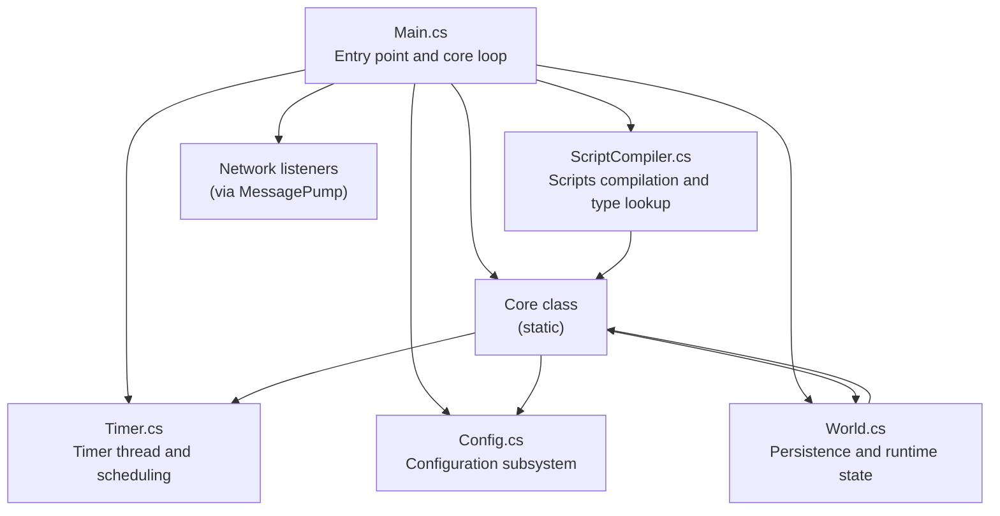
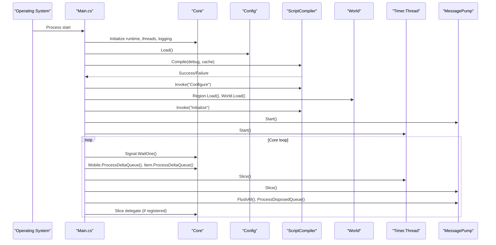
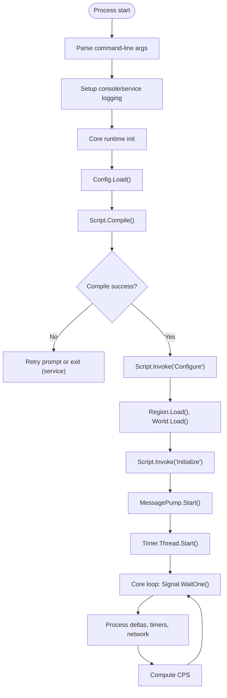
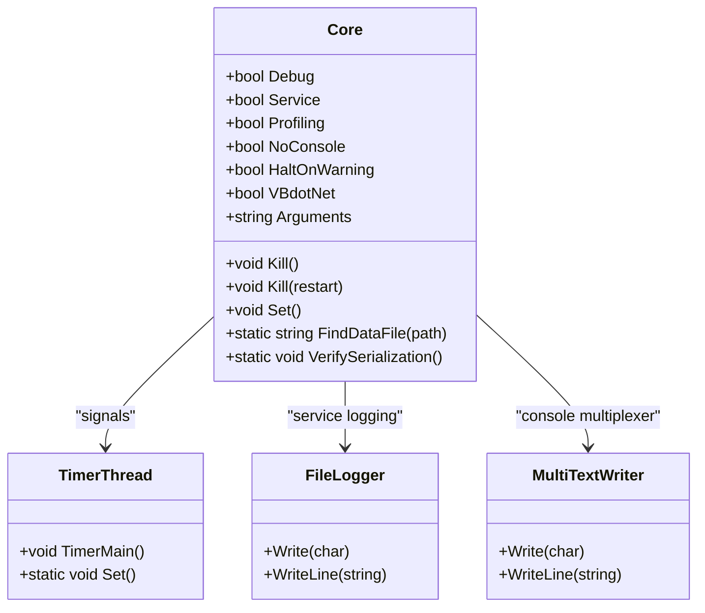
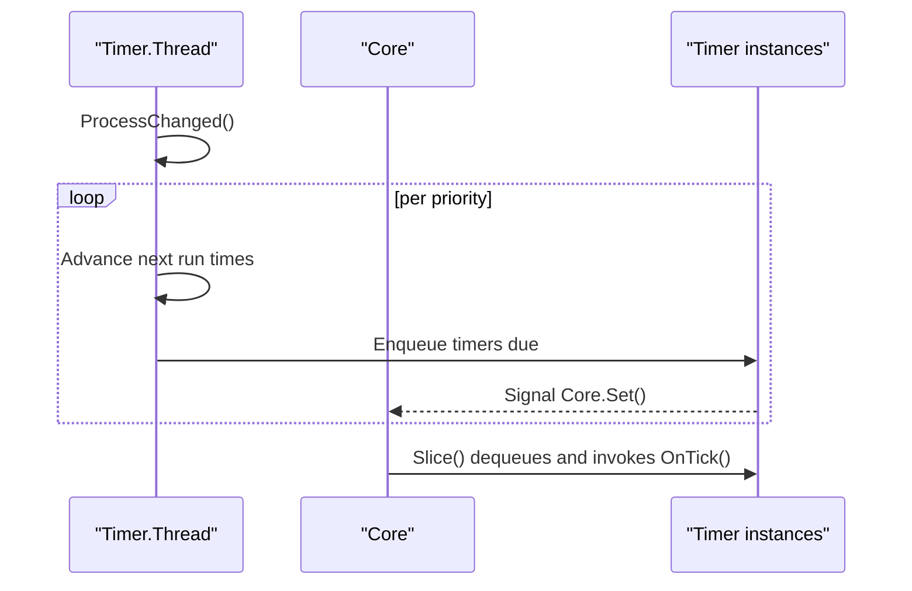
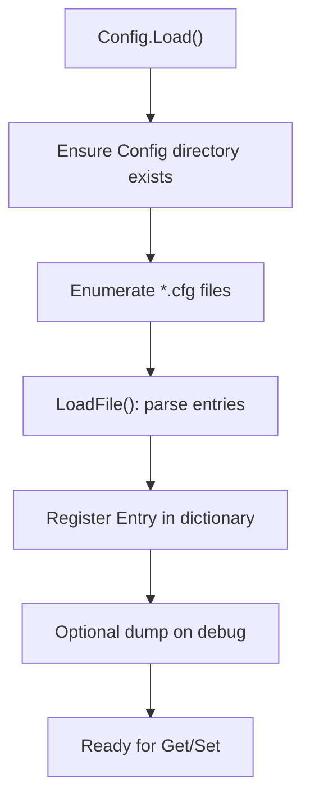
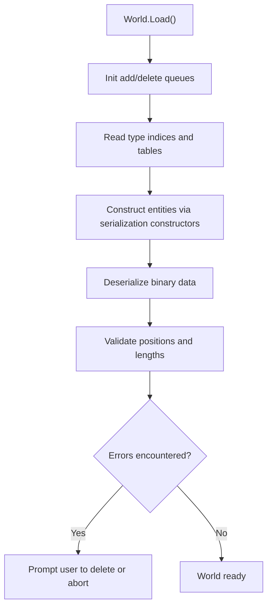
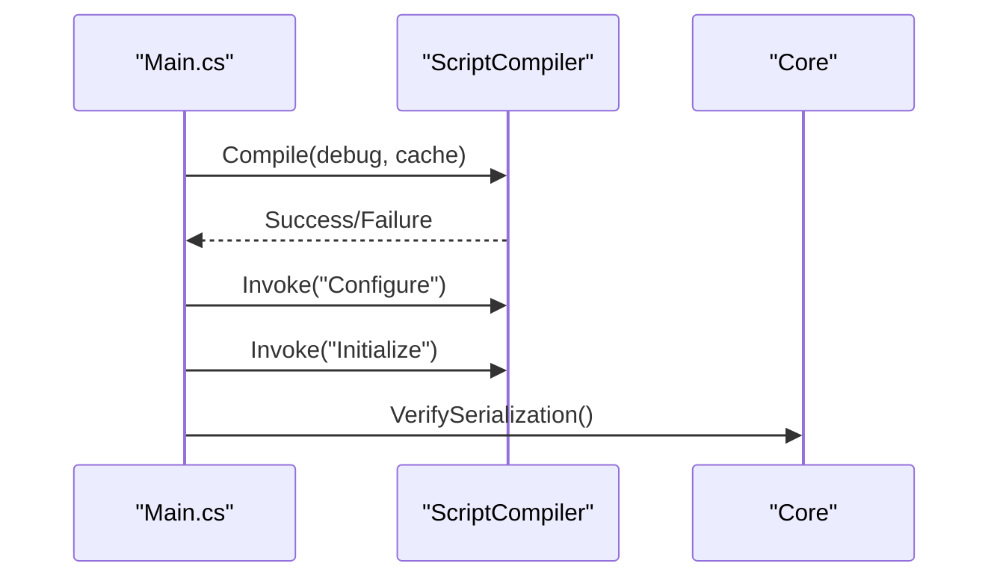
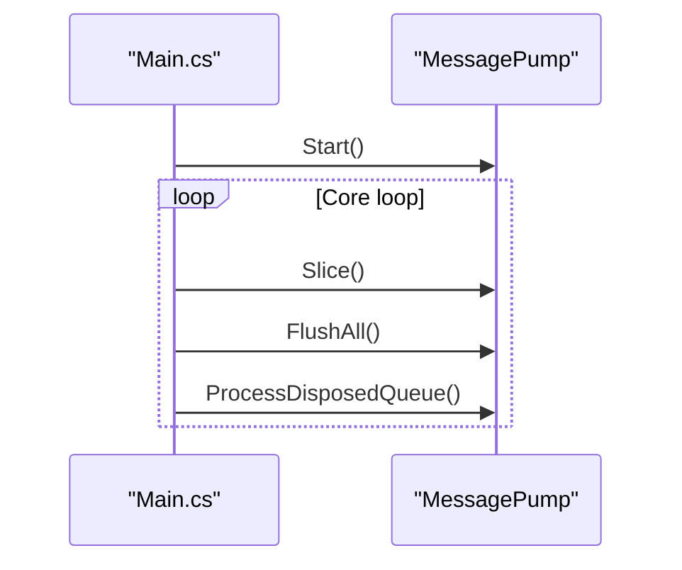
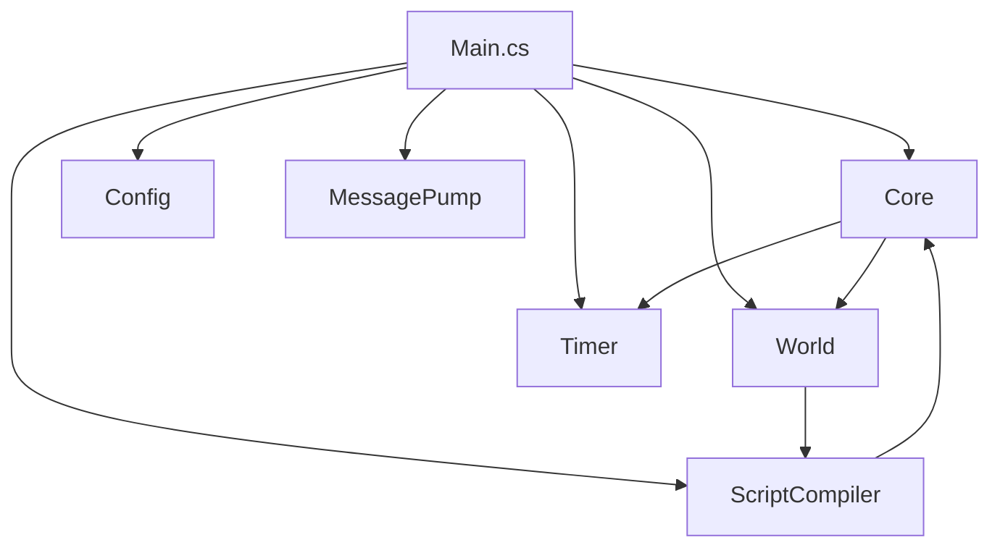

# Core Engine

<cite>
**Referenced Files in This Document**
- [Main.cs](file://Server/Main.cs)
- [World.cs](file://Server/World.cs)
- [ScriptCompiler.cs](file://Server/ScriptCompiler.cs)
- [Config.cs](file://Server/Config.cs)
- [Timer.cs](file://Server/Timer.cs)
- [Utility.cs](file://Server/Utility.cs)
</cite>

## Table of Contents
1. [Introduction](#introduction)
2. [Project Structure](#project-structure)
3. [Core Components](#core-components)
4. [Architecture Overview](#architecture-overview)
5. [Detailed Component Analysis](#detailed-component-analysis)
6. [Dependency Analysis](#dependency-analysis)
7. [Performance Considerations](#performance-considerations)
8. [Troubleshooting Guide](#troubleshooting-guide)
9. [Conclusion](#conclusion)

## Introduction
This document explains ServUO’s core engine with emphasis on the server entry point and initialization sequence. It covers the Main.cs entry point, the core loop, process lifecycle, shutdown procedures, and the Core class’s responsibilities including timer management, configuration loading, world persistence initialization, and network listener setup. It also documents the relationships among Core, World, ScriptCompiler, and Timer, and provides practical guidance for administrators and developers.

## Project Structure
ServUO organizes the core engine under the Server directory. The most relevant files for this document are:
- Main.cs: Entry point, initialization sequence, core loop, and shutdown
- World.cs: World persistence loader/saver and runtime state
- ScriptCompiler.cs: Scripts compilation and type discovery
- Config.cs: Configuration subsystem
- Timer.cs: Timer thread and scheduling
- Utility.cs: Shared utilities used across the engine

**Diagram sources**
- [Main.cs](file://Server/Main.cs#L29-L650)
- [Config.cs](file://Server/Config.cs#L220-L320)
- [ScriptCompiler.cs](file://Server/ScriptCompiler.cs#L18-L85)
- [World.cs](file://Server/World.cs#L348-L420)
- [Timer.cs](file://Server/Timer.cs#L131-L380)

**Section sources**
- [Main.cs](file://Server/Main.cs#L29-L650)

## Core Components
- Core (static): Provides global runtime state, platform detection, console/service handling, crash/shutdown hooks, timer thread coordination, and argument assembly. It also exposes profiling and serialization verification utilities.
- Timer.Thread: Dedicated timer thread that schedules timers by priority buckets and signals the core loop to process slices.
- Config: Loads and manages configuration from Config/*.cfg, supports defaults, dumping, and dynamic updates.
- ScriptCompiler: Builds scripts via dotnet CLI, loads resulting assembly, verifies serialization constructors, and exposes type caches and lookups.
- World: Manages persistence queues, loading and saving of entities, and ensures safe write completion on shutdown.

**Section sources**
- [Main.cs](file://Server/Main.cs#L29-L200)
- [Timer.cs](file://Server/Timer.cs#L131-L380)
- [Config.cs](file://Server/Config.cs#L220-L320)
- [ScriptCompiler.cs](file://Server/ScriptCompiler.cs#L18-L85)
- [World.cs](file://Server/World.cs#L348-L420)

## Architecture Overview
The server starts by initializing Core, loading configuration, compiling scripts, loading world data, and starting the timer thread and network listeners. The core loop coordinates periodic tasks and maintains cycle statistics.

**Diagram sources**
- [Main.cs](file://Server/Main.cs#L498-L605)
- [Config.cs](file://Server/Config.cs#L220-L320)
- [ScriptCompiler.cs](file://Server/ScriptCompiler.cs#L18-L85)
- [World.cs](file://Server/World.cs#L348-L420)
- [Timer.cs](file://Server/Timer.cs#L314-L380)

## Detailed Component Analysis

### Main.cs Entry Point and Initialization Sequence
- Command-line arguments parsing controls debug, service, profile, cache, halt-on-warning, VB.NET support, no-console, and help modes.
- Console/service redirection sets up logging and output multiplexing.
- Core initializes runtime metadata, processor topology, GC mode, timing capabilities, and random implementation details.
- Config.Load() reads all *.cfg files and reports errors with interactive continuation prompts.
- Script.Compile builds scripts and verifies serialization constructors; on failure, it allows retry or exit depending on service mode.
- Script.Invoke("Configure") and Script.Invoke("Initialize") run static initialization routines across compiled assemblies.
- Region.Load() and World.Load() initialize regions and persisted entities.
- MessagePump.Start() and Timer.Thread start networking and timers.
- Core loop waits on a signal, processes deltas, timers, network, and optional Slice delegate, and computes cycles per second.

**Diagram sources**
- [Main.cs](file://Server/Main.cs#L329-L605)

**Section sources**
- [Main.cs](file://Server/Main.cs#L329-L605)

### Core Class Responsibilities
- Crash handling: Unhandled exceptions route to a crash handler, optionally prompting for exit in interactive mode.
- Console events: Ctrl+C/Ctrl+Break/Ctrl+Close are captured to initiate graceful shutdown.
- Process lifecycle: Kill() handles restarts and ensures disk writes complete before termination.
- Timer coordination: Set() signals the core loop to wake and process work.
- Arguments assembly: Arguments property composes a string representation of current flags for diagnostics.
- Serialization verification: VerifySerialization scans assemblies and logs missing serialization members.
- Utility helpers: FindDataFile, platform detection, TickCount, and expansion flags.

**Diagram sources**
- [Main.cs](file://Server/Main.cs#L29-L200)
- [Main.cs](file://Server/Main.cs#L280-L330)
- [Main.cs](file://Server/Main.cs#L811-L932)
- [Timer.cs](file://Server/Timer.cs#L131-L380)

**Section sources**
- [Main.cs](file://Server/Main.cs#L29-L200)
- [Main.cs](file://Server/Main.cs#L280-L330)
- [Main.cs](file://Server/Main.cs#L811-L932)
- [Timer.cs](file://Server/Timer.cs#L131-L380)

### Timer Management
- TimerPriority defines priority buckets mapped to delays.
- TimerThread maintains lists per priority, advances next run times, enqueues timers, and signals Core.Set().
- Timer.Slice drains the queue and invokes OnTick(), with profiling support.
- Core loop integrates Timer.Slice() into each iteration.

**Diagram sources**
- [Timer.cs](file://Server/Timer.cs#L131-L380)
- [Timer.cs](file://Server/Timer.cs#L391-L420)
- [Main.cs](file://Server/Main.cs#L573-L599)

**Section sources**
- [Timer.cs](file://Server/Timer.cs#L131-L380)
- [Timer.cs](file://Server/Timer.cs#L391-L420)
- [Main.cs](file://Server/Main.cs#L573-L599)

### Configuration Loading
- Config.Load() enumerates Config/*.cfg recursively, parses entries, and supports comments and default markers (@).
- On load/save failures, it prints contextual messages and either continues or exits depending on user input.
- Provides typed getters and setters, delegates to parsers/stringifiers, and supports arrays and complex types.

**Diagram sources**
- [Config.cs](file://Server/Config.cs#L220-L320)
- [Config.cs](file://Server/Config.cs#L324-L409)

**Section sources**
- [Config.cs](file://Server/Config.cs#L220-L320)
- [Config.cs](file://Server/Config.cs#L324-L409)

### World Persistence Initialization
- World.Load() initializes loading queues, reads indices and type tables for items, mobiles, guilds, and customs data, constructs instances, and deserializes binary data.
- It validates positions and lengths during deserialization and surfaces errors with interactive deletion prompts in non-service mode.
- World.WaitForWriteCompletion() ensures pending saves finish before shutdown.

**Diagram sources**
- [World.cs](file://Server/World.cs#L348-L420)
- [World.cs](file://Server/World.cs#L499-L774)

**Section sources**
- [World.cs](file://Server/World.cs#L348-L420)
- [World.cs](file://Server/World.cs#L499-L774)

### Script Compilation and Type Discovery
- Script.Compile() builds Scripts.csproj via dotnet CLI, loads Scripts.dll, and runs Core.VerifySerialization() to check serialization constructors and methods.
- Script.Invoke("Configure"/"Initialize") executes static methods across assemblies.
- TypeCache and TypeTable provide fast lookups by name/full name and hashes.

**Diagram sources**
- [ScriptCompiler.cs](file://Server/ScriptCompiler.cs#L18-L85)
- [ScriptCompiler.cs](file://Server/ScriptCompiler.cs#L87-L112)
- [Main.cs](file://Server/Main.cs#L525-L542)

**Section sources**
- [ScriptCompiler.cs](file://Server/ScriptCompiler.cs#L18-L85)
- [ScriptCompiler.cs](file://Server/ScriptCompiler.cs#L87-L112)
- [Main.cs](file://Server/Main.cs#L525-L542)

### Network Listener Setup
- MessagePump.Start() is called after world initialization and before the core loop begins.
- NetState.Initialize() and NetState.FlushAll()/ProcessDisposedQueue() are invoked during each core slice.

**Diagram sources**
- [Main.cs](file://Server/Main.cs#L551-L585)

**Section sources**
- [Main.cs](file://Server/Main.cs#L551-L585)

## Dependency Analysis
- Main depends on Core for runtime state and lifecycle, Config for configuration, ScriptCompiler for scripts, World for persistence, Timer for scheduling, and MessagePump for networking.
- Core depends on Timer for scheduling and World for safe shutdown.
- ScriptCompiler depends on Core.BaseDirectory and Core.Assembly for type verification and assembly loading.
- World depends on ScriptCompiler for type resolution and on Core for service mode behavior.

**Diagram sources**
- [Main.cs](file://Server/Main.cs#L498-L605)
- [Timer.cs](file://Server/Timer.cs#L131-L380)
- [ScriptCompiler.cs](file://Server/ScriptCompiler.cs#L18-L85)
- [World.cs](file://Server/World.cs#L348-L420)

**Section sources**
- [Main.cs](file://Server/Main.cs#L498-L605)
- [Timer.cs](file://Server/Timer.cs#L131-L380)
- [ScriptCompiler.cs](file://Server/ScriptCompiler.cs#L18-L85)
- [World.cs](file://Server/World.cs#L348-L420)

## Performance Considerations
- Profiling: Core.Profiling toggles performance diagnostics for timers and packets; enable with -profile flag.
- Timer priorities: Properly setting Timer.Priority reduces overhead by batching executions.
- Serialization verification: Core.VerifySerialization helps detect missing serialization members early.
- Disk I/O: World.WaitForWriteCompletion() ensures flushes complete on shutdown; avoid frequent manual saves during normal operation.
- Logging: Service mode redirects console to Logs/Console.log; excessive logging can impact performance.

[No sources needed since this section provides general guidance]

## Troubleshooting Guide
Common startup issues and resolutions:
- Scripts fail to compile:
  - The server retries compilation or exits depending on service mode. Use -debug and review console output. Fix script errors and retry.
- Missing serialization constructors or methods:
  - Core.VerifySerialization logs warnings for missing Serialize/Deserialize or serialization constructors. Implement required members.
- Configuration load errors:
  - Config.Load() prints contextual messages and asks whether to continue or exit. Correct malformed entries or remove problematic files.
- World load errors:
  - World.Load() validates serialized sizes and positions. In interactive mode, it prompts to delete offending objects; in service mode, it throws and exits.
- Graceful shutdown:
  - Console events and ProcessExit trigger HandleClosed(), which waits for disk writes and invokes shutdown events. If stuck, ensure no long-running timers or blocking operations.

**Section sources**
- [Main.cs](file://Server/Main.cs#L329-L420)
- [Main.cs](file://Server/Main.cs#L280-L330)
- [Config.cs](file://Server/Config.cs#L220-L320)
- [World.cs](file://Server/World.cs#L499-L774)

## Conclusion
ServUO’s core engine centers around a robust entry point that orchestrates configuration, script compilation, world persistence, and runtime services. The Core class coordinates lifecycle, timers, and diagnostics, while Timer, World, ScriptCompiler, and Config form the backbone of initialization and steady-state operation. Understanding the initialization sequence and shutdown flow enables administrators and developers to diagnose issues, optimize performance, and maintain a reliable server.