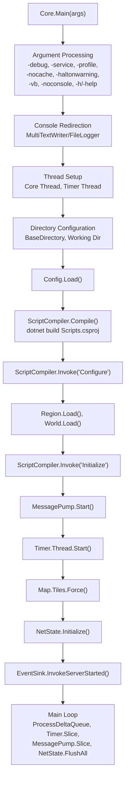
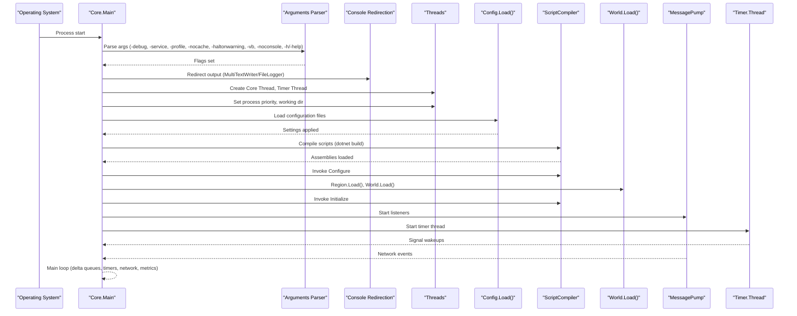
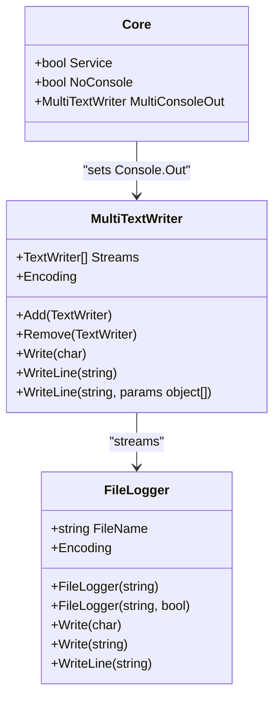
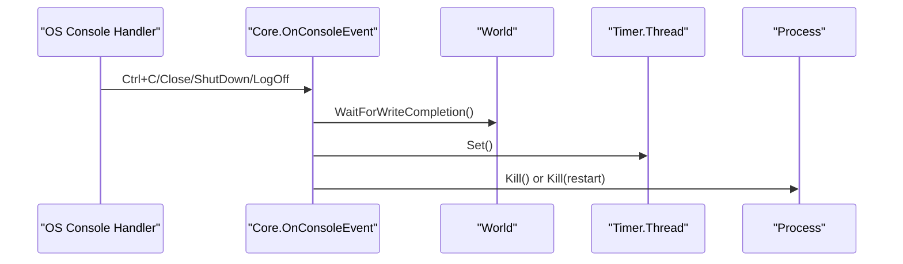
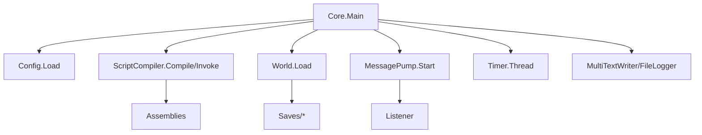

# Main Entry Point and Initialization

<cite>
**Referenced Files in This Document**
- [Main.cs](file://Server/Main.cs)
- [Config.cs](file://Server/Config.cs)
- [ScriptCompiler.cs](file://Server/ScriptCompiler.cs)
- [World.cs](file://Server/World.cs)
- [Timer.cs](file://Server/Timer.cs)
- [MessagePump.cs](file://Server/Network/MessagePump.cs)
- [Listener.cs](file://Server/Network/Listener.cs)
- [FileLogger.cs](file://Server/Main.cs)
- [MultiTextWriter.cs](file://Server/Main.cs)
- [ConsoleCommands.cs](file://Scripts/Misc/ConsoleCommands.cs)
</cite>

## Table of Contents
1. [Introduction](#introduction)
2. [Project Structure](#project-structure)
3. [Core Components](#core-components)
4. [Architecture Overview](#architecture-overview)
5. [Detailed Component Analysis](#detailed-component-analysis)
6. [Dependency Analysis](#dependency-analysis)
7. [Performance Considerations](#performance-considerations)
8. [Troubleshooting Guide](#troubleshooting-guide)
9. [Conclusion](#conclusion)

## Introduction
This document explains ServUO's main entry point and initialization sequence, focusing on the Core.Main method and the complete startup workflow. It covers command-line argument parsing, console handling, process configuration, environment detection, and the precise initialization order: argument processing, console redirection, thread setup, directory configuration, timer thread creation, configuration loading, script compilation, world loading, and main loop startup. It also documents the differences between service mode and interactive mode, console event handling, graceful shutdown procedures, common startup issues, debugging techniques, and performance considerations.

## Project Structure
ServUO's server lifecycle begins in the Server project's entry point. The initialization sequence spans several core systems:
- Command-line argument parsing and environment detection
- Console redirection and logging
- Threading model and process configuration
- Configuration loading from .cfg files
- Script compilation and dynamic assembly loading
- World and region loading
- Network message pump and timer thread startup
- Main processing loop with periodic metrics

**Diagram sources**
- [Main.cs](file://Server/Main.cs#L329-L605)
- [Config.cs](file://Server/Config.cs#L220-L293)
- [ScriptCompiler.cs](file://Server/ScriptCompiler.cs#L18-L41)
- [World.cs](file://Server/World.cs#L845-L901)
- [Timer.cs](file://Server/Timer.cs#L314-L379)
- [MessagePump.cs](file://Server/Network/MessagePump.cs#L22-L49)

**Section sources**
- [Main.cs](file://Server/Main.cs#L329-L605)

## Core Components
- Core.Main: Orchestrates the entire startup sequence, handles arguments, sets up threads, loads configuration, compiles scripts, initializes world and networking, and runs the main loop.
- Config.Load: Loads all .cfg files from the Config directory and applies settings to the runtime.
- ScriptCompiler: Compiles scripts via dotnet build, manages dynamic assembly loading, and invokes Configure/Initialize hooks.
- World: Handles loading and saving of items, mobiles, guilds, and custom data.
- Timer.TimerThread: Dedicated thread that schedules and executes timers.
- MessagePump: Manages listeners and network message processing.
- Console Redirection: MultiTextWriter and FileLogger redirect console output for service mode and interactive mode.

**Section sources**
- [Main.cs](file://Server/Main.cs#L24-L110)
- [Config.cs](file://Server/Config.cs#L220-L293)
- [ScriptCompiler.cs](file://Server/ScriptCompiler.cs#L18-L41)
- [World.cs](file://Server/World.cs#L845-L901)
- [Timer.cs](file://Server/Timer.cs#L314-L379)
- [MessagePump.cs](file://Server/Network/MessagePump.cs#L12-L49)
- [FileLogger.cs](file://Server/Main.cs#L811-L882)
- [MultiTextWriter.cs](file://Server/Main.cs#L884-L930)

## Architecture Overview
The initialization follows a strict order to ensure dependencies are satisfied before runtime begins. The diagram below maps the startup phases to their respective components.

**Diagram sources**
- [Main.cs](file://Server/Main.cs#L329-L605)
- [Config.cs](file://Server/Config.cs#L220-L293)
- [ScriptCompiler.cs](file://Server/ScriptCompiler.cs#L18-L41)
- [World.cs](file://Server/World.cs#L845-L901)
- [Timer.cs](file://Server/Timer.cs#L314-L379)
- [MessagePump.cs](file://Server/Network/MessagePump.cs#L22-L49)

## Detailed Component Analysis

### Argument Parsing System
Core.Main parses command-line arguments to configure runtime behavior. The supported flags include:
- -debug: Enables debug mode and verbose runtime information.
- -service: Runs in service mode (no interactive console).
- -profile: Enables profiling for diagnostics.
- -nocache: Controls caching behavior for script compilation.
- -haltonwarning: Halts compilation on warnings.
- -vb: Enables VB.NET script compilation.
- -noconsole: Suppresses interactive console prompts.
- -h or -help: Prints help text and exits.

Effect of each flag:
- -debug toggles Core.Debug and affects informational messages and serialization verification.
- -service sets Core.Service and redirects console output to Logs/Console.log.
- -profile toggles Core.Profiling and accumulates profiling time.
- -nocache disables caching during script compilation.
- -haltonwarning causes compilation failure on warnings.
- -vb enables VB.NET script compilation alongside C#.
- -noconsole suppresses interactive prompts during startup and runtime.

Behavior specifics:
- The help text is printed and the process exits when -h or -help is provided.
- Service mode implies NoConsole regardless of explicit flags.
- Interactive mode uses MultiTextWriter writing to Console.Out; service mode writes to FileLogger.

**Section sources**
- [Main.cs](file://Server/Main.cs#L338-L384)
- [Main.cs](file://Server/Main.cs#L386-L408)
- [Main.cs](file://Server/Main.cs#L607-L650)

### Console Redirection and Logging
Console redirection is configured based on service mode:
- Service mode: Output redirected to Logs/Console.log using MultiTextWriter and FileLogger.
- Interactive mode: Output written to Console.Out via MultiTextWriter.

MultiTextWriter forwards all write operations to multiple TextWriter instances, enabling dual logging to console and file. FileLogger timestamps each line and ensures thread-safe file writes.

**Diagram sources**
- [MultiTextWriter.cs](file://Server/Main.cs#L884-L930)
- [FileLogger.cs](file://Server/Main.cs#L811-L882)
- [Main.cs](file://Server/Main.cs#L391-L408)

**Section sources**
- [Main.cs](file://Server/Main.cs#L391-L408)
- [MultiTextWriter.cs](file://Server/Main.cs#L884-L930)
- [FileLogger.cs](file://Server/Main.cs#L811-L882)

### Thread Setup and Process Configuration
Core.Main creates and configures threads and process settings:
- Creates a dedicated Timer thread named "Timer Thread".
- Sets the current thread name to "Core Thread".
- Adjusts process priority to High on Windows.
- Sets the working directory to the executable's base directory.
- Detects platform (Windows, Unix, macOS) and runtime (CLR or Mono).
- Enables server garbage collection mode detection and reports high-resolution timing support.

These steps ensure optimal performance and consistent behavior across platforms.

**Section sources**
- [Main.cs](file://Server/Main.cs#L410-L427)
- [Main.cs](file://Server/Main.cs#L414-L422)
- [Main.cs](file://Server/Main.cs#L471-L518)

### Configuration Loading
Core.Config.Load enumerates all .cfg files under the Config directory, loads each file, and applies entries to the runtime configuration. It handles exceptions per-file, prompting to continue or exit in interactive mode. In service mode, failures cause immediate termination.

Key behaviors:
- Creates the Config directory if missing.
- Supports scoped loading via Config.Load(scope).
- Provides debug output of loaded entries when Core.Debug is true.

**Section sources**
- [Config.cs](file://Server/Config.cs#L220-L293)
- [Config.cs](file://Server/Config.cs#L295-L322)

### Script Compilation and Assembly Loading
ScriptCompiler.Compile triggers dotnet build on Scripts.csproj projects, compiling C# and optionally VB.NET scripts depending on flags. It manages dynamic assembly loading and exposes ScriptCompiler.Assemblies for later use.

Flow:
- Enumerate Scripts.csproj files under Scripts.
- Build each project with Debug or Release based on Core.Debug.
- Collect compiled assemblies.
- Retry loop allows interactive reattempt in non-service mode.

After successful compilation, Core.Main invokes:
- ScriptCompiler.Invoke("Configure"): Allows scripts to perform pre-world initialization.
- Region.Load(): Loads regions from data files.
- World.Load(): Loads items, mobiles, guilds, and custom data.
- ScriptCompiler.Invoke("Initialize"): Allows scripts to finalize initialization.

**Section sources**
- [ScriptCompiler.cs](file://Server/ScriptCompiler.cs#L18-L41)
- [Main.cs](file://Server/Main.cs#L525-L549)

### World Loading and Initialization
World.Load orchestrates loading of persistent data:
- Validates and loads indices for items, mobiles, guilds, and custom data.
- Applies safety queues and updates totals and properties post-load.
- Invokes EventSink.InvokeWorldLoad upon completion.

Region.Load prepares region definitions and boundaries prior to world population.

**Section sources**
- [World.cs](file://Server/World.cs#L845-L901)
- [Main.cs](file://Server/Main.cs#L546-L547)

### Network Message Pump and Timer Thread Startup
Core.Main starts the network subsystem and timer thread:
- MessagePump.Start initializes listeners from configured endpoints and retries on failure.
- Timer.TimerThread.ttObj.TimerMain runs on a dedicated thread, scheduling timers and signaling the core signal.
- Map.Tiles.Force() forces tile matrices to be loaded for all maps.
- NetState.Initialize() prepares network state management.
- EventSink.InvokeServerStarted() signals server readiness.

**Section sources**
- [Main.cs](file://Server/Main.cs#L551-L562)
- [MessagePump.cs](file://Server/Network/MessagePump.cs#L22-L49)
- [Timer.cs](file://Server/Timer.cs#L314-L379)

### Main Loop and Metrics
The main loop processes:
- Delta queues for mobiles and items.
- Timer.Slice() to execute scheduled timers.
- MessagePump.Slice() to handle network events.
- NetState.FlushAll() and NetState.ProcessDisposedQueue().
- Core.Slice delegate if registered.
- Periodic CPS metrics sampling.

The loop continues until Core.Closing becomes true, triggered by graceful shutdown.

**Section sources**
- [Main.cs](file://Server/Main.cs#L564-L605)
- [Timer.cs](file://Server/Timer.cs#L391-L419)

### Service Mode vs Interactive Mode
- Service mode:
  - Core.Service is true.
  - NoConsole is enforced.
  - Console output is redirected to Logs/Console.log.
  - Interactive prompts are suppressed; startup failures terminate immediately.
- Interactive mode:
  - Core.Service is false.
  - Console output goes to the terminal.
  - Interactive prompts allow retrying script compilation failures.

**Section sources**
- [Main.cs](file://Server/Main.cs#L386-L408)
- [Main.cs](file://Server/Main.cs#L525-L542)

### Console Event Handling and Graceful Shutdown
Core registers a console control handler to intercept Ctrl+C, Ctrl+Break, and close/shutdown/logoff events. During shutdown:
- Core.HandleClosed sets Core.Closing, waits for disk writes to complete, invokes EventSink.InvokeShutdown, and signals the timer thread.
- World.WaitForWriteCompletion ensures pending saves finish.
- Kill(restart) can relaunch the process with the same arguments.

**Diagram sources**
- [Main.cs](file://Server/Main.cs#L254-L264)
- [Main.cs](file://Server/Main.cs#L297-L320)
- [Main.cs](file://Server/Main.cs#L285-L295)

**Section sources**
- [Main.cs](file://Server/Main.cs#L254-L264)
- [Main.cs](file://Server/Main.cs#L297-L320)
- [Main.cs](file://Server/Main.cs#L285-L295)

### Console Commands and Interactive Mode
In interactive mode, Core.Main optionally enables console command processing through ServerConsole, which listens to console input and provides commands such as crash, save, shutdown, restart, online, and bc.

**Section sources**
- [ConsoleCommands.cs](file://Scripts/Misc/ConsoleCommands.cs#L23-L63)
- [ConsoleCommands.cs](file://Scripts/Misc/ConsoleCommands.cs#L250-L264)

## Dependency Analysis
The initialization sequence exhibits tight coupling among core components:
- Core.Main depends on Config.Load for settings, ScriptCompiler.Compile for assemblies, World.Load for persistence, MessagePump.Start for networking, and Timer.Thread for scheduling.
- Console redirection depends on MultiTextWriter and FileLogger.
- Service mode influences console behavior and logging.

**Diagram sources**
- [Main.cs](file://Server/Main.cs#L525-L562)
- [Config.cs](file://Server/Config.cs#L220-L293)
- [ScriptCompiler.cs](file://Server/ScriptCompiler.cs#L18-L41)
- [World.cs](file://Server/World.cs#L845-L901)
- [MessagePump.cs](file://Server/Network/MessagePump.cs#L22-L49)
- [Listener.cs](file://Server/Network/Listener.cs#L498-L546)

**Section sources**
- [Main.cs](file://Server/Main.cs#L525-L562)
- [Config.cs](file://Server/Config.cs#L220-L293)
- [ScriptCompiler.cs](file://Server/ScriptCompiler.cs#L18-L41)
- [World.cs](file://Server/World.cs#L845-L901)
- [MessagePump.cs](file://Server/Network/MessagePump.cs#L22-L49)
- [Listener.cs](file://Server/Network/Listener.cs#L498-L546)

## Performance Considerations
- Profiling: Enabling -profile adds overhead; use sparingly in production.
- Script compilation: Dynamic builds via dotnet can be slow; consider Release builds and disabling -debug for production.
- Garbage collection: Server GC mode improves throughput; ensure appropriate runtime configuration.
- High-resolution timing: Reported during startup; enabling high-resolution timers can improve precision on Windows.
- Logging: FileLogger writes are synchronous; excessive logging can impact performance.
- Threading: Dedicated timer thread prevents blocking; ensure minimal work in Core.Slice.

[No sources needed since this section provides general guidance]

## Troubleshooting Guide
Common startup issues and resolutions:
- Script compilation failures:
  - Use -debug and -haltonwarning to catch issues early.
  - In interactive mode, press R to retry after fixing errors.
  - In service mode, fix errors and restart the service.
- Configuration load errors:
  - Review Config.Load error messages and file paths.
  - Fix invalid entries or remove problematic files.
- Console output not visible:
  - Verify -noconsole flag; remove it for interactive mode.
  - In service mode, check Logs/Console.log.
- Unexpected crashes:
  - Review Core.CurrentDomain_UnhandledException handling and logs.
  - Use -debug to gather more context.
- Network listener failures:
  - MessagePump.Start retries; ensure ports are free and configured correctly.

**Section sources**
- [Main.cs](file://Server/Main.cs#L525-L542)
- [Config.cs](file://Server/Config.cs#L248-L280)
- [Main.cs](file://Server/Main.cs#L183-L233)
- [MessagePump.cs](file://Server/Network/MessagePump.cs#L22-L49)

## Conclusion
ServUO’s Core.Main method implements a robust, ordered initialization sequence designed for reliability and performance. By separating concerns—argument parsing, console redirection, threading, configuration, script compilation, world loading, and network startup—the system provides predictable behavior across environments. Understanding the startup phases, service vs. interactive modes, graceful shutdown, and troubleshooting techniques enables efficient deployment and maintenance of the server.