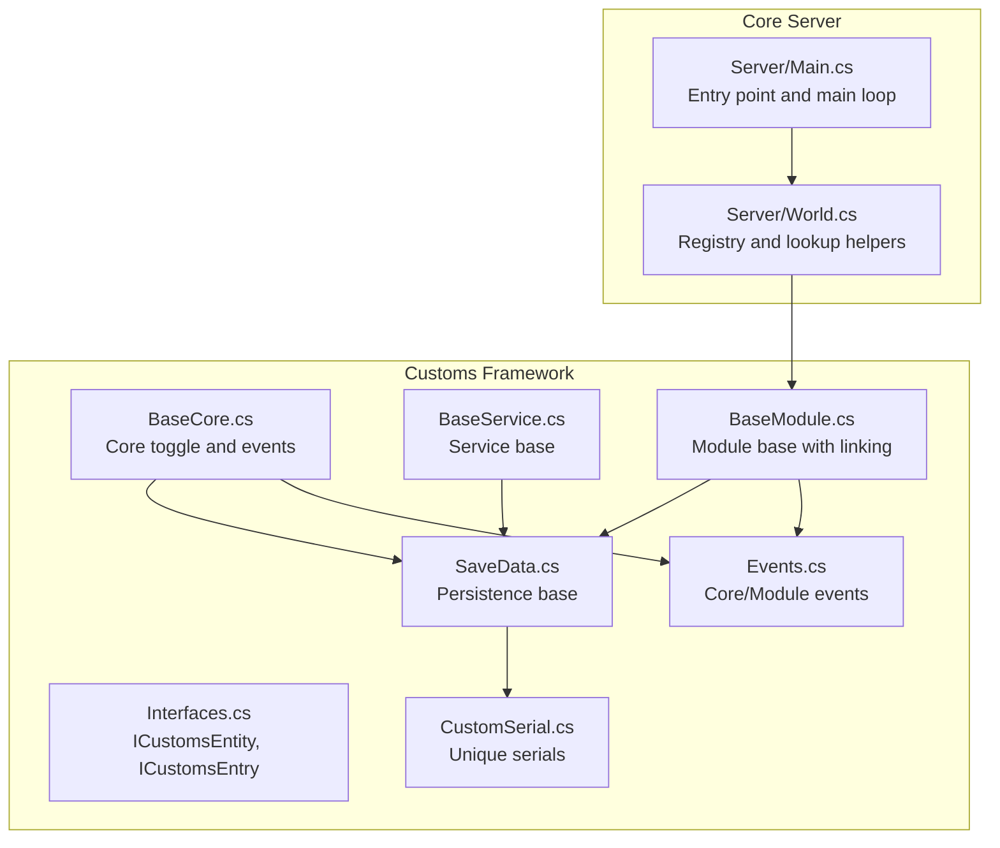
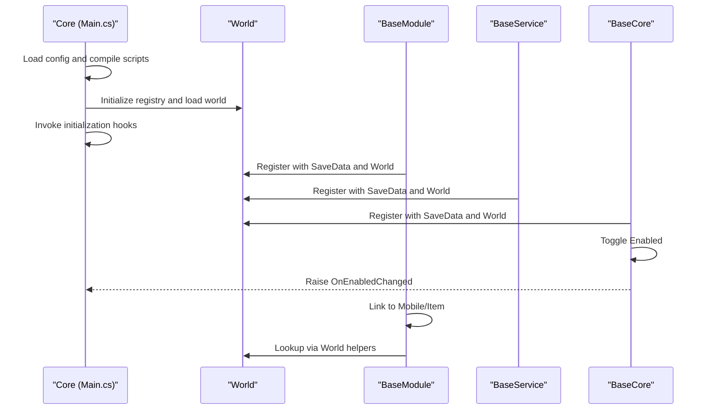
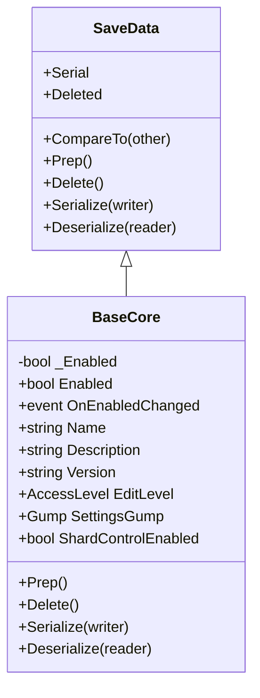
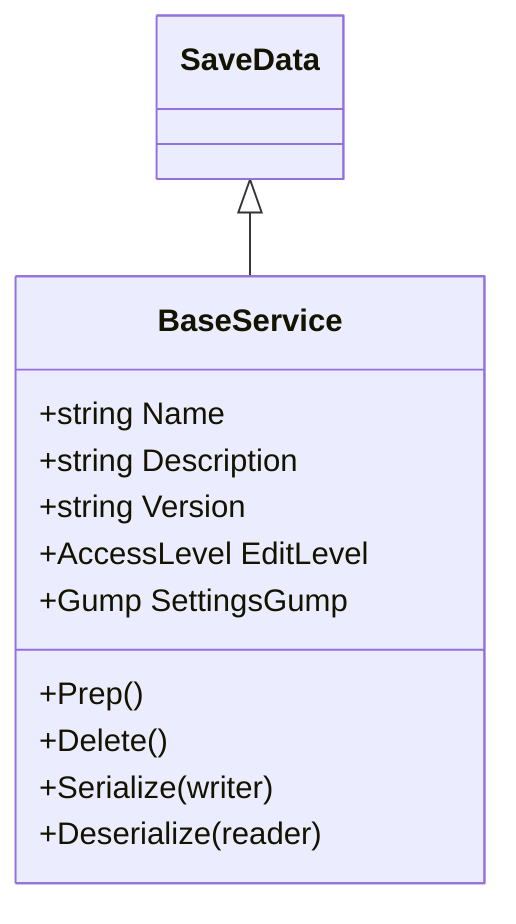
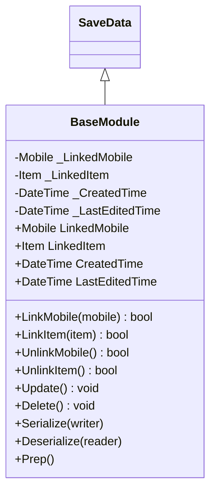
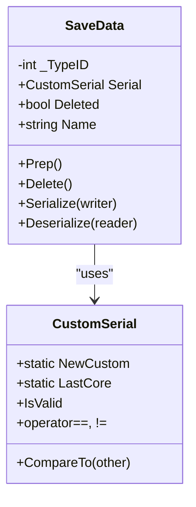
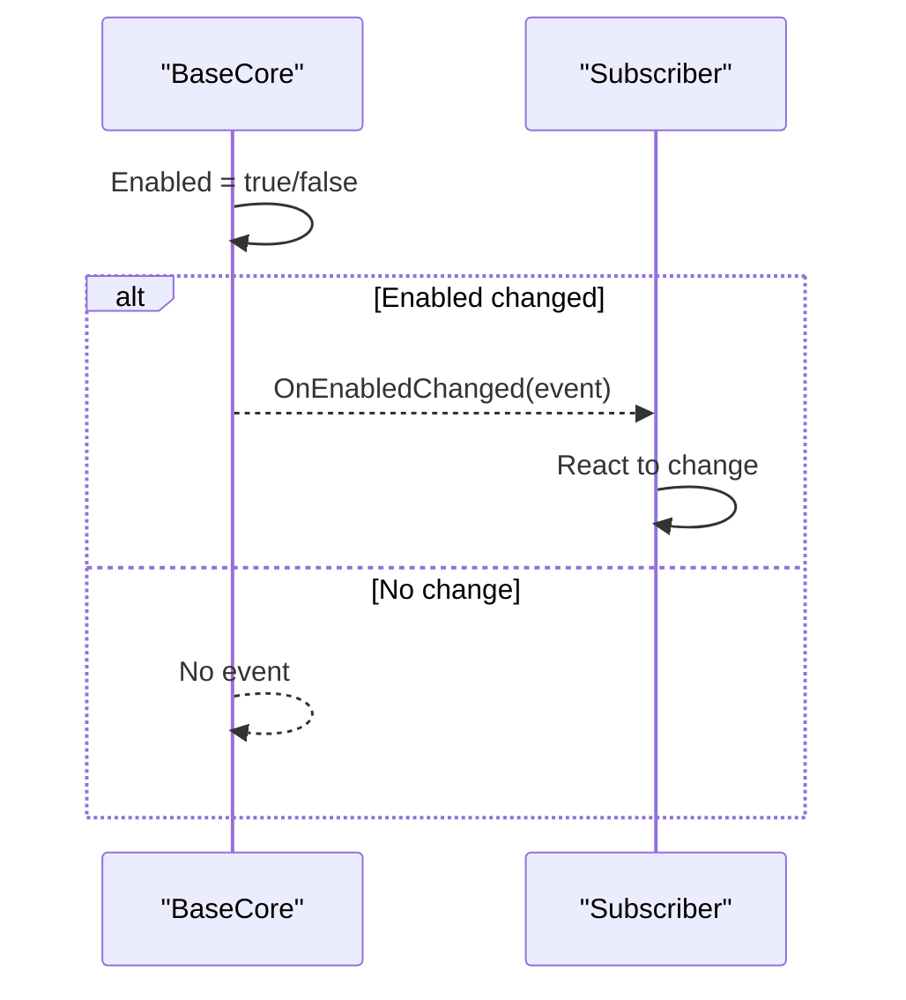
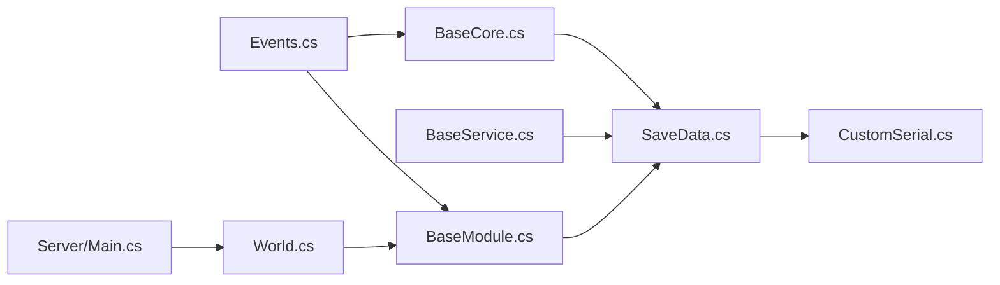

# Custom Framework

<cite>
**Referenced Files in This Document**
- [Main.cs](file://Server/Main.cs)
- [BaseModule.cs](file://Server/Customs Framework/Central Core/Base Types/BaseModule.cs)
- [BaseService.cs](file://Server/Customs Framework/Central Core/Base Types/BaseService.cs)
- [BaseCore.cs](file://Server/Customs Framework/Central Core/Base Types/BaseCore.cs)
- [Events.cs](file://Server/Customs Framework/Central Core/Base Types/Events.cs)
- [SaveData.cs](file://Server/Customs Framework/Central Core/Base Types/SaveData.cs)
- [Interfaces.cs](file://Server/Customs Framework/Central Core/Interfaces.cs)
- [CustomSerial.cs](file://Server/Customs Framework/CustomSerial.cs)
- [World.cs](file://Server/World.cs)
</cite>

## Table of Contents
1. [Introduction](#introduction)
2. [Project Structure](#project-structure)
3. [Core Components](#core-components)
4. [Architecture Overview](#architecture-overview)
5. [Detailed Component Analysis](#detailed-component-analysis)
6. [Dependency Analysis](#dependency-analysis)
7. [Performance Considerations](#performance-considerations)
8. [Troubleshooting Guide](#troubleshooting-guide)
9. [Conclusion](#conclusion)
10. [Appendices](#appendices)

## Introduction
This document explains ServUO’s Custom Framework extensibility architecture and plugin system. It focuses on three foundational base types—BaseCore, BaseService, and BaseModule—and how they enable third-party extensions. You will learn how modules and services are registered, how the lifecycle works, how inter-module communication is achieved, and how to integrate with the core server functionality. The guide also covers event system integration, configuration management, persistence handling, performance considerations, debugging techniques, best practices, and migration strategies.

## Project Structure
The Custom Framework resides under Server/Customs Framework/Central Core/Base Types and related utilities. The core server entry point initializes the world, loads configurations, compiles scripts, and starts the main loop. The framework base types are designed to be saved and restored via ServUO’s persistence layer and are integrated into the world’s data registry.

**Diagram sources**
- [Main.cs](file://Server/Main.cs#L520-L565)
- [World.cs](file://Server/World.cs#L1434-L1634)
- [BaseCore.cs](file://Server/Customs Framework/Central Core/Base Types/BaseCore.cs#L1-L80)
- [BaseService.cs](file://Server/Customs Framework/Central Core/Base Types/BaseService.cs#L1-L53)
- [BaseModule.cs](file://Server/Customs Framework/Central Core/Base Types/BaseModule.cs#L1-L188)
- [SaveData.cs](file://Server/Customs Framework/Central Core/Base Types/SaveData.cs#L1-L113)
- [Interfaces.cs](file://Server/Customs Framework/Central Core/Interfaces.cs#L1-L23)
- [CustomSerial.cs](file://Server/Customs Framework/CustomSerial.cs#L1-L116)
- [Events.cs](file://Server/Customs Framework/Central Core/Base Types/Events.cs#L1-L34)

**Section sources**
- [Main.cs](file://Server/Main.cs#L520-L565)
- [World.cs](file://Server/World.cs#L1434-L1634)

## Core Components
- BaseCore: A persistent, serializable entity that exposes an Enabled flag and raises an event when toggled. It serves as the central control point for enabling/disabling systems.
- BaseService: A lightweight persistent base for services that participate in the framework’s save/load lifecycle.
- BaseModule: A persistent base for modules that can link to a Mobile or an Item. It tracks creation/edit timestamps and supports linking/unlinking with automatic cleanup.
- SaveData: The foundational persistence layer that registers types, assigns serial identities, and handles serialization/deserialization.
- CustomSerial: A unique serial generator and comparer used by SaveData to manage identity and ordering.
- ICustomsEntity and ICustomsEntry: Interfaces that define the contract for framework entities and entries.
- Events: Delegates and event args for BaseCore and BaseModule enabling external subscribers to react to state changes.

These components collectively form the foundation for extensible systems that can be toggled, persisted, linked to in-game objects, and discovered via the world registry.

**Section sources**
- [BaseCore.cs](file://Server/Customs Framework/Central Core/Base Types/BaseCore.cs#L1-L80)
- [BaseService.cs](file://Server/Customs Framework/Central Core/Base Types/BaseService.cs#L1-L53)
- [BaseModule.cs](file://Server/Customs Framework/Central Core/Base Types/BaseModule.cs#L1-L188)
- [SaveData.cs](file://Server/Customs Framework/Central Core/Base Types/SaveData.cs#L1-L113)
- [CustomSerial.cs](file://Server/Customs Framework/CustomSerial.cs#L1-L116)
- [Interfaces.cs](file://Server/Customs Framework/Central Core/Interfaces.cs#L1-L23)
- [Events.cs](file://Server/Customs Framework/Central Core/Base Types/Events.cs#L1-L34)

## Architecture Overview
The framework integrates tightly with the core server lifecycle:
- The server initializes configuration, compiles scripts, and invokes initialization hooks.
- The world maintains a registry of SaveData instances and provides lookup helpers for modules.
- BaseCore, BaseService, and BaseModule derive from SaveData and thus participate in the global persistence system.
- BaseCore exposes an Enabled flag and fires an event when toggled, enabling decoupled subscribers to react.
- BaseModule supports linking to Mobile or Item, enabling per-character or per-item capabilities.

**Diagram sources**
- [Main.cs](file://Server/Main.cs#L520-L565)
- [World.cs](file://Server/World.cs#L1434-L1634)
- [BaseCore.cs](file://Server/Customs Framework/Central Core/Base Types/BaseCore.cs#L1-L80)
- [BaseModule.cs](file://Server/Customs Framework/Central Core/Base Types/BaseModule.cs#L1-L188)
- [BaseService.cs](file://Server/Customs Framework/Central Core/Base Types/BaseService.cs#L1-L53)

## Detailed Component Analysis

### BaseCore Analysis
BaseCore encapsulates a global “enabled” state and raises an event when the state changes. This enables subsystems to subscribe to OnEnabledChanged and react accordingly.

**Diagram sources**
- [BaseCore.cs](file://Server/Customs Framework/Central Core/Base Types/BaseCore.cs#L1-L80)
- [SaveData.cs](file://Server/Customs Framework/Central Core/Base Types/SaveData.cs#L1-L113)

Key behaviors:
- Enabled property setter triggers OnEnabledChanged when the value flips.
- Implements serialization to persist the Enabled state.
- Provides metadata (Name, Description, Version, EditLevel) suitable for admin UIs.

Usage pattern:
- Subscribe to BaseCore.OnEnabledChanged to coordinate activation/deactivation of dependent systems.
- Persist and restore state automatically via SaveData mechanisms.

**Section sources**
- [BaseCore.cs](file://Server/Customs Framework/Central Core/Base Types/BaseCore.cs#L1-L80)
- [Events.cs](file://Server/Customs Framework/Central Core/Base Types/Events.cs#L1-L34)

### BaseService Analysis
BaseService is a minimal base for service-like components that participate in the framework’s persistence lifecycle.

**Diagram sources**
- [BaseService.cs](file://Server/Customs Framework/Central Core/Base Types/BaseService.cs#L1-L53)
- [SaveData.cs](file://Server/Customs Framework/Central Core/Base Types/SaveData.cs#L1-L113)

Key behaviors:
- Inherits persistence from SaveData.
- Provides metadata suitable for admin UIs.
- Intended for services that do not require linking to Mobile/Item.

**Section sources**
- [BaseService.cs](file://Server/Customs Framework/Central Core/Base Types/BaseService.cs#L1-L53)
- [SaveData.cs](file://Server/Customs Framework/Central Core/Base Types/SaveData.cs#L1-L113)

### BaseModule Analysis
BaseModule is the primary building block for features attached to in-game objects. It supports linking to a Mobile or an Item, tracks creation and edit times, and cleans up references on deletion.

**Diagram sources**
- [BaseModule.cs](file://Server/Customs Framework/Central Core/Base Types/BaseModule.cs#L1-L188)
- [SaveData.cs](file://Server/Customs Framework/Central Core/Base Types/SaveData.cs#L1-L113)

Key behaviors:
- Linking/unlinking ensures references are added/removed from the target object’s Modules collection.
- Update() refreshes LastEditedTime.
- Serialize/Deserialize persist LinkedMobile, LinkedItem, CreatedTime, and LastEditedTime.
- World helpers allow retrieval of modules by Mobile, Item, name, or type.

Inter-module communication:
- Modules can discover each other via World helpers (by Mobile/Item, name/type).
- They can also communicate indirectly through shared services or by raising events.

**Section sources**
- [BaseModule.cs](file://Server/Customs Framework/Central Core/Base Types/BaseModule.cs#L1-L188)
- [World.cs](file://Server/World.cs#L1434-L1634)

### SaveData and Identity Management
SaveData is the backbone of persistence and identity:
- Assigns a CustomSerial and registers the type in the world registry.
- Provides CompareTo and equality semantics for ordering and deduplication.
- Handles Deleted flag and basic serialization.

**Diagram sources**
- [SaveData.cs](file://Server/Customs Framework/Central Core/Base Types/SaveData.cs#L1-L113)
- [CustomSerial.cs](file://Server/Customs Framework/CustomSerial.cs#L1-L116)

**Section sources**
- [SaveData.cs](file://Server/Customs Framework/Central Core/Base Types/SaveData.cs#L1-L113)
- [CustomSerial.cs](file://Server/Customs Framework/CustomSerial.cs#L1-L116)

### Events and Lifecycle Integration
- BaseCore.OnEnabledChanged allows external systems to react to enable/disable transitions.
- BaseModule exposes a companion event type for module-specific notifications.
- These events integrate with the server’s event sink and lifecycle hooks.

**Diagram sources**
- [BaseCore.cs](file://Server/Customs Framework/Central Core/Base Types/BaseCore.cs#L1-L80)
- [Events.cs](file://Server/Customs Framework/Central Core/Base Types/Events.cs#L1-L34)

**Section sources**
- [BaseCore.cs](file://Server/Customs Framework/Central Core/Base Types/BaseCore.cs#L1-L80)
- [Events.cs](file://Server/Customs Framework/Central Core/Base Types/Events.cs#L1-L34)

## Dependency Analysis
The framework components share a common inheritance chain and rely on the world registry and persistence layer.

**Diagram sources**
- [SaveData.cs](file://Server/Customs Framework/Central Core/Base Types/SaveData.cs#L1-L113)
- [CustomSerial.cs](file://Server/Customs Framework/CustomSerial.cs#L1-L116)
- [BaseCore.cs](file://Server/Customs Framework/Central Core/Base Types/BaseCore.cs#L1-L80)
- [BaseService.cs](file://Server/Customs Framework/Central Core/Base Types/BaseService.cs#L1-L53)
- [BaseModule.cs](file://Server/Customs Framework/Central Core/Base Types/BaseModule.cs#L1-L188)
- [Events.cs](file://Server/Customs Framework/Central Core/Base Types/Events.cs#L1-L34)
- [World.cs](file://Server/World.cs#L1434-L1634)
- [Main.cs](file://Server/Main.cs#L520-L565)

**Section sources**
- [SaveData.cs](file://Server/Customs Framework/Central Core/Base Types/SaveData.cs#L1-L113)
- [BaseCore.cs](file://Server/Customs Framework/Central Core/Base Types/BaseCore.cs#L1-L80)
- [BaseModule.cs](file://Server/Customs Framework/Central Core/Base Types/BaseModule.cs#L1-L188)
- [BaseService.cs](file://Server/Customs Framework/Central Core/Base Types/BaseService.cs#L1-L53)
- [Events.cs](file://Server/Customs Framework/Central Core/Base Types/Events.cs#L1-L34)
- [World.cs](file://Server/World.cs#L1434-L1634)
- [Main.cs](file://Server/Main.cs#L520-L565)

## Performance Considerations
- Prefer lazy initialization in BaseService and BaseModule to avoid unnecessary overhead during server startup.
- Use BaseCore.Enabled to gate expensive subsystems; disable them when not needed to reduce CPU and memory usage.
- Keep module linking scoped to the minimum required targets (Mobile or Item) to limit traversal and lookup costs.
- Avoid heavy work in event handlers subscribed to BaseCore.OnEnabledChanged; defer to timers or queues if needed.
- Utilize ServUO’s built-in profiling flags to measure impact during development and testing.

[No sources needed since this section provides general guidance]

## Troubleshooting Guide
Common issues and remedies:
- Serialization errors: Ensure custom SaveData-derived types implement Serialize/Deserialize and include the required constructors. Verify that types are registered in the world registry.
- Missing module references: Use World helpers to locate modules by Mobile, Item, name, or type. Confirm that LinkMobile/LinkItem was called and that the module is present in the target’s Modules collection.
- Event not firing: Confirm that subscribers are attached to BaseCore.OnEnabledChanged before toggling Enabled and that the event is not unsubscribed prematurely.
- Identity conflicts: Ensure CustomSerial.NewCustom is used when creating new SaveData instances and avoid manual collisions.

**Section sources**
- [SaveData.cs](file://Server/Customs Framework/Central Core/Base Types/SaveData.cs#L1-L113)
- [BaseModule.cs](file://Server/Customs Framework/Central Core/Base Types/BaseModule.cs#L1-L188)
- [World.cs](file://Server/World.cs#L1434-L1634)
- [BaseCore.cs](file://Server/Customs Framework/Central Core/Base Types/BaseCore.cs#L1-L80)

## Conclusion
ServUO’s Custom Framework provides a robust, extensible foundation for building modular systems. BaseCore offers centralized control with event-driven reactions, BaseService delivers lightweight persistence-aware services, and BaseModule enables powerful per-object capabilities with linking and discovery. Together with SaveData and CustomSerial, they form a cohesive persistence and identity system that integrates cleanly with the core server lifecycle.

[No sources needed since this section summarizes without analyzing specific files]

## Appendices

### Creating a Custom Module
Steps:
- Derive from BaseModule and override metadata as needed.
- Implement any required logic in Prep/Delete or during the server lifecycle.
- Optionally expose a SettingsGump for administrative control.
- Link the module to a Mobile or Item using LinkMobile/LinkItem.
- Persist and restore via SaveData mechanisms; confirm serialization support.

Example references:
- [BaseModule.cs](file://Server/Customs Framework/Central Core/Base Types/BaseModule.cs#L1-L188)
- [SaveData.cs](file://Server/Customs Framework/Central Core/Base Types/SaveData.cs#L1-L113)

**Section sources**
- [BaseModule.cs](file://Server/Customs Framework/Central Core/Base Types/BaseModule.cs#L1-L188)
- [SaveData.cs](file://Server/Customs Framework/Central Core/Base Types/SaveData.cs#L1-L113)

### Implementing a Service
Steps:
- Derive from BaseService and override metadata.
- Implement any initialization in Prep or during server initialization hooks.
- Persist and restore via SaveData mechanisms.

Example references:
- [BaseService.cs](file://Server/Customs Framework/Central Core/Base Types/BaseService.cs#L1-L53)
- [SaveData.cs](file://Server/Customs Framework/Central Core/Base Types/SaveData.cs#L1-L113)

**Section sources**
- [BaseService.cs](file://Server/Customs Framework/Central Core/Base Types/BaseService.cs#L1-L53)
- [SaveData.cs](file://Server/Customs Framework/Central Core/Base Types/SaveData.cs#L1-L113)

### Integrating with Core Server Functionality
- Initialization: Use the server’s initialization hooks to register services/modules after scripts are compiled and the world is loaded.
- Lifecycle: Subscribe to BaseCore.OnEnabledChanged to coordinate activation/deactivation.
- Persistence: Rely on SaveData.Serialize/Deserialize for automatic world loading/saving.

Example references:
- [Main.cs](file://Server/Main.cs#L520-L565)
- [BaseCore.cs](file://Server/Customs Framework/Central Core/Base Types/BaseCore.cs#L1-L80)
- [SaveData.cs](file://Server/Customs Framework/Central Core/Base Types/SaveData.cs#L1-L113)

**Section sources**
- [Main.cs](file://Server/Main.cs#L520-L565)
- [BaseCore.cs](file://Server/Customs Framework/Central Core/Base Types/BaseCore.cs#L1-L80)
- [SaveData.cs](file://Server/Customs Framework/Central Core/Base Types/SaveData.cs#L1-L113)

### Event System Integration
- Subscribe to BaseCore.OnEnabledChanged to react to global toggles.
- Use BaseModule’s companion event type for module-specific notifications.
- Ensure event handlers are attached before toggling Enabled.

Example references:
- [Events.cs](file://Server/Customs Framework/Central Core/Base Types/Events.cs#L1-L34)
- [BaseCore.cs](file://Server/Customs Framework/Central Core/Base Types/BaseCore.cs#L1-L80)

**Section sources**
- [Events.cs](file://Server/Customs Framework/Central Core/Base Types/Events.cs#L1-L34)
- [BaseCore.cs](file://Server/Customs Framework/Central Core/Base Types/BaseCore.cs#L1-L80)

### Configuration Management
- Use server configuration files to tune behavior and logging.
- Expose admin-friendly settings via SettingsGump in BaseModule/BaseService when appropriate.

[No sources needed since this section provides general guidance]

### Persistence Handling for Custom Components
- Implement Serialize/Deserialize in custom SaveData-derived types.
- Ensure constructors accept CustomSerial and call base(serial).
- Verify type registration occurs automatically via SaveData.

Example references:
- [SaveData.cs](file://Server/Customs Framework/Central Core/Base Types/SaveData.cs#L1-L113)
- [CustomSerial.cs](file://Server/Customs Framework/CustomSerial.cs#L1-L116)

**Section sources**
- [SaveData.cs](file://Server/Customs Framework/Central Core/Base Types/SaveData.cs#L1-L113)
- [CustomSerial.cs](file://Server/Customs Framework/CustomSerial.cs#L1-L116)

### Common Extension Scenarios
- Per-player abilities: Create a BaseModule linked to Mobile; use World helpers to retrieve and manage instances.
- Per-item effects: Create a BaseModule linked to Item; manage state per-object.
- Global systems: Use BaseCore.Enabled to toggle entire subsystems; subscribe to OnEnabledChanged for coordinated actions.
- Background services: Implement BaseService for periodic tasks or cross-cutting concerns.

Example references:
- [BaseModule.cs](file://Server/Customs Framework/Central Core/Base Types/BaseModule.cs#L1-L188)
- [BaseCore.cs](file://Server/Customs Framework/Central Core/Base Types/BaseCore.cs#L1-L80)
- [World.cs](file://Server/World.cs#L1434-L1634)

**Section sources**
- [BaseModule.cs](file://Server/Customs Framework/Central Core/Base Types/BaseModule.cs#L1-L188)
- [BaseCore.cs](file://Server/Customs Framework/Central Core/Base Types/BaseCore.cs#L1-L80)
- [World.cs](file://Server/World.cs#L1434-L1634)

### Best Practices
- Keep modules small and focused; favor composition over monolithic modules.
- Use BaseCore.Enabled to gate expensive features.
- Avoid heavy work in constructors; defer to Prep or initialization hooks.
- Provide meaningful Names, Descriptions, and Versions for admin visibility.
- Use SettingsGump for configurable parameters exposed to administrators.

[No sources needed since this section provides general guidance]

### Version Compatibility and Migration Strategies
- Maintain backward-compatible serialization by versioning Serialize/Deserialize and supporting downgrade paths.
- Increment version numbers when changing field layouts; preserve older branches in Deserialize.
- Test migrations by loading older worlds and verifying that modules/services initialize correctly.

Example references:
- [SaveData.cs](file://Server/Customs Framework/Central Core/Base Types/SaveData.cs#L1-L113)

**Section sources**
- [SaveData.cs](file://Server/Customs Framework/Central Core/Base Types/SaveData.cs#L1-L113)