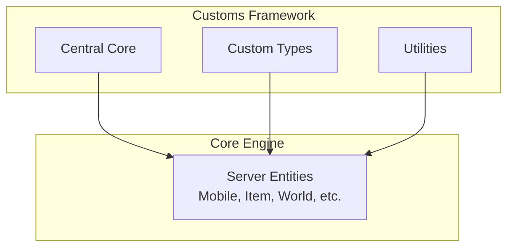
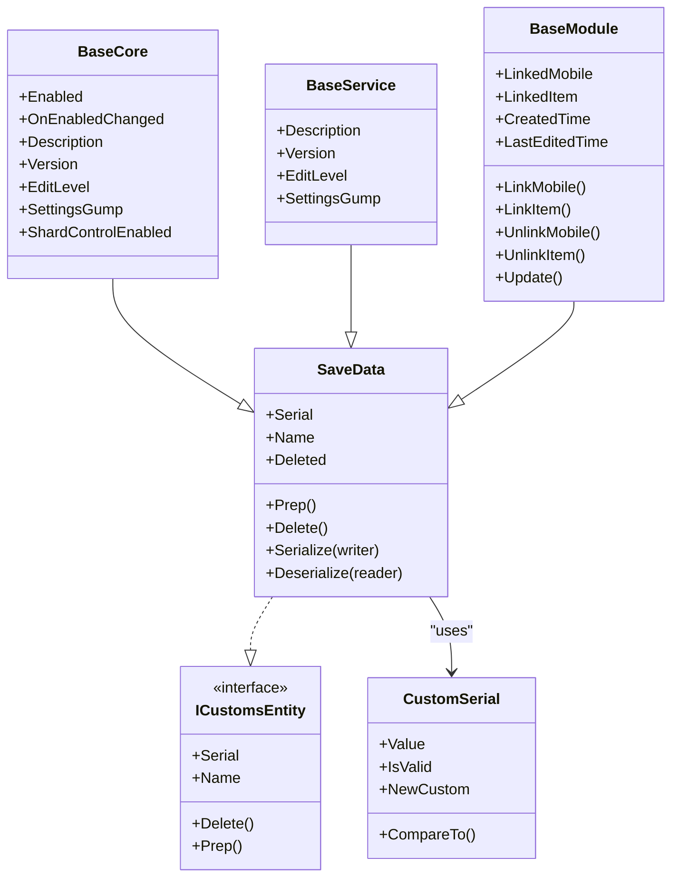
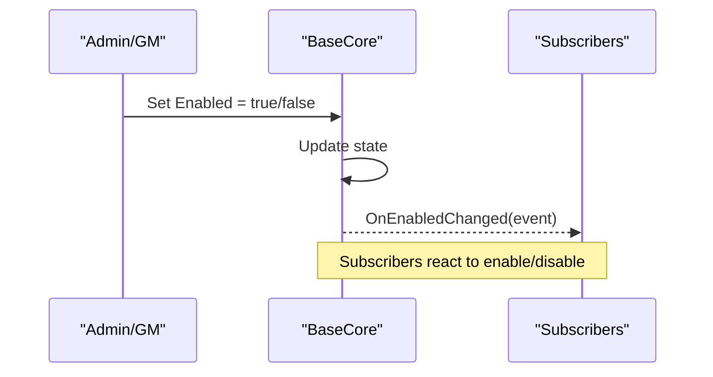
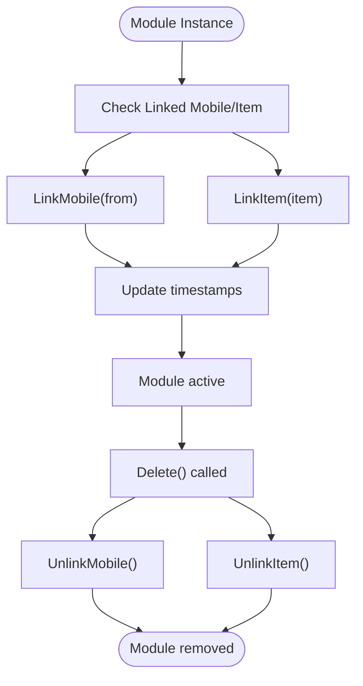
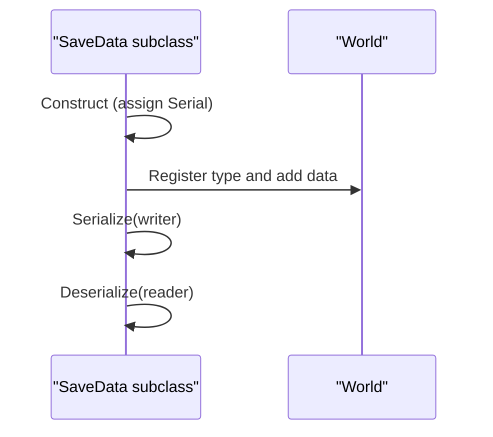
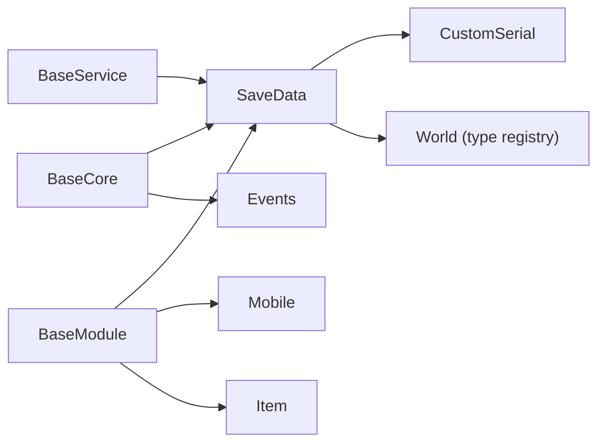
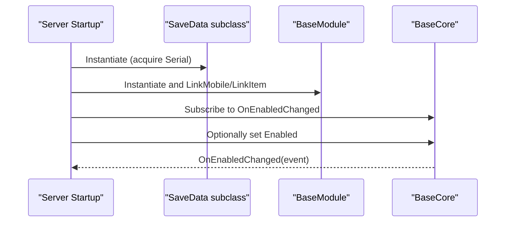

# Framework Architecture

<cite>
**Referenced Files in This Document**
- [BaseCore.cs](file://Server/Customs Framework/Central Core/Base Types/BaseCore.cs)
- [BaseModule.cs](file://Server/Customs Framework/Central Core/Base Types/BaseModule.cs)
- [BaseService.cs](file://Server/Customs Framework/Central Core/Base Types/BaseService.cs)
- [SaveData.cs](file://Server/Customs Framework/Central Core/Base Types/SaveData.cs)
- [Events.cs](file://Server/Customs Framework/Central Core/Base Types/Events.cs)
- [Interfaces.cs](file://Server/Customs Framework/Central Core/Interfaces.cs)
- [CustomSerial.cs](file://Server/Customs Framework/Central Core/CustomSerial.cs)
- [Utilities.cs](file://Server/Customs Framework/Utilities/Utilities.cs)
- [LastEditedBy.cs](file://Server/Customs Framework/Custom Types/LastEditedBy.cs)
- [Place.cs](file://Server/Customs Framework/Custom Types/Place.cs)
</cite>

## Table of Contents
1. [Introduction](#introduction)
2. [Project Structure](#project-structure)
3. [Core Components](#core-components)
4. [Architecture Overview](#architecture-overview)
5. [Detailed Component Analysis](#detailed-component-analysis)
6. [Dependency Analysis](#dependency-analysis)
7. [Performance Considerations](#performance-considerations)
8. [Troubleshooting Guide](#troubleshooting-guide)
9. [Conclusion](#conclusion)
10. [Appendices](#appendices)

## Introduction
This document explains the Custom Framework architecture in ServUO, focusing on the foundational design patterns centered around three base types: BaseCore, BaseService, and SaveData. It also covers the plugin-style module model via BaseModule, lifecycle management, event-driven integration, serialization and persistence, and how the framework extends server functionality while remaining compatible with the core engine. The document includes architectural diagrams, lifecycle sequences, and practical guidance for initialization, shutdown, and error handling.

## Project Structure
The Custom Framework resides under Server/Customs Framework and is organized into:
- Central Core: Base types (BaseCore, BaseService, BaseModule, SaveData), events, interfaces, and serialization identifiers
- Custom Types: Lightweight value-like types used by modules/services (e.g., LastEditedBy, Place)
- Utilities: Helper extensions and strategies for persistence and common operations

**Section sources**
- [BaseCore.cs](file://Server/Customs Framework/Central Core/Base Types/BaseCore.cs#L1-L80)
- [BaseModule.cs](file://Server/Customs Framework/Central Core/Base Types/BaseModule.cs#L1-L188)
- [BaseService.cs](file://Server/Customs Framework/Central Core/Base Types/BaseService.cs#L1-L53)
- [SaveData.cs](file://Server/Customs Framework/Central Core/Base Types/SaveData.cs#L1-L113)
- [Interfaces.cs](file://Server/Customs Framework/Central Core/Interfaces.cs#L1-L23)
- [CustomSerial.cs](file://Server/Customs Framework/Central Core/CustomSerial.cs#L1-L116)
- [Utilities.cs](file://Server/Customs Framework/Utilities/Utilities.cs#L1-L160)
- [LastEditedBy.cs](file://Server/Customs Framework/Custom Types/LastEditedBy.cs#L1-L55)
- [Place.cs](file://Server/Customs Framework/Custom Types/Place.cs#L1-L59)

## Core Components
This section documents the foundational base types and their roles in the framework.

- SaveData: Provides identity, lifecycle hooks, and serialization for framework entities. It registers entity types with the world and assigns persistent serials.
- BaseCore: Root framework entity representing a “core” subsystem. Exposes enable/disable state and a change event. Designed to be extended by major systems.
- BaseService: Lightweight base for service-like functionality. Inherits persistence and identity from SaveData.
- BaseModule: Plugin-style component that links to a Mobile and/or Item, tracking creation/edit timestamps and enabling unlinking on deletion.

Key contracts:
- ICustomsEntity: Defines identity, name, delete/prep lifecycle, and comparison.
- IComparable overloads: Enables sorting and ordering of framework entities.

Serialization and identity:
- CustomSerial: Unique identifier generator ensuring uniqueness across framework data, with operators and comparisons.

**Section sources**
- [SaveData.cs](file://Server/Customs Framework/Central Core/Base Types/SaveData.cs#L1-L113)
- [BaseCore.cs](file://Server/Customs Framework/Central Core/Base Types/BaseCore.cs#L1-L80)
- [BaseService.cs](file://Server/Customs Framework/Central Core/Base Types/BaseService.cs#L1-L53)
- [BaseModule.cs](file://Server/Customs Framework/Central Core/Base Types/BaseModule.cs#L1-L188)
- [Interfaces.cs](file://Server/Customs Framework/Central Core/Interfaces.cs#L1-L23)
- [CustomSerial.cs](file://Server/Customs Framework/Central Core/CustomSerial.cs#L1-L116)

## Architecture Overview
The framework follows a layered pattern:
- Base types encapsulate identity, lifecycle, and persistence
- Modules act as plugins bound to server entities (Mobile/Item)
- Services encapsulate functional capabilities
- Events notify subscribers of state changes
- Utilities support persistence strategies and common helpers

**Diagram sources**
- [SaveData.cs](file://Server/Customs Framework/Central Core/Base Types/SaveData.cs#L1-L113)
- [BaseCore.cs](file://Server/Customs Framework/Central Core/Base Types/BaseCore.cs#L1-L80)
- [BaseService.cs](file://Server/Customs Framework/Central Core/Base Types/BaseService.cs#L1-L53)
- [BaseModule.cs](file://Server/Customs Framework/Central Core/Base Types/BaseModule.cs#L1-L188)
- [Interfaces.cs](file://Server/Customs Framework/Central Core/Interfaces.cs#L1-L23)
- [CustomSerial.cs](file://Server/Customs Framework/Central Core/CustomSerial.cs#L1-L116)

## Detailed Component Analysis

### BaseCore: System-wide Core Entity
- Purpose: Represents a major framework subsystem with an on/off switch and change notifications.
- Lifecycle: Inherits persistence from SaveData; exposes Enabled property with event firing.
- Extensibility: Override Description, Version, EditLevel, SettingsGump, and shard control flags.

**Section sources**
- [BaseCore.cs](file://Server/Customs Framework/Central Core/Base Types/BaseCore.cs#L1-L80)
- [Events.cs](file://Server/Customs Framework/Central Core/Base Types/Events.cs#L1-L34)

### BaseService: Functional Service Base
- Purpose: Minimal base for service-like functionality with identity and persistence.
- Lifecycle: Inherits prep/delete hooks and serialization from SaveData.

**Section sources**
- [BaseService.cs](file://Server/Customs Framework/Central Core/Base Types/BaseService.cs#L1-L53)
- [SaveData.cs](file://Server/Customs Framework/Central Core/Base Types/SaveData.cs#L1-L113)

### BaseModule: Plugin-Style Module
- Purpose: Encapsulates a plugin-like component linked to a Mobile and/or Item.
- Lifecycle: Tracks CreatedTime and LastEditedTime; automatically unlinks on Delete.
- Linking: Supports linking/unlinking Mobile and Item; updates timestamps.

**Section sources**
- [BaseModule.cs](file://Server/Customs Framework/Central Core/Base Types/BaseModule.cs#L1-L188)

### SaveData: Identity, Ordering, and Persistence
- Identity: Assigns CustomSerial and registers type with World for persistence.
- Ordering: Implements IComparable to order entities by serial.
- Lifecycle: Prep/Delete hooks; versioned serialization.

**Section sources**
- [SaveData.cs](file://Server/Customs Framework/Central Core/Base Types/SaveData.cs#L1-L113)
- [CustomSerial.cs](file://Server/Customs Framework/Central Core/CustomSerial.cs#L1-L116)

### Events: Enablement Notifications
- BaseCoreEventArgs and BaseModuleEventArgs provide context for state changes.
- Delegates define event handlers for core and module enable/disable.

**Section sources**
- [Events.cs](file://Server/Customs Framework/Central Core/Base Types/Events.cs#L1-L34)

### Interfaces and Serialization Identifiers
- ICustomsEntity defines the contract for framework entities.
- ISerializable.TypeReference and ISerializable.SerialIdentity integrate with the engine’s serialization system.

**Section sources**
- [Interfaces.cs](file://Server/Customs Framework/Central Core/Interfaces.cs#L1-L23)

### Utilities: Persistence Strategies and Helpers
- SaveStrategyTypes enumerates supported save strategies.
- Extension methods assist with versioning, file checks, placement, blessing, and dumping.

**Section sources**
- [Utilities.cs](file://Server/Customs Framework/Utilities/Utilities.cs#L1-L160)

### Custom Types: Lightweight Value Objects
- Place: Holds Map and Point3D with serialization.
- LastEditedBy: Tracks Mobile and DateTime with serialization.

These types demonstrate how framework-aware scripts can compose richer metadata without inheriting from base framework classes.

**Section sources**
- [Place.cs](file://Server/Customs Framework/Custom Types/Place.cs#L1-L59)
- [LastEditedBy.cs](file://Server/Customs Framework/Custom Types/LastEditedBy.cs#L1-L55)

## Dependency Analysis
The framework maintains low coupling to the core engine by relying on:
- World registration and type indexing via SaveData
- Server entities (Mobile, Item) for module linkage
- Event delegates for decoupled notifications
- Serialization interfaces for persistence

**Diagram sources**
- [SaveData.cs](file://Server/Customs Framework/Central Core/Base Types/SaveData.cs#L1-L113)
- [BaseCore.cs](file://Server/Customs Framework/Central Core/Base Types/BaseCore.cs#L1-L80)
- [BaseModule.cs](file://Server/Customs Framework/Central Core/Base Types/BaseModule.cs#L1-L188)
- [CustomSerial.cs](file://Server/Customs Framework/Central Core/CustomSerial.cs#L1-L116)
- [Events.cs](file://Server/Customs Framework/Central Core/Base Types/Events.cs#L1-L34)

**Section sources**
- [SaveData.cs](file://Server/Customs Framework/Central Core/Base Types/SaveData.cs#L1-L113)
- [BaseModule.cs](file://Server/Customs Framework/Central Core/Base Types/BaseModule.cs#L1-L188)
- [BaseCore.cs](file://Server/Customs Framework/Central Core/Base Types/BaseCore.cs#L1-L80)
- [Events.cs](file://Server/Customs Framework/Central Core/Base Types/Events.cs#L1-L34)

## Performance Considerations
- Serialization versioning: Use WriteVersion/ReaderVersion helpers to maintain backward compatibility during migrations.
- Save strategies: Choose appropriate strategies (standard, dual, dynamic, parallel) based on workload and hardware.
- Entity ordering: IComparable enables efficient sorting and indexing of framework entities.
- Linking overhead: BaseModule linking/unlinking operates on collections; avoid excessive re-linking to minimize churn.

[No sources needed since this section provides general guidance]

## Troubleshooting Guide
Common issues and remedies:
- Serialization version mismatch: Ensure consistent version handling in Serialize/Deserialize overrides.
- Duplicate type registration: SaveData registers types with World; avoid manual duplication.
- Module unlinking: If a module persists after removing its linked entity, verify Delete() is invoked and unlinks occur.
- Event subscriptions: Subscribe to OnEnabledChanged to react to core enable/disable transitions.

**Section sources**
- [SaveData.cs](file://Server/Customs Framework/Central Core/Base Types/SaveData.cs#L1-L113)
- [BaseModule.cs](file://Server/Customs Framework/Central Core/Base Types/BaseModule.cs#L1-L188)
- [BaseCore.cs](file://Server/Customs Framework/Central Core/Base Types/BaseCore.cs#L1-L80)
- [Utilities.cs](file://Server/Customs Framework/Utilities/Utilities.cs#L1-L160)

## Conclusion
The Custom Framework provides a robust foundation for extending ServUO functionality through modular, persistent, and event-driven components. BaseCore, BaseService, and BaseModule offer clear extension points, while SaveData and CustomSerial ensure consistent identity and persistence. The framework’s design emphasizes separation of concerns, minimal coupling to the core engine, and extensibility for diverse subsystems.

[No sources needed since this section summarizes without analyzing specific files]

## Appendices

### Initialization Sequence
- Construct framework entities (SaveData subclasses) to acquire Serial and register types
- Link BaseModule instances to Mobile/Item as needed
- Subscribe to BaseCore.OnEnabledChanged for runtime control
- Initialize services and core systems during server startup routines

**Diagram sources**
- [SaveData.cs](file://Server/Customs Framework/Central Core/Base Types/SaveData.cs#L1-L113)
- [BaseModule.cs](file://Server/Customs Framework/Central Core/Base Types/BaseModule.cs#L1-L188)
- [BaseCore.cs](file://Server/Customs Framework/Central Core/Base Types/BaseCore.cs#L1-L80)
- [Events.cs](file://Server/Customs Framework/Central Core/Base Types/Events.cs#L1-L34)

### Shutdown Procedure
- Call Delete() on framework entities to trigger cleanup and unlinking
- Unsubscribe from events to prevent leaks
- Allow World to persist registered types and data

**Section sources**
- [SaveData.cs](file://Server/Customs Framework/Central Core/Base Types/SaveData.cs#L1-L113)
- [BaseModule.cs](file://Server/Customs Framework/Central Core/Base Types/BaseModule.cs#L1-L188)
- [BaseCore.cs](file://Server/Customs Framework/Central Core/Base Types/BaseCore.cs#L1-L80)

### Inter-Module Communication Mechanisms
- Event-driven: Use BaseCore.OnEnabledChanged to broadcast enable/disable state changes
- Shared state: Persist state via SaveData and CustomSerial to ensure cross-module visibility
- Value objects: Compose lightweight types (e.g., Place, LastEditedBy) to share metadata

**Section sources**
- [Events.cs](file://Server/Customs Framework/Central Core/Base Types/Events.cs#L1-L34)
- [SaveData.cs](file://Server/Customs Framework/Central Core/Base Types/SaveData.cs#L1-L113)
- [Place.cs](file://Server/Customs Framework/Custom Types/Place.cs#L1-L59)
- [LastEditedBy.cs](file://Server/Customs Framework/Custom Types/LastEditedBy.cs#L1-L55)

### Configuration Management
- Use SettingsGump overrides on BaseCore/BaseService to expose admin-configurable options
- Respect EditLevel to control who can modify settings
- Persist configuration via SaveData serialization

**Section sources**
- [BaseCore.cs](file://Server/Customs Framework/Central Core/Base Types/BaseCore.cs#L1-L80)
- [BaseService.cs](file://Server/Customs Framework/Central Core/Base Types/BaseService.cs#L1-L53)
- [SaveData.cs](file://Server/Customs Framework/Central Core/Base Types/SaveData.cs#L1-L113)

### Design Decisions and Trade-offs
- Inheritance over composition: Using BaseCore/BaseService/BaseModule simplifies extension but increases coupling to the framework hierarchy
- Event-driven control: Enables loose coupling for enable/disable actions but requires careful subscription management
- Serialization-first design: Ensures persistence and migration safety but adds overhead for complex objects
- Lightweight custom types: Favor value objects for metadata to reduce inheritance overhead

[No sources needed since this section provides general guidance]