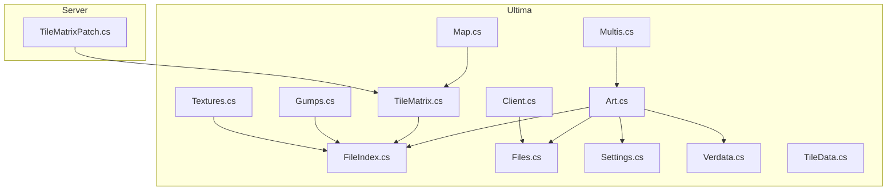
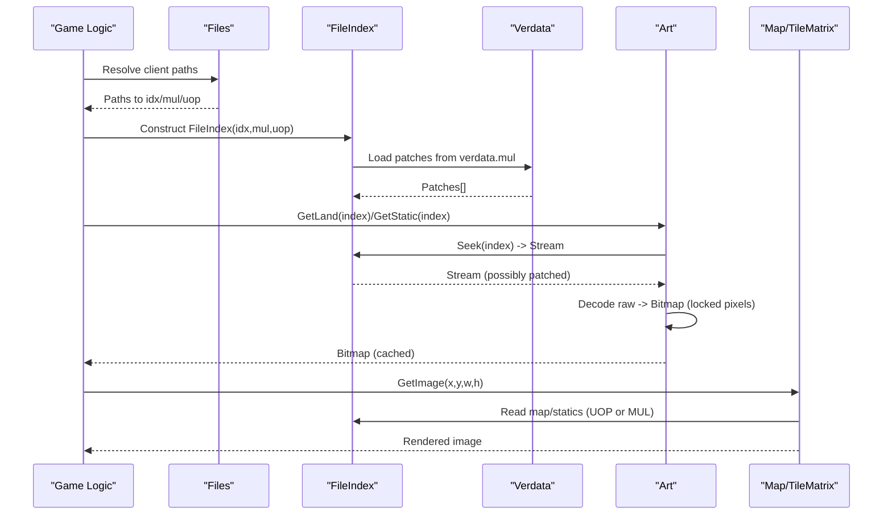
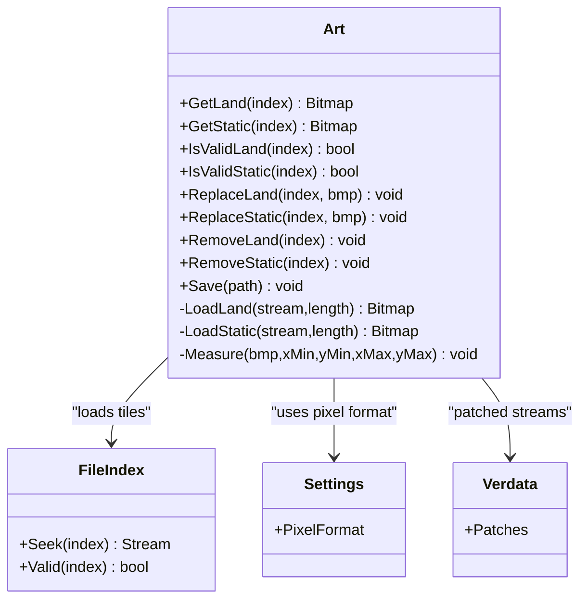
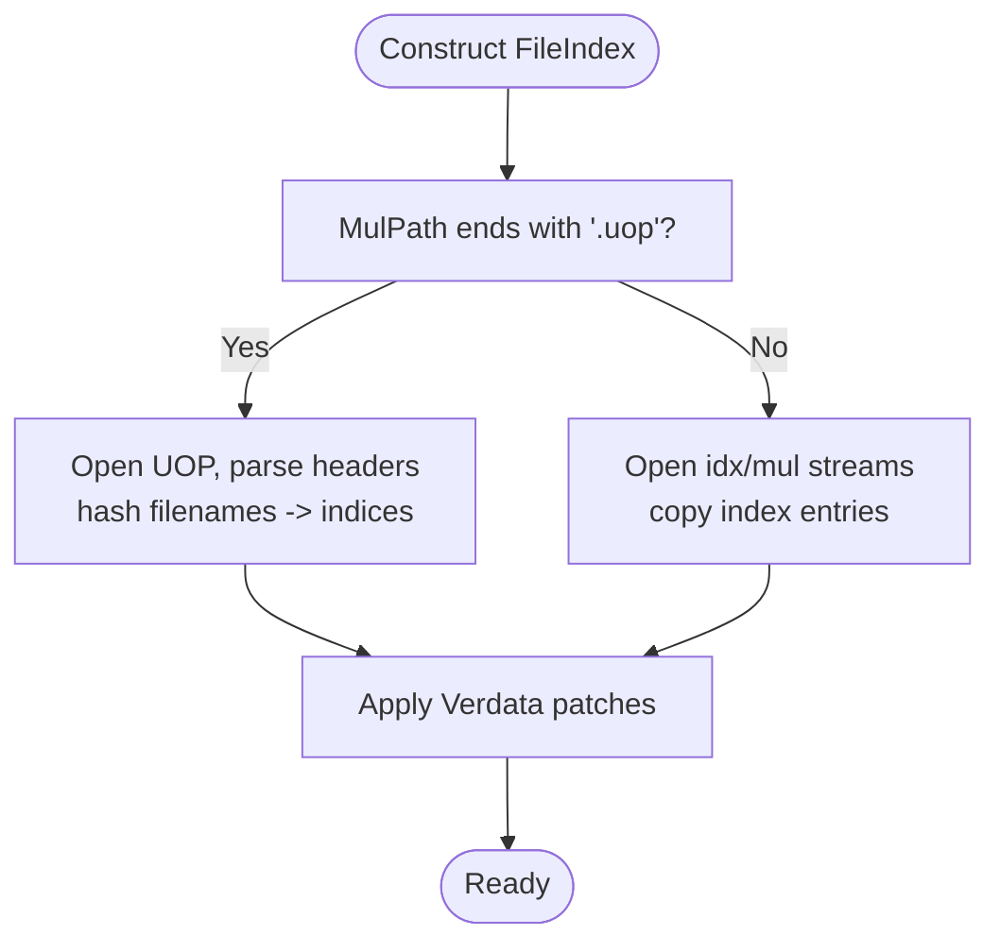
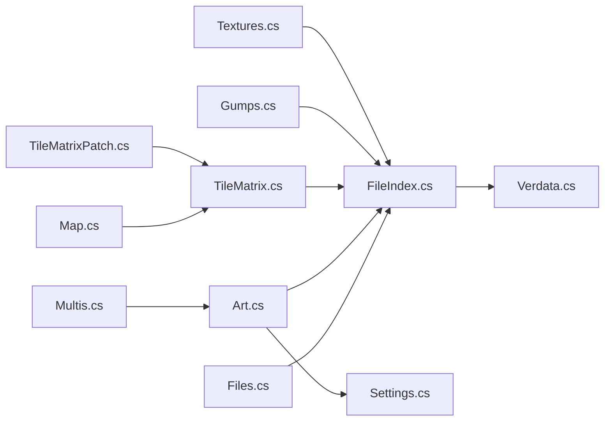

# Asset Extraction and Management

<cite>
**Referenced Files in This Document**
- [Art.cs](file://Ultima/Art.cs)
- [FileIndex.cs](file://Ultima/FileIndex.cs)
- [Files.cs](file://Ultima/Files.cs)
- [Settings.cs](file://Ultima/Settings.cs)
- [Verdata.cs](file://Ultima/Verdata.cs)
- [TileData.cs](file://Ultima/TileData.cs)
- [TileMatrix.cs](file://Ultima/TileMatrix.cs)
- [Map.cs](file://Ultima/Map.cs)
- [Multis.cs](file://Ultima/Multis.cs)
- [Gumps.cs](file://Ultima/Gumps.cs)
- [Textures.cs](file://Ultima/Textures.cs)
- [Client.cs](file://Ultima/Client.cs)
- [TileMatrixPatch.cs](file://Server/TileMatrixPatch.cs)
</cite>

## Table of Contents
1. [Introduction](#introduction)
2. [Project Structure](#project-structure)
3. [Core Components](#core-components)
4. [Architecture Overview](#architecture-overview)
5. [Detailed Component Analysis](#detailed-component-analysis)
6. [Dependency Analysis](#dependency-analysis)
7. [Performance Considerations](#performance-considerations)
8. [Troubleshooting Guide](#troubleshooting-guide)
9. [Conclusion](#conclusion)
10. [Appendices](#appendices)

## Introduction
This document explains ServUO’s asset extraction and management system with a focus on client data handling and resource loading. It covers:
- The Art class for managing tile art resources (land and static tiles), including loading, caching, replacement, and validation.
- The FileIndex system for handling multiple file formats (MUL and UOP archives), checksum verification, and patch application.
- The asset loading workflow, including bitmap conversion, pixel format handling, and memory optimization.
- Practical examples of extracting, validating, and caching assets for optimal performance.
- The relationship between asset management and world rendering, spawn placement, and client compatibility across expansions.
- Common asset loading issues, corruption detection, and troubleshooting corrupted client files.
- Guidance on asset replacement, patching, and integrating custom content.

## Project Structure
ServUO organizes asset-related logic primarily under the Ultima namespace for client data and under Server for game logic and patches. Key areas:
- Ultima: FileIndex, Art, Files, Settings, Verdata, TileData, TileMatrix, Map, Multis, Gumps, Textures, Client.
- Server: TileMatrixPatch for applying map/static diffs.

**Diagram sources**
- [Art.cs](file://Ultima/Art.cs#L1-L120)
- [FileIndex.cs](file://Ultima/FileIndex.cs#L1-L120)
- [Files.cs](file://Ultima/Files.cs#L1-L120)
- [Settings.cs](file://Ultima/Settings.cs#L1-L15)
- [Verdata.cs](file://Ultima/Verdata.cs#L1-L92)
- [TileData.cs](file://Ultima/TileData.cs#L1-L120)
- [TileMatrix.cs](file://Ultima/TileMatrix.cs#L1-L120)
- [Map.cs](file://Ultima/Map.cs#L1-L120)
- [Multis.cs](file://Ultima/Multis.cs#L469-L532)
- [Gumps.cs](file://Ultima/Gumps.cs#L316-L378)
- [Textures.cs](file://Ultima/Textures.cs#L109-L168)
- [Client.cs](file://Ultima/Client.cs#L1-L120)
- [TileMatrixPatch.cs](file://Server/TileMatrixPatch.cs#L1-L58)

**Section sources**
- [Art.cs](file://Ultima/Art.cs#L1-L120)
- [FileIndex.cs](file://Ultima/FileIndex.cs#L1-L120)
- [Files.cs](file://Ultima/Files.cs#L1-L120)
- [Settings.cs](file://Ultima/Settings.cs#L1-L15)
- [Verdata.cs](file://Ultima/Verdata.cs#L1-L92)
- [TileData.cs](file://Ultima/TileData.cs#L1-L120)
- [TileMatrix.cs](file://Ultima/TileMatrix.cs#L1-L120)
- [Map.cs](file://Ultima/Map.cs#L1-L120)
- [Multis.cs](file://Ultima/Multis.cs#L469-L532)
- [Gumps.cs](file://Ultima/Gumps.cs#L316-L378)
- [Textures.cs](file://Ultima/Textures.cs#L109-L168)
- [Client.cs](file://Ultima/Client.cs#L1-L120)
- [TileMatrixPatch.cs](file://Server/TileMatrixPatch.cs#L1-L58)

## Core Components
- Art: Manages tile art resources (land and static), bitmap loading, caching, replacement, and checksum-based deduplication during export.
- FileIndex: Index and stream manager for MUL/UOP archives, including patch application via Verdata and UOP hash-based lookup.
- Files: Client data path resolution, registry-based discovery, hash file comparison, and global cache toggle.
- Settings: Pixel format constant selection for platform-specific rendering.
- Verdata: Loads patch entries from verdata.mul and provides streaming for patched assets.
- TileData: Defines land and item tile metadata and flags used by rendering and gameplay logic.
- TileMatrix/Map: Tile matrix abstraction and map rendering pipeline, including UOP map support and diffs.
- Multis/Gumps/Textures: Additional asset loaders for multi components, gump images, and texture maps.
- TileMatrixPatch: Applies map/static diffs from mapdif/stadif files to TileMatrix.

**Section sources**
- [Art.cs](file://Ultima/Art.cs#L1-L120)
- [FileIndex.cs](file://Ultima/FileIndex.cs#L1-L120)
- [Files.cs](file://Ultima/Files.cs#L1-L120)
- [Settings.cs](file://Ultima/Settings.cs#L1-L15)
- [Verdata.cs](file://Ultima/Verdata.cs#L1-L92)
- [TileData.cs](file://Ultima/TileData.cs#L1-L120)
- [TileMatrix.cs](file://Ultima/TileMatrix.cs#L1-L120)
- [Map.cs](file://Ultima/Map.cs#L1-L120)
- [Multis.cs](file://Ultima/Multis.cs#L469-L532)
- [Gumps.cs](file://Ultima/Gumps.cs#L316-L378)
- [Textures.cs](file://Ultima/Textures.cs#L109-L168)
- [TileMatrixPatch.cs](file://Server/TileMatrixPatch.cs#L1-L58)

## Architecture Overview
The asset pipeline connects client data files to runtime rendering and gameplay:
- Files resolves client installation paths and validates presence of required files.
- FileIndex loads index/streams for MUL/UOP archives and applies verdata patches.
- Art loads and caches tile bitmaps, converts raw streams to bitmaps, and supports replacement and export.
- TileMatrix and Map manage map tiles and statics, with UOP support and diff application.
- Rendering uses Settings.PixelFormat and locks/unlocks bitmaps for efficient pixel manipulation.

**Diagram sources**
- [Files.cs](file://Ultima/Files.cs#L93-L151)
- [FileIndex.cs](file://Ultima/FileIndex.cs#L141-L380)
- [Verdata.cs](file://Ultima/Verdata.cs#L40-L81)
- [Art.cs](file://Ultima/Art.cs#L232-L362)
- [Map.cs](file://Ultima/Map.cs#L135-L196)

## Detailed Component Analysis

### Art: Tile Art Management
Art encapsulates:
- Static and land tile loading with caching and removal flags.
- Replacement and removal APIs for custom content.
- Validation helpers for existence checks.
- Export routine with checksum-based deduplication to minimize output size.

Key behaviors:
- Uses FileIndex to locate and stream tile data.
- Converts raw streams to bitmaps using Settings.PixelFormat and locked pixel buffers for performance.
- Supports UOAHS mode detection and adjusted max item IDs.
- Deduplicates exported assets by computing SHA-256 checksums and reusing identical entries.

**Diagram sources**
- [Art.cs](file://Ultima/Art.cs#L13-L120)
- [FileIndex.cs](file://Ultima/FileIndex.cs#L17-L81)
- [Settings.cs](file://Ultima/Settings.cs#L7-L14)
- [Verdata.cs](file://Ultima/Verdata.cs#L28-L92)

**Section sources**
- [Art.cs](file://Ultima/Art.cs#L13-L120)
- [Art.cs](file://Ultima/Art.cs#L232-L362)
- [Art.cs](file://Ultima/Art.cs#L526-L572)
- [Art.cs](file://Ultima/Art.cs#L578-L779)
- [Art.cs](file://Ultima/Art.cs#L781-L837)

### FileIndex: Archive Index and Stream Manager
FileIndex manages:
- Index loading from MUL or UOP archives.
- UOP hash-based entry lookup and optional extra field parsing.
- Patch application via Verdata entries.
- Seeking to asset streams with patched vs. original distinction.

Highlights:
- Supports legacy MUL indexing and modern UOP indexing.
- Computes entry hashes using a custom hash function.
- Applies verdata patches by marking entries with a special length bit and redirecting to verdata stream.

**Diagram sources**
- [FileIndex.cs](file://Ultima/FileIndex.cs#L239-L336)
- [FileIndex.cs](file://Ultima/FileIndex.cs#L338-L380)
- [FileIndex.cs](file://Ultima/FileIndex.cs#L465-L554)
- [Verdata.cs](file://Ultima/Verdata.cs#L40-L81)

**Section sources**
- [FileIndex.cs](file://Ultima/FileIndex.cs#L17-L81)
- [FileIndex.cs](file://Ultima/FileIndex.cs#L141-L380)
- [FileIndex.cs](file://Ultima/FileIndex.cs#L465-L554)
- [Verdata.cs](file://Ultima/Verdata.cs#L40-L81)

### Files: Client Path Resolution and Hash Verification
Files provides:
- Registry-based discovery of client installation directories.
- Path mapping for required client files.
- Hash file comparison for verifying client integrity.
- Global cache toggle for asset loading.

Practical usage:
- LoadMulPath scans known client files and records their locations.
- CompareHashFile compares computed MD5 against stored hash files.
- CacheData controls whether decoded bitmaps are cached.

**Section sources**
- [Files.cs](file://Ultima/Files.cs#L93-L151)
- [Files.cs](file://Ultima/Files.cs#L309-L350)
- [Files.cs](file://Ultima/Files.cs#L357-L379)

### Settings: Pixel Format Selection
Settings defines the pixel format used for bitmaps:
- Platform-dependent choice between 16-bit RGB/ARGB formats.

Rendering implications:
- Ensures consistent pixel layout across platforms for locked/unlocked bitmaps.

**Section sources**
- [Settings.cs](file://Ultima/Settings.cs#L7-L14)

### Verdata: Patch Entries and Streaming
Verdata:
- Loads verdata.mul and parses patch entries.
- Provides a seekable stream for patched assets.
- Patches are applied by FileIndex when an entry’s length bit indicates a patch.

**Section sources**
- [Verdata.cs](file://Ultima/Verdata.cs#L40-L81)

### TileData: Tile Metadata and Flags
TileData defines:
- LandData and ItemData structures with flags and properties.
- Enumerated TileFlag flags used by gameplay logic (e.g., passability, transparency, bridge, container, etc.).

These flags influence rendering and movement logic.

**Section sources**
- [TileData.cs](file://Ultima/TileData.cs#L16-L120)
- [TileData.cs](file://Ultima/TileData.cs#L635-L800)

### TileMatrix and Map: UOP Support and Diff Application
TileMatrix:
- Handles map/statics loading from MUL or UOP.
- Maintains static and land tile arrays and supports diffs via TileMatrixPatch.

Map:
- Renders map tiles and optionally statics.
- Uses TileMatrix and supports UOP map formats.

**Section sources**
- [TileMatrix.cs](file://Ultima/TileMatrix.cs#L71-L155)
- [Map.cs](file://Ultima/Map.cs#L135-L196)
- [TileMatrixPatch.cs](file://Server/TileMatrixPatch.cs#L35-L58)

### Multis, Gumps, Textures: Additional Asset Loaders
- Multis: Renders multi components using Art.GetStatic and calculates screen-space offsets.
- Gumps: Loads gump images from gumpart.mul/gumpartlegacy.uop.
- Textures: Loads texture maps with optional extra dimension sizing.

**Section sources**
- [Multis.cs](file://Ultima/Multis.cs#L469-L532)
- [Gumps.cs](file://Ultima/Gumps.cs#L316-L378)
- [Textures.cs](file://Ultima/Textures.cs#L109-L168)

## Dependency Analysis
The following diagram shows key dependencies among asset management components:

**Diagram sources**
- [Files.cs](file://Ultima/Files.cs#L93-L151)
- [FileIndex.cs](file://Ultima/FileIndex.cs#L141-L380)
- [Verdata.cs](file://Ultima/Verdata.cs#L40-L81)
- [Art.cs](file://Ultima/Art.cs#L13-L120)
- [Settings.cs](file://Ultima/Settings.cs#L7-L14)
- [TileMatrix.cs](file://Ultima/TileMatrix.cs#L71-L155)
- [Map.cs](file://Ultima/Map.cs#L135-L196)
- [Multis.cs](file://Ultima/Multis.cs#L469-L532)
- [Gumps.cs](file://Ultima/Gumps.cs#L316-L378)
- [Textures.cs](file://Ultima/Textures.cs#L109-L168)
- [TileMatrixPatch.cs](file://Server/TileMatrixPatch.cs#L35-L58)

**Section sources**
- [Files.cs](file://Ultima/Files.cs#L93-L151)
- [FileIndex.cs](file://Ultima/FileIndex.cs#L141-L380)
- [Art.cs](file://Ultima/Art.cs#L13-L120)
- [TileMatrix.cs](file://Ultima/TileMatrix.cs#L71-L155)
- [Map.cs](file://Ultima/Map.cs#L135-L196)
- [Multis.cs](file://Ultima/Multis.cs#L469-L532)
- [Gumps.cs](file://Ultima/Gumps.cs#L316-L378)
- [Textures.cs](file://Ultima/Textures.cs#L109-L168)
- [TileMatrixPatch.cs](file://Server/TileMatrixPatch.cs#L35-L58)

## Performance Considerations
- Pixel format and locked bitmaps: Art uses Settings.PixelFormat and locks/unlocks bitmaps to avoid managed copies and reduce GC pressure.
- Streaming and buffering: Art reuses a shared stream buffer to decode raw tile data, minimizing allocations.
- Caching: Art caches decoded bitmaps and tracks removals to avoid repeated decoding.
- Deduplication on export: Art computes SHA-256 checksums and reuses identical entries to reduce output size.
- UOP vs MUL: UOP support enables incremental updates and avoids full re-indexing when only parts change.
- Verdata patches: Patched entries are redirected to verdata streams, avoiding redundant disk reads.

[No sources needed since this section provides general guidance]

## Troubleshooting Guide
Common issues and resolutions:
- Missing client files:
  - Verify Files.LoadMulPath detects required files. Use Files.SetMulPath to override paths.
  - Check Files.GetFilePath for specific files.
- Corrupted or mismatched client files:
  - Use Files.CompareHashFile to compare computed MD5 against stored hash files.
  - Use Files.CompareMD5 to verify a single file.
- Asset not loading:
  - Confirm FileIndex.Valid returns true for the index.
  - Check FileIndex.Seek returns a non-null stream and patched flag.
  - For Art, ensure IsValidLand/IsValidStatic return true and that cache is not marked removed.
- UOP vs MUL confusion:
  - Ensure FileIndex recognizes .uop vs .mul and applies UOP hash lookup accordingly.
- Rendering anomalies:
  - Verify Settings.PixelFormat matches expectations.
  - Ensure TileData flags align with intended gameplay behavior.

**Section sources**
- [Files.cs](file://Ultima/Files.cs#L309-L350)
- [Files.cs](file://Ultima/Files.cs#L357-L379)
- [FileIndex.cs](file://Ultima/FileIndex.cs#L83-L139)
- [Art.cs](file://Ultima/Art.cs#L164-L225)
- [Settings.cs](file://Ultima/Settings.cs#L7-L14)
- [TileData.cs](file://Ultima/TileData.cs#L635-L800)

## Conclusion
ServUO’s asset extraction and management system integrates robust archive handling (MUL/UOP), patch application (verdata), and efficient bitmap decoding with caching and checksum-based deduplication. The Art class centralizes tile art handling, while FileIndex and Verdata provide flexible access to client data. Together with TileMatrix/Map and TileMatrixPatch, the system supports world rendering, spawn placement, and compatibility across expansions. Proper use of Files for path resolution and integrity checks ensures reliable operation.

[No sources needed since this section summarizes without analyzing specific files]

## Appendices

### Asset Loading Workflow Example
- Resolve paths: Call Files.LoadMulPath and Files.GetFilePath for required files.
- Initialize index: Construct FileIndex with idx/mul/uop paths.
- Apply patches: Verdata patches are automatically applied by FileIndex.
- Load tiles:
  - Land: Art.GetLand(index) -> FileIndex.Seek -> decode -> cache.
  - Static: Art.GetStatic(index) -> FileIndex.Seek -> decode -> cache.
- Export tiles: Art.Save(path) computes checksums and writes deduplicated artidx/art.

**Section sources**
- [Files.cs](file://Ultima/Files.cs#L93-L151)
- [FileIndex.cs](file://Ultima/FileIndex.cs#L141-L380)
- [Art.cs](file://Ultima/Art.cs#L232-L362)
- [Art.cs](file://Ultima/Art.cs#L578-L779)

### Relationship to World Rendering and Spawns
- Rendering: Map.GetImage uses TileMatrix to draw tiles and optionally statics.
- Multis: Multis.cs renders multi components using Art.GetStatic.
- Tile flags: TileData flags inform movement and visibility logic.

**Section sources**
- [Map.cs](file://Ultima/Map.cs#L135-L196)
- [Multis.cs](file://Ultima/Multis.cs#L469-L532)
- [TileData.cs](file://Ultima/TileData.cs#L635-L800)

### Client Compatibility Across Expansions
- UOAHS detection: Art.IsUOAHS determines expanded capacity and max item IDs.
- UOP support: FileIndex supports UOP archives for newer clients.
- Patches: Verdata patches enable incremental updates without full re-indexing.

**Section sources**
- [Art.cs](file://Ultima/Art.cs#L58-L61)
- [FileIndex.cs](file://Ultima/FileIndex.cs#L239-L336)
- [Verdata.cs](file://Ultima/Verdata.cs#L40-L81)

### Asset Replacement and Patching
- Replace/remove tiles: Art.ReplaceLand/ReplaceStatic and RemoveLand/RemoveStatic.
- Apply diffs: TileMatrixPatch reads mapdif/stadif files and updates TileMatrix.
- Custom content: Use Art.Save to export modified assets with checksum reuse.

**Section sources**
- [Art.cs](file://Ultima/Art.cs#L104-L157)
- [Art.cs](file://Ultima/Art.cs#L578-L779)
- [TileMatrixPatch.cs](file://Server/TileMatrixPatch.cs#L35-L58)