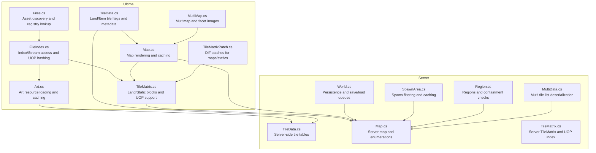
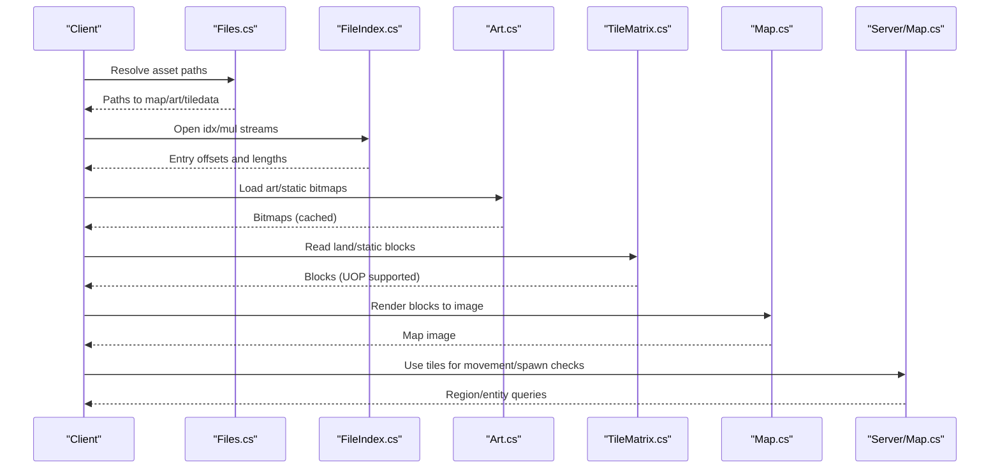
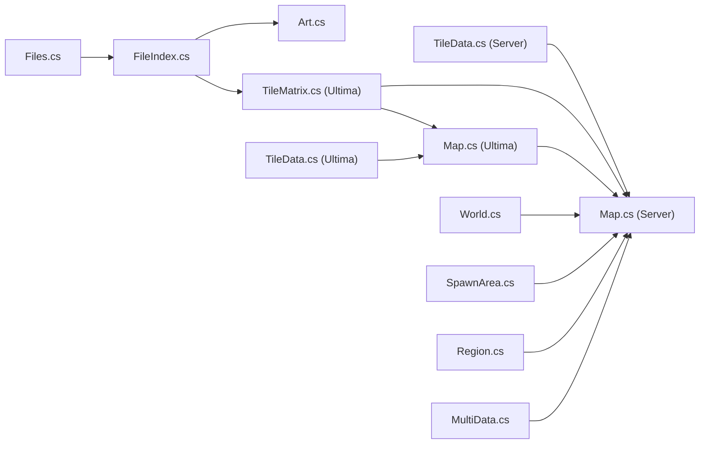
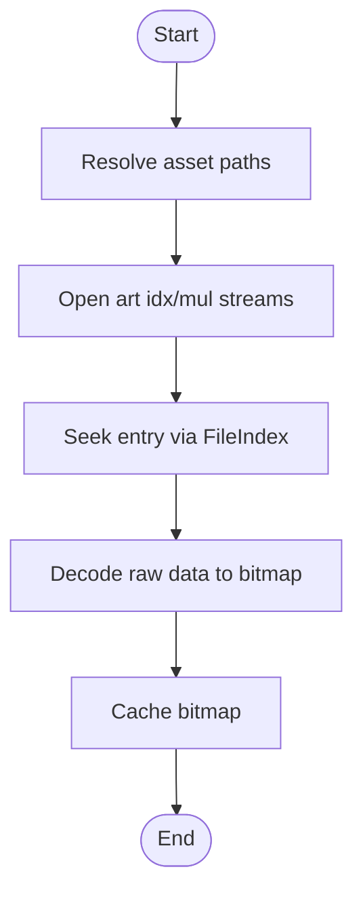
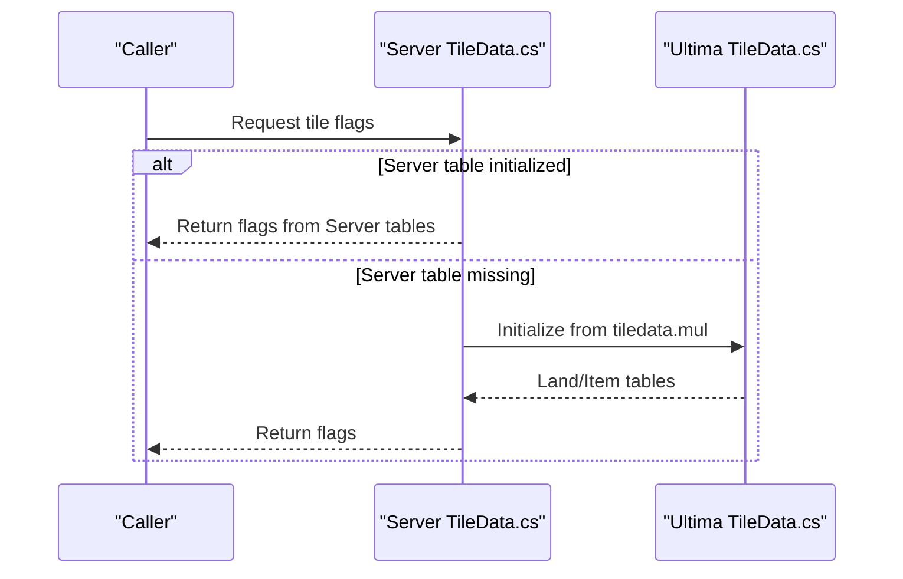
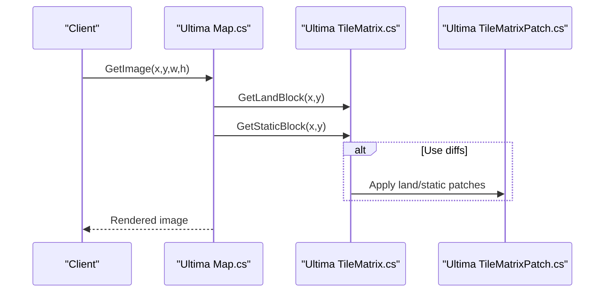

# Data Management

<cite>
**Referenced Files in This Document**
- [Files.cs](file://Ultima/Files.cs)
- [FileIndex.cs](file://Ultima/FileIndex.cs)
- [Art.cs](file://Ultima/Art.cs)
- [TileData.cs](file://Ultima/TileData.cs)
- [Map.cs](file://Ultima/Map.cs)
- [TileMatrix.cs](file://Ultima/TileMatrix.cs)
- [TileMatrixPatch.cs](file://Ultima/TileMatrixPatch.cs)
- [MultiMap.cs](file://Ultima/MultiMap.cs)
- [TileData.cs](file://Server/TileData.cs)
- [Map.cs](file://Server/Map.cs)
- [TileMatrix.cs](file://Server/TileMatrix.cs)
- [World.cs](file://Server/World.cs)
- [SpawnArea.cs](file://Server/SpawnArea.cs)
- [Region.cs](file://Server/Region.cs)
- [MultiData.cs](file://Server/MultiData.cs)
</cite>

## Table of Contents
1. [Introduction](#introduction)
2. [Project Structure](#project-structure)
3. [Core Components](#core-components)
4. [Architecture Overview](#architecture-overview)
5. [Detailed Component Analysis](#detailed-component-analysis)
6. [Dependency Analysis](#dependency-analysis)
7. [Performance Considerations](#performance-considerations)
8. [Troubleshooting Guide](#troubleshooting-guide)
9. [Conclusion](#conclusion)
10. [Appendices](#appendices)

## Introduction
This document explains ServUO’s data management system with a focus on asset extraction, tile management, and client data handling. It covers how the Ultima project locates and loads client assets (art, tile data, map data), how file indexing and UOP support work, and how the server integrates these assets into world management for rendering, spawning, and terrain handling. Concrete code paths illustrate asset loading workflows, tile data access patterns, and map rendering systems. The guide also addresses common data-loading issues, performance optimization strategies, and troubleshooting data corruption.

## Project Structure
ServUO separates client asset access and rendering logic in the Ultima project, while the Server project manages world entities, regions, and persistence. Key areas:
- Ultima: Asset discovery, file indexing, art and tile data loading, map rendering, and multi-map handling.
- Server: World persistence, entity enumeration, region system, spawn area computation, and integration with Ultima’s tile and map systems.

**Diagram sources**
- [Files.cs](file://Ultima/Files.cs#L1-L120)
- [FileIndex.cs](file://Ultima/FileIndex.cs#L1-L120)
- [Art.cs](file://Ultima/Art.cs#L1-L120)
- [TileData.cs](file://Ultima/TileData.cs#L1-L120)
- [Map.cs](file://Ultima/Map.cs#L1-L120)
- [TileMatrix.cs](file://Ultima/TileMatrix.cs#L1-L120)
- [TileMatrixPatch.cs](file://Ultima/TileMatrixPatch.cs#L1-L120)
- [MultiMap.cs](file://Ultima/MultiMap.cs#L1-L120)
- [TileData.cs](file://Server/TileData.cs#L1-L120)
- [Map.cs](file://Server/Map.cs#L1-L120)
- [TileMatrix.cs](file://Server/TileMatrix.cs#L1-L120)
- [World.cs](file://Server/World.cs#L1-L120)
- [SpawnArea.cs](file://Server/SpawnArea.cs#L1-L120)
- [Region.cs](file://Server/Region.cs#L1-L120)
- [MultiData.cs](file://Server/MultiData.cs#L154-L186)

**Section sources**
- [Files.cs](file://Ultima/Files.cs#L1-L120)
- [FileIndex.cs](file://Ultima/FileIndex.cs#L1-L120)
- [Art.cs](file://Ultima/Art.cs#L1-L120)
- [TileData.cs](file://Ultima/TileData.cs#L1-L120)
- [Map.cs](file://Ultima/Map.cs#L1-L120)
- [TileMatrix.cs](file://Ultima/TileMatrix.cs#L1-L120)
- [TileMatrixPatch.cs](file://Ultima/TileMatrixPatch.cs#L1-L120)
- [MultiMap.cs](file://Ultima/MultiMap.cs#L1-L120)
- [TileData.cs](file://Server/TileData.cs#L1-L120)
- [Map.cs](file://Server/Map.cs#L1-L120)
- [TileMatrix.cs](file://Server/TileMatrix.cs#L1-L120)
- [World.cs](file://Server/World.cs#L1-L120)
- [SpawnArea.cs](file://Server/SpawnArea.cs#L1-L120)
- [Region.cs](file://Server/Region.cs#L1-L120)
- [MultiData.cs](file://Server/MultiData.cs#L154-L186)

## Core Components
- Asset discovery and file resolution: The Files subsystem resolves client installation paths, validates presence of required MUL/UOP files, and supports optional hash verification and UOP indexing.
- File indexing and streaming: FileIndex encapsulates index/stream access, supports legacy MUL and UOP formats, and handles verdata patches.
- Art and tile data: Art loads and caches bitmap assets from art assets, while TileData defines and reads tile flags and metadata for land and items.
- Map rendering and blocks: TileMatrix reads land and static blocks, supports UOP map data, and applies diff patches. Map composes rendered blocks and caches results.
- Server integration: Server-side TileData and TileMatrix mirror and integrate with Ultima’s systems for entity/world management, persistence, and spawn filtering.

Concrete references:
- [Files.cs](file://Ultima/Files.cs#L1-L120)
- [FileIndex.cs](file://Ultima/FileIndex.cs#L1-L120)
- [Art.cs](file://Ultima/Art.cs#L1-L120)
- [TileData.cs](file://Ultima/TileData.cs#L1-L120)
- [Map.cs](file://Ultima/Map.cs#L1-L120)
- [TileMatrix.cs](file://Ultima/TileMatrix.cs#L1-L120)
- [TileMatrixPatch.cs](file://Ultima/TileMatrixPatch.cs#L1-L120)
- [TileData.cs](file://Server/TileData.cs#L1-L120)
- [TileMatrix.cs](file://Server/TileMatrix.cs#L1-L120)

**Section sources**
- [Files.cs](file://Ultima/Files.cs#L1-L120)
- [FileIndex.cs](file://Ultima/FileIndex.cs#L1-L120)
- [Art.cs](file://Ultima/Art.cs#L1-L120)
- [TileData.cs](file://Ultima/TileData.cs#L1-L120)
- [Map.cs](file://Ultima/Map.cs#L1-L120)
- [TileMatrix.cs](file://Ultima/TileMatrix.cs#L1-L120)
- [TileMatrixPatch.cs](file://Ultima/TileMatrixPatch.cs#L1-L120)
- [TileData.cs](file://Server/TileData.cs#L1-L120)
- [TileMatrix.cs](file://Server/TileMatrix.cs#L1-L120)

## Architecture Overview
The data pipeline connects client asset discovery to rendering and world management:
- Files locates and validates asset files.
- FileIndex opens streams and resolves entries, supporting UOP hashing and verdata patches.
- Art and TileData provide decoded assets and tile metadata.
- TileMatrix reads blocks and applies diffs; Map renders blocks to images.
- Server Map and TileMatrix integrate these assets for world operations, persistence, and spawn generation.

**Diagram sources**
- [Files.cs](file://Ultima/Files.cs#L1-L120)
- [FileIndex.cs](file://Ultima/FileIndex.cs#L1-L120)
- [Art.cs](file://Ultima/Art.cs#L1-L120)
- [TileMatrix.cs](file://Ultima/TileMatrix.cs#L1-L120)
- [Map.cs](file://Ultima/Map.cs#L1-L120)
- [Map.cs](file://Server/Map.cs#L1-L120)

## Detailed Component Analysis

### Asset Discovery and File Resolution
- Purpose: Locate client asset roots, enumerate known files, and resolve absolute paths. Supports registry lookup and UOP detection.
- Key behaviors:
  - Loads known asset filenames and checks existence.
  - Provides GetFilePath to resolve a filename to an absolute path.
  - Supports UOP map/static detection and size adjustments.
- Example paths:
  - [Files.cs](file://Ultima/Files.cs#L56-L120)
  - [Files.cs](file://Ultima/Files.cs#L169-L193)
  - [Files.cs](file://Ultima/Files.cs#L381-L409)

**Section sources**
- [Files.cs](file://Ultima/Files.cs#L56-L120)
- [Files.cs](file://Ultima/Files.cs#L169-L193)
- [Files.cs](file://Ultima/Files.cs#L381-L409)

### File Indexing and Streaming (MUL and UOP)
- Purpose: Manage index and data streams for map/static/art, including UOP hashing and verdata patches.
- Key behaviors:
  - Reads index files and maps entries to offsets/lengths.
  - Supports UOP files via hash-based entry lookup and offset recomposition.
  - Applies verdata patches to entries.
- Example paths:
  - [FileIndex.cs](file://Ultima/FileIndex.cs#L141-L210)
  - [FileIndex.cs](file://Ultima/FileIndex.cs#L232-L336)
  - [FileIndex.cs](file://Ultima/FileIndex.cs#L338-L463)
  - [FileIndex.cs](file://Ultima/FileIndex.cs#L465-L556)

**Section sources**
- [FileIndex.cs](file://Ultima/FileIndex.cs#L141-L210)
- [FileIndex.cs](file://Ultima/FileIndex.cs#L232-L336)
- [FileIndex.cs](file://Ultima/FileIndex.cs#L338-L463)
- [FileIndex.cs](file://Ultima/FileIndex.cs#L465-L556)

### Art Resources and Static/Land Loading
- Purpose: Load and cache art resources, validate entries, and convert raw data to bitmaps.
- Key behaviors:
  - Validates and loads land/static bitmaps from art assets.
  - Supports removal and replacement of art entries.
  - Uses FileIndex for seeking and verdata patching.
- Example paths:
  - [Art.cs](file://Ultima/Art.cs#L160-L225)
  - [Art.cs](file://Ultima/Art.cs#L227-L362)
  - [Art.cs](file://Ultima/Art.cs#L364-L420)

**Section sources**
- [Art.cs](file://Ultima/Art.cs#L160-L225)
- [Art.cs](file://Ultima/Art.cs#L227-L362)
- [Art.cs](file://Ultima/Art.cs#L364-L420)

### Tile Data: Flags and Metadata
- Purpose: Define and load tile flags and metadata for land and items.
- Key behaviors:
  - Reads tiledata.muls and initializes land/item tables.
  - Supports legacy and newer formats with different structures.
- Example paths:
  - [TileData.cs](file://Ultima/TileData.cs#L859-L944)
  - [TileData.cs](file://Ultima/TileData.cs#L946-L977)
  - [TileData.cs](file://Server/TileData.cs#L166-L331)

**Section sources**
- [TileData.cs](file://Ultima/TileData.cs#L859-L944)
- [TileData.cs](file://Ultima/TileData.cs#L946-L977)
- [TileData.cs](file://Server/TileData.cs#L166-L331)

### Map Rendering and Block Management
- Purpose: Render map tiles to images, manage block caching, and handle diffs.
- Key behaviors:
  - Renders blocks combining land and static tiles.
  - Caches rendered blocks per map and supports diff-based patches.
  - Handles UOP map data and offset translation.
- Example paths:
  - [Map.cs](file://Ultima/Map.cs#L338-L472)
  - [Map.cs](file://Ultima/Map.cs#L474-L569)
  - [TileMatrix.cs](file://Ultima/TileMatrix.cs#L533-L689)
  - [TileMatrixPatch.cs](file://Ultima/TileMatrixPatch.cs#L120-L203)
  - [TileMatrixPatch.cs](file://Ultima/TileMatrixPatch.cs#L205-L306)

**Section sources**
- [Map.cs](file://Ultima/Map.cs#L338-L472)
- [Map.cs](file://Ultima/Map.cs#L474-L569)
- [TileMatrix.cs](file://Ultima/TileMatrix.cs#L533-L689)
- [TileMatrixPatch.cs](file://Ultima/TileMatrixPatch.cs#L120-L203)
- [TileMatrixPatch.cs](file://Ultima/TileMatrixPatch.cs#L205-L306)

### Server Integration: World, Regions, and Spawn Areas
- Purpose: Persist and load entities, compute spawn areas, and integrate tile data for movement and placement.
- Key behaviors:
  - World manages save/load queues and binary persistence.
  - Server Map exposes enumerations and movement checks using tile data.
  - SpawnArea computes valid spawn points using tile flags and validators.
  - Region system defines containment and area coverage.
- Example paths:
  - [World.cs](file://Server/World.cs#L348-L590)
  - [World.cs](file://Server/World.cs#L599-L800)
  - [Map.cs](file://Server/Map.cs#L543-L609)
  - [Map.cs](file://Server/Map.cs#L609-L720)
  - [SpawnArea.cs](file://Server/SpawnArea.cs#L312-L460)
  - [Region.cs](file://Server/Region.cs#L123-L220)

**Section sources**
- [World.cs](file://Server/World.cs#L348-L590)
- [World.cs](file://Server/World.cs#L599-L800)
- [Map.cs](file://Server/Map.cs#L543-L609)
- [Map.cs](file://Server/Map.cs#L609-L720)
- [SpawnArea.cs](file://Server/SpawnArea.cs#L312-L460)
- [Region.cs](file://Server/Region.cs#L123-L220)

### Multi Tile Deserialization (Server)
- Purpose: Deserialize multi tile lists from multi.mul entries.
- Key behaviors:
  - Reads counts and entries, decompresses data when necessary.
  - Builds lists of multi tile entries for rendering and placement.
- Example paths:
  - [MultiData.cs](file://Server/MultiData.cs#L154-L186)

**Section sources**
- [MultiData.cs](file://Server/MultiData.cs#L154-L186)

## Dependency Analysis
The following diagram highlights key dependencies between asset loading and world management:

**Diagram sources**
- [Files.cs](file://Ultima/Files.cs#L1-L120)
- [FileIndex.cs](file://Ultima/FileIndex.cs#L1-L120)
- [Art.cs](file://Ultima/Art.cs#L1-L120)
- [TileMatrix.cs](file://Ultima/TileMatrix.cs#L1-L120)
- [Map.cs](file://Ultima/Map.cs#L1-L120)
- [TileData.cs](file://Ultima/TileData.cs#L1-L120)
- [TileData.cs](file://Server/TileData.cs#L1-L120)
- [Map.cs](file://Server/Map.cs#L1-L120)
- [World.cs](file://Server/World.cs#L1-L120)
- [SpawnArea.cs](file://Server/SpawnArea.cs#L1-L120)
- [Region.cs](file://Server/Region.cs#L1-L120)
- [MultiData.cs](file://Server/MultiData.cs#L154-L186)

**Section sources**
- [Files.cs](file://Ultima/Files.cs#L1-L120)
- [FileIndex.cs](file://Ultima/FileIndex.cs#L1-L120)
- [Art.cs](file://Ultima/Art.cs#L1-L120)
- [TileMatrix.cs](file://Ultima/TileMatrix.cs#L1-L120)
- [Map.cs](file://Ultima/Map.cs#L1-L120)
- [TileData.cs](file://Ultima/TileData.cs#L1-L120)
- [TileData.cs](file://Server/TileData.cs#L1-L120)
- [Map.cs](file://Server/Map.cs#L1-L120)
- [World.cs](file://Server/World.cs#L1-L120)
- [SpawnArea.cs](file://Server/SpawnArea.cs#L1-L120)
- [Region.cs](file://Server/Region.cs#L1-L120)
- [MultiData.cs](file://Server/MultiData.cs#L154-L186)

## Performance Considerations
- Caching:
  - Art caches decoded bitmaps to avoid repeated IO.
  - Map caches rendered blocks and supports preloading for hot regions.
- Streaming and UOP:
  - UOP map/static reading uses hashed entry lookups and offset recomposition; minimize repeated seeks by reusing streams.
- Tile data:
  - Server-side tile tables provide O(1) flag lookups for movement and spawn checks.
- Enumerations:
  - Server Map uses pooled enumerators and LINQ-based selectors to reduce allocations during frequent lookups.

[No sources needed since this section provides general guidance]

## Troubleshooting Guide
Common issues and resolutions:
- Missing tiledata.mul:
  - Symptom: Startup exception indicating missing tiledata.
  - Resolution: Configure data path and ensure tiledata.mul exists.
  - Reference: [TileData.cs](file://Server/TileData.cs#L316-L331)
- Invalid UOP files:
  - Symptom: Exceptions when reading UOP map/static files.
  - Resolution: Verify UOP signatures and hashes; re-check asset integrity.
  - References: [TileMatrix.cs](file://Server/TileMatrix.cs#L500-L533), [FileIndex.cs](file://Ultima/FileIndex.cs#L418-L512)
- Static/Land validation failures:
  - Symptom: Art.IsValid* returning false for entries.
  - Resolution: Confirm art indices and verify artLegacyMUL/uop presence.
  - Reference: [Art.cs](file://Ultima/Art.cs#L164-L202)
- Diff patches not applied:
  - Symptom: Outdated map/static visuals.
  - Resolution: Ensure mapdif/stadif files exist and are readable.
  - Reference: [TileMatrixPatch.cs](file://Ultima/TileMatrixPatch.cs#L93-L156)
- End-of-stream warnings:
  - Symptom: Console warnings for static/land EOS.
  - Resolution: Verify statics/map files integrity; rebuild indexes if necessary.
  - Reference: [TileMatrix.cs](file://Server/TileMatrix.cs#L488-L533)

**Section sources**
- [TileData.cs](file://Server/TileData.cs#L316-L331)
- [TileMatrix.cs](file://Server/TileMatrix.cs#L500-L533)
- [FileIndex.cs](file://Ultima/FileIndex.cs#L418-L512)
- [Art.cs](file://Ultima/Art.cs#L164-L202)
- [TileMatrixPatch.cs](file://Ultima/TileMatrixPatch.cs#L93-L156)
- [TileMatrix.cs](file://Server/TileMatrix.cs#L488-L533)

## Conclusion
ServUO’s data management system cleanly separates asset discovery and rendering (Ultima) from world management and persistence (Server). The integration leverages robust file indexing, UOP support, and caching to deliver efficient map rendering, accurate tile metadata, and reliable spawn/region computations. Administrators can maintain assets confidently by validating paths, ensuring UOP integrity, and leveraging built-in caching and diff patching.

[No sources needed since this section summarizes without analyzing specific files]

## Appendices

### Example Workflows

#### Asset Loading Workflow (Art)

**Diagram sources**
- [Files.cs](file://Ultima/Files.cs#L169-L193)
- [FileIndex.cs](file://Ultima/FileIndex.cs#L17-L81)
- [Art.cs](file://Ultima/Art.cs#L303-L362)

**Section sources**
- [Files.cs](file://Ultima/Files.cs#L169-L193)
- [FileIndex.cs](file://Ultima/FileIndex.cs#L17-L81)
- [Art.cs](file://Ultima/Art.cs#L303-L362)

#### Tile Data Access Pattern

**Diagram sources**
- [TileData.cs](file://Server/TileData.cs#L166-L331)
- [TileData.cs](file://Ultima/TileData.cs#L859-L944)

**Section sources**
- [TileData.cs](file://Server/TileData.cs#L166-L331)
- [TileData.cs](file://Ultima/TileData.cs#L859-L944)

#### Map Rendering System

**Diagram sources**
- [Map.cs](file://Ultima/Map.cs#L338-L472)
- [TileMatrix.cs](file://Ultima/TileMatrix.cs#L212-L275)
- [TileMatrixPatch.cs](file://Ultima/TileMatrixPatch.cs#L1-L120)

**Section sources**
- [Map.cs](file://Ultima/Map.cs#L338-L472)
- [TileMatrix.cs](file://Ultima/TileMatrix.cs#L212-L275)
- [TileMatrixPatch.cs](file://Ultima/TileMatrixPatch.cs#L1-L120)