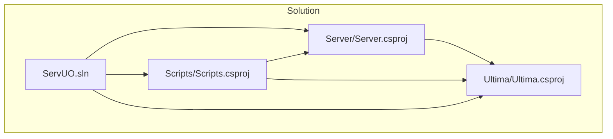
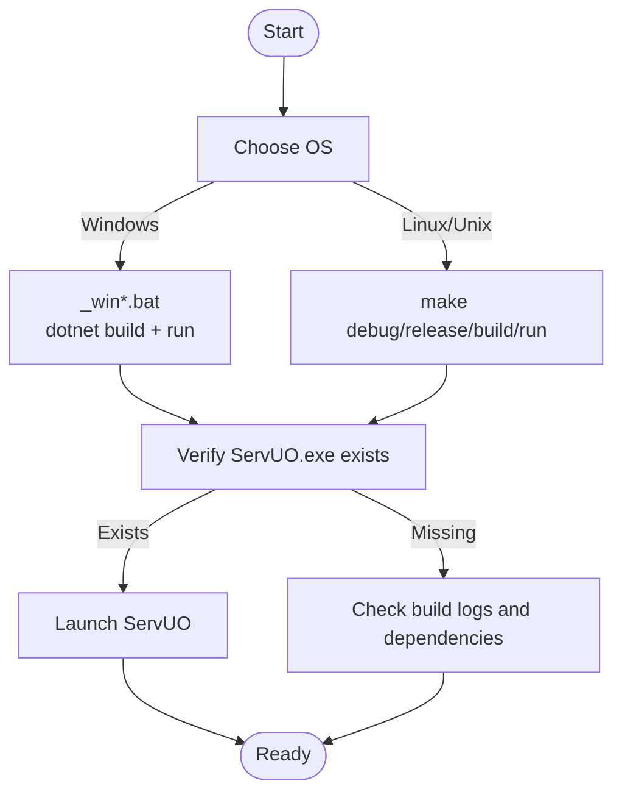
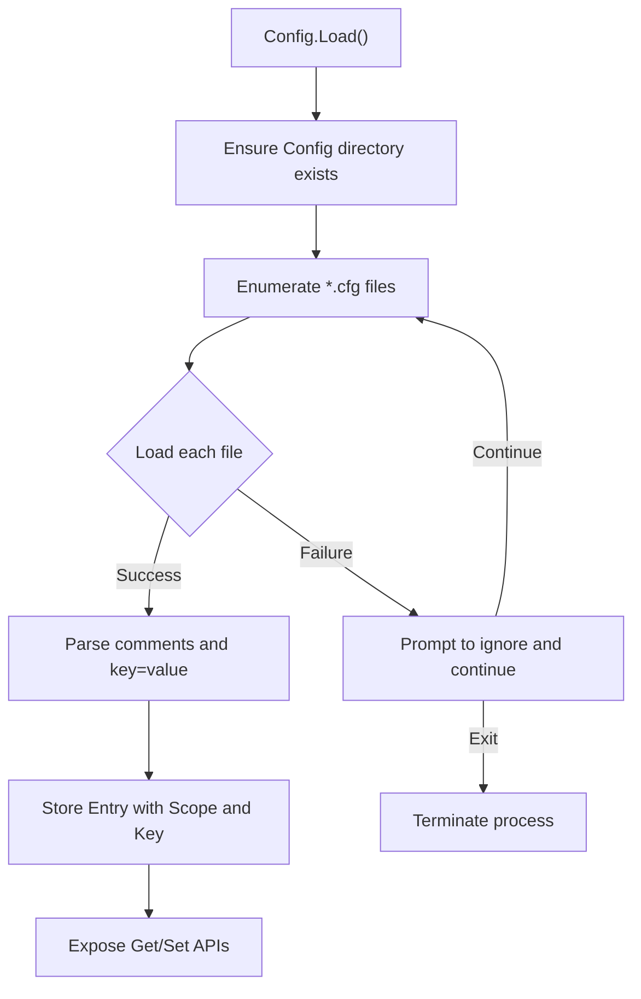
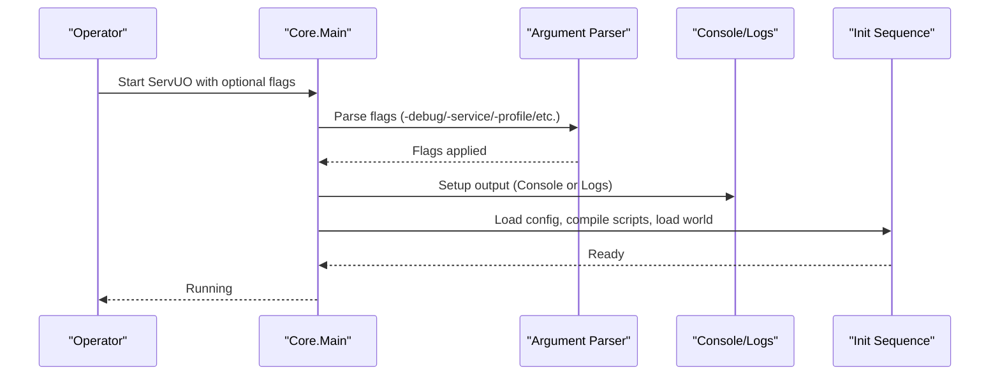
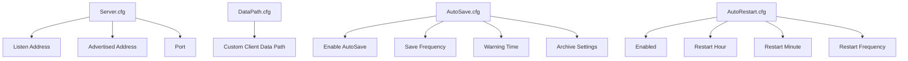
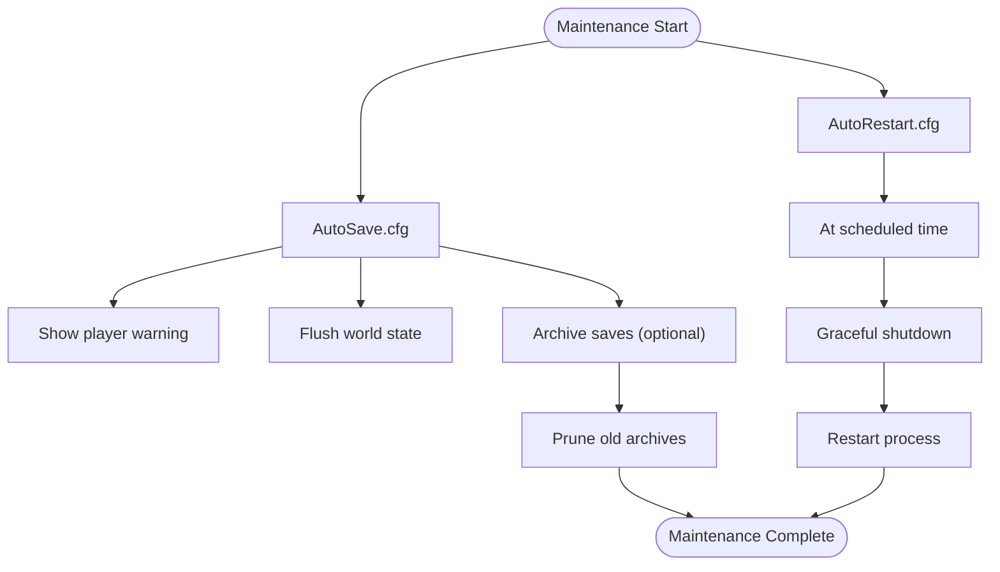

# Deployment and Operations

<cite>
**Referenced Files in This Document**
- [README.md](file://README.md)
- [makefile](file://makefile)
- [_winrelease.bat](file://_winrelease.bat)
- [_windebug.bat](file://_windebug.bat)
- [ServUO.exe.config](file://ServUO.exe.config)
- [ServUO.sln](file://ServUO.sln)
- [Server.csproj](file://Server/Server.csproj)
- [Scripts.csproj](file://Scripts/Scripts.csproj)
- [Ultima.csproj](file://Ultima/Ultime.csproj)
- [Server.cfg](file://Config/Server.cfg)
- [AutoSave.cfg](file://Config/AutoSave.cfg)
- [AutoRestart.cfg](file://Config/AutoRestart.cfg)
- [DataPath.cfg](file://Config/DataPath.cfg)
- [Main.cs](file://Server/Main.cs)
- [Config.cs](file://Server/Config.cs)
</cite>

## Table of Contents
1. [Introduction](#introduction)
2. [Project Structure](#project-structure)
3. [Core Components](#core-components)
4. [Architecture Overview](#architecture-overview)
5. [Detailed Component Analysis](#detailed-component-analysis)
6. [Dependency Analysis](#dependency-analysis)
7. [Performance Considerations](#performance-considerations)
8. [Troubleshooting Guide](#troubleshooting-guide)
9. [Conclusion](#conclusion)
10. [Appendices](#appendices)

## Introduction
This document provides comprehensive deployment and operations guidance for ServUO server management and maintenance across Windows, Linux, and Unix-like systems. It covers build processes, service configuration, startup parameters, monitoring and maintenance procedures, scaling and optimization, security considerations, and operational best practices. Guidance also includes automation patterns, backup and disaster recovery strategies, and cloud/high availability deployment considerations.

## Project Structure
ServUO is organized into three primary .NET projects:
- Server: The executable entrypoint and core runtime.
- Scripts: Game logic and scripts compiled into the server runtime.
- Ultima: Client asset access library.

Build artifacts target x64 and .NET Framework 4.8. The solution integrates batch and makefiles for cross-platform builds and runs.



**Diagram sources**
- [ServUO.sln](file://ServUO.sln#L1-L55)
- [Server.csproj](file://Server/Server.csproj#L1-L28)
- [Scripts.csproj](file://Scripts/Scripts.csproj#L1-L34)
- [Ultima.csproj](file://Ultima/Ultima.csproj#L1-L21)

**Section sources**
- [ServUO.sln](file://ServUO.sln#L1-L55)
- [README.md](file://README.md#L1-L60)

## Core Components
- Build and runtime targets:
  - x64 platform, .NET Framework 4.8.
  - Executable assembly name “ServUO”.
- Startup parameters:
  - Debug, service, profile, nocache, haltonwarning, noconsole, vb, help.
- Configuration subsystem:
  - Loads *.cfg files from a Config directory under the base directory.
  - Supports scoped keys and default overrides via leading marker.
- Networking and lifecycle:
  - Listens on configured address/port, handles graceful shutdown and crash events.

**Section sources**
- [Server.csproj](file://Server/Server.csproj#L1-L28)
- [Scripts.csproj](file://Scripts/Scripts.csproj#L1-L34)
- [Main.cs](file://Server/Main.cs#L329-L410)
- [Main.cs](file://Server/Main.cs#L330-L383)
- [Config.cs](file://Server/Config.cs#L220-L293)

## Architecture Overview
The server initializes configuration, compiles scripts, loads regions and world data, starts networking, and enters the main loop. Graceful shutdown and crash handling are integrated.

```mermaid
sequenceDiagram
participant OS as "Operating System"
participant Core as "Core.Main"
participant Config as "Config.Load()"
participant Scripts as "ScriptCompiler.Compile()"
participant World as "World.Load()"
participant Net as "MessagePump.Start()"
participant Loop as "Main Loop"
OS->>Core : Launch ServUO with arguments
Core->>Config : Load()
Config-->>Core : Config entries
Core->>Scripts : Compile(Debug, Cache)
Scripts-->>Core : Success/Failure
Core->>World : Load()
Core->>Net : Start()
Net-->>Core : Ready
Core->>Loop : Enter main loop
```

**Diagram sources**
- [Main.cs](file://Server/Main.cs#L520-L563)
- [Main.cs](file://Server/Main.cs#L566-L605)
- [Config.cs](file://Server/Config.cs#L220-L293)

## Detailed Component Analysis

### Build and Cross-Platform Deployment
- Windows:
  - Use provided batch scripts for Debug and Release builds and immediate startup.
- Linux/Unix:
  - Use makefile targets to build and run under Mono.
- Dependencies:
  - .NET SDK/Runtime 4.8 and Mono for non-Windows platforms.



**Diagram sources**
- [_winrelease.bat](file://_winrelease.bat#L1-L31)
- [_windebug.bat](file://_windebug.bat#L1-L31)
- [makefile](file://makefile#L1-L34)
- [README.md](file://README.md#L20-L41)

**Section sources**
- [README.md](file://README.md#L20-L41)
- [makefile](file://makefile#L1-L34)
- [_winrelease.bat](file://_winrelease.bat#L1-L31)
- [_windebug.bat](file://_windebug.bat#L1-L31)

### Configuration Management
- Config.Load enumerates *.cfg recursively under the Config directory, parses comments and key/value pairs, supports default overrides, and exposes typed getters/setters.
- Keys are case-insensitive and grouped by scope derived from file path segments.



**Diagram sources**
- [Config.cs](file://Server/Config.cs#L220-L293)
- [Config.cs](file://Server/Config.cs#L324-L409)
- [Config.cs](file://Server/Config.cs#L411-L464)

**Section sources**
- [Config.cs](file://Server/Config.cs#L220-L293)
- [Config.cs](file://Server/Config.cs#L324-L409)
- [Config.cs](file://Server/Config.cs#L411-L464)

### Server Lifecycle and Startup Parameters
- Core.Main parses arguments to enable debug/service/profile/nocache/haltonwarning/vb/noconsole modes.
- Service mode redirects console output to Logs/Console.log and disables interactive prompts.
- On Unix/Mono, runtime detection and environment-specific messages are printed.



**Diagram sources**
- [Main.cs](file://Server/Main.cs#L329-L410)
- [Main.cs](file://Server/Main.cs#L330-L383)
- [Main.cs](file://Server/Main.cs#L391-L410)

**Section sources**
- [Main.cs](file://Server/Main.cs#L329-L410)
- [Main.cs](file://Server/Main.cs#L330-L383)

### Network and Runtime Settings
- Server.cfg controls shard name, bind address, advertised address, and port.
- DataPath.cfg allows specifying a custom client data path (required on non-Windows).
- AutoSave.cfg governs automatic world saving cadence, warnings, and archival retention.
- AutoRestart.cfg enables scheduled restarts.



**Diagram sources**
- [Server.cfg](file://Config/Server.cfg#L1-L19)
- [DataPath.cfg](file://Config/DataPath.cfg#L1-L6)
- [AutoSave.cfg](file://Config/AutoSave.cfg#L1-L47)
- [AutoRestart.cfg](file://Config/AutoRestart.cfg#L1-L12)

**Section sources**
- [Server.cfg](file://Config/Server.cfg#L1-L19)
- [DataPath.cfg](file://Config/DataPath.cfg#L1-L6)
- [AutoSave.cfg](file://Config/AutoSave.cfg#L1-L47)
- [AutoRestart.cfg](file://Config/AutoRestart.cfg#L1-L12)

### Monitoring and Maintenance Procedures
- Automatic saving and archiving:
  - Configure AutoSave.cfg for periodic saves and optional asynchronous archiving with retention policies.
- Scheduled restarts:
  - Configure AutoRestart.cfg for daily restart windows and intervals.
- Log management:
  - Service mode writes console output to Logs/Console.log; monitor this file for errors and warnings.
- Backup and disaster recovery:
  - Use AutoSave.cfg archives and maintain offsite backups of world saves and configuration.



**Diagram sources**
- [AutoSave.cfg](file://Config/AutoSave.cfg#L1-L47)
- [AutoRestart.cfg](file://Config/AutoRestart.cfg#L1-L12)
- [Main.cs](file://Server/Main.cs#L297-L321)

**Section sources**
- [AutoSave.cfg](file://Config/AutoSave.cfg#L1-L47)
- [AutoRestart.cfg](file://Config/AutoRestart.cfg#L1-L12)
- [Main.cs](file://Server/Main.cs#L297-L321)

### Scaling and Resource Optimization
- CPU and GC:
  - Server GC mode detection and high-resolution timing support are reported at startup.
- Threading:
  - Dedicated timer thread and message pump threads manage scheduling and network I/O.
- Multi-processor:
  - Optimizations are applied when multiple processors or 64-bit runtime is detected.
- Recommendations:
  - Prefer Release builds for production.
  - Monitor cycles-per-second metrics and adjust world complexity accordingly.
  - Tune save frequency and warning times to balance safety and player experience.

**Section sources**
- [Main.cs](file://Server/Main.cs#L505-L520)
- [Main.cs](file://Server/Main.cs#L460-L470)
- [Main.cs](file://Server/Main.cs#L566-L605)

### Security Considerations
- Service mode:
  - Use -service flag when running as a Windows service to avoid interactive prompts and redirect output to Logs/Console.log.
- Client data path:
  - On non-Windows systems, set a custom client data path to ensure proper asset loading and reduce reliance on default OS locations.
- Runtime selection:
  - Ensure .NET Framework 4.8 and compatible Mono runtime are installed and up-to-date.

**Section sources**
- [Main.cs](file://Server/Main.cs#L391-L410)
- [DataPath.cfg](file://Config/DataPath.cfg#L1-L6)
- [README.md](file://README.md#L34-L41)

### Operational Best Practices
- Build and run:
  - Use make release for production on Linux/Unix; use _winrelease.bat on Windows.
- Configuration:
  - Edit Config/*.cfg files to match environment and shard policy.
- Monitoring:
  - Tail Logs/Console.log for errors and warnings; correlate with save/restart schedules.
- Automation:
  - Integrate make or batch scripts into CI/CD for reproducible builds and deployments.
- Disaster recovery:
  - Maintain offsite backups of world saves and configuration; test restore procedures regularly.

**Section sources**
- [README.md](file://README.md#L20-L41)
- [makefile](file://makefile#L1-L34)
- [_winrelease.bat](file://_winrelease.bat#L1-L31)

## Dependency Analysis
The solution defines layered dependencies: Server depends on Ultima; Scripts depends on both Server and Ultima. The solution file ties them together and sets shared configuration.


**Diagram sources**
- [ServUO.sln](file://ServUO.sln#L1-L55)
- [Server.csproj](file://Server/Server.csproj#L1-L28)
- [Scripts.csproj](file://Scripts/Scripts.csproj#L1-L34)
- [Ultima.csproj](file://Ultima/Ultima.csproj#L1-L21)

**Section sources**
- [ServUO.sln](file://ServUO.sln#L1-L55)
- [Server.csproj](file://Server/Server.csproj#L1-L28)
- [Scripts.csproj](file://Scripts/Scripts.csproj#L1-L34)
- [Ultima.csproj](file://Ultima/Ultima.csproj#L1-L21)

## Performance Considerations
- Build mode:
  - Release builds minimize overhead for production workloads.
- Runtime:
  - Server GC mode and high-resolution timing diagnostics are logged at startup; leverage these indicators to validate environment tuning.
- Save cadence:
  - Adjust AutoSave.cfg frequency and warning times to balance data safety and performance impact.
- Player impact:
  - Use warning times to notify players before heavy operations.

**Section sources**
- [Main.cs](file://Server/Main.cs#L505-L520)
- [AutoSave.cfg](file://Config/AutoSave.cfg#L1-L47)

## Troubleshooting Guide
- Build failures:
  - Ensure dependencies are installed (see README Linux/Unix dependencies).
  - Use make debug or _windebug.bat for verbose output during development.
- Script compilation errors:
  - Core.Main loops until scripts compile successfully; fix reported issues and retry.
- Service mode issues:
  - Verify Logs/Console.log exists and is writable when using -service.
- Configuration errors:
  - Config.Load reports invalid values and allows continuing or exiting; review and correct misformatted keys.

**Section sources**
- [README.md](file://README.md#L34-L41)
- [Main.cs](file://Server/Main.cs#L525-L542)
- [Main.cs](file://Server/Main.cs#L391-L410)
- [Config.cs](file://Server/Config.cs#L252-L293)

## Conclusion
ServUO’s deployment model centers on reproducible builds via make/batch scripts, robust configuration management, and clear operational controls for logging, saving, and restarting. By following the outlined procedures—choosing appropriate build modes, configuring network and save policies, monitoring logs, and maintaining backups—you can operate a reliable, scalable, and secure shard across Windows, Linux, and Unix environments.

## Appendices

### Appendix A: Production Deployment Checklist
- Install prerequisites (.NET Framework 4.8, Mono on non-Windows).
- Build Release (make release or _winrelease.bat).
- Configure Config/*.cfg (Server.cfg, AutoSave.cfg, AutoRestart.cfg, DataPath.cfg).
- Start with -service on Windows services or as a daemon on Unix-like systems.
- Monitor Logs/Console.log and automate offsite backups.

**Section sources**
- [README.md](file://README.md#L34-L41)
- [makefile](file://makefile#L1-L34)
- [_winrelease.bat](file://_winrelease.bat#L1-L31)
- [Server.cfg](file://Config/Server.cfg#L1-L19)
- [AutoSave.cfg](file://Config/AutoSave.cfg#L1-L47)
- [AutoRestart.cfg](file://Config/AutoRestart.cfg#L1-L12)
- [DataPath.cfg](file://Config/DataPath.cfg#L1-L6)
- [Main.cs](file://Server/Main.cs#L391-L410)