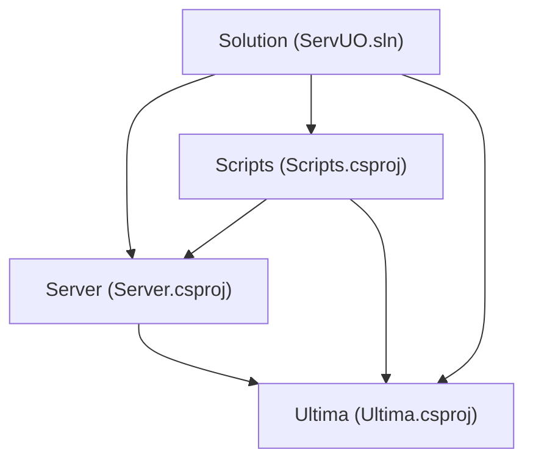
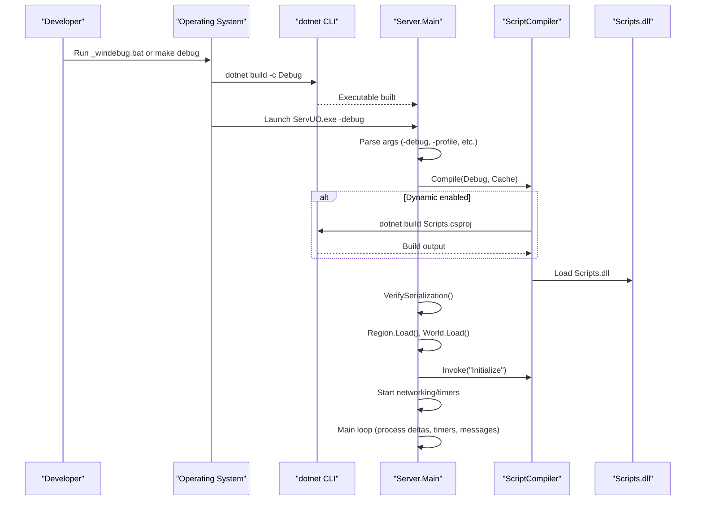
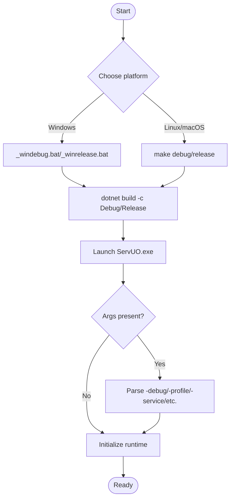
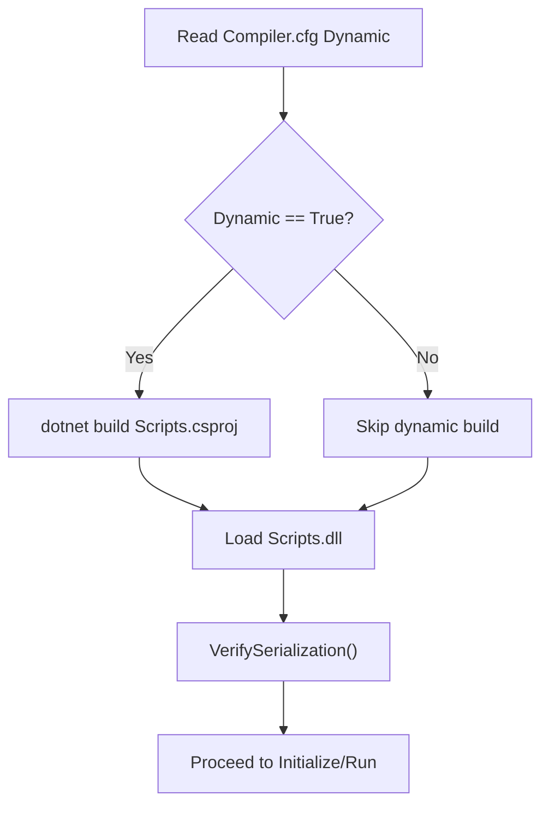
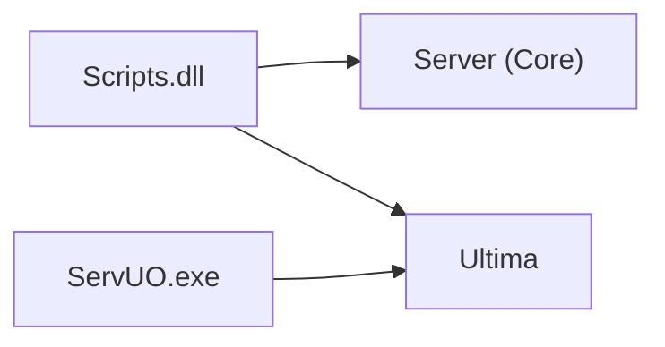

# Development Guide

<cite>
**Referenced Files in This Document**
- [README.md](file://README.md)
- [ServUO.sln](file://ServUO.sln)
- [Scripts.csproj](file://Scripts/Scripts.csproj)
- [Server.csproj](file://Server/Server.csproj)
- [_windebug.bat](file://_windebug.bat)
- [_winrelease.bat](file://_winrelease.bat)
- [makefile](file://makefile)
- [Server.cfg](file://Config/Server.cfg)
- [Compiler.cfg](file://Config/Compiler.cfg)
- [Main.cs](file://Server/Main.cs)
- [ScriptCompiler.cs](file://Server/ScriptCompiler.cs)
- [PlayerMobile.cs](file://Scripts/Mobiles/PlayerMobile.cs)
</cite>

## Table of Contents
1. [Introduction](#introduction)
2. [Project Structure](#project-structure)
3. [Core Components](#core-components)
4. [Architecture Overview](#architecture-overview)
5. [Detailed Component Analysis](#detailed-component-analysis)
6. [Dependency Analysis](#dependency-analysis)
7. [Performance Considerations](#performance-considerations)
8. [Troubleshooting Guide](#troubleshooting-guide)
9. [Conclusion](#conclusion)
10. [Appendices](#appendices)

## Introduction
This guide explains how to develop, build, and contribute content for ServUO. It covers the development environment setup, project build and run workflows, dynamic script compilation, hot-reloading behavior, debugging techniques, performance profiling, and best practices for organizing scripts and implementing systems such as entities, skills, and AI.

## Project Structure
ServUO is organized as a multi-project solution targeting .NET Framework 4.8:
- Server: The executable hosting the core runtime, networking, world loading, and lifecycle management.
- Scripts: The content DLL built from managed scripts and loaded dynamically at runtime.
- Ultima: Asset and data access library used by the server.

**Diagram sources**
- [ServUO.sln](file://ServUO.sln#L1-L55)
- [Server.csproj](file://Server/Server.csproj#L1-L28)
- [Scripts.csproj](file://Scripts/Scripts.csproj#L1-L34)
- [Ultima.csproj](file://Ultima/Ultime.csproj#L1-L21)

**Section sources**
- [ServUO.sln](file://ServUO.sln#L1-L55)
- [Server.csproj](file://Server/Server.csproj#L1-L28)
- [Scripts.csproj](file://Scripts/Scripts.csproj#L1-L34)

## Core Components
- Server executable entrypoint and runtime lifecycle:
  - Parses command-line arguments, initializes logging/console, loads configuration, compiles and invokes scripts, starts networking and timers, and runs the main loop.
- Script compilation and invocation:
  - Supports dynamic compilation of the Scripts project and assembly loading.
  - Provides type caches and reflection-based invocation of static methods across loaded assemblies.
- Configuration:
  - Server.cfg controls shard identity, bind address, advertised address, and port.
  - Compiler.cfg toggles dynamic script compilation behavior.

Key responsibilities:
- Build and run: Windows batch scripts and cross-platform makefile.
- Dynamic compilation: Scripts project is built via dotnet CLI and loaded at runtime.
- Hot-reload behavior: Dynamic compilation is controlled by configuration; recompilation occurs when enabled.

**Section sources**
- [Main.cs](file://Server/Main.cs#L329-L650)
- [ScriptCompiler.cs](file://Server/ScriptCompiler.cs#L18-L85)
- [Server.cfg](file://Config/Server.cfg#L1-L19)
- [Compiler.cfg](file://Config/Compiler.cfg#L1-L4)

## Architecture Overview
The runtime initializes, compiles scripts (if enabled), verifies serialization, loads regions/world, invokes initialization hooks, and enters the main event loop. Networking and timers are started, and periodic slices process deltas and queued work.

**Diagram sources**
- [_windebug.bat](file://_windebug.bat#L15-L30)
- [makefile](file://makefile#L16-L30)
- [Main.cs](file://Server/Main.cs#L329-L650)
- [ScriptCompiler.cs](file://Server/ScriptCompiler.cs#L18-L85)

## Detailed Component Analysis

### Build and Run Workflow
- Windows:
  - Use _windebug.bat for development builds with embedded debug symbols and optional debugger attachment.
  - Use _winrelease.bat for production builds.
- Cross-platform:
  - make debug builds and runs under Mono with -debug.
  - make release builds without debug symbols.

**Diagram sources**
- [_windebug.bat](file://_windebug.bat#L15-L30)
- [_winrelease.bat](file://_winrelease.bat#L15-L30)
- [makefile](file://makefile#L16-L30)
- [Main.cs](file://Server/Main.cs#L329-L410)

**Section sources**
- [README.md](file://README.md#L20-L32)
- [_windebug.bat](file://_windebug.bat#L15-L30)
- [_winrelease.bat](file://_winrelease.bat#L15-L30)
- [makefile](file://makefile#L16-L30)
- [Main.cs](file://Server/Main.cs#L329-L410)

### Dynamic Script Compilation and Hot-Reload Behavior
- Dynamic compilation is controlled by Compiler.cfg and exposed via ScriptCompiler.Dynamic.
- When enabled, the core triggers a dotnet build of Scripts.csproj and loads Scripts.dll.
- The core verifies serialization across all loaded assemblies after compilation.

**Diagram sources**
- [Compiler.cfg](file://Config/Compiler.cfg#L1-L4)
- [ScriptCompiler.cs](file://Server/ScriptCompiler.cs#L18-L85)
- [Main.cs](file://Server/Main.cs#L525-L542)

**Section sources**
- [Compiler.cfg](file://Config/Compiler.cfg#L1-L4)
- [ScriptCompiler.cs](file://Server/ScriptCompiler.cs#L18-L85)
- [Main.cs](file://Server/Main.cs#L525-L542)

### Configuration Management
- Server.cfg defines shard name, listening interface, advertised address, and port.
- Command-line arguments influence runtime behavior (debug, service, profile, etc.).

Practical steps:
- Edit Server.cfg to set shard name, bind address, advertised address, and port.
- Pass -debug to enable verbose runtime output and extended diagnostics.
- Pass -profile to enable profiling for packets, timers, and maintenance diagnostics.

**Section sources**
- [Server.cfg](file://Config/Server.cfg#L1-L19)
- [Main.cs](file://Server/Main.cs#L329-L410)

### Script Organization and Code Structure
- Scripts are compiled into a single library (Scripts.dll) and loaded at runtime.
- The Scripts project references Server and Ultima projects, enabling access to core APIs and assets.
- Best practice:
  - Keep scripts modular by feature folders (e.g., Scripts/Mobiles, Scripts/Items).
  - Use partial classes for large entities (e.g., PlayerMobile partial class).
  - Ensure all serializable types implement proper serialization constructors and methods.

Example reference:
- PlayerMobile demonstrates extensive partial organization and numerous subsystem integrations.

**Section sources**
- [Scripts.csproj](file://Scripts/Scripts.csproj#L24-L34)
- [PlayerMobile.cs](file://Scripts/Mobiles/PlayerMobile.cs#L1-L120)

### Common Development Scenarios

#### Entity Creation (Mobiles and Items)
- Implement serialization constructors and methods for all new types.
- Use type aliases and caches for efficient lookup.
- Integrate with world loading and region systems.

References:
- Serialization verification and type discovery are handled by the core after script compilation.

**Section sources**
- [ScriptCompiler.cs](file://Server/ScriptCompiler.cs#L63-L85)
- [Main.cs](file://Server/Main.cs#L630-L744)

#### Skill Implementation
- Skills are implemented as separate modules under Scripts/Skills.
- Follow the established pattern for skill handlers and integrate with PlayerMobile and relevant engines.

Note: Specific skill files are located under Scripts/Skills; adopt the existing patterns for new skills.

#### AI Behavior Development
- AI logic resides under Scripts/Mobiles/AI.
- Use existing AI framework patterns and ensure proper integration with movement, targeting, and combat systems.

Note: AI-related files are located under Scripts/Mobiles/AI; reuse established base classes and patterns.

### Debugging Techniques
- Attach a debugger:
  - Windows: run _windebug.bat to build and launch with -debug.
  - Linux/macOS: make debug to build and run under Mono with -debug.
- Profiling:
  - Pass -profile to enable profiling for packets, timers, and maintenance diagnostics.
- Logging:
  - Use console output and logs; on Windows service mode, logs are redirected to Logs/Console.log.

**Section sources**
- [_windebug.bat](file://_windebug.bat#L15-L30)
- [makefile](file://makefile#L16-L30)
- [Main.cs](file://Server/Main.cs#L329-L410)

### Testing Methodologies
- Unit-style testing is not explicitly provided in the repository; rely on:
  - Iterative server runs with -debug and -profile.
  - Manual QA cycles in-game.
  - Logging and crash reporting via the core’s unhandled exception handler.

**Section sources**
- [Main.cs](file://Server/Main.cs#L183-L233)

## Dependency Analysis
The Scripts project depends on Server and Ultima. The Server executable depends on Ultima. The solution configuration sets Debug/Release platforms and constants for ServUO builds.

**Diagram sources**
- [Scripts.csproj](file://Scripts/Scripts.csproj#L24-L34)
- [Server.csproj](file://Server/Server.csproj#L25-L28)

**Section sources**
- [ServUO.sln](file://ServUO.sln#L20-L33)
- [Scripts.csproj](file://Scripts/Scripts.csproj#L24-L34)
- [Server.csproj](file://Server/Server.csproj#L25-L28)

## Performance Considerations
- Use -profile to collect diagnostics for packets, timers, and maintenance tasks.
- Monitor cycles per second and average CPS printed by the core.
- Keep scripts modular to reduce compile times and improve maintainability.
- Prefer efficient data structures and avoid excessive reflection at runtime.

[No sources needed since this section provides general guidance]

## Troubleshooting Guide
- Script compilation failures:
  - The core retries compilation until successful or the user cancels.
  - Use -debug to see extended output and fix errors iteratively.
- Serialization warnings:
  - The core verifies serialization constructors and methods; address warnings to ensure persistence compatibility.
- Service mode:
  - On Windows service mode, console output is redirected to Logs/Console.log.

**Section sources**
- [Main.cs](file://Server/Main.cs#L525-L542)
- [Main.cs](file://Server/Main.cs#L630-L744)

## Conclusion
This guide outlined the ServUO development workflow, build/run processes, dynamic script compilation, configuration, debugging, and best practices. By following the modular structure and leveraging the provided tools and configuration, developers can efficiently implement and iterate on content for ServUO.

[No sources needed since this section summarizes without analyzing specific files]

## Appendices

### Appendix A: Quick Setup Checklist
- Install prerequisites (see README for platform-specific dependencies).
- Configure Config/Server.cfg (name, listen, address, port).
- Build and run:
  - Windows: _windebug.bat or _winrelease.bat
  - Linux/macOS: make debug or make release
- Enable -debug for verbose output and -profile for diagnostics.

**Section sources**
- [README.md](file://README.md#L20-L32)
- [Server.cfg](file://Config/Server.cfg#L1-L19)