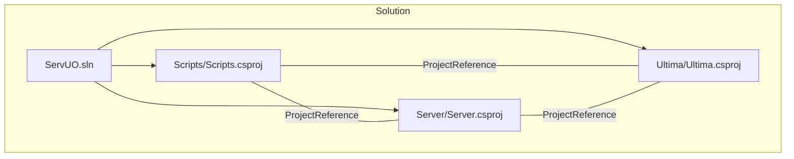
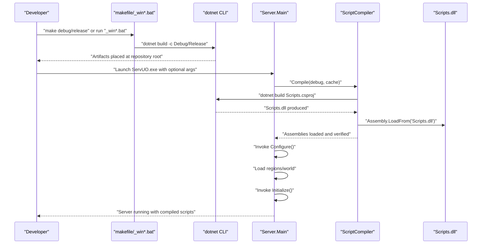
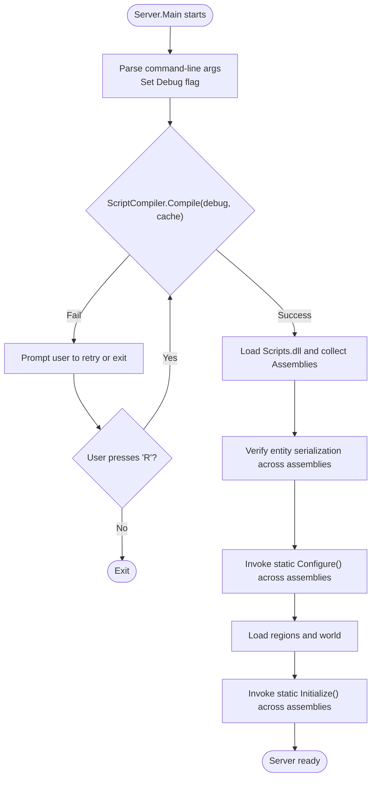
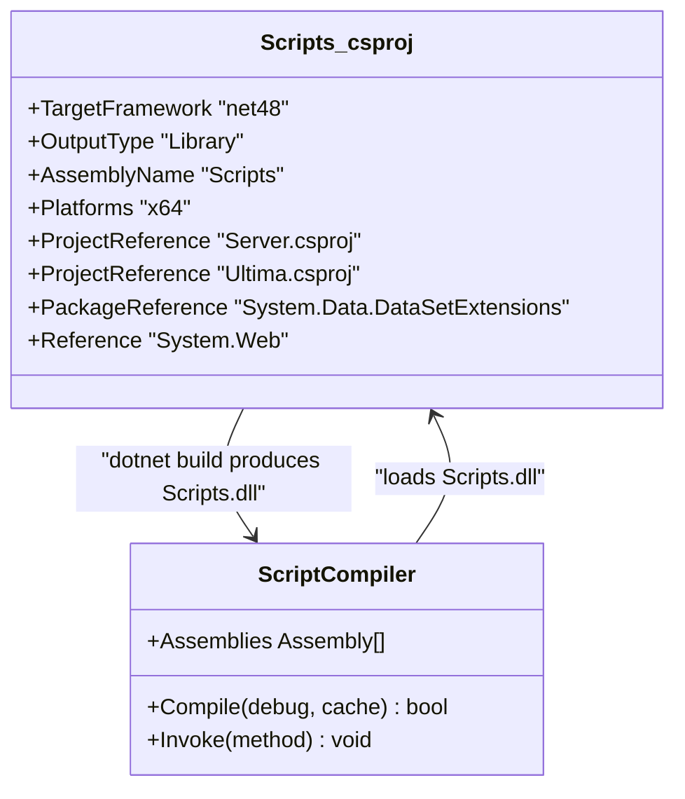
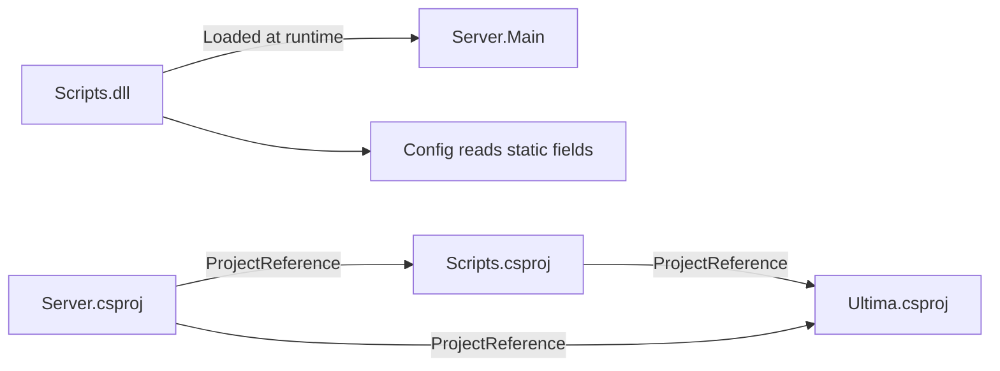

# Development Workflow

<cite>
**Referenced Files in This Document**
- [makefile](file://makefile)
- [ServUO.sln](file://ServUO.sln)
- [Scripts.csproj](file://Scripts/Scripts.csproj)
- [Server.csproj](file://Server/Server.csproj)
- [Ultima.csproj](file://Ultima/Ultima.csproj)
- [_windebug.bat](file://_windebug.bat)
- [_winrelease.bat](file://_winrelease.bat)
- [ServUO.exe.config](file://ServUO.exe.config)
- [README.md](file://README.md)
- [ScriptCompiler.cs](file://Server/ScriptCompiler.cs)
- [Main.cs](file://Server/Main.cs)
- [Config.cs](file://Server/Config.cs)
- [WeaponAbility.cs](file://Scripts/Abilities/WeaponAbility.cs)
</cite>

## Table of Contents
1. [Introduction](#introduction)
2. [Project Structure](#project-structure)
3. [Core Components](#core-components)
4. [Architecture Overview](#architecture-overview)
5. [Detailed Component Analysis](#detailed-component-analysis)
6. [Dependency Analysis](#dependency-analysis)
7. [Performance Considerations](#performance-considerations)
8. [Troubleshooting Guide](#troubleshooting-guide)
9. [Conclusion](#conclusion)
10. [Appendices](#appendices)

## Introduction
This document explains the complete ServUO development workflow from project setup to deployment. It covers the build system using dotnet CLI and MSBuild integration, the script compilation pipeline with dynamic compilation and assembly loading, development environment setup for Windows and Linux, and practical guidance for organizing scripts, configuring build targets, resolving dependencies, and addressing common issues. It also clarifies the role of Scripts.csproj in the compilation pipeline and how the server loads compiled scripts at runtime.

## Project Structure
ServUO is organized into three primary .NET projects:
- Scripts: Library project containing game logic, systems, and content.
- Server: Executable entry-point project that initializes the server and orchestrates script compilation and loading.
- Ultima: Shared library project providing client and tile data abstractions.

The solution file defines the project hierarchy and build configurations. Build automation is provided via a makefile for Linux and batch scripts for Windows.

**Diagram sources**
- [ServUO.sln](file://ServUO.sln#L1-L55)
- [Scripts.csproj](file://Scripts/Scripts.csproj#L1-L34)
- [Server.csproj](file://Server/Server.csproj#L1-L28)
- [Ultima.csproj](file://Ultima/Ultima.csproj#L1-L21)

**Section sources**
- [ServUO.sln](file://ServUO.sln#L1-L55)
- [Scripts.csproj](file://Scripts/Scripts.csproj#L1-L34)
- [Server.csproj](file://Server/Server.csproj#L1-L28)
- [Ultima.csproj](file://Ultima/Ultima.csproj#L1-L21)

## Core Components
- Build system:
  - Linux: makefile targets for debug and release builds, invoking dotnet build and running the executable under Mono.
  - Windows: batch scripts for debug and release builds, launching ServUO.exe with appropriate arguments.
- Compilation pipeline:
  - Server.Main orchestrates script compilation and invokes initialization routines.
  - ScriptCompiler dynamically compiles Scripts.csproj and loads Scripts.dll, then verifies entity serialization across all loaded assemblies.
- Project configuration:
  - Scripts.csproj sets target framework, platform, output path, constants, and project references to Server and Ultima.
  - Server.csproj sets the entry point and references Ultima.
  - Ultima.csproj is a shared library with platform-specific settings.

**Section sources**
- [makefile](file://makefile#L1-L34)
- [_windebug.bat](file://_windebug.bat#L1-L31)
- [_winrelease.bat](file://_winrelease.bat#L1-L31)
- [ScriptCompiler.cs](file://Server/ScriptCompiler.cs#L1-L85)
- [Main.cs](file://Server/Main.cs#L524-L574)
- [Scripts.csproj](file://Scripts/Scripts.csproj#L1-L34)
- [Server.csproj](file://Server/Server.csproj#L1-L28)
- [Ultima.csproj](file://Ultima/Ultima.csproj#L1-L21)

## Architecture Overview
The runtime compilation and loading flow integrates the build system with the server’s initialization sequence.

**Diagram sources**
- [makefile](file://makefile#L16-L31)
- [_windebug.bat](file://_windebug.bat#L15-L30)
- [_winrelease.bat](file://_winrelease.bat#L15-L30)
- [ScriptCompiler.cs](file://Server/ScriptCompiler.cs#L18-L66)
- [Main.cs](file://Server/Main.cs#L524-L574)

## Detailed Component Analysis

### Build System and Tooling
- Linux makefile:
  - Targets: all, build, run, clean, debug, release.
  - Behavior: runs dotnet build with selected configuration, then executes ServUO.exe under Mono with the corresponding argument.
- Windows batch scripts:
  - _windebug.bat: builds Debug, prints output, then launches ServUO.exe with -debug.
  - _winrelease.bat: builds Release, prints output, then launches ServUO.exe without arguments.
- Configuration:
  - ServUO.exe.config pins the runtime to .NET Framework 4.8.

Practical usage:
- Linux: make debug for development with extended output; make release for production.
- Windows: run _windebug.bat for development; run _winrelease.bat for production.

**Section sources**
- [makefile](file://makefile#L1-L34)
- [_windebug.bat](file://_windebug.bat#L1-L31)
- [_winrelease.bat](file://_winrelease.bat#L1-L31)
- [ServUO.exe.config](file://ServUO.exe.config#L1-L6)

### Script Compilation Pipeline and Assembly Loading
- Dynamic compilation:
  - ScriptCompiler.Compile enumerates Scripts.csproj under the Scripts directory and invokes dotnet build for it.
  - After compilation, Scripts.dll is loaded via Assembly.LoadFrom.
- Assembly scanning and invocation:
  - ScriptCompiler collects all loaded assemblies and exposes methods to discover and invoke static methods (e.g., Configure, Initialize) across types in those assemblies.
- Server orchestration:
  - Server.Main calls ScriptCompiler.Compile in a loop until successful, then invokes Configure and Initialize in sequence, followed by world and region loading.

**Diagram sources**
- [Main.cs](file://Server/Main.cs#L524-L574)
- [ScriptCompiler.cs](file://Server/ScriptCompiler.cs#L18-L85)

**Section sources**
- [ScriptCompiler.cs](file://Server/ScriptCompiler.cs#L18-L112)
- [Main.cs](file://Server/Main.cs#L524-L574)

### Scripts.csproj and the Compilation Pipeline
- Purpose:
  - Defines the Scripts project as a Library targeting net48, configured for x64, with Debug and Release output paths pointing to the repository root.
  - Adds project references to Server and Ultima so compiled scripts can access server and client data abstractions.
  - Includes a PackageReference for System.Data.DataSetExtensions and a Reference to System.Web.
- Relationship to pipeline:
  - The server’s ScriptCompiler dynamically builds Scripts.csproj and loads the resulting Scripts.dll, which contains all compiled scripts and systems.

**Diagram sources**
- [Scripts.csproj](file://Scripts/Scripts.csproj#L1-L34)
- [ScriptCompiler.cs](file://Server/ScriptCompiler.cs#L18-L66)

**Section sources**
- [Scripts.csproj](file://Scripts/Scripts.csproj#L1-L34)
- [ScriptCompiler.cs](file://Server/ScriptCompiler.cs#L18-L66)

### Development Environment Setup
- Windows:
  - Use Visual Studio to open ServUO.sln and build/run projects.
  - Launch via _windebug.bat or _winrelease.bat for quick iteration.
  - Attach a debugger to ServUO.exe when running in debug mode.
- Linux:
  - Install required dependencies (see README).
  - Use make debug for development and make release for production.
  - Optionally attach a debugger to the Mono process.
- Configuration:
  - ServUO.exe.config ensures the runtime targets .NET Framework 4.8.

**Section sources**
- [README.md](file://README.md#L20-L32)
- [_windebug.bat](file://_windebug.bat#L15-L30)
- [_winrelease.bat](file://_winrelease.bat#L15-L30)
- [makefile](file://makefile#L16-L31)
- [ServUO.exe.config](file://ServUO.exe.config#L1-L6)

### Script Organization, Namespaces, and File Placement
- Organization:
  - Scripts are grouped by functional areas (e.g., Scripts/Abilities, Scripts/Mobiles, Scripts/Items).
  - Scripts.csproj compiles all C# files under the Scripts directory into a single library.
- Namespaces and placement:
  - Example: Abilities/WeaponAbility.cs resides in the Server namespace and references server-side types.
  - Scripts are compiled into the Scripts assembly; runtime discovery relies on static methods (Configure, Initialize) and type caches.
- Recommendations:
  - Keep related scripts in subfolders mirroring gameplay domains (abilities, commands, quests, skills, etc.).
  - Maintain consistent namespaces aligned with the Server assembly to simplify references.

**Section sources**
- [WeaponAbility.cs](file://Scripts/Abilities/WeaponAbility.cs#L1-L20)

### Practical Examples
- Setting up a development project:
  - Open ServUO.sln in Visual Studio.
  - Build the solution in Debug|x64 to produce ServUO.exe and Scripts.dll in the repository root.
- Configuring build targets:
  - Use make debug or _windebug.bat for development builds with embedded debug symbols.
  - Use make release or _winrelease.bat for optimized production builds.
- Managing script dependencies:
  - Add project references in Scripts.csproj for new libraries or ensure referenced assemblies are copied to the output directory.
  - Resolve missing references by adding NuGet PackageReferences or ensuring external assemblies are present alongside ServUO.exe.

**Section sources**
- [ServUO.sln](file://ServUO.sln#L20-L28)
- [Scripts.csproj](file://Scripts/Scripts.csproj#L24-L34)
- [makefile](file://makefile#L16-L31)
- [_windebug.bat](file://_windebug.bat#L15-L30)
- [_winrelease.bat](file://_winrelease.bat#L15-L30)

## Dependency Analysis
- Project dependencies:
  - Scripts depends on Server and Ultima.
  - Server depends on Ultima.
- Runtime dependencies:
  - Scripts.dll is loaded at runtime after compilation.
  - Server reads configuration entries from types within loaded assemblies.

**Diagram sources**
- [Scripts.csproj](file://Scripts/Scripts.csproj#L24-L30)
- [Server.csproj](file://Server/Server.csproj#L25-L28)
- [Config.cs](file://Server/Config.cs#L1845-L1880)

**Section sources**
- [Scripts.csproj](file://Scripts/Scripts.csproj#L24-L30)
- [Server.csproj](file://Server/Server.csproj#L25-L28)
- [Config.cs](file://Server/Config.cs#L1845-L1880)

## Performance Considerations
- Compilation overhead:
  - Dynamic compilation occurs on server startup; keep Scripts.csproj minimal and avoid unnecessary dependencies to reduce build time.
- Assembly loading:
  - ScriptCompiler loads Scripts.dll and scans types; ensure static initialization methods are efficient.
- Runtime performance:
  - Use Release builds for production deployments.
  - Monitor server logs for warnings emitted during serialization verification.

[No sources needed since this section provides general guidance]

## Troubleshooting Guide
Common issues and resolutions:
- Missing references:
  - Symptom: Build fails due to unresolved assemblies.
  - Resolution: Add appropriate ProjectReference or PackageReference in Scripts.csproj; ensure referenced assemblies are present in the output directory.
- Compilation errors:
  - Symptom: ScriptCompiler.Compile returns false and prompts to retry.
  - Resolution: Fix compile-time errors in scripts; rebuild; confirm Scripts.dll is generated in the repository root.
- Runtime conflicts:
  - Symptom: Missing static methods (Configure, Initialize) or type resolution failures.
  - Resolution: Ensure scripts define required static methods; verify assembly loading order and that Scripts.dll is up-to-date.
- Debugging:
  - Windows: Attach the Visual Studio debugger to ServUO.exe when launched in debug mode.
  - Linux: Run under Mono and attach a debugger to the Mono process.

**Section sources**
- [Main.cs](file://Server/Main.cs#L524-L574)
- [ScriptCompiler.cs](file://Server/ScriptCompiler.cs#L18-L85)
- [_windebug.bat](file://_windebug.bat#L15-L30)
- [_winrelease.bat](file://_winrelease.bat#L15-L30)

## Conclusion
ServUO’s development workflow centers on a streamlined build and compilation pipeline: dotnet CLI builds the Scripts project, the server dynamically compiles scripts on startup, and loads the resulting assembly to initialize systems and entities. With Visual Studio and platform-specific scripts/batch files, developers can efficiently iterate on scripts, manage dependencies, and deploy production-ready servers.

[No sources needed since this section summarizes without analyzing specific files]

## Appendices

### Appendix A: Command Reference
- Linux:
  - make debug: Build and run in debug mode.
  - make release: Build and run in release mode.
  - make build: Build only.
  - make clean: Clean artifacts.
- Windows:
  - _windebug.bat: Build and run in debug mode.
  - _winrelease.bat: Build and run in release mode.

**Section sources**
- [makefile](file://makefile#L1-L34)
- [_windebug.bat](file://_windebug.bat#L1-L31)
- [_winrelease.bat](file://_winrelease.bat#L1-L31)