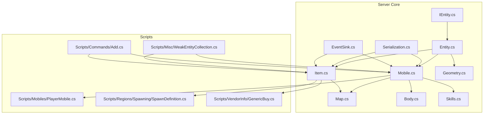
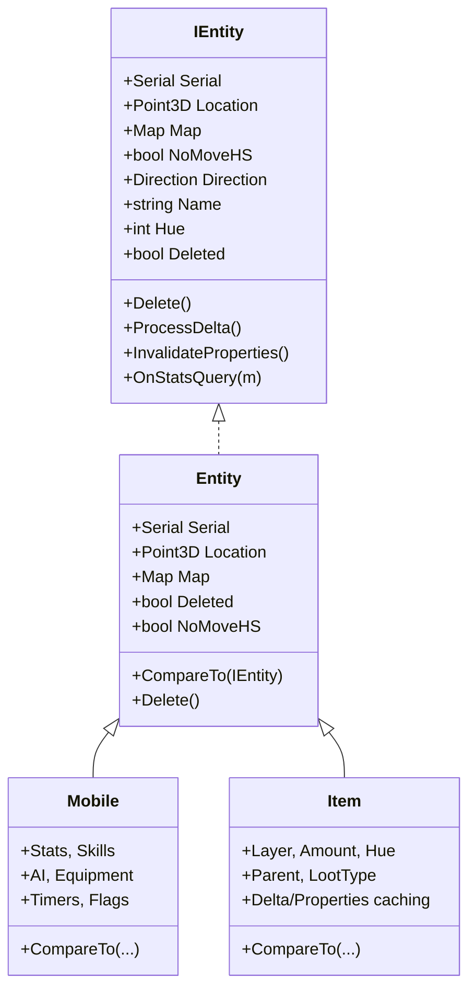
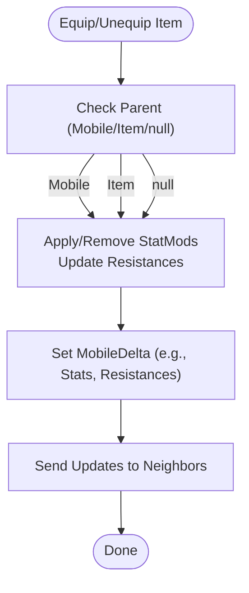
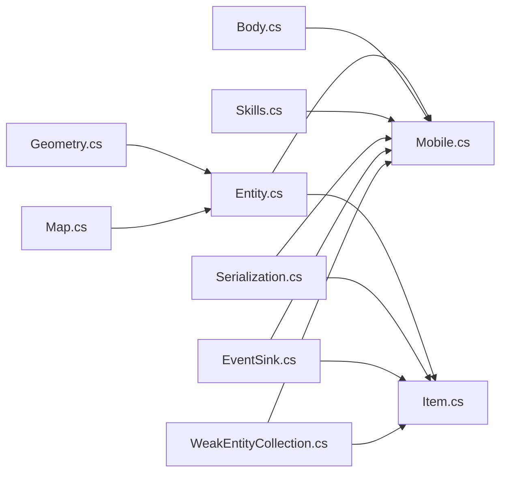

# Base Entity Classes

<cite>
**Referenced Files in This Document**
- [IEntity.cs](file://Server/IEntity.cs)
- [Entity.cs](file://Server/Entity.cs)
- [Mobile.cs](file://Server/Mobile.cs)
- [Item.cs](file://Server/Item.cs)
- [Map.cs](file://Server/Map.cs)
- [Body.cs](file://Server/Body.cs)
- [Skills.cs](file://Server/Skills.cs)
- [PlayerMobile.cs](file://Scripts/Mobiles/PlayerMobile.cs)
- [Geometry.cs](file://Server/Geometry.cs)
- [Serialization.cs](file://Server/Serialization.cs)
- [EventSink.cs](file://Server/EventSink.cs)
- [WeakEntityCollection.cs](file://Scripts/Misc/WeakEntityCollection.cs)
- [Add.cs](file://Scripts/Commands/Add.cs)
- [SpawnDefinition.cs](file://Scripts/Regions/Spawning/SpawnDefinition.cs)
- [GenericBuy.cs](file://Scripts/VendorInfo/GenericBuy.cs)
</cite>

## Table of Contents
1. [Introduction](#introduction)
2. [Project Structure](#project-structure)
3. [Core Components](#core-components)
4. [Architecture Overview](#architecture-overview)
5. [Detailed Component Analysis](#detailed-component-analysis)
6. [Dependency Analysis](#dependency-analysis)
7. [Performance Considerations](#performance-considerations)
8. [Troubleshooting Guide](#troubleshooting-guide)
9. [Conclusion](#conclusion)

## Introduction
This document explains ServUO’s base entity model with a focus on the inheritance hierarchy centered around the IEntity interface and the Entity base class. It covers shared properties such as Serial, Location, Map, Name, and Hue, and details how Mobile and Item extend these foundations. It also documents Mobile-specific concerns (stats, skills, AI hooks, equipment), Item-specific concerns (weight, layering, containers), polymorphic behavior, event handling, type safety, casting, and performance characteristics.

## Project Structure
ServUO organizes core entity infrastructure in the Server project and derives specialized types in Scripts. The base entity classes live alongside geometry, serialization, and world/map abstractions.

**Diagram sources**
- [IEntity.cs](file://Server/IEntity.cs#L1-L105)
- [Entity.cs](file://Server/Entity.cs#L1-L105)
- [Mobile.cs](file://Server/Mobile.cs#L1-L200)
- [Item.cs](file://Server/Item.cs#L1-L200)
- [Map.cs](file://Server/Map.cs#L699-L747)
- [Geometry.cs](file://Server/Geometry.cs#L214-L360)
- [Serialization.cs](file://Server/Serialization.cs#L1-L200)
- [EventSink.cs](file://Server/EventSink.cs#L1726-L2260)
- [PlayerMobile.cs](file://Scripts/Mobiles/PlayerMobile.cs#L1-L200)
- [Add.cs](file://Scripts/Commands/Add.cs#L310-L346)
- [SpawnDefinition.cs](file://Scripts/Regions/Spawning/SpawnDefinition.cs#L222-L279)
- [GenericBuy.cs](file://Scripts/VendorInfo/GenericBuy.cs#L285-L329)
- [WeakEntityCollection.cs](file://Scripts/Misc/WeakEntityCollection.cs#L118-L187)

**Section sources**
- [IEntity.cs](file://Server/IEntity.cs#L1-L105)
- [Entity.cs](file://Server/Entity.cs#L1-L105)
- [Mobile.cs](file://Server/Mobile.cs#L1-L200)
- [Item.cs](file://Server/Item.cs#L1-L200)
- [Map.cs](file://Server/Map.cs#L699-L747)
- [Geometry.cs](file://Server/Geometry.cs#L214-L360)
- [Serialization.cs](file://Server/Serialization.cs#L1-L200)
- [EventSink.cs](file://Server/EventSink.cs#L1726-L2260)
- [PlayerMobile.cs](file://Scripts/Mobiles/PlayerMobile.cs#L1-L200)
- [Add.cs](file://Scripts/Commands/Add.cs#L310-L346)
- [SpawnDefinition.cs](file://Scripts/Regions/Spawning/SpawnDefinition.cs#L222-L279)
- [GenericBuy.cs](file://Scripts/VendorInfo/GenericBuy.cs#L285-L329)
- [WeakEntityCollection.cs](file://Scripts/Misc/WeakEntityCollection.cs#L118-L187)

## Core Components
- IEntity: Defines the minimal contract for all entities: Serial identity, location, map, direction, hue, name, deletion lifecycle, and property invalidation hooks.
- Entity: Provides a default implementation of IEntity with shared state (Serial, Location, Map, Deleted, NoMoveHS) and comparison semantics based on Serial.
- Mobile: Extends IEntity and adds stats, skills, equipment slots, AI-related state, timers, guild, and numerous behavioral flags. It also introduces handlers for skill checks, regeneration rates, and AOS status.
- Item: Extends IEntity and adds item-specific fields (hue, amount, layer, parent, loot type, light type, direction) and delta/property caching for network efficiency.

Key shared properties:
- Serial: Unique identifier used for sorting and equality comparisons.
- Location: Point3D position with X/Y/Z accessors.
- Map: Containing map reference.
- Name/Hue: Visual/name metadata.
- Deleted: Lifecycle flag to mark removal.

**Section sources**
- [IEntity.cs](file://Server/IEntity.cs#L1-L105)
- [Entity.cs](file://Server/Entity.cs#L1-L105)
- [Mobile.cs](file://Server/Mobile.cs#L531-L620)
- [Item.cs](file://Server/Item.cs#L674-L760)
- [Geometry.cs](file://Server/Geometry.cs#L214-L360)

## Architecture Overview
The entity system centers on a common interface and base class, with Mobile and Item specializing for living and object behaviors respectively. Both derive from Entity and implement IEntity. Map exposes spatial enumeration helpers, and Geometry defines Point3D. Serialization supports persistence of entities. EventSink exposes global events for gameplay hooks.

**Diagram sources**
- [IEntity.cs](file://Server/IEntity.cs#L1-L105)
- [Entity.cs](file://Server/Entity.cs#L1-L105)
- [Mobile.cs](file://Server/Mobile.cs#L531-L620)
- [Item.cs](file://Server/Item.cs#L674-L760)

## Detailed Component Analysis

### IEntity and Entity
- Contract: All entities expose Serial, Location, Map, Direction, Hue, Name, Deleted, plus lifecycle and property invalidation hooks.
- Implementation: Entity stores Serial, Location, Map, Deleted, NoMoveHS, and provides CompareTo over Serial for deterministic ordering and Delete to tombstone the entity.

Polymorphic behavior:
- Sorting and equality rely on Serial via CompareTo.
- Delete sets Deleted and clears Location/Map to prevent dangling references.

**Section sources**
- [IEntity.cs](file://Server/IEntity.cs#L1-L105)
- [Entity.cs](file://Server/Entity.cs#L1-L105)

### Mobile
Mobile extends Entity and implements a broad set of capabilities:
- Identity and appearance: Serial, Location, Map, Direction, Hue, Name, Body.
- Stats and skills: Hits/Stam/Mana, Str/Dex/Int, Fame/Karma, Stat caps, Skills collection, stat mods, resistance mods.
- Equipment and timers: Equipment list, spell/target/prompt/context menu, combat timers, stat regen handlers, fatigue handler.
- AI and state: Combatant tracking, aggressor lists, warmode, hidden, blessed, flying, auto-page notify, and numerous timers.

Mobile-specific enums and flags:
- Direction, StatType, MobileDelta, ResistanceType, AccessLevel, AnimationType, DFAlgorithm.

MobileDelta enumerates change flags for efficient client updates.

**Section sources**
- [Mobile.cs](file://Server/Mobile.cs#L362-L495)
- [Mobile.cs](file://Server/Mobile.cs#L496-L620)
- [Mobile.cs](file://Server/Mobile.cs#L620-L800)
- [Body.cs](file://Server/Body.cs#L1-L200)
- [Skills.cs](file://Server/Skills.cs#L1-L200)

#### Mobile Equipment and Stats Flow

**Diagram sources**
- [Mobile.cs](file://Server/Mobile.cs#L620-L800)
- [Skills.cs](file://Server/Skills.cs#L1-L200)

### Item
Item extends Entity and adds:
- Item identity: ItemID, Hue, Amount, Direction, LightType.
- Spatial and containment: Location, Map, Layer, Parent (Mobile/Item/null), BounceInfo for movement.
- Loot and stacking: LootType, LastMovedTime, Amount.
- Performance: Delta flags, property list caching, world packet caches.

Layer enumeration defines equipment and container slot semantics.

**Section sources**
- [Item.cs](file://Server/Item.cs#L1-L200)
- [Item.cs](file://Server/Item.cs#L674-L800)

#### Item Container Behavior
Containers derive from Item and support nested storage. Typical operations include:
- Adding/removing items to/from parent containers.
- Propagating property invalidation and delta updates.
- Handling secure trade and bank boxes via Layer.

[No sources needed since this subsection summarizes container behavior conceptually]

### Polymorphism and Casting
- All entities implement IEntity and can be stored in collections typed to IEntity.
- Casting patterns:
  - Downcasting from IEntity to Mobile or Item requires runtime checks.
  - Upcasting from Mobile/Item to IEntity is implicit.
- Sorting and equality: CompareTo on Entity/Mobile/Item relies on Serial, ensuring stable ordering.

**Section sources**
- [IEntity.cs](file://Server/IEntity.cs#L1-L105)
- [Entity.cs](file://Server/Entity.cs#L1-L105)
- [Mobile.cs](file://Server/Mobile.cs#L531-L620)
- [Item.cs](file://Server/Item.cs#L724-L760)

### Event Handling Mechanisms
Global events are exposed via EventSink for actions like login, logout, item use, region enter, and property changes. Handlers can be subscribed to influence behavior (e.g., skill checks, regeneration rates).

**Section sources**
- [EventSink.cs](file://Server/EventSink.cs#L1726-L2260)

### Entity Instantiation Examples
Concrete examples of creating entities appear across scripts:
- Command Add constructs entities within a region and returns an IEntity.
- SpawnDefinition creates Mobile instances via Activator.
- Vendor GenericBuy returns IEntity instances for display/restock.

These demonstrate:
- Using Activator to instantiate types.
- Passing constructor arguments when needed.
- Returning to callers as IEntity for polymorphic handling.

**Section sources**
- [Add.cs](file://Scripts/Commands/Add.cs#L310-L346)
- [SpawnDefinition.cs](file://Scripts/Regions/Spawning/SpawnDefinition.cs#L222-L279)
- [GenericBuy.cs](file://Scripts/VendorInfo/GenericBuy.cs#L285-L329)

## Dependency Analysis
- Entity depends on Geometry.Point3D for location and Map for spatial enumeration.
- Mobile depends on Body for type classification and Skills for skill management.
- Item depends on Map for world queries and Serialization for persistence.
- EventSink centralizes cross-cutting concerns for gameplay hooks.
- WeakEntityCollection demonstrates weak-reference-backed grouping of entities.

**Diagram sources**
- [Geometry.cs](file://Server/Geometry.cs#L214-L360)
- [Map.cs](file://Server/Map.cs#L699-L747)
- [Entity.cs](file://Server/Entity.cs#L1-L105)
- [Mobile.cs](file://Server/Mobile.cs#L1-L200)
- [Item.cs](file://Server/Item.cs#L1-L200)
- [Body.cs](file://Server/Body.cs#L1-L200)
- [Skills.cs](file://Server/Skills.cs#L1-L200)
- [Serialization.cs](file://Server/Serialization.cs#L1-L200)
- [EventSink.cs](file://Server/EventSink.cs#L1726-L2260)
- [WeakEntityCollection.cs](file://Scripts/Misc/WeakEntityCollection.cs#L118-L187)

**Section sources**
- [Geometry.cs](file://Server/Geometry.cs#L214-L360)
- [Map.cs](file://Server/Map.cs#L699-L747)
- [Entity.cs](file://Server/Entity.cs#L1-L105)
- [Mobile.cs](file://Server/Mobile.cs#L1-L200)
- [Item.cs](file://Server/Item.cs#L1-L200)
- [Body.cs](file://Server/Body.cs#L1-L200)
- [Skills.cs](file://Server/Skills.cs#L1-L200)
- [Serialization.cs](file://Server/Serialization.cs#L1-L200)
- [EventSink.cs](file://Server/EventSink.cs#L1726-L2260)
- [WeakEntityCollection.cs](file://Scripts/Misc/WeakEntityCollection.cs#L118-L187)

## Performance Considerations
- Spatial enumeration: Map exposes pooled enumerables and configurable ranges to reduce allocations and improve visibility/update performance.
- Entity comparison: CompareTo on Serial avoids deep comparisons and leverages numeric ordering.
- Item caching: Items cache world packets and property lists to minimize redundant sends.
- Timers and pooling: Mobile movement records and other timers use pooling to reduce GC pressure.
- Serialization: Strong-typed readers/writers and compact collections reduce IO overhead.

Practical tips:
- Prefer pooled enumerables when scanning nearby entities.
- Use MobileDelta and ItemDelta to batch updates and avoid per-property sends.
- Avoid frequent property invalidations; coalesce changes where possible.

**Section sources**
- [Map.cs](file://Server/Map.cs#L699-L747)
- [Entity.cs](file://Server/Entity.cs#L1-L105)
- [Item.cs](file://Server/Item.cs#L760-L800)
- [Mobile.cs](file://Server/Mobile.cs#L696-L740)
- [Serialization.cs](file://Server/Serialization.cs#L1-L200)

## Troubleshooting Guide
Common issues and diagnostics:
- Deleted entity access: Deleted entities have cleared Location/Map; check Deleted before using spatial APIs.
- Incorrect casting: Always verify type before casting from IEntity to Mobile/Item.
- Serialization errors: Ensure types implement required constructors and Serialize/Deserialize members.
- Property not updating: Trigger InvalidateProperties and rely on delta flags to refresh clients.
- Weak collections cleanup: Periodically clean weak collections to remove dead references.

**Section sources**
- [Entity.cs](file://Server/Entity.cs#L83-L105)
- [Serialization.cs](file://Server/Serialization.cs#L1-L200)
- [WeakEntityCollection.cs](file://Scripts/Misc/WeakEntityCollection.cs#L118-L187)

## Conclusion
ServUO’s entity model provides a robust, extensible foundation for both living and static objects. The IEntity/Entity abstraction cleanly separates identity and spatial concerns from behavior, while Mobile and Item specialize for their domains. With careful use of delta updates, pooled enumerables, and event hooks, developers can implement efficient gameplay mechanics and maintain type safety across polymorphic workflows.