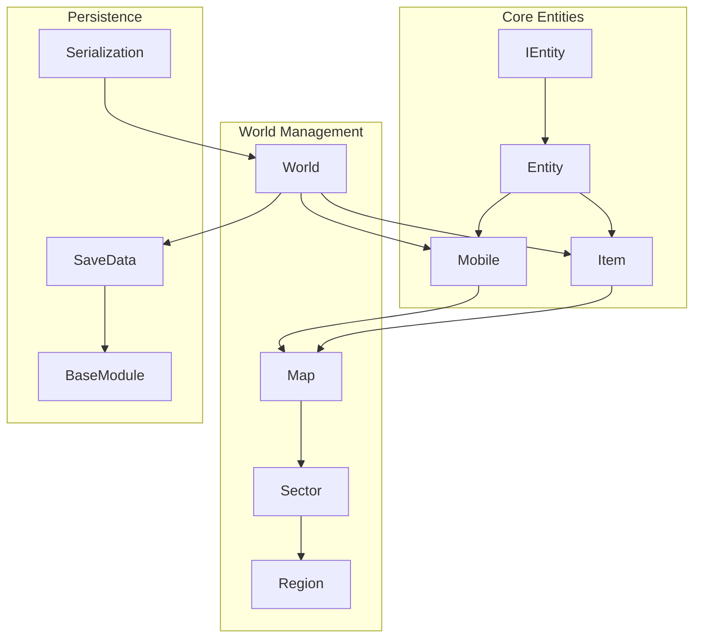
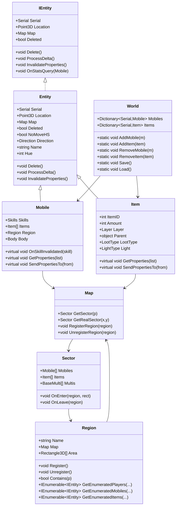
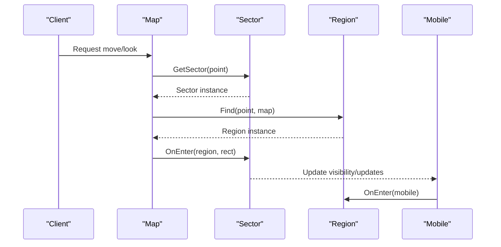
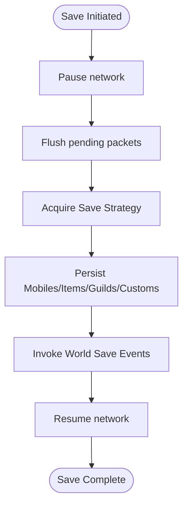
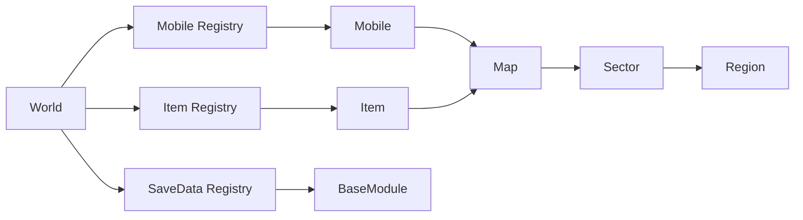

# Entity System

<cite>
**Referenced Files in This Document**
- [IEntity.cs](file://Server/IEntity.cs)
- [Entity.cs](file://Server/Entity.cs)
- [Mobile.cs](file://Server/Mobile.cs)
- [Item.cs](file://Server/Item.cs)
- [World.cs](file://Server/World.cs)
- [Region.cs](file://Server/Region.cs)
- [Serialization.cs](file://Server/Serialization.cs)
- [Map.cs](file://Server/Map.cs)
- [Sector.cs](file://Server/Sector.cs)
- [BaseModule.cs](file://Server/Customs Framework/Central Core/Base Types/BaseModule.cs)
</cite>

## Table of Contents
1. [Introduction](#introduction)
2. [Project Structure](#project-structure)
3. [Core Components](#core-components)
4. [Architecture Overview](#architecture-overview)
5. [Detailed Component Analysis](#detailed-component-analysis)
6. [Dependency Analysis](#dependency-analysis)
7. [Performance Considerations](#performance-considerations)
8. [Troubleshooting Guide](#troubleshooting-guide)
9. [Conclusion](#conclusion)
10. [Appendices](#appendices)

## Introduction
This document explains ServUO’s entity system with a focus on the Entity Component System (ECS) architecture and the base classes for game objects. It covers the Mobile and Item base classes, their properties and methods, inheritance hierarchy, and how entities are managed across the lifecycle: creation, property change notifications, spatial partitioning, and destruction. It also documents relationships between entities, world management integration, and persistence mechanisms, with practical examples drawn from the codebase. Guidance is included for debugging and optimizing entity state and memory usage.

## Project Structure
ServUO organizes the entity system around a small set of foundational interfaces and classes:
- IEntity and Entity define the core entity contract and shared position/state fields.
- Mobile and Item derive from Entity and implement the primary game object types.
- World manages global registries for entities and coordinates persistence.
- Region and Map integrate spatial partitioning and region-based event handling.
- Serialization and SaveData support persistence and module linking.

**Diagram sources**
- [IEntity.cs](file://Server/IEntity.cs#L1-L106)
- [Entity.cs](file://Server/Entity.cs#L1-L106)
- [Mobile.cs](file://Server/Mobile.cs#L531-L620)
- [Item.cs](file://Server/Item.cs#L674-L760)
- [World.cs](file://Server/World.cs#L1-L120)
- [Region.cs](file://Server/Region.cs#L123-L220)
- [Serialization.cs](file://Server/Serialization.cs#L1-L200)
- [BaseModule.cs](file://Server/Customs Framework/Central Core/Base Types/BaseModule.cs#L1-L120)

**Section sources**
- [IEntity.cs](file://Server/IEntity.cs#L1-L106)
- [Entity.cs](file://Server/Entity.cs#L1-L106)
- [Mobile.cs](file://Server/Mobile.cs#L531-L620)
- [Item.cs](file://Server/Item.cs#L674-L760)
- [World.cs](file://Server/World.cs#L1-L120)
- [Region.cs](file://Server/Region.cs#L123-L220)

## Core Components
- IEntity: Defines the minimal contract for serializable entities with location, map, direction, hue, name, NoMoveHS, and deletion semantics. Also exposes ProcessDelta and InvalidateProperties hooks.
- Entity: Implements IEntity and provides shared fields for Serial, Location, Map, Direction, Hue, Name, NoMoveHS, and Deleted. Includes a Delete routine that resets position and map.
- Mobile: Extends Entity and adds extensive state for stats, skills, equipment, timers, regions, and property lists. Implements IHued and several handlers for gameplay mechanics.
- Item: Extends Entity and adds fields for item-specific state (ItemID, amount, layer, parent, loot type, light, etc.), packet caches, and property list caching. Supports compact storage of optional data via CompactInfo.

Key lifecycle hooks:
- ProcessDelta: Allows subclasses to batch update flags and resend packets.
- InvalidateProperties: Marks property lists dirty and triggers recalculation.
- Delete: Marks entity deleted and clears world references.

**Section sources**
- [IEntity.cs](file://Server/IEntity.cs#L1-L106)
- [Entity.cs](file://Server/Entity.cs#L1-L106)
- [Mobile.cs](file://Server/Mobile.cs#L531-L620)
- [Item.cs](file://Server/Item.cs#L674-L760)

## Architecture Overview
ServUO’s ECS-like model centers on lightweight base classes with optional component-like behavior:
- Entity provides core identity and spatial fields.
- Mobile and Item encapsulate domain-specific state and behaviors.
- World maintains dictionaries keyed by Serial for fast lookup and safe queueing during save/load.
- Region and Map provide spatial indexing and event dispatching.
- Serialization persists entities and linked SaveData modules.

**Diagram sources**
- [IEntity.cs](file://Server/IEntity.cs#L1-L106)
- [Entity.cs](file://Server/Entity.cs#L1-L106)
- [Mobile.cs](file://Server/Mobile.cs#L531-L620)
- [Item.cs](file://Server/Item.cs#L674-L760)
- [World.cs](file://Server/World.cs#L1-L120)
- [Region.cs](file://Server/Region.cs#L123-L220)
- [Map.cs](file://Server/Map.cs#L1-L200)
- [Sector.cs](file://Server/Sector.cs#L1-L200)

## Detailed Component Analysis

### Entity and IEntity
- Contract: Serial, Location, Map, Deleted, Direction, Hue, Name, NoMoveHS, Delete(), ProcessDelta(), InvalidateProperties(), OnStatsQuery().
- Implementation: Entity initializes Serial, Location, Map; Delete sets Deleted and resets Location/Map; ProcessDelta/InvalidateProperties are no-ops in base Entity.

Practical usage:
- Creation: Construct with Serial, Point3D, Map.
- Deletion: Call Delete to mark deleted and reset spatial fields.

**Section sources**
- [IEntity.cs](file://Server/IEntity.cs#L1-L106)
- [Entity.cs](file://Server/Entity.cs#L1-L106)

### Mobile
- Role: Base class for player avatars, NPCs, and creatures.
- Key fields: Stats (Str/Dex/Int, Hits/Stam/Mana), Skills, Equipment list, Region, Body, NetState, timers, and flags (e.g., Warmode, Hidden, Blessed).
- Lifecycle hooks: Delta flags (e.g., MobileDelta), InvalidateProperties, OnSkillInvalidated, GetProperties, SendPropertiesTo.
- Spatial: Region property and UpdateRegion() used after load; integrates with Map/Sector.
- Property system: ObjectPropertyList caching and invalidation.

Common patterns:
- Property invalidation: Call InvalidateProperties and rely on ProcessDelta to resend updates.
- Region enumeration: Use Region.GetEnumeratedPlayers/Mobiles/Items for scoped iteration.

**Section sources**
- [Mobile.cs](file://Server/Mobile.cs#L531-L620)
- [Mobile.cs](file://Server/Mobile.cs#L800-L920)
- [Mobile.cs](file://Server/Mobile.cs#L1117-L1190)
- [Region.cs](file://Server/Region.cs#L493-L678)

### Item
- Role: Base class for all world objects (equipment, containers, resources).
- Key fields: ItemID, Amount, Layer, Parent (Mobile/Item/null), Map, Location, LootType, LightType, Direction, and packet caches for OPL/world visibility.
- Lifecycle hooks: InvalidateProperties, GetProperties, SendPropertiesTo, Bounce handling via BounceInfo.
- Spatial: Inherits Location/Map from Entity; participates in Map/Sector collections.

Optimization note:
- CompactInfo stores optional fields lazily to reduce memory footprint for items without special metadata.

**Section sources**
- [Item.cs](file://Server/Item.cs#L674-L760)
- [Item.cs](file://Server/Item.cs#L800-L920)
- [Item.cs](file://Server/Item.cs#L1115-L1170)
- [Item.cs](file://Server/Item.cs#L1461-L1490)

### World Management and Persistence
- Registries: World maintains Mobiles and Items dictionaries keyed by Serial.
- Safe queues: During save/load, World queues additions/removals to avoid inconsistent state.
- Save/Load: World.Load constructs entities via type tables and deserializes state; World.Save persists entities and fires events.

Example flows:
- Adding an entity safely during save: World.AddItem checks m_Saving and enqueues if true.
- Applying queued deletions post-load: ProcessSafetyQueues drains delete queues and calls Delete().

**Section sources**
- [World.cs](file://Server/World.cs#L1-L120)
- [World.cs](file://Server/World.cs#L880-L962)
- [World.cs](file://Server/World.cs#L988-L1030)
- [World.cs](file://Server/World.cs#L1097-L1208)

### Spatial Partitioning and Region-Based Events
- Map partitions the world into Sectors; each Sector tracks Mobiles, Items, and Multis.
- Region defines 3D areas and registers/unregisters with Map and Sectors.
- Region provides enumerators for Players/Mobiles/Items within its bounds and priority ordering for dynamic vs static regions.

**Diagram sources**
- [Region.cs](file://Server/Region.cs#L123-L220)
- [Region.cs](file://Server/Region.cs#L276-L363)
- [Region.cs](file://Server/Region.cs#L493-L678)
- [Map.cs](file://Server/Map.cs#L1-L200)
- [Sector.cs](file://Server/Sector.cs#L1-L200)

**Section sources**
- [Region.cs](file://Server/Region.cs#L123-L220)
- [Region.cs](file://Server/Region.cs#L276-L363)
- [Region.cs](file://Server/Region.cs#L493-L678)

### Entity Registration, World Positioning, and Region Events
- Registration: Region.Register binds to Map and Sectors; Unregister detaches.
- World positioning: Mobile and Item inherit Location/Map; after load, World updates regions and totals.
- Region events: OnEnter/OnExit and OnMoveInto allow custom behaviors per region.

Concrete example paths:
- Region registration and sector binding: [Region.cs](file://Server/Region.cs#L276-L363)
- World post-load updates: [World.cs](file://Server/World.cs#L884-L906)
- Region enumeration helpers: [Region.cs](file://Server/Region.cs#L493-L678)

**Section sources**
- [Region.cs](file://Server/Region.cs#L276-L363)
- [Region.cs](file://Server/Region.cs#L493-L678)
- [World.cs](file://Server/World.cs#L884-L906)

### Persistence Mechanisms
- Save/Load orchestration: World.Save/Load coordinate serialization and event firing.
- Serialization: Entities implement serialization constructors and Deserialize/Serialize routines; World reads type tables and positions to reconstruct instances.
- SaveData and Modules: World maintains SaveData registry; BaseModule supports linking SaveData to Mobile/Item for modular extensions.

**Diagram sources**
- [World.cs](file://Server/World.cs#L1097-L1208)
- [Serialization.cs](file://Server/Serialization.cs#L1-L200)

**Section sources**
- [World.cs](file://Server/World.cs#L1097-L1208)
- [Serialization.cs](file://Server/Serialization.cs#L1-L200)

## Dependency Analysis
- Coupling:
  - Mobile depends on Map/Region for spatial queries and on Skills/Equipment lists for state.
  - Item depends on Map/Region for spatial queries and on Parent for containment.
  - World couples Mobile/Item registries to persistence and event sinks.
- Cohesion:
  - Entity centralizes identity and spatial fields; Mobile/Item encapsulate domain-specific state.
- External dependencies:
  - Network (NetState), Timers, ObjectPropertyList, and Map/Sector for spatial indexing.

**Diagram sources**
- [World.cs](file://Server/World.cs#L1-L120)
- [Mobile.cs](file://Server/Mobile.cs#L531-L620)
- [Item.cs](file://Server/Item.cs#L674-L760)
- [Region.cs](file://Server/Region.cs#L123-L220)
- [BaseModule.cs](file://Server/Customs Framework/Central Core/Base Types/BaseModule.cs#L1-L120)

**Section sources**
- [World.cs](file://Server/World.cs#L1-L120)
- [Mobile.cs](file://Server/Mobile.cs#L531-L620)
- [Item.cs](file://Server/Item.cs#L674-L760)
- [Region.cs](file://Server/Region.cs#L123-L220)
- [BaseModule.cs](file://Server/Customs Framework/Central Core/Base Types/BaseModule.cs#L1-L120)

## Performance Considerations
- Spatial partitioning:
  - Use Region enumerators to limit visibility and event processing to relevant entities.
  - Prefer Sector-level iteration for bulk operations to minimize dictionary lookups.
- Property invalidation:
  - Batch property updates via InvalidateProperties and rely on ProcessDelta to coalesce sends.
- Memory optimization:
  - CompactInfo in Item defers allocation of optional fields until needed.
  - Avoid frequent property list recomputation; cache and invalidate judiciously.
- Save/load:
  - Leverage World’s safety queues to avoid inconsistent state during persistence.
  - Choose appropriate SaveStrategy for throughput vs latency.

[No sources needed since this section provides general guidance]

## Troubleshooting Guide
Common issues and remedies:
- Entity stuck in deleted state:
  - Ensure Delete() is called once and not re-applied. Check Deleted flag and reset of Location/Map.
- Incorrect spatial queries:
  - Verify Region.Register() and Map sector bindings; confirm Region.Contains() and GetEnumerated*() filters.
- Property list not updating:
  - Call InvalidateProperties and ensure ProcessDelta is invoked to resend updates.
- Save/load failures:
  - Review World.Load error handling and safety logs; fix bad serial/type entries and reattempt load.
- Module linkage errors:
  - Confirm SaveData registrations and BaseModule links to Mobile/Item; use World.GetData/GetModules helpers.

**Section sources**
- [Entity.cs](file://Server/Entity.cs#L83-L104)
- [Region.cs](file://Server/Region.cs#L276-L363)
- [World.cs](file://Server/World.cs#L800-L877)
- [World.cs](file://Server/World.cs#L988-L1030)

## Conclusion
ServUO’s entity system blends a clean ECS-inspired foundation with robust game-specific classes. Entity provides identity and spatial fields; Mobile and Item encapsulate rich state and behaviors; World orchestrates persistence and safe operations; Region and Map deliver efficient spatial partitioning. Following the patterns documented here—proper property invalidation, region-aware enumeration, and careful persistence—will help you implement reliable custom entities and optimize runtime performance.

[No sources needed since this section summarizes without analyzing specific files]

## Appendices

### Example Paths for Common Tasks
- Creating and registering a Mobile safely during save:
  - [World.cs](file://Server/World.cs#L1247-L1258)
- Adding an Item safely during save:
  - [World.cs](file://Server/World.cs#L1269-L1280)
- Removing an entity:
  - [World.cs](file://Server/World.cs#L1282-L1290)
- Region enumeration:
  - [Region.cs](file://Server/Region.cs#L493-L678)
- Property invalidation and updates:
  - [Mobile.cs](file://Server/Mobile.cs#L1117-L1190)
  - [Item.cs](file://Server/Item.cs#L1461-L1490)