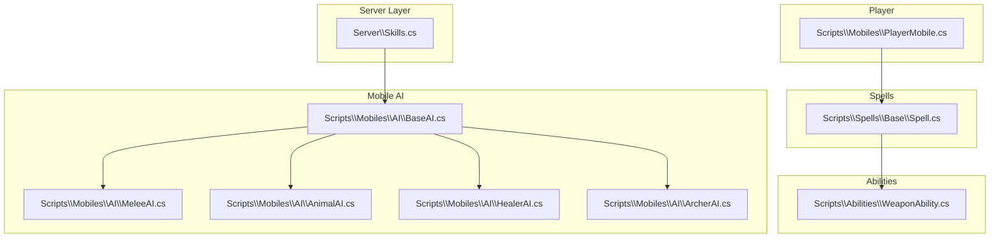
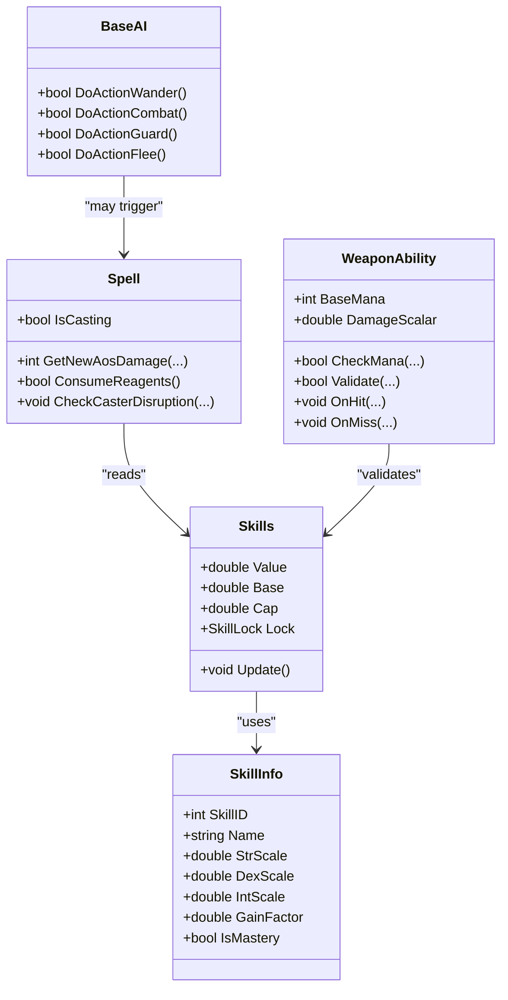
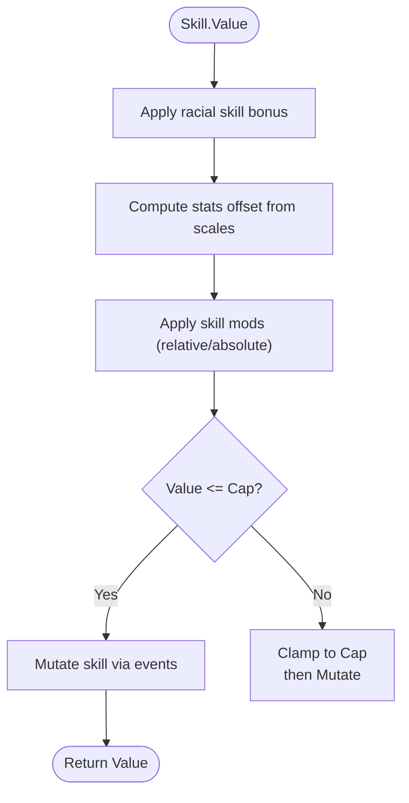
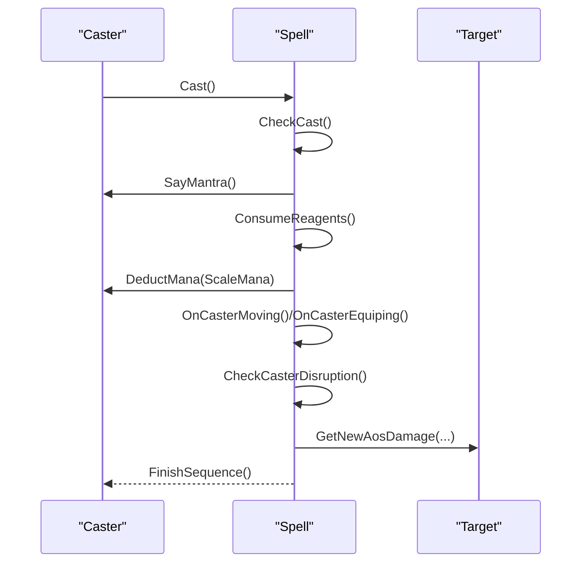
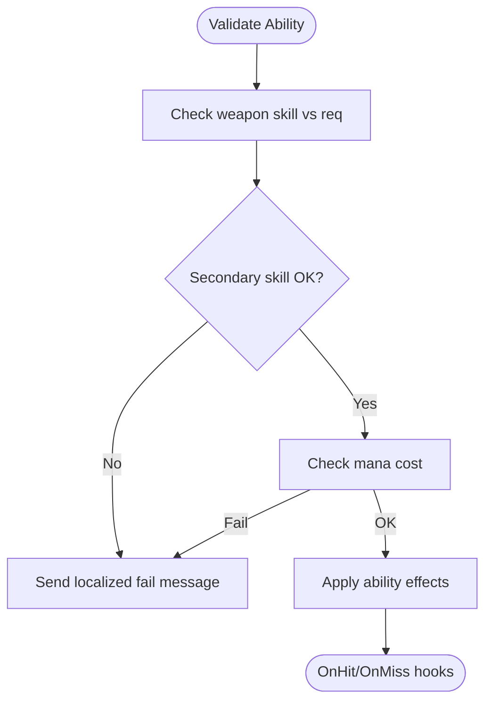
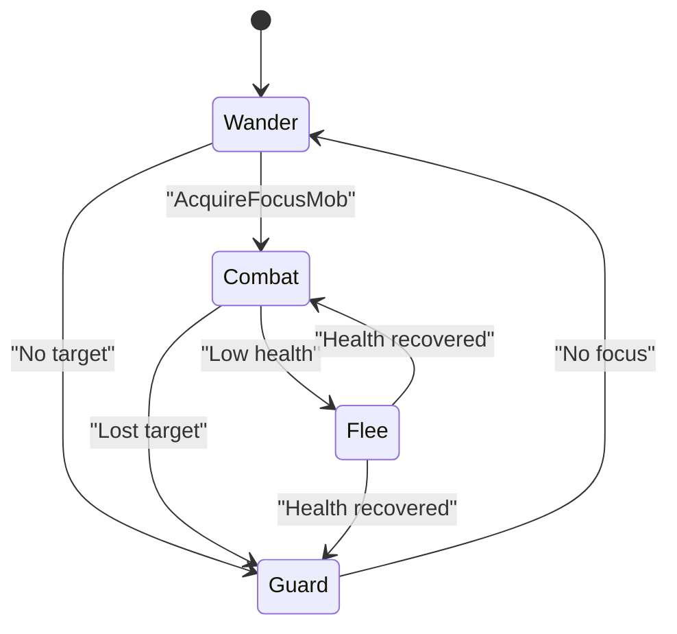
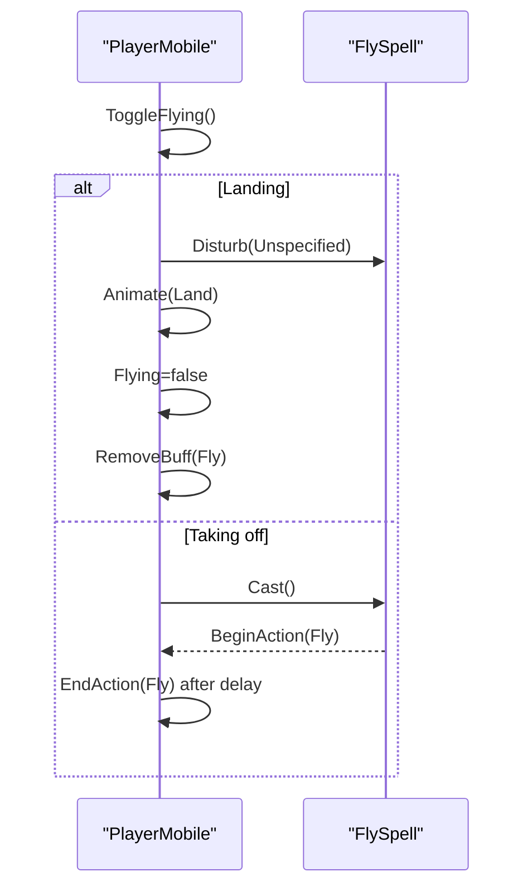
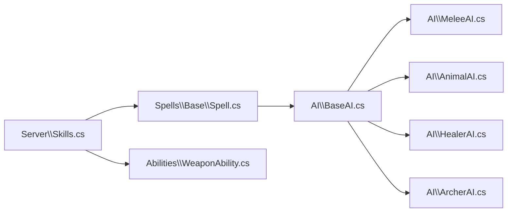

# Game Mechanics

<cite>
**Referenced Files in This Document**
- [Server\Skills.cs](file://Server\Skills.cs)
- [Scripts\Mobiles\AI\BaseAI.cs](file://Scripts\Mobiles\AI\BaseAI.cs)
- [Scripts\Mobiles\AI\MeleeAI.cs](file://Scripts\Mobiles\AI\MeleeAI.cs)
- [Scripts\Mobiles\AI\AnimalAI.cs](file://Scripts\Mobiles\AI\AnimalAI.cs)
- [Scripts\Mobiles\AI\HealerAI.cs](file://Scripts\Mobiles\AI\HealerAI.cs)
- [Scripts\Mobiles\AI\ArcherAI.cs](file://Scripts\Mobiles\AI\ArcherAI.cs)
- [Scripts\Spells\Base\Spell.cs](file://Scripts\Spells\Base\Spell.cs)
- [Scripts\Abilities\WeaponAbility.cs](file://Scripts\Abilities\WeaponAbility.cs)
- [Scripts\Mobiles\PlayerMobile.cs](file://Scripts\Mobiles\PlayerMobile.cs)
</cite>

## Table of Contents
1. [Introduction](#introduction)
2. [Project Structure](#project-structure)
3. [Core Components](#core-components)
4. [Architecture Overview](#architecture-overview)
5. [Detailed Component Analysis](#detailed-component-analysis)
6. [Dependency Analysis](#dependency-analysis)
7. [Performance Considerations](#performance-considerations)
8. [Troubleshooting Guide](#troubleshooting-guide)
9. [Conclusion](#conclusion)
10. [Appendices](#appendices)

## Introduction
This document explains ServUO’s game mechanics with a focus on skills, spell casting, combat, and AI behavior. It synthesizes the repository’s implementation to describe how skill checks and advancement work, how spells are cast and resolved, how weapon abilities and combat calculations operate, and how NPC AI decisions are made. It also provides guidance for balancing, performance optimization, debugging, and extending the system with custom mechanics.

## Project Structure
ServUO organizes mechanics across several namespaces and files:
- Skills and skill metadata live in the server layer.
- AI behaviors for creatures are implemented under the mobile AI namespace.
- Spell mechanics and formulas are centralized in the spell base class.
- Combat abilities and weapon mechanics are implemented under abilities.
- Player-specific spell actions (e.g., flying) are implemented in the player mobile class.

**Diagram sources**
- [Server\Skills.cs](file://Server\Skills.cs#L1-L120)
- [Scripts\Mobiles\AI\BaseAI.cs](file://Scripts\Mobiles\AI\BaseAI.cs#L1-L120)
- [Scripts\Mobiles\AI\MeleeAI.cs](file://Scripts\Mobiles\AI\MeleeAI.cs#L1-L60)
- [Scripts\Mobiles\AI\AnimalAI.cs](file://Scripts\Mobiles\AI\AnimalAI.cs#L1-L60)
- [Scripts\Mobiles\AI\HealerAI.cs](file://Scripts\Mobiles\AI\HealerAI.cs#L1-L60)
- [Scripts\Mobiles\AI\ArcherAI.cs](file://Scripts\Mobiles\AI\ArcherAI.cs#L1-L60)
- [Scripts\Spells\Base\Spell.cs](file://Scripts\Spells\Base\Spell.cs#L1-L120)
- [Scripts\Abilities\WeaponAbility.cs](file://Scripts\Abilities\WeaponAbility.cs#L1-L80)
- [Scripts\Mobiles\PlayerMobile.cs](file://Scripts\Mobiles\PlayerMobile.cs#L150-L200)

**Section sources**
- [Server\Skills.cs](file://Server\Skills.cs#L1-L120)
- [Scripts\Mobiles\AI\BaseAI.cs](file://Scripts\Mobiles\AI\BaseAI.cs#L1-L120)
- [Scripts\Spells\Base\Spell.cs](file://Scripts\Spells\Base\Spell.cs#L1-L120)

## Core Components
- Skills system: Defines skill metadata, scaling, caps, racial bonuses, and derived values.
- Spell system: Provides casting lifecycle, reagent consumption, damage calculation, and disruption mechanics.
- Weapon abilities: Implements ability validation, mana cost, and on-hit/on-miss hooks.
- AI behaviors: Implements decision loops for wandering, combat, guarding, fleeing, and specialized roles (healer/archer).

**Section sources**
- [Server\Skills.cs](file://Server\Skills.cs#L360-L520)
- [Scripts\Spells\Base\Spell.cs](file://Scripts\Spells\Base\Spell.cs#L200-L320)
- [Scripts\Abilities\WeaponAbility.cs](file://Scripts\Abilities\WeaponAbility.cs#L120-L220)
- [Scripts\Mobiles\AI\BaseAI.cs](file://Scripts\Mobiles\AI\BaseAI.cs#L1-L120)

## Architecture Overview
The mechanics are structured around:
- Skill metadata and derived values feeding combat and spell calculations.
- Spell base class orchestrating casting, reagents, damage scaling, and disruption.
- AI base class coordinating action selection and movement, with role-specific overrides.
- Abilities validating prerequisites and consuming resources.

**Diagram sources**
- [Server\Skills.cs](file://Server\Skills.cs#L360-L520)
- [Scripts\Spells\Base\Spell.cs](file://Scripts\Spells\Base\Spell.cs#L200-L320)
- [Scripts\Abilities\WeaponAbility.cs](file://Scripts\Abilities\WeaponAbility.cs#L120-L220)
- [Scripts\Mobiles\AI\BaseAI.cs](file://Scripts\Mobiles\AI\BaseAI.cs#L1-L120)

## Detailed Component Analysis

### Skills Implementation
- Skill metadata defines scales for Strength/Dexterity/Intelligence and gain factors per skill.
- Derived value combines base skill, racial bonuses, stat modifiers, and skill mods, then mutates via events.
- Caps and locks control advancement and visibility.
- Mastery skills track learned volumes and current mastery designation.

**Diagram sources**
- [Server\Skills.cs](file://Server\Skills.cs#L360-L520)

**Section sources**
- [Server\Skills.cs](file://Server\Skills.cs#L360-L520)

### Spell Casting Mechanics
- Lifecycle: Check cast eligibility, say mantra, consume reagents, apply mana cost, handle disruption, resolve damage.
- Reagents: Consumed via backpack contents against spell reagent lists.
- Damage formula: Dice-based roll scaled by inscribe bonus, caster Int, spell damage bonus, EvalInt/EvalSkill scaling, and optional PvP scalar.
- Disruption: Movement/equipment/object interactions, resist effects, and protection registry influence chance to fizzle.

**Diagram sources**
- [Scripts\Spells\Base\Spell.cs](file://Scripts\Spells\Base\Spell.cs#L680-L800)
- [Scripts\Spells\Base\Spell.cs](file://Scripts\Spells\Base\Spell.cs#L380-L420)
- [Scripts\Spells\Base\Spell.cs](file://Scripts\Spells\Base\Spell.cs#L200-L320)
- [Scripts\Spells\Base\Spell.cs](file://Scripts\Spells\Base\Spell.cs#L240-L320)

**Section sources**
- [Scripts\Spells\Base\Spell.cs](file://Scripts\Spells\Base\Spell.cs#L200-L320)
- [Scripts\Spells\Base\Spell.cs](file://Scripts\Spells\Base\Spell.cs#L380-L420)
- [Scripts\Spells\Base\Spell.cs](file://Scripts\Spells\Base\Spell.cs#L680-L800)

### Weapon Abilities and Combat Calculations
- Validation: Checks weapon skill, secondary skill (Tactics/Bushido/Ninjitsu/Poisoning), and expansion requirements.
- Mana cost: Base mana reduced by skill totals, curses, lower mana cost gear, and special move cooldown doubling.
- On-hit/move hooks: Allow effects like bleeding, disarm, dismount, whirlwind, and parry mastery.

**Diagram sources**
- [Scripts\Abilities\WeaponAbility.cs](file://Scripts\Abilities\WeaponAbility.cs#L120-L220)
- [Scripts\Abilities\WeaponAbility.cs](file://Scripts\Abilities\WeaponAbility.cs#L220-L340)

**Section sources**
- [Scripts\Abilities\WeaponAbility.cs](file://Scripts\Abilities\WeaponAbility.cs#L120-L220)
- [Scripts\Abilities\WeaponAbility.cs](file://Scripts\Abilities\WeaponAbility.cs#L220-L340)

### NPC AI Behaviors
- BaseAI: Manages action transitions (wander, combat, guard, flee, backoff), speech handling, and control commands.
- MeleeAI: Acquires targets, moves within range, decides to flee when low on health.
- AnimalAI: Simple flee threshold and combat behavior; avoids panic mechanics in current implementation.
- HealerAI: Targets poisoned, low HP, or minor HP targets and casts Cure/Greater Heal/Lesser Heal accordingly.
- ArcherAI: Maintains max range, rotates to face target, and flees when low on health.

**Diagram sources**
- [Scripts\Mobiles\AI\BaseAI.cs](file://Scripts\Mobiles\AI\BaseAI.cs#L1-L120)
- [Scripts\Mobiles\AI\MeleeAI.cs](file://Scripts\Mobiles\AI\MeleeAI.cs#L1-L120)
- [Scripts\Mobiles\AI\AnimalAI.cs](file://Scripts\Mobiles\AI\AnimalAI.cs#L1-L120)
- [Scripts\Mobiles\AI\HealerAI.cs](file://Scripts\Mobiles\AI\HealerAI.cs#L1-L120)
- [Scripts\Mobiles\AI\ArcherAI.cs](file://Scripts\Mobiles\AI\ArcherAI.cs#L1-L120)

**Section sources**
- [Scripts\Mobiles\AI\BaseAI.cs](file://Scripts\Mobiles\AI\BaseAI.cs#L1-L120)
- [Scripts\Mobiles\AI\MeleeAI.cs](file://Scripts\Mobiles\AI\MeleeAI.cs#L1-L120)
- [Scripts\Mobiles\AI\AnimalAI.cs](file://Scripts\Mobiles\AI\AnimalAI.cs#L1-L120)
- [Scripts\Mobiles\AI\HealerAI.cs](file://Scripts\Mobiles\AI\HealerAI.cs#L1-L120)
- [Scripts\Mobiles\AI\ArcherAI.cs](file://Scripts\Mobiles\AI\ArcherAI.cs#L1-L120)

### Player Spell Actions (Example: Flying)
PlayerMobile toggles flight state, casting or canceling a fly spell, with cooldowns and landing restrictions.

**Diagram sources**
- [Scripts\Mobiles\PlayerMobile.cs](file://Scripts\Mobiles\PlayerMobile.cs#L150-L200)

**Section sources**
- [Scripts\Mobiles\PlayerMobile.cs](file://Scripts\Mobiles\PlayerMobile.cs#L150-L200)

## Dependency Analysis
- Skills feed into spell damage scaling and ability validations.
- Spell base class depends on skill values for damage and disruption checks.
- Abilities depend on weapon skills and secondary skills.
- AI behaviors depend on skills for teaching/training and on spell casting for healer AI.

**Diagram sources**
- [Server\Skills.cs](file://Server\Skills.cs#L360-L520)
- [Scripts\Spells\Base\Spell.cs](file://Scripts\Spells\Base\Spell.cs#L200-L320)
- [Scripts\Abilities\WeaponAbility.cs](file://Scripts\Abilities\WeaponAbility.cs#L120-L220)
- [Scripts\Mobiles\AI\BaseAI.cs](file://Scripts\Mobiles\AI\BaseAI.cs#L1-L120)

**Section sources**
- [Server\Skills.cs](file://Server\Skills.cs#L360-L520)
- [Scripts\Spells\Base\Spell.cs](file://Scripts\Spells\Base\Spell.cs#L200-L320)
- [Scripts\Abilities\WeaponAbility.cs](file://Scripts\Abilities\WeaponAbility.cs#L120-L220)
- [Scripts\Mobiles\AI\BaseAI.cs](file://Scripts\Mobiles\AI\BaseAI.cs#L1-L120)

## Performance Considerations
- Minimize repeated skill recalculations by caching derived values where appropriate.
- Use spatial queries and range checks judiciously in AI loops to avoid excessive enumeration.
- Avoid redundant packet updates by batching state changes during spell sequences.
- Prefer early exits in spell disruption checks and ability validations to reduce branching overhead.
- Offload heavy computations to timers or throttled intervals for non-critical tasks.

[No sources needed since this section provides general guidance]

## Troubleshooting Guide
- Spell fizzling: Verify reagent consumption, mana availability, and disruption triggers (movement/equipment/use).
- Low damage scaling: Check inscribe bonus, EvalInt/EvalSkill values, and spell damage bonuses.
- Ability failing: Confirm weapon skill thresholds, secondary skill requirements, and lower mana cost effects.
- AI not engaging: Ensure perception ranges and focus modes are configured; verify target validity and movement constraints.
- Player spell cooldowns: Review next spell time and action blocking states.

**Section sources**
- [Scripts\Spells\Base\Spell.cs](file://Scripts\Spells\Base\Spell.cs#L380-L420)
- [Scripts\Spells\Base\Spell.cs](file://Scripts\Spells\Base\Spell.cs#L240-L320)
- [Scripts\Abilities\WeaponAbility.cs](file://Scripts\Abilities\WeaponAbility.cs#L120-L220)
- [Scripts\Mobiles\AI\BaseAI.cs](file://Scripts\Mobiles\AI\BaseAI.cs#L1-L120)

## Conclusion
ServUO’s mechanics combine a robust skills system, a flexible spell framework, a suite of weapon abilities, and layered AI behaviors. By understanding how derived skill values influence spell damage, how abilities validate prerequisites and consume resources, and how AI actions are selected and executed, developers can balance gameplay, optimize performance, and extend the system with custom skills, spells, and AI behaviors.

[No sources needed since this section summarizes without analyzing specific files]

## Appendices

### Example References to Code Paths
- Skill metadata and derived value computation:
  - [Server\Skills.cs](file://Server\Skills.cs#L360-L520)
- Spell damage calculation:
  - [Scripts\Spells\Base\Spell.cs](file://Scripts\Spells\Base\Spell.cs#L200-L320)
- Spell reagent consumption:
  - [Scripts\Spells\Base\Spell.cs](file://Scripts\Spells\Base\Spell.cs#L380-L420)
- Ability validation and mana cost:
  - [Scripts\Abilities\WeaponAbility.cs](file://Scripts\Abilities\WeaponAbility.cs#L120-L220)
- AI action transitions:
  - [Scripts\Mobiles\AI\BaseAI.cs](file://Scripts\Mobiles\AI\BaseAI.cs#L1-L120)
- Healer AI targeting logic:
  - [Scripts\Mobiles\AI\HealerAI.cs](file://Scripts\Mobiles\AI\HealerAI.cs#L1-L120)
- Archer AI range maintenance:
  - [Scripts\Mobiles\AI\ArcherAI.cs](file://Scripts\Mobiles\AI\ArcherAI.cs#L1-L120)
- Player flying toggle and cooldown:
  - [Scripts\Mobiles\PlayerMobile.cs](file://Scripts\Mobiles\PlayerMobile.cs#L150-L200)