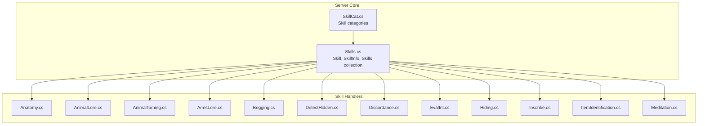
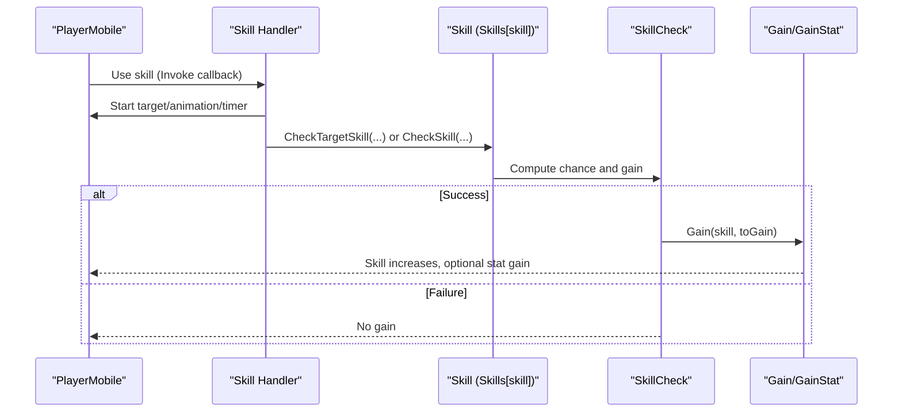
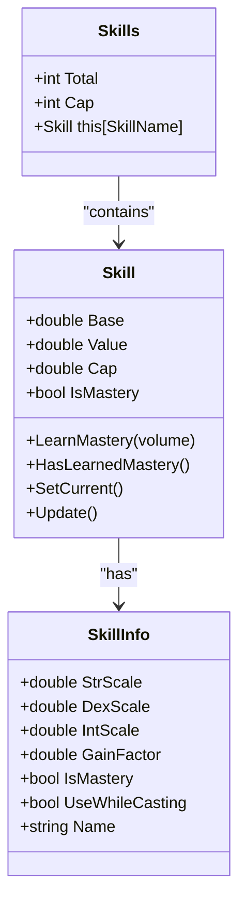
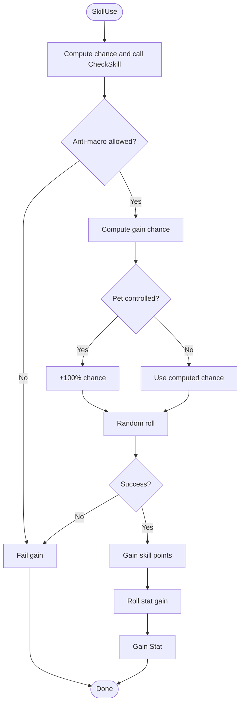
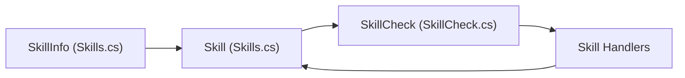

# Skills System

<cite>
**Referenced Files in This Document**
- [SkillCat.cs](file://Scripts/Skills/SkillCat.cs)
- [Skills.cs](file://Server/Skills.cs)
- [SkillCheck.cs](file://Scripts/Misc/SkillCheck.cs)
- [Anatomy.cs](file://Scripts/Skills/Anatomy.cs)
- [AnimalLore.cs](file://Scripts/Skills/AnimalLore.cs)
- [AnimalTaming.cs](file://Scripts/Skills/AnimalTaming.cs)
- [ArmsLore.cs](file://Scripts/Skills/ArmsLore.cs)
- [Begging.cs](file://Scripts/Skills/Begging.cs)
- [DetectHidden.cs](file://Scripts/Skills/DetectHidden.cs)
- [Discordance.cs](file://Scripts/Skills/Discordance.cs)
- [EvalInt.cs](file://Scripts/Skills/EvalInt.cs)
- [Hiding.cs](file://Scripts/Skills/Hiding.cs)
- [Inscribe.cs](file://Scripts/Skills/Inscribe.cs)
- [ItemIdentification.cs](file://Scripts/Skills/ItemIdentification.cs)
- [Meditation.cs](file://Scripts/Skills/Meditation.cs)
</cite>

## Table of Contents
1. [Introduction](#introduction)
2. [Project Structure](#project-structure)
3. [Core Components](#core-components)
4. [Architecture Overview](#architecture-overview)
5. [Detailed Component Analysis](#detailed-component-analysis)
6. [Dependency Analysis](#dependency-analysis)
7. [Performance Considerations](#performance-considerations)
8. [Troubleshooting Guide](#troubleshooting-guide)
9. [Conclusion](#conclusion)

## Introduction
This document explains ServUO’s skills system: how skills are categorized, how skill checks and progression work, and how each of the requested skills behaves. It synthesizes the server-side skill model, skill check and gain mechanics, and per-skill behaviors from the codebase. It also provides guidance for balancing, performance, and extending the system.

## Project Structure
ServUO organizes skills into:
- A central skill model and registry in the server assembly
- Per-skill handler logic in Scripts/Skills
- Global skill check and gain logic in Scripts/Misc

**Diagram sources**
- [Skills.cs](file://Server/Skills.cs#L1-L120)
- [SkillCat.cs](file://Scripts/Skills/SkillCat.cs#L1-L16)
- [Anatomy.cs](file://Scripts/Skills/Anatomy.cs#L1-L93)
- [AnimalLore.cs](file://Scripts/Skills/AnimalLore.cs#L1-L121)
- [AnimalTaming.cs](file://Scripts/Skills/AnimalTaming.cs#L1-L120)
- [ArmsLore.cs](file://Scripts/Skills/ArmsLore.cs#L1-L167)
- [Begging.cs](file://Scripts/Skills/Begging.cs#L1-L120)
- [DetectHidden.cs](file://Scripts/Skills/DetectHidden.cs#L1-L140)
- [Discordance.cs](file://Scripts/Skills/Discordance.cs#L1-L120)
- [EvalInt.cs](file://Scripts/Skills/EvalInt.cs#L1-L93)
- [Hiding.cs](file://Scripts/Skills/Hiding.cs#L1-L129)
- [Inscribe.cs](file://Scripts/Skills/Inscribe.cs#L1-L171)
- [ItemIdentification.cs](file://Scripts/Skills/ItemIdentification.cs#L1-L196)
- [Meditation.cs](file://Scripts/Skills/Meditation.cs#L1-L106)

**Section sources**
- [Skills.cs](file://Server/Skills.cs#L1-L120)
- [SkillCat.cs](file://Scripts/Skills/SkillCat.cs#L1-L16)

## Core Components
- Skill and SkillInfo define a skill’s identity, scaling, and metadata (e.g., stat scales, gain factors, mastery flag).
- Skills is a typed collection of Skill instances owned by a Mobile, tracking total and caps.
- Skill.Value computes effective skill including racial bonuses, stats, and modifiers.
- SkillCheck orchestrates skill checks, gain chance calculation, stat gain, and anti-macro.

Key implementation highlights:
- Skill.Value aggregates base skill, stat contributions, racial bonuses, and skill mods; then mutates via event hooks.
- Gain chance depends on skill cap slack, total cap slack, difficulty, and a per-skill gain factor; pets receive a bonus; capped at 100%.
- Stat gain uses configurable delays and per-skill anti-macro gating.

**Section sources**
- [Skills.cs](file://Server/Skills.cs#L366-L468)
- [Skills.cs](file://Server/Skills.cs#L521-L657)
- [SkillCheck.cs](file://Scripts/Misc/SkillCheck.cs#L240-L330)
- [SkillCheck.cs](file://Scripts/Misc/SkillCheck.cs#L331-L460)
- [SkillCheck.cs](file://Scripts/Misc/SkillCheck.cs#L460-L580)

## Architecture Overview
The skills system is composed of:
- Central registry and computation (Skill, SkillInfo, Skills)
- Per-skill handler callbacks that trigger targets, timers, and outcomes
- Global skill check and gain pipeline

**Diagram sources**
- [Skills.cs](file://Server/Skills.cs#L366-L468)
- [SkillCheck.cs](file://Scripts/Misc/SkillCheck.cs#L240-L330)
- [SkillCheck.cs](file://Scripts/Misc/SkillCheck.cs#L331-L460)

## Detailed Component Analysis

### Skill Categorization
ServUO defines a categorical taxonomy for skills to support UI and grouping. Categories include miscellaneous, combat, trade skills, magic, wilderness, thievery, and bard.

- Category enumeration: None, Miscellaneous, Combat, TradeSkills, Magic, Wilderness, Thievery, Bard.

Practical impact:
- Used to group skills in UI and systems that rely on category-aware logic.

**Section sources**
- [SkillCat.cs](file://Scripts/Skills/SkillCat.cs#L1-L16)

### Skill Computation Model
- Skill.Value computes effective skill including:
  - Base fixed-point value scaled to double
  - Stat contributions scaled by per-skill stat weights
  - Racial bonuses
  - Skill mods (relative and absolute)
  - Mastery mutation hook
- SkillInfo holds stat scales, gain factors, mastery flag, and primary/secondary stats.

**Diagram sources**
- [Skills.cs](file://Server/Skills.cs#L366-L468)
- [Skills.cs](file://Server/Skills.cs#L521-L657)

**Section sources**
- [Skills.cs](file://Server/Skills.cs#L366-L468)
- [Skills.cs](file://Server/Skills.cs#L521-L657)

### Skill Check and Gain Mechanics
- SkillCheck exposes:
  - Direct and location/target-based skill checks
  - Gain chance computation dependent on skill cap slack, total cap slack, difficulty, and gain factor
  - Anti-macro gating per skill
  - Stat gain with configurable delays and per-skill bonuses (e.g., pets)
  - Global and per-skill cooldowns for stat gains

**Diagram sources**
- [SkillCheck.cs](file://Scripts/Misc/SkillCheck.cs#L240-L330)
- [SkillCheck.cs](file://Scripts/Misc/SkillCheck.cs#L331-L460)

**Section sources**
- [SkillCheck.cs](file://Scripts/Misc/SkillCheck.cs#L240-L330)
- [SkillCheck.cs](file://Scripts/Misc/SkillCheck.cs#L331-L460)

### Anatomy
- Behavior: Allows examining a mobile to estimate attributes and endurance with a skill check.
- Key mechanics:
  - Uses a margin of error based on Anatomy skill.
  - Sends localized messages depending on success and skill thresholds.
  - Requires targeting a mobile within range.

**Section sources**
- [Anatomy.cs](file://Scripts/Skills/Anatomy.cs#L1-L93)

### Animal Lore
- Behavior: Inspect a creature to reveal stats, resistances, and skills via a skill check.
- Key mechanics:
  - Minimum skill thresholds vary by creature type and taming status.
  - Supports a gump UI (with optional training UI) for detailed stats.
  - Checks passively or actively depending on context.

**Section sources**
- [AnimalLore.cs](file://Scripts/Skills/AnimalLore.cs#L1-L121)

### Animal Taming
- Behavior: Taming a creature with a multi-phase timer and success check.
- Key mechanics:
  - Must be subdued depending on creature rules.
  - Scaling of stats/skills based on first-time vs. repeat tames and paralysis state.
  - Ownership and bonding changes on success.
  - Passive checks against Animal Lore during taming.

**Section sources**
- [AnimalTaming.cs](file://Scripts/Skills/AnimalTaming.cs#L1-L120)
- [AnimalTaming.cs](file://Scripts/Skills/AnimalTaming.cs#L268-L489)

### Arms Lore
- Behavior: Identify weapon/armor quality and properties by targeting items.
- Key mechanics:
  - Sends localized feedback based on durability and damage/armor rating bands.
  - Handles special items like barding on pets.

**Section sources**
- [ArmsLore.cs](file://Scripts/Skills/ArmsLore.cs#L1-L167)

### Begging
- Behavior: Attempt to gain gold or items from NPCs by performing a skill check.
- Key mechanics:
  - Karma affects NPC willingness.
  - Maximum gold taken is bounded by fame.
  - Different outcomes for humanoid and elf NPCs.

**Section sources**
- [Begging.cs](file://Scripts/Skills/Begging.cs#L1-L120)
- [Begging.cs](file://Scripts/Skills/Begging.cs#L120-L220)
- [Begging.cs](file://Scripts/Skills/Begging.cs#L220-L336)

### Detect Hidden
- Behavior: Search an area to reveal hidden mobiles and items.
- Key mechanics:
  - Range determined by Detect Hidden skill with house bonuses.
  - Passive detection around the player.
  - Shadow mastery and stealth/hiding skill comparison.

**Section sources**
- [DetectHidden.cs](file://Scripts/Skills/DetectHidden.cs#L1-L140)
- [DetectHidden.cs](file://Scripts/Skills/DetectHidden.cs#L140-L212)

### Discordance
- Behavior: Play an instrument to weaken an opponent’s stats and skills.
- Key mechanics:
  - Instrument difficulty and Musicianship modifier.
  - Adds resistance and skill mods to the target.
  - Supports PvP variants with expiring effects and item bonus removal.

**Section sources**
- [Discordance.cs](file://Scripts/Skills/Discordance.cs#L1-L120)
- [Discordance.cs](file://Scripts/Skills/Discordance.cs#L120-L220)
- [Discordance.cs](file://Scripts/Skills/Discordance.cs#L220-L320)

### Evaluating Intelligence
- Behavior: Estimate a target’s intelligence and mental strength with a skill check.
- Key mechanics:
  - Margin of error decreases with higher skill.
  - Messages vary by target type and success threshold.

**Section sources**
- [EvalInt.cs](file://Scripts/Skills/EvalInt.cs#L1-L93)

### Hiding
- Behavior: Hide self from nearby enemies.
- Key mechanics:
  - Range decreases with skill.
  - Combat overrides prevent hiding.
  - House-friendly areas grant bonuses.

**Section sources**
- [Hiding.cs](file://Scripts/Skills/Hiding.cs#L1-L129)

### Inscribe
- Behavior: Copy text from one writable book to another.
- Key mechanics:
  - Uses two-target selection (source and destination).
  - Checks inscribe skill for success.

**Section sources**
- [Inscribe.cs](file://Scripts/Skills/Inscribe.cs#L1-L171)

### Item Identification
- Behavior: Identify an item’s name, value, and optionally infer unraveling ingredients.
- Key mechanics:
  - Basic identification with a skill check.
  - Advanced identification integrates with Imbuing and vendor pricing cache.

**Section sources**
- [ItemIdentification.cs](file://Scripts/Skills/ItemIdentification.cs#L1-L196)

### Meditation
- Behavior: Enter a meditative trance to restore mana.
- Key mechanics:
  - Hands must be free (or appropriate channeling items).
  - Chance to succeed based on skill and mana deficit.
  - Buff icon and stat reset on success.

**Section sources**
- [Meditation.cs](file://Scripts/Skills/Meditation.cs#L1-L106)

## Dependency Analysis
- Skill handlers depend on:
  - SkillInfo for skill metadata and callbacks
  - Skill.Value for effective skill computation
  - SkillCheck for skill checks and gain
- SkillCheck depends on:
  - SkillInfo.GainFactor and stat scales
  - Region and siege conditions
  - Anti-macro gating per skill

**Diagram sources**
- [Skills.cs](file://Server/Skills.cs#L521-L657)
- [Skills.cs](file://Server/Skills.cs#L366-L468)
- [SkillCheck.cs](file://Scripts/Misc/SkillCheck.cs#L240-L330)

**Section sources**
- [Skills.cs](file://Server/Skills.cs#L521-L657)
- [SkillCheck.cs](file://Scripts/Misc/SkillCheck.cs#L240-L330)

## Performance Considerations
- Skill.Value computation:
  - Includes stat scaling, racial bonuses, and modifiers; avoid excessive re-computation by caching where appropriate.
- SkillCheck gain:
  - Gain chance uses arithmetic over totals and caps; keep totals/caps updated efficiently.
  - Anti-macro and region checks add minimal overhead; ensure they are not called excessively in tight loops.
- Handlers:
  - Many handlers iterate nearby mobiles/items; use spatial queries and early exits to minimize work.
- Recommendations:
  - Batch skill updates when possible.
  - Use pooled enumerables and avoid repeated allocations in hot paths.
  - Consider lazy evaluation of expensive UI or message generation.

[No sources needed since this section provides general guidance]

## Troubleshooting Guide
- Skill not increasing:
  - Verify skill lock is Up and below cap.
  - Check total cap and whether gains are reduced by total cap slack.
  - Confirm anti-macro gating and region restrictions.
- Stat not increasing:
  - Check stat gain delay timers and per-skill thresholds.
  - Ensure the character meets prerequisites (e.g., hands free for Meditation).
- Skill check always fails:
  - Review difficulty range and gain factor.
  - Confirm correct skill name and target range.
- Handler not responding:
  - Ensure the skill callback is registered in SkillInfo.Table.
  - Verify target validity and handler-specific constraints (e.g., taming prerequisites).

**Section sources**
- [SkillCheck.cs](file://Scripts/Misc/SkillCheck.cs#L331-L460)
- [Meditation.cs](file://Scripts/Skills/Meditation.cs#L1-L106)
- [AnimalTaming.cs](file://Scripts/Skills/AnimalTaming.cs#L120-L220)

## Conclusion
ServUO’s skills system centers on a robust Skill/SkillInfo model with a unified skill check and gain pipeline. Each skill handler encapsulates behavior while leveraging shared infrastructure for fairness, balance, and performance. Adjusting gain factors, caps, and stat scales allows tuning progression and balancing. Extending the system involves registering a new SkillInfo and a handler callback, following the established patterns.