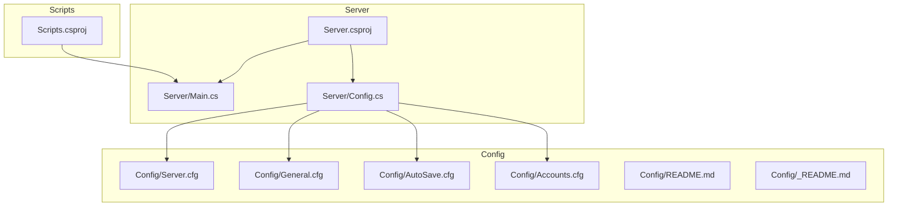
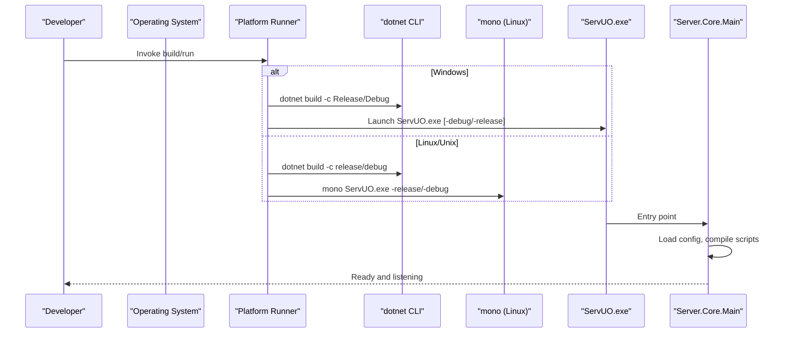
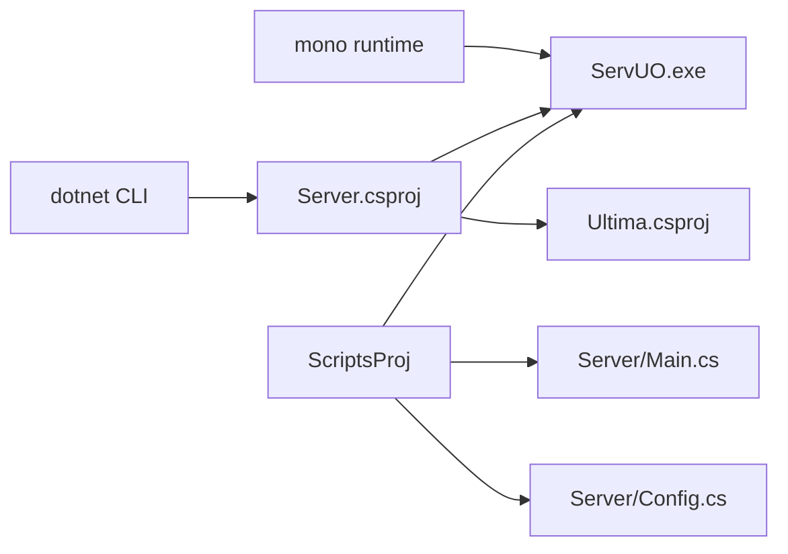

# Getting Started

<cite>
**Referenced Files in This Document**
- [README.md](file://README.md)
- [_winrelease.bat](file://_winrelease.bat)
- [_windebug.bat](file://_windebug.bat)
- [makefile](file://makefile)
- [Server.csproj](file://Server/Server.csproj)
- [Scripts.csproj](file://Scripts/Scripts.csproj)
- [ServUO.exe.config](file://ServUO.exe.config)
- [Server.cfg](file://Config/Server.cfg)
- [General.cfg](file://Config/General.cfg)
- [AutoSave.cfg](file://Config/AutoSave.cfg)
- [Accounts.cfg](file://Config/Accounts.cfg)
- [Main.cs](file://Server/Main.cs)
- [Config.cs](file://Server/Config.cs)
- [README.md (Config)](file://Config/README.md)
- [_README.md (Config Overrides)](file://Config/_README.md)
</cite>

## Table of Contents
1. [Introduction](#introduction)
2. [Project Structure](#project-structure)
3. [Core Components](#core-components)
4. [Architecture Overview](#architecture-overview)
5. [Detailed Component Analysis](#detailed-component-analysis)
6. [Dependency Analysis](#dependency-analysis)
7. [Performance Considerations](#performance-considerations)
8. [Troubleshooting Guide](#troubleshooting-guide)
9. [Conclusion](#conclusion)
10. [Appendices](#appendices)

## Introduction
This guide helps you install, configure, and run ServUO for the first time. It covers platform-specific build and run steps for Windows and Linux/Unix, essential configuration files, and how to verify the server is working. It also explains system requirements, optional dependencies, and common pitfalls to avoid.

## Project Structure
ServUO is organized into a server executable, scripts, and a data/config layer:
- Server executable and core runtime live under Server/.
- Script assemblies live under Scripts/.
- Configuration files live under Config/.
- Data assets and XML spawn definitions live under Data/ and Spawns/.

**Diagram sources**
- [Server.csproj](file://Server/Server.csproj#L1-L28)
- [Scripts.csproj](file://Scripts/Scripts.csproj#L1-L34)
- [Main.cs](file://Server/Main.cs#L290-L560)
- [Config.cs](file://Server/Config.cs#L1-L200)
- [Server.cfg](file://Config/Server.cfg#L1-L19)
- [General.cfg](file://Config/General.cfg#L1-L20)
- [AutoSave.cfg](file://Config/AutoSave.cfg#L1-L47)
- [Accounts.cfg](file://Config/Accounts.cfg#L1-L26)
- [README.md (Config)](file://Config/README.md#L1-L17)
- [_README.md (Config Overrides)](file://Config/_README.md#L1-L35)

**Section sources**
- [README.md](file://README.md#L1-L60)
- [Server.csproj](file://Server/Server.csproj#L1-L28)
- [Scripts.csproj](file://Scripts/Scripts.csproj#L1-L34)

## Core Components
- Server executable: Built via dotnet SDK targeting net48 and configured as an executable with a StartupObject.
- Scripts assembly: A library project that compiles into the server runtime.
- Configuration system: Loads *.cfg files from Config/ at startup.
- Platform runners: Windows batch files and a makefile for Linux/Unix.

Key configuration files to review:
- Server.cfg: Shard name, listening address, advertised address, and port.
- General.cfg: Metrics toggle, help system, item decay, and red-related restrictions.
- AutoSave.cfg: Automatic world save scheduling and archive retention.
- Accounts.cfg: Account/IP limits, auto-create, deletion restrictions, and password protection.

**Section sources**
- [Server.csproj](file://Server/Server.csproj#L1-L28)
- [Scripts.csproj](file://Scripts/Scripts.csproj#L1-L34)
- [Server.cfg](file://Config/Server.cfg#L1-L19)
- [General.cfg](file://Config/General.cfg#L1-L20)
- [AutoSave.cfg](file://Config/AutoSave.cfg#L1-L47)
- [Accounts.cfg](file://Config/Accounts.cfg#L1-L26)

## Architecture Overview
The server starts by loading configuration, compiling scripts, initializing regions/world, and entering the main loop. Platform runners build and launch the executable with appropriate arguments.

**Diagram sources**
- [_winrelease.bat](file://_winrelease.bat#L1-L31)
- [_windebug.bat](file://_windebug.bat#L1-L31)
- [makefile](file://makefile#L1-L34)
- [Server.csproj](file://Server/Server.csproj#L1-L28)
- [Main.cs](file://Server/Main.cs#L320-L560)

## Detailed Component Analysis

### Platform-Specific Installation and Build

- Windows
  - Use _windebug.bat for development builds with debug symbols and console output.
  - Use _winrelease.bat for production builds and immediate launch.
  - Both scripts call dotnet build with Release or Debug configuration and then launch ServUO.exe with optional arguments.

- Linux/Unix
  - Use make for a quick build-and-run cycle.
  - make debug builds with Debug configuration and runs with mono -debug.
  - make or make release builds with Release configuration and runs with mono -release.

- Notes
  - The makefile checks for the built executable and exits early if missing.
  - The Windows batch files echo progress and pause for visibility.

**Section sources**
- [_winrelease.bat](file://_winrelease.bat#L1-L31)
- [_windebug.bat](file://_windebug.bat#L1-L31)
- [makefile](file://makefile#L1-L34)

### System Requirements and Dependencies

- .NET runtime and SDK
  - The server targets net48. Ensure the matching .NET runtime and SDK are installed.
  - ServUO.exe.config declares supportedRuntime for .NETFramework v4.8.

- Linux/Unix specifics
  - Install mono-complete to run the executable via mono.
  - Install dotnet-sdk and dotnet-runtime compatible with the target framework.

- Ubuntu/Debian example commands are provided in the repository’s README.

**Section sources**
- [ServUO.exe.config](file://ServUO.exe.config#L1-L6)
- [README.md](file://README.md#L34-L47)
- [Server.csproj](file://Server/Server.csproj#L1-L14)

### Essential Configuration Steps

1) Review Config file format
- Lines starting with # describe the following option.
- Blank lines end descriptions.
- Set options with Key=Value.
- Prefix with @ to force defaults and suppress warnings.

2) Edit Server.cfg
- Set shard Name, Listen address, advertised Address, and Port.
- Typical defaults are provided in comments.

3) Review other *.cfg files
- General.cfg: Metrics, help system, item decay, red restrictions.
- AutoSave.cfg: Enable automatic saves, frequency, warning time, archive settings.
- Accounts.cfg: Accounts per IP, auto-create, deletion delay, password protection.

4) Optional overrides
- Use Config/_DEBUG.cfg to override options during local debug sessions without editing main configs.

**Section sources**
- [README.md (Config)](file://Config/README.md#L1-L17)
- [Server.cfg](file://Config/Server.cfg#L1-L19)
- [General.cfg](file://Config/General.cfg#L1-L20)
- [AutoSave.cfg](file://Config/AutoSave.cfg#L1-L47)
- [Accounts.cfg](file://Config/Accounts.cfg#L1-L26)
- [_README.md (Config Overrides)](file://Config/_README.md#L1-L35)

### First Server Launch

- Windows
  - Run _windebug.bat or _winrelease.bat from the repository root.
  - The batch files build and launch the executable accordingly.

- Linux/Unix
  - Run make debug for development or make or make release for production.
  - The makefile builds and launches via mono with the appropriate argument.

- What to expect
  - The server prints version/build info, runtime detection, and configuration load messages.
  - After initialization, it enters the main loop and begins accepting connections.

**Section sources**
- [_winrelease.bat](file://_winrelease.bat#L1-L31)
- [_windebug.bat](file://_windebug.bat#L1-L31)
- [makefile](file://makefile#L1-L34)
- [Main.cs](file://Server/Main.cs#L440-L560)

### Verification That the Server Is Running Correctly

- Console output
  - Look for version/build date and runtime lines.
  - Confirm successful script compilation and initialization.
  - Ensure the server reports “ready” and is listening on the configured port.

- Network connectivity
  - From a client on the same network, connect to the configured Address and Port.
  - If hosting remotely, ensure firewall/NAT rules allow inbound connections on the configured Port.

- Logs
  - On Windows service mode, logs are written to Logs/Console.log.
  - Otherwise, console output is the primary log.

**Section sources**
- [Main.cs](file://Server/Main.cs#L440-L560)
- [README.md](file://README.md#L1-L60)

### Practical Configuration Examples and Effects

- Server.cfg
  - Name: Sets the shard name shown to clients.
  - Listen: Controls interface binding; default binds to all interfaces.
  - Address: Publicly advertised address for server list discovery.
  - Port: Listening port; default is commonly used for UO.

- General.cfg
  - Metrics: Enables Windows performance counters for world save metrics (requires admin run once).
  - DefaultItemDecayTime: Controls how quickly dropped items decay.
  - RestrictRedsToFel: Limits red player spawns to Felucca-like facets.

- AutoSave.cfg
  - Enabled: Toggle automatic world saves.
  - Frequency: Interval between saves.
  - WarningTime: Advance warning given to players before save.
  - ArchivesEnabled/ArchivesAsync/ArchivesExpire/ArchivesMerging/ArchivesPath: Archive retention and storage.

- Accounts.cfg
  - AccountsPerIp: Limit simultaneous accounts per IP.
  - AutoCreateAccounts: Allow first-time login account creation.
  - DeleteDelay: Minimum character age for deletion.
  - ProtectPasswords: Password hashing scheme.

**Section sources**
- [Server.cfg](file://Config/Server.cfg#L1-L19)
- [General.cfg](file://Config/General.cfg#L1-L20)
- [AutoSave.cfg](file://Config/AutoSave.cfg#L1-L47)
- [Accounts.cfg](file://Config/Accounts.cfg#L1-L26)

## Dependency Analysis
The server executable depends on the Scripts assembly and the Ultima asset library. The Scripts assembly depends on Server and Ultima. Platform runners depend on dotnet CLI and optionally mono.

**Diagram sources**
- [Server.csproj](file://Server/Server.csproj#L1-L28)
- [Scripts.csproj](file://Scripts/Scripts.csproj#L1-L34)
- [Main.cs](file://Server/Main.cs#L290-L560)
- [Config.cs](file://Server/Config.cs#L1-L200)

**Section sources**
- [Server.csproj](file://Server/Server.csproj#L1-L28)
- [Scripts.csproj](file://Scripts/Scripts.csproj#L1-L34)

## Performance Considerations
- Use make or _winrelease.bat for production builds to optimize runtime performance.
- On Unix systems, mono runtime detection is printed; ensure a compatible runtime is installed.
- Automatic saves and archives can impact performance; tune AutoSave.cfg Frequency and WarningTime appropriately.

[No sources needed since this section provides general guidance]

## Troubleshooting Guide

Common startup issues and resolutions:
- Missing dependencies
  - Symptom: Failure to run on Linux or missing runtime messages.
  - Fix: Install mono-complete and the matching dotnet-sdk/runtime as indicated in the repository README.

- Build failures
  - Symptom: make fails to produce ServUO.exe or _winrelease/_windebug.bat exits early.
  - Fix: Ensure dotnet SDK is installed and the solution builds successfully. The makefile checks for the executable and aborts if missing.

- Configuration errors
  - Symptom: Server fails to start or warns about invalid config values.
  - Fix: Review Config/README.md for syntax and @prefix behavior. Validate Server.cfg, General.cfg, AutoSave.cfg, and Accounts.cfg.

- Debugging
  - Use _windebug.bat or make debug to enable verbose output and attach a debugger.
  - The server supports -debug and -help flags; see Main.cs for available parameters.

- Logs
  - On Windows service mode, check Logs/Console.log.
  - Otherwise, rely on console output for diagnostics.

**Section sources**
- [README.md](file://README.md#L34-L47)
- [makefile](file://makefile#L21-L29)
- [README.md (Config)](file://Config/README.md#L1-L17)
- [_winrelease.bat](file://_winrelease.bat#L1-L31)
- [_windebug.bat](file://_windebug.bat#L1-L31)
- [Main.cs](file://Server/Main.cs#L360-L420)

## Conclusion
You now have the essentials to install ServUO, configure core settings, build and run on your platform, and troubleshoot common issues. Start with Server.cfg, review the other *.cfg files, and use the platform runners to build and launch. For production, prefer release builds; for development, use debug builds and the provided scripts.

[No sources needed since this section summarizes without analyzing specific files]

## Appendices

### Quick Reference: Platform Commands
- Windows
  - Development: run _windebug.bat
  - Production: run _winrelease.bat

- Linux/Unix
  - Development: make debug
  - Production: make or make release

**Section sources**
- [_winrelease.bat](file://_winrelease.bat#L1-L31)
- [_windebug.bat](file://_windebug.bat#L1-L31)
- [makefile](file://makefile#L1-L34)