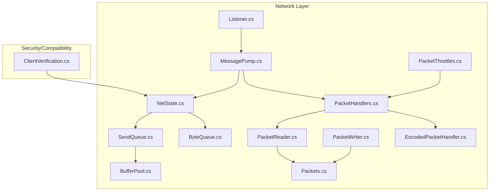
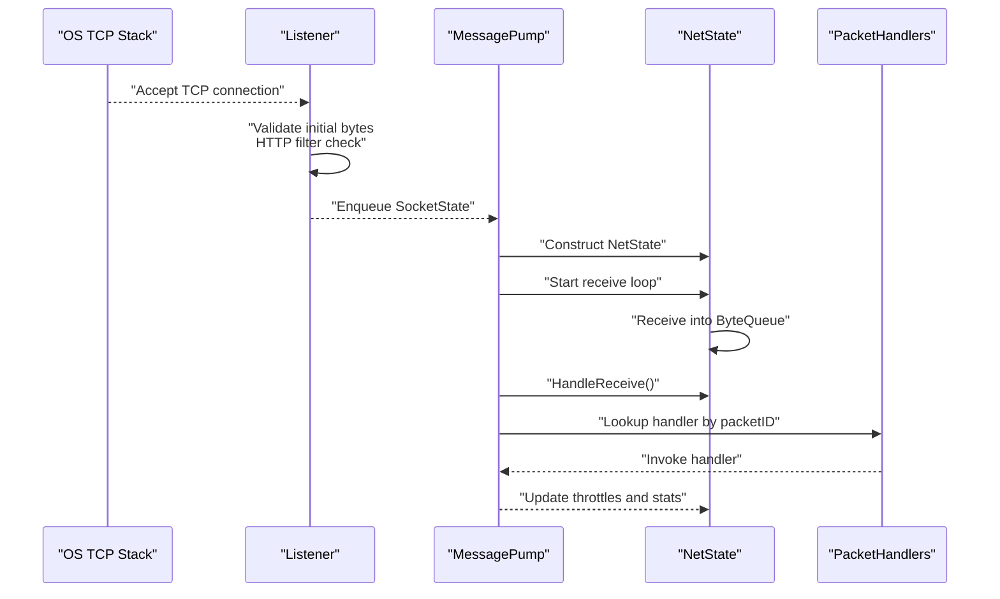
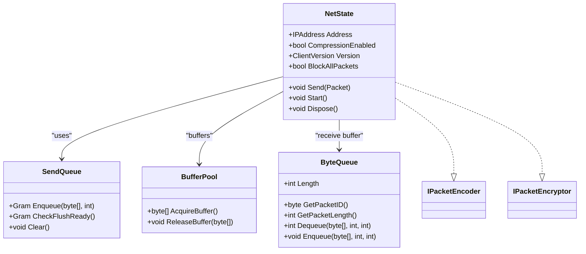
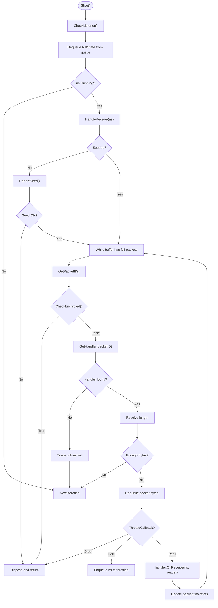
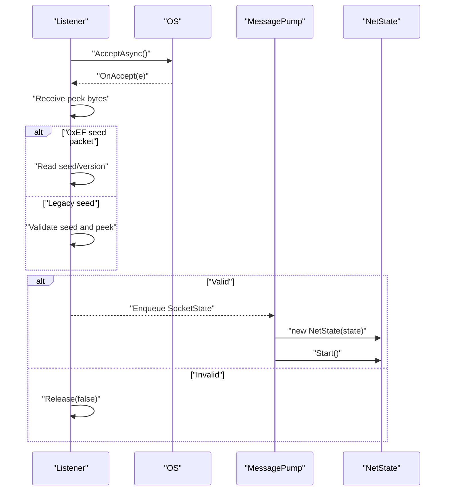
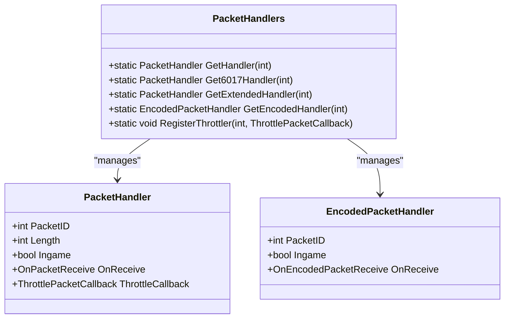
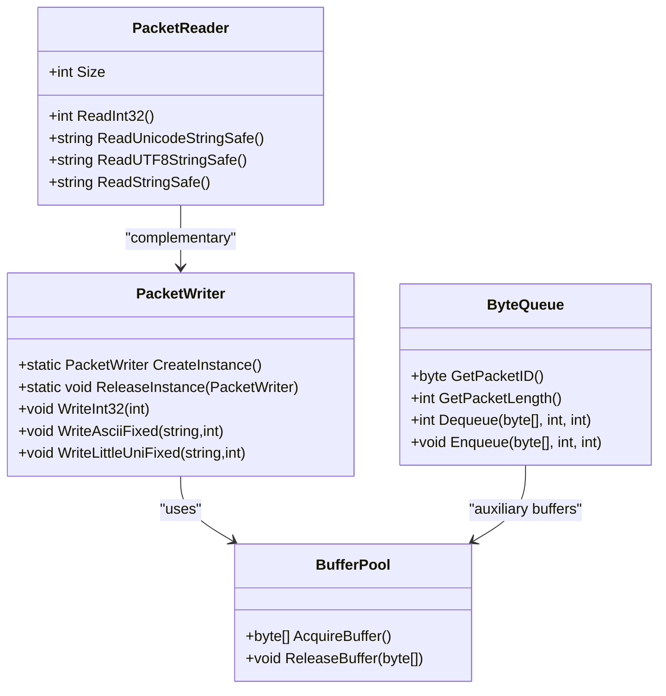
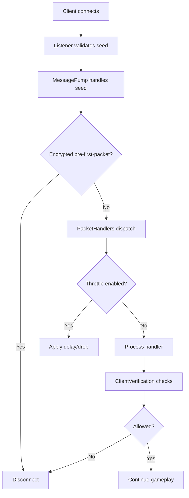
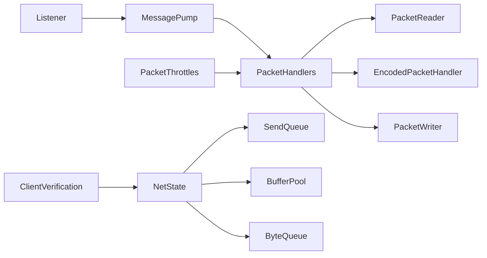

# Network Layer

<cite>
**Referenced Files in This Document**
- [NetState.cs](file://Server/Network/NetState.cs)
- [MessagePump.cs](file://Server/Network/MessagePump.cs)
- [Listener.cs](file://Server/Network/Listener.cs)
- [PacketHandlers.cs](file://Server/Network/PacketHandlers.cs)
- [PacketHandler.cs](file://Server/Network/PacketHandler.cs)
- [EncodedPacketHandler.cs](file://Server/Network/EncodedPacketHandler.cs)
- [PacketReader.cs](file://Server/Network/PacketReader.cs)
- [PacketWriter.cs](file://Server/Network/PacketWriter.cs)
- [SendQueue.cs](file://Server/Network/SendQueue.cs)
- [ByteQueue.cs](file://Server/Network/ByteQueue.cs)
- [BufferPool.cs](file://Server/Network/BufferPool.cs)
- [PacketThrottles.cs](file://Server/Network/PacketThrottles.cs)
- [Packets.cs](file://Server/Network/Packets.cs)
- [ClientVerification.cs](file://Scripts/Misc/ClientVerification.cs)
</cite>

## Table of Contents
1. [Introduction](#introduction)
2. [Project Structure](#project-structure)
3. [Core Components](#core-components)
4. [Architecture Overview](#architecture-overview)
5. [Detailed Component Analysis](#detailed-component-analysis)
6. [Dependency Analysis](#dependency-analysis)
7. [Performance Considerations](#performance-considerations)
8. [Troubleshooting Guide](#troubleshooting-guide)
9. [Conclusion](#conclusion)
10. [Appendices](#appendices)

## Introduction
This document explains ServUO’s TCP network layer with a focus on connection lifecycle, packet processing, protocol negotiation, encoding/decoding, security, and performance. It covers:
- NetState: connection state, buffers, send queue, and client version handling
- MessagePump: accept loop, receive processing, throttling, and flood protection
- Listener: accepting TCP connections, basic handshake validation, and HTTP filter checks
- PacketHandlers: packet dispatch, extended and encoded handlers, and throttling registration
- Encoding/decoding: PacketReader/PacketWriter and buffer pooling
- Security: client verification, encryption checks, and anti-flood measures
- Performance: buffer pools, coalescing, and throttling

## Project Structure
ServUO organizes the network layer under Server/Network with supporting scripts for client verification. The core files implement:
- Connection lifecycle: Listener, NetState, SendQueue
- Packet pipeline: MessagePump, PacketHandlers, PacketReader/Writer
- Buffer management: ByteQueue, BufferPool
- Throttling and flood protection: PacketThrottles
- Client compatibility: ClientVerification

**Diagram sources**
- [Listener.cs](file://Server/Network/Listener.cs#L1-L547)
- [MessagePump.cs](file://Server/Network/MessagePump.cs#L1-L366)
- [NetState.cs](file://Server/Network/NetState.cs#L1-L1342)
- [SendQueue.cs](file://Server/Network/SendQueue.cs#L1-L213)
- [ByteQueue.cs](file://Server/Network/ByteQueue.cs#L1-L148)
- [BufferPool.cs](file://Server/Network/BufferPool.cs#L1-L99)
- [PacketHandlers.cs](file://Server/Network/PacketHandlers.cs#L1-L3370)
- [PacketReader.cs](file://Server/Network/PacketReader.cs#L1-L511)
- [PacketWriter.cs](file://Server/Network/PacketWriter.cs#L1-L439)
- [PacketThrottles.cs](file://Server/Network/PacketThrottles.cs#L1-L203)
- [EncodedPacketHandler.cs](file://Server/Network/EncodedPacketHandler.cs#L1-L24)
- [Packets.cs](file://Server/Network/Packets.cs#L1-L200)
- [ClientVerification.cs](file://Scripts/Misc/ClientVerification.cs#L1-L242)

**Section sources**
- [Listener.cs](file://Server/Network/Listener.cs#L1-L547)
- [MessagePump.cs](file://Server/Network/MessagePump.cs#L1-L366)
- [NetState.cs](file://Server/Network/NetState.cs#L1-L1342)
- [PacketHandlers.cs](file://Server/Network/PacketHandlers.cs#L1-L3370)
- [PacketReader.cs](file://Server/Network/PacketReader.cs#L1-L511)
- [PacketWriter.cs](file://Server/Network/PacketWriter.cs#L1-L439)
- [SendQueue.cs](file://Server/Network/SendQueue.cs#L1-L213)
- [ByteQueue.cs](file://Server/Network/ByteQueue.cs#L1-L148)
- [BufferPool.cs](file://Server/Network/BufferPool.cs#L1-L99)
- [PacketThrottles.cs](file://Server/Network/PacketThrottles.cs#L1-L203)
- [EncodedPacketHandler.cs](file://Server/Network/EncodedPacketHandler.cs#L1-L24)
- [Packets.cs](file://Server/Network/Packets.cs#L1-L200)
- [ClientVerification.cs](file://Scripts/Misc/ClientVerification.cs#L1-L242)

## Core Components
- NetState: per-connection state, buffers, send queue, client version, compression, and caps for gumps/menus/hue pickers
- MessagePump: accept loop, receive queue, throttling, and packet dispatch
- Listener: TCP accept loop, basic handshake validation, HTTP filter, and enqueues validated sockets
- PacketHandlers: packet registry, extended and encoded handlers, and throttler registration
- Buffering: ByteQueue for inbound, BufferPool for reusable buffers, SendQueue for outbound coalescing
- Security: client verification hooks, encryption checks, and throttling for flood protection

**Section sources**
- [NetState.cs](file://Server/Network/NetState.cs#L1-L1342)
- [MessagePump.cs](file://Server/Network/MessagePump.cs#L1-L366)
- [Listener.cs](file://Server/Network/Listener.cs#L1-L547)
- [PacketHandlers.cs](file://Server/Network/PacketHandlers.cs#L1-L3370)
- [PacketThrottles.cs](file://Server/Network/PacketThrottles.cs#L1-L203)

## Architecture Overview
The network stack begins with Listener accepting TCP connections, validates the initial bytes, and enqueues a SocketState. MessagePump slices accepted sockets, constructs NetState instances, and starts receive processing. NetState maintains receive/send queues and delegates packet handling to PacketHandlers via MessagePump. PacketHandlers dispatch to registered handlers, optionally using Encoded handlers for BF/encoded commands. BufferPool and ByteQueue minimize allocations and manage packet boundaries.

**Diagram sources**
- [Listener.cs](file://Server/Network/Listener.cs#L1-L547)
- [MessagePump.cs](file://Server/Network/MessagePump.cs#L1-L366)
- [NetState.cs](file://Server/Network/NetState.cs#L1-L1342)
- [PacketHandlers.cs](file://Server/Network/PacketHandlers.cs#L1-L3370)

## Detailed Component Analysis

### NetState: Connection Management and Protocol Negotiation
- Maintains remote address, socket, receive/send buffers, and send queue
- Tracks client version and derives protocol changes bitmask for feature flags
- Supports compression, encryption/encoding hooks, and caps for UI interactions
- Implements send pipeline with optional encoder/encryptor, buffer pooling, and async send
- Handles secure trading, menus, gumps, and hue picker lifecycle with caps

**Diagram sources**
- [NetState.cs](file://Server/Network/NetState.cs#L1-L1342)
- [SendQueue.cs](file://Server/Network/SendQueue.cs#L1-L213)
- [BufferPool.cs](file://Server/Network/BufferPool.cs#L1-L99)
- [ByteQueue.cs](file://Server/Network/ByteQueue.cs#L1-L148)

**Section sources**
- [NetState.cs](file://Server/Network/NetState.cs#L1-L1342)

### MessagePump: Packet Processing Loop and Flood Protection
- Starts Listener instances for configured endpoints
- Accepts SocketState from Listener, creates NetState, and starts receive loop
- Maintains receive queue and throttled queue; processes packets in batches
- Validates seed/initial bytes, detects encrypted clients pre-first-packet, and enforces reserved packets
- Dispatches to PacketHandlers with throttling callback support

**Diagram sources**
- [MessagePump.cs](file://Server/Network/MessagePump.cs#L1-L366)
- [PacketHandlers.cs](file://Server/Network/PacketHandlers.cs#L1-L3370)

**Section sources**
- [MessagePump.cs](file://Server/Network/MessagePump.cs#L1-L366)
- [PacketThrottles.cs](file://Server/Network/PacketThrottles.cs#L1-L203)

### Listener: TCP Accept and Initial Validation
- Binds TCP socket to configured endpoints, listens with backlog
- AcceptAsync loop with concurrency limiter and IOCP-style completion
- Validates first bytes: supports 0xEF seed packet and legacy seed + peek
- HTTP method filter blocks common web requests
- Releases gracefully on invalid sequences

**Diagram sources**
- [Listener.cs](file://Server/Network/Listener.cs#L1-L547)
- [MessagePump.cs](file://Server/Network/MessagePump.cs#L1-L366)

**Section sources**
- [Listener.cs](file://Server/Network/Listener.cs#L1-L547)

### PacketHandlers: Protocol Negotiation and Dispatch
- Registers handlers for classic and extended packets
- Supports encoded packets (BF) with EncodedPacketHandler
- Provides throttling registration and reserved packet protection
- Includes protocol-specific handlers for login, character selection, and gameplay

**Diagram sources**
- [PacketHandlers.cs](file://Server/Network/PacketHandlers.cs#L1-L3370)
- [PacketHandler.cs](file://Server/Network/PacketHandler.cs#L1-L33)
- [EncodedPacketHandler.cs](file://Server/Network/EncodedPacketHandler.cs#L1-L24)

**Section sources**
- [PacketHandlers.cs](file://Server/Network/PacketHandlers.cs#L1-L3370)
- [PacketHandler.cs](file://Server/Network/PacketHandler.cs#L1-L33)
- [EncodedPacketHandler.cs](file://Server/Network/EncodedPacketHandler.cs#L1-L24)

### Encoding/Decoding: PacketReader, PacketWriter, and Buffering
- PacketReader: safe reads for integers, booleans, strings (ASCII/Unicode/UTF-8), with bounds checking and safety filters
- PacketWriter: pooled writer with primitives and string encodings; supports re-use via instance pool
- BufferPool: pre-sized buffers for send/receive and coalesced sends
- ByteQueue: ring-buffer for inbound packet assembly and boundary detection

**Diagram sources**
- [PacketReader.cs](file://Server/Network/PacketReader.cs#L1-L511)
- [PacketWriter.cs](file://Server/Network/PacketWriter.cs#L1-L439)
- [BufferPool.cs](file://Server/Network/BufferPool.cs#L1-L99)
- [ByteQueue.cs](file://Server/Network/ByteQueue.cs#L1-L148)

**Section sources**
- [PacketReader.cs](file://Server/Network/PacketReader.cs#L1-L511)
- [PacketWriter.cs](file://Server/Network/PacketWriter.cs#L1-L439)
- [BufferPool.cs](file://Server/Network/BufferPool.cs#L1-L99)
- [ByteQueue.cs](file://Server/Network/ByteQueue.cs#L1-L148)

### Security: Client Verification and Anti-Flood
- ClientVerification: enforces minimum client versions, client type allowances, and delayed kicks for outdated or disallowed clients
- MessagePump: rejects encrypted clients before first packet; HTTP filter blocks common web requests
- PacketThrottles: configurable per-packet delays with reserved packets protected from override

**Diagram sources**
- [MessagePump.cs](file://Server/Network/MessagePump.cs#L1-L366)
- [PacketThrottles.cs](file://Server/Network/PacketThrottles.cs#L1-L203)
- [ClientVerification.cs](file://Scripts/Misc/ClientVerification.cs#L1-L242)

**Section sources**
- [ClientVerification.cs](file://Scripts/Misc/ClientVerification.cs#L1-L242)
- [MessagePump.cs](file://Server/Network/MessagePump.cs#L1-L366)
- [PacketThrottles.cs](file://Server/Network/PacketThrottles.cs#L1-L203)

## Dependency Analysis
- Listener depends on Socket APIs and enqueues validated SocketState to MessagePump
- MessagePump depends on PacketHandlers for dispatch and NetState for buffering
- NetState depends on SendQueue and BufferPool for efficient sending
- PacketHandlers depends on PacketReader/Writer and EncodedReader for parsing
- PacketThrottles registers callbacks into PacketHandlers
- ClientVerification subscribes to version/type events and interacts with NetState/Mobile

**Diagram sources**
- [Listener.cs](file://Server/Network/Listener.cs#L1-L547)
- [MessagePump.cs](file://Server/Network/MessagePump.cs#L1-L366)
- [PacketHandlers.cs](file://Server/Network/PacketHandlers.cs#L1-L3370)
- [PacketReader.cs](file://Server/Network/PacketReader.cs#L1-L511)
- [PacketWriter.cs](file://Server/Network/PacketWriter.cs#L1-L439)
- [EncodedPacketHandler.cs](file://Server/Network/EncodedPacketHandler.cs#L1-L24)
- [NetState.cs](file://Server/Network/NetState.cs#L1-L1342)
- [SendQueue.cs](file://Server/Network/SendQueue.cs#L1-L213)
- [BufferPool.cs](file://Server/Network/BufferPool.cs#L1-L99)
- [ByteQueue.cs](file://Server/Network/ByteQueue.cs#L1-L148)
- [PacketThrottles.cs](file://Server/Network/PacketThrottles.cs#L1-L203)
- [ClientVerification.cs](file://Scripts/Misc/ClientVerification.cs#L1-L242)

**Section sources**
- [Listener.cs](file://Server/Network/Listener.cs#L1-L547)
- [MessagePump.cs](file://Server/Network/MessagePump.cs#L1-L366)
- [PacketHandlers.cs](file://Server/Network/PacketHandlers.cs#L1-L3370)
- [NetState.cs](file://Server/Network/NetState.cs#L1-L1342)
- [PacketThrottles.cs](file://Server/Network/PacketThrottles.cs#L1-L203)
- [ClientVerification.cs](file://Scripts/Misc/ClientVerification.cs#L1-L242)

## Performance Considerations
- Buffer pooling: BufferPool reduces GC pressure for send/receive and coalesced buffers
- Send coalescing: SendQueue aggregates small writes into larger flushes
- Packet throttling: PacketThrottles limits noisy packets and protects reserved ones
- Reader safety: PacketReader enforces bounds and safe string decoding to avoid exceptions
- Compression: NetState exposes CompressionEnabled for downstream packet writers
- Concurrency: MessagePump uses concurrent queues and lightweight locks around critical sections

[No sources needed since this section provides general guidance]

## Troubleshooting Guide
Common issues and remedies:
- Excessive pending data: CapacityExceededException indicates the send queue overflow; reduce burst rate or increase capacity thresholds
  - See: [SendQueue.cs](file://Server/Network/SendQueue.cs#L1-L213)
- Null send buffer: NetState logs and disconnects on null buffer sends; inspect packet compilation
  - See: [NetState.cs](file://Server/Network/NetState.cs#L1-L1342)
- Invalid seed or HTTP probe: Listener drops connections that fail seed validation or match HTTP verbs
  - See: [Listener.cs](file://Server/Network/Listener.cs#L1-L547)
- Encrypted client pre-first-packet: MessagePump rejects unsupported encrypted packets before login
  - See: [MessagePump.cs](file://Server/Network/MessagePump.cs#L1-L366)
- Outdated or disallowed client: ClientVerification enforces minimum versions and client types; configure allowances
  - See: [ClientVerification.cs](file://Scripts/Misc/ClientVerification.cs#L1-L242)
- Packet flooding: Enable throttles for noisy packets; reserved packets are protected
  - See: [PacketThrottles.cs](file://Server/Network/PacketThrottles.cs#L1-L203)

**Section sources**
- [SendQueue.cs](file://Server/Network/SendQueue.cs#L1-L213)
- [NetState.cs](file://Server/Network/NetState.cs#L1-L1342)
- [Listener.cs](file://Server/Network/Listener.cs#L1-L547)
- [MessagePump.cs](file://Server/Network/MessagePump.cs#L1-L366)
- [ClientVerification.cs](file://Scripts/Misc/ClientVerification.cs#L1-L242)
- [PacketThrottles.cs](file://Server/Network/PacketThrottles.cs#L1-L203)

## Conclusion
ServUO’s network layer combines robust connection acceptance, efficient buffering, and strict protocol handling. NetState encapsulates per-client state and security posture, MessagePump orchestrates receive processing and throttling, and PacketHandlers provide extensible dispatch for classic, extended, and encoded packets. Together with buffer pooling and client verification, the system balances performance, security, and maintainability.

[No sources needed since this section summarizes without analyzing specific files]

## Appendices

### Protocol Version Negotiation and Compatibility
- ClientVersion and ProtocolChanges flags drive feature availability per client build
- NetState.Version setter updates protocol flags; handlers reference these flags for behavior
- ClientVerification enforces minimum versions and client types

**Section sources**
- [NetState.cs](file://Server/Network/NetState.cs#L1-L1342)
- [ClientVerification.cs](file://Scripts/Misc/ClientVerification.cs#L1-L242)

### Example Packet Processing Workflow
- Listener validates initial bytes and enqueues SocketState
- MessagePump constructs NetState and starts receive loop
- NetState fills ByteQueue; MessagePump drains and dispatches to PacketHandlers
- Handlers use PacketReader to parse safely; optional throttling applies

**Section sources**
- [Listener.cs](file://Server/Network/Listener.cs#L1-L547)
- [MessagePump.cs](file://Server/Network/MessagePump.cs#L1-L366)
- [PacketHandlers.cs](file://Server/Network/PacketHandlers.cs#L1-L3370)
- [PacketReader.cs](file://Server/Network/PacketReader.cs#L1-L511)