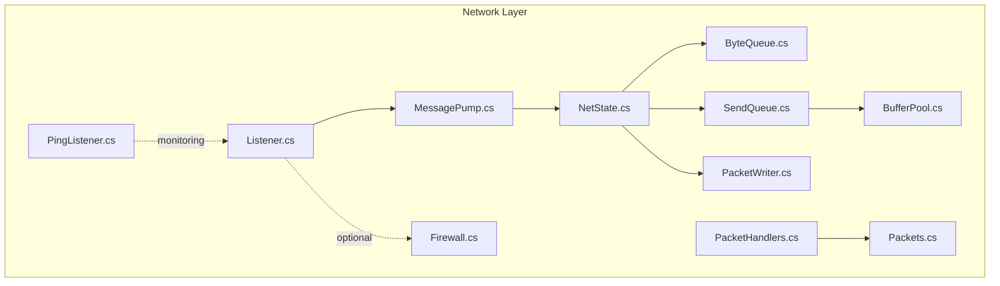
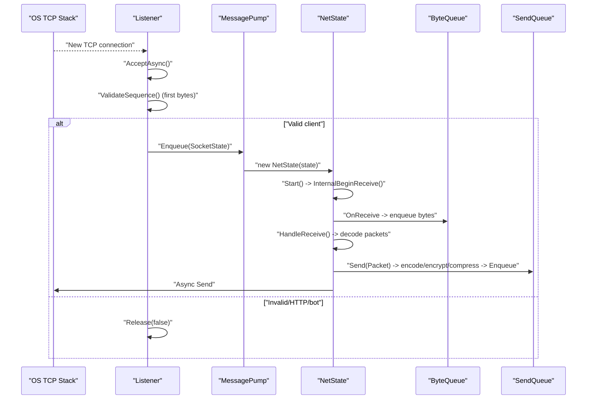
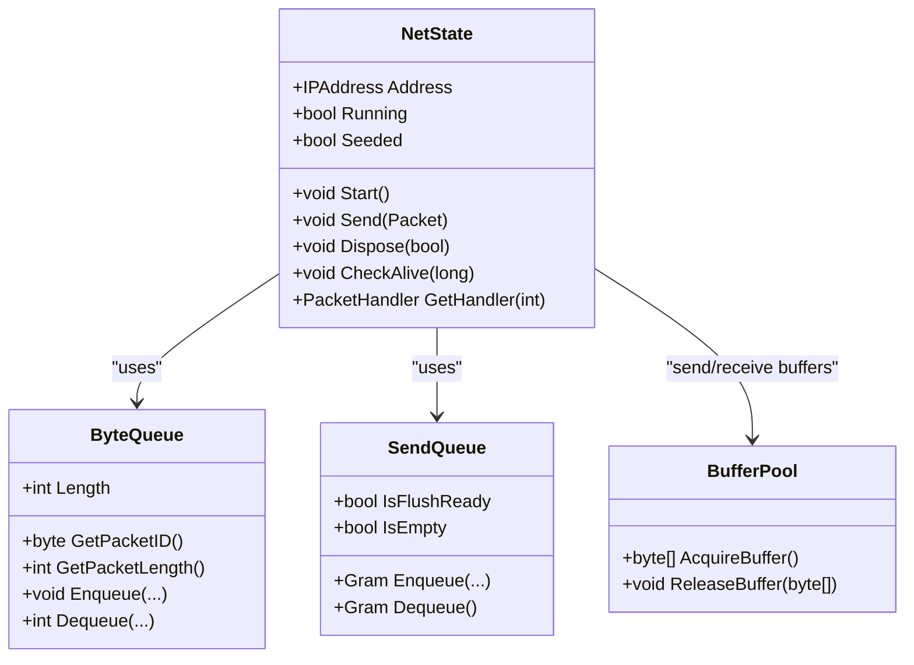
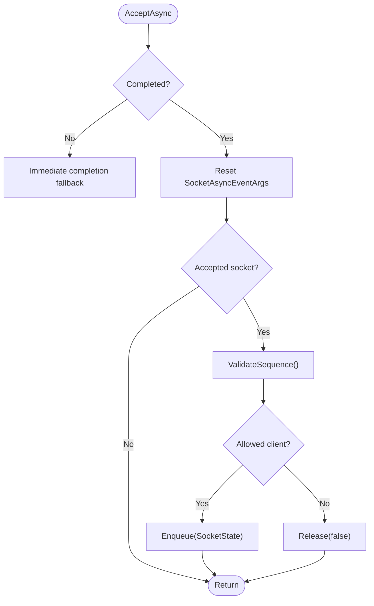
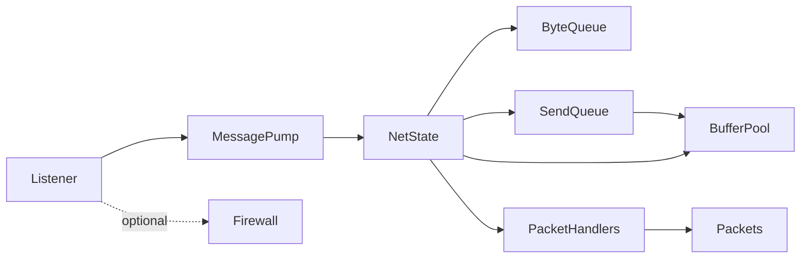

# TCP Socket Management

<cite>
**Referenced Files in This Document**
- [NetState.cs](file://Server/Network/NetState.cs)
- [Listener.cs](file://Server/Network/Listener.cs)
- [MessagePump.cs](file://Server/Network/MessagePump.cs)
- [BufferPool.cs](file://Server/Network/BufferPool.cs)
- [SendQueue.cs](file://Server/Network/SendQueue.cs)
- [ByteQueue.cs](file://Server/Network/ByteQueue.cs)
- [PacketWriter.cs](file://Server/Network/PacketWriter.cs)
- [PingListener.cs](file://Server/Network/PingListener.cs)
- [PacketHandlers.cs](file://Server/Network/PacketHandlers.cs)
- [Packets.cs](file://Server/Network/Packets.cs)
- [Firewall.cs](file://Scripts/Accounting/Firewall.cs)
</cite>

## Table of Contents
1. [Introduction](#introduction)
2. [Project Structure](#project-structure)
3. [Core Components](#core-components)
4. [Architecture Overview](#architecture-overview)
5. [Detailed Component Analysis](#detailed-component-analysis)
6. [Dependency Analysis](#dependency-analysis)
7. [Performance Considerations](#performance-considerations)
8. [Troubleshooting Guide](#troubleshooting-guide)
9. [Conclusion](#conclusion)
10. [Appendices](#appendices)

## Introduction
This document explains TCP socket management in ServUO’s network layer, focusing on connection lifecycle control, listener configuration, asynchronous I/O, buffer management, and robust cleanup. It covers:
- NetState: connection initialization, receive/send loops, timeouts, and disposal
- Listener: accepting inbound connections, socket configuration, and connection gating
- MessagePump: dispatching accepted sockets to NetState instances
- Buffering and memory optimization via BufferPool and SendQueue
- Practical examples for socket creation, error handling, and resource cleanup
- Firewall configuration, port binding, and network interface selection
- Debugging and performance monitoring techniques

## Project Structure
ServUO organizes networking under Server/Network with modular responsibilities:
- Listener: TCP acceptor and pre-authentication filtering
- MessagePump: orchestrates listeners, queues accepted sockets, and starts NetState
- NetState: per-client session, async receive/send, protocol/version handling, and lifecycle
- BufferPool: reusable byte buffers to reduce GC pressure
- SendQueue: coalescing outgoing packets and enforcing pending limits
- ByteQueue: streaming inbound bytes and packet demultiplexing
- PacketWriter: efficient packet construction
- PingListener: UDP ping responder for server discovery
- PacketHandlers and Packets: packet registry and packet definitions
- Firewall: optional IP-based connection blocking

**Diagram sources**
- [Listener.cs](file://Server/Network/Listener.cs#L1-L120)
- [MessagePump.cs](file://Server/Network/MessagePump.cs#L1-L120)
- [NetState.cs](file://Server/Network/NetState.cs#L595-L773)
- [BufferPool.cs](file://Server/Network/BufferPool.cs#L1-L99)
- [SendQueue.cs](file://Server/Network/SendQueue.cs#L1-L120)
- [ByteQueue.cs](file://Server/Network/ByteQueue.cs#L1-L148)
- [PacketWriter.cs](file://Server/Network/PacketWriter.cs#L1-L120)
- [PingListener.cs](file://Server/Network/PingListener.cs#L1-L98)
- [PacketHandlers.cs](file://Server/Network/PacketHandlers.cs#L1-L120)
- [Packets.cs](file://Server/Network/Packets.cs#L1-L120)
- [Firewall.cs](file://Scripts/Accounting/Firewall.cs#L1-L120)

**Section sources**
- [Listener.cs](file://Server/Network/Listener.cs#L1-L120)
- [MessagePump.cs](file://Server/Network/MessagePump.cs#L1-L120)
- [NetState.cs](file://Server/Network/NetState.cs#L595-L773)
- [BufferPool.cs](file://Server/Network/BufferPool.cs#L1-L99)
- [SendQueue.cs](file://Server/Network/SendQueue.cs#L1-L120)
- [ByteQueue.cs](file://Server/Network/ByteQueue.cs#L1-L148)
- [PacketWriter.cs](file://Server/Network/PacketWriter.cs#L1-L120)
- [PingListener.cs](file://Server/Network/PingListener.cs#L1-L98)
- [PacketHandlers.cs](file://Server/Network/PacketHandlers.cs#L1-L120)
- [Packets.cs](file://Server/Network/Packets.cs#L1-L120)
- [Firewall.cs](file://Scripts/Accounting/Firewall.cs#L1-L120)

## Core Components
- Listener: binds TCP socket, configures options, accepts asynchronously, validates initial sequence, enqueues validated sockets, and releases rejected ones
- MessagePump: manages multiple listeners, slices accepted sockets, constructs NetState, and starts receive loop
- NetState: holds per-connection state, async receive/send, buffer management, activity timeout, and lifecycle disposal
- BufferPool: preallocates and reuses byte arrays for send/receive/coalesce
- SendQueue: coalesces outbound writes and enforces pending-capacity limits
- ByteQueue: accumulates inbound bytes and exposes packet boundaries
- PacketWriter: efficient packet assembly with pooled writers
- PingListener: UDP echo responder for server discovery
- PacketHandlers/Packets: packet routing and definitions
- Firewall: optional IP/CIDR/wildcard-based blocking

**Section sources**
- [Listener.cs](file://Server/Network/Listener.cs#L81-L171)
- [MessagePump.cs](file://Server/Network/MessagePump.cs#L22-L120)
- [NetState.cs](file://Server/Network/NetState.cs#L595-L885)
- [BufferPool.cs](file://Server/Network/BufferPool.cs#L1-L99)
- [SendQueue.cs](file://Server/Network/SendQueue.cs#L1-L213)
- [ByteQueue.cs](file://Server/Network/ByteQueue.cs#L1-L148)
- [PacketWriter.cs](file://Server/Network/PacketWriter.cs#L1-L120)
- [PingListener.cs](file://Server/Network/PingListener.cs#L1-L98)
- [PacketHandlers.cs](file://Server/Network/PacketHandlers.cs#L1-L120)
- [Packets.cs](file://Server/Network/Packets.cs#L1-L120)
- [Firewall.cs](file://Scripts/Accounting/Firewall.cs#L1-L120)

## Architecture Overview
The network stack follows an accept-then-validate model:
- Listener binds and listens, accepts asynchronously, and validates the first bytes to reject bots/HTTP probes
- Validated sockets are queued and later dequeued by MessagePump to construct NetState
- NetState starts async receive/send loops, applies protocol/version checks, and handles packet decoding
- Outbound packets are encoded/encrypted, optionally compressed, and coalesced before sending

**Diagram sources**
- [Listener.cs](file://Server/Network/Listener.cs#L203-L291)
- [Listener.cs](file://Server/Network/Listener.cs#L294-L414)
- [MessagePump.cs](file://Server/Network/MessagePump.cs#L65-L120)
- [NetState.cs](file://Server/Network/NetState.cs#L775-L885)
- [NetState.cs](file://Server/Network/NetState.cs#L800-L885)
- [SendQueue.cs](file://Server/Network/SendQueue.cs#L127-L188)

**Section sources**
- [Listener.cs](file://Server/Network/Listener.cs#L203-L291)
- [Listener.cs](file://Server/Network/Listener.cs#L294-L414)
- [MessagePump.cs](file://Server/Network/MessagePump.cs#L65-L120)
- [NetState.cs](file://Server/Network/NetState.cs#L775-L885)
- [SendQueue.cs](file://Server/Network/SendQueue.cs#L127-L188)

## Detailed Component Analysis

### NetState: Connection Lifecycle and Async I/O
Responsibilities:
- Socket initialization and capture of remote endpoint
- Async receive loop with continuation chaining and pause/resume
- Async send loop with coalescing and buffered reuse
- Activity timeout enforcement and periodic cleanup
- Packet encoding/encryption and compression hooks
- Graceful shutdown and resource release

Key behaviors:
- Constructor acquires receive buffer from BufferPool, initializes queues, captures address, and registers instance
- Start() begins receive loop guarded by AsyncState flags and thread safety locks
- OnReceive(Task<int>) handles completion, decrypt/decode, enqueue to ByteQueue, and restarts receive
- Send(Packet) compiles packet, applies encoder/encryptor, enqueues to SendQueue, and triggers async send
- OnSend(Task<int>) drains SendQueue, continues async send, and transitions state
- Dispose(flush) shuts down socket, releases buffers, clears state, and enqueues for post-dispose processing

**Diagram sources**
- [NetState.cs](file://Server/Network/NetState.cs#L595-L1176)
- [ByteQueue.cs](file://Server/Network/ByteQueue.cs#L1-L148)
- [SendQueue.cs](file://Server/Network/SendQueue.cs#L1-L213)
- [BufferPool.cs](file://Server/Network/BufferPool.cs#L1-L99)

**Section sources**
- [NetState.cs](file://Server/Network/NetState.cs#L595-L773)
- [NetState.cs](file://Server/Network/NetState.cs#L800-L885)
- [NetState.cs](file://Server/Network/NetState.cs#L887-L949)
- [NetState.cs](file://Server/Network/NetState.cs#L951-L1042)
- [NetState.cs](file://Server/Network/NetState.cs#L1062-L1176)

### Listener: Accepting Connections and Socket Configuration
Responsibilities:
- Bind and listen on configured address/port
- Configure socket options (NoDelay, timeouts, linger)
- AcceptAsync with SocketAsyncEventArgs
- Validate first bytes to detect HTTP/bots and reject them
- Queue validated sockets for MessagePump processing
- Controlled accept rate via AutoResetEvent limiter

Key behaviors:
- Bind(ipep) creates TCP socket, sets options, binds, and listens
- AcceptLoop drives AcceptAsync continuously
- OnAccept handles completion, resets args, validates sequence, and enqueues or releases
- ValidateSequence reads peek bytes, inspects packetID, and accepts only supported clients
- Release closes socket with appropriate linger behavior

**Diagram sources**
- [Listener.cs](file://Server/Network/Listener.cs#L194-L291)
- [Listener.cs](file://Server/Network/Listener.cs#L294-L414)
- [Listener.cs](file://Server/Network/Listener.cs#L446-L525)

**Section sources**
- [Listener.cs](file://Server/Network/Listener.cs#L81-L171)
- [Listener.cs](file://Server/Network/Listener.cs#L194-L291)
- [Listener.cs](file://Server/Network/Listener.cs#L294-L414)
- [Listener.cs](file://Server/Network/Listener.cs#L446-L525)

### MessagePump: Dispatch and Throttling
Responsibilities:
- Start() creates Listener instances for configured endpoints
- Slice() iterates listeners, dequeues validated sockets, fires connect events, and instantiates NetState
- HandleReceive() decodes packets, applies throttling, and invokes handlers
- OnReceive() queues NetState for processing

Key behaviors:
- Start() retries until listeners bind successfully
- Slice() processes up to queue count, delegates to Display() for logging, and calls NetState.Start()
- HandleReceive() parses seed/encrpytion checks, extracts packet boundaries, and routes to handlers

**Section sources**
- [MessagePump.cs](file://Server/Network/MessagePump.cs#L22-L120)
- [MessagePump.cs](file://Server/Network/MessagePump.cs#L113-L213)
- [MessagePump.cs](file://Server/Network/MessagePump.cs#L206-L363)

### Buffer Management and Memory Optimization
- BufferPool: preallocates buffers, tracks misses, and clears buffers before reuse
- SendQueue: coalesces multiple small writes into larger segments, enforces PendingCap, and pools Gram objects
- ByteQueue: dynamic ring buffer with capacity growth and safe wrap-around
- PacketWriter: pooled writer instances to avoid allocations during packet assembly

Recommendations:
- Tune BufferPool capacities for typical payload sizes
- Adjust SendQueue.CoalesceBufferSize to balance throughput vs. latency
- Monitor BufferPool misses to size pools appropriately

**Section sources**
- [BufferPool.cs](file://Server/Network/BufferPool.cs#L1-L99)
- [SendQueue.cs](file://Server/Network/SendQueue.cs#L1-L213)
- [ByteQueue.cs](file://Server/Network/ByteQueue.cs#L1-L148)
- [PacketWriter.cs](file://Server/Network/PacketWriter.cs#L1-L120)

### Packet Routing and Protocol Handling
- PacketHandlers maintains lookup tables for classic and extended packets, including version-specific handlers
- NetState.GetHandler selects appropriate handler based on client version/flags
- Packets defines concrete packet classes used by the server

**Section sources**
- [PacketHandlers.cs](file://Server/Network/PacketHandlers.cs#L1-L120)
- [NetState.cs](file://Server/Network/NetState.cs#L1044-L1052)
- [Packets.cs](file://Server/Network/Packets.cs#L1-L120)

### Firewall and Security Controls
- Firewall supports IP, CIDR, and wildcard entries loaded from a configuration file
- Listener can integrate with firewall logic to block undesired IPs before enqueueing

**Section sources**
- [Firewall.cs](file://Scripts/Accounting/Firewall.cs#L1-L120)
- [Listener.cs](file://Server/Network/Listener.cs#L446-L525)

### UDP Ping Listener
- PingListener binds a UDP socket on a fixed port and echoes received datagrams
- Useful for server discovery and health checks

**Section sources**
- [PingListener.cs](file://Server/Network/PingListener.cs#L1-L98)

## Dependency Analysis

**Diagram sources**
- [Listener.cs](file://Server/Network/Listener.cs#L1-L120)
- [MessagePump.cs](file://Server/Network/MessagePump.cs#L1-L120)
- [NetState.cs](file://Server/Network/NetState.cs#L595-L773)
- [SendQueue.cs](file://Server/Network/SendQueue.cs#L1-L120)
- [BufferPool.cs](file://Server/Network/BufferPool.cs#L1-L99)
- [PacketHandlers.cs](file://Server/Network/PacketHandlers.cs#L1-L120)
- [Packets.cs](file://Server/Network/Packets.cs#L1-L120)
- [Firewall.cs](file://Scripts/Accounting/Firewall.cs#L1-L120)

**Section sources**
- [Listener.cs](file://Server/Network/Listener.cs#L1-L120)
- [MessagePump.cs](file://Server/Network/MessagePump.cs#L1-L120)
- [NetState.cs](file://Server/Network/NetState.cs#L595-L773)
- [SendQueue.cs](file://Server/Network/SendQueue.cs#L1-L120)
- [BufferPool.cs](file://Server/Network/BufferPool.cs#L1-L99)
- [PacketHandlers.cs](file://Server/Network/PacketHandlers.cs#L1-L120)
- [Packets.cs](file://Server/Network/Packets.cs#L1-L120)
- [Firewall.cs](file://Scripts/Accounting/Firewall.cs#L1-L120)

## Performance Considerations
- Asynchronous I/O: Prefer async receive/send continuations to minimize threads and maximize throughput
- Buffer reuse: Use BufferPool for send/receive buffers and SendQueue coalescing to reduce allocations
- Pending limits: SendQueue enforces PendingCap to prevent memory exhaustion under bursts
- Nagle’s off: Listener and accepted sockets set NoDelay to reduce latency
- Timeouts: Short SendTimeout/ReceiveTimeout on accepted sockets help detect dead peers quickly
- Activity timeouts: NetState.CheckAlive disconnects idle clients periodically
- Monitoring: AcceptsPerSecond counters and profiling timers aid capacity planning

[No sources needed since this section provides general guidance]

## Troubleshooting Guide
Common issues and remedies:
- Binding failures (address in use/unavailable): Inspect Listener.Bind error handling and adjust port/address
- Excessive pending data: CapacityExceededException indicates SendQueue overflow; tune PendingCap or throttle clients
- Invalid client/bot traffic: ValidateSequence rejects unsupported sequences; ensure firewall blocks unwanted IPs
- Socket exceptions during send/receive: NetState traces exceptions and disposes gracefully
- Idle disconnects: Increase update range or reduce activity timeout thresholds if needed

Practical steps:
- Enable Core.Profiling to capture packet send/receive profiles
- Review network-errors.log for socket exceptions
- Use PingListener to verify UDP availability for discovery
- Monitor AcceptsPerSecond to detect overload conditions

**Section sources**
- [Listener.cs](file://Server/Network/Listener.cs#L100-L133)
- [SendQueue.cs](file://Server/Network/SendQueue.cs#L153-L158)
- [MessagePump.cs](file://Server/Network/MessagePump.cs#L193-L204)
- [NetState.cs](file://Server/Network/NetState.cs#L1087-L1115)
- [PingListener.cs](file://Server/Network/PingListener.cs#L1-L98)

## Conclusion
ServUO’s network layer cleanly separates acceptance, validation, and per-connection processing. NetState encapsulates the connection lifecycle with robust async I/O, buffer pooling, and lifecycle cleanup. Listener and MessagePump coordinate accept and dispatch, while BufferPool and SendQueue optimize memory and throughput. Optional firewall integration and ping listener support operational needs. Following the recommendations here helps maintain stability, performance, and operability under load.

[No sources needed since this section summarizes without analyzing specific files]

## Appendices

### Practical Examples (by file path)
- Socket creation and binding:
  - [Bind(IPEndPoint)](file://Server/Network/Listener.cs#L81-L133)
- Accepting and validating:
  - [AcceptLoop/Accept/OnAccept](file://Server/Network/Listener.cs#L194-L291)
  - [ValidateSequence](file://Server/Network/Listener.cs#L294-L414)
- Starting NetState receive loop:
  - [Start()](file://Server/Network/NetState.cs#L775-L799)
  - [InternalBeginReceive/OnReceive](file://Server/Network/NetState.cs#L800-L885)
- Sending packets with encoding/encryption:
  - [Send(Packet)](file://Server/Network/NetState.cs#L642-L773)
  - [OnSend](file://Server/Network/NetState.cs#L887-L949)
- Error handling and resource cleanup:
  - [Dispose(flush)](file://Server/Network/NetState.cs#L1127-L1176)
  - [Release(graceful)](file://Server/Network/Listener.cs#L453-L491)
- Buffer management:
  - [BufferPool.Acquire/Release](file://Server/Network/BufferPool.cs#L64-L91)
  - [SendQueue.Enqueue/Dequeue](file://Server/Network/SendQueue.cs#L127-L203)
- Packet routing:
  - [GetHandler](file://Server/Network/NetState.cs#L1044-L1052)
  - [PacketHandlers registration](file://Server/Network/PacketHandlers.cs#L171-L220)

### Configuration and Ports
- Server.Listen and Server.Port are read from configuration to bind listeners
- PingListener binds to a fixed UDP port for discovery

**Section sources**
- [Listener.cs](file://Server/Network/Listener.cs#L34-L41)
- [PingListener.cs](file://Server/Network/PingListener.cs#L13-L20)