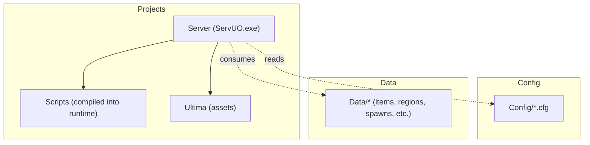
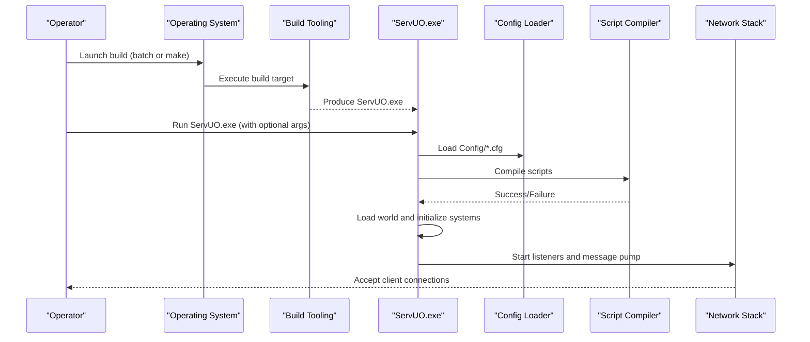
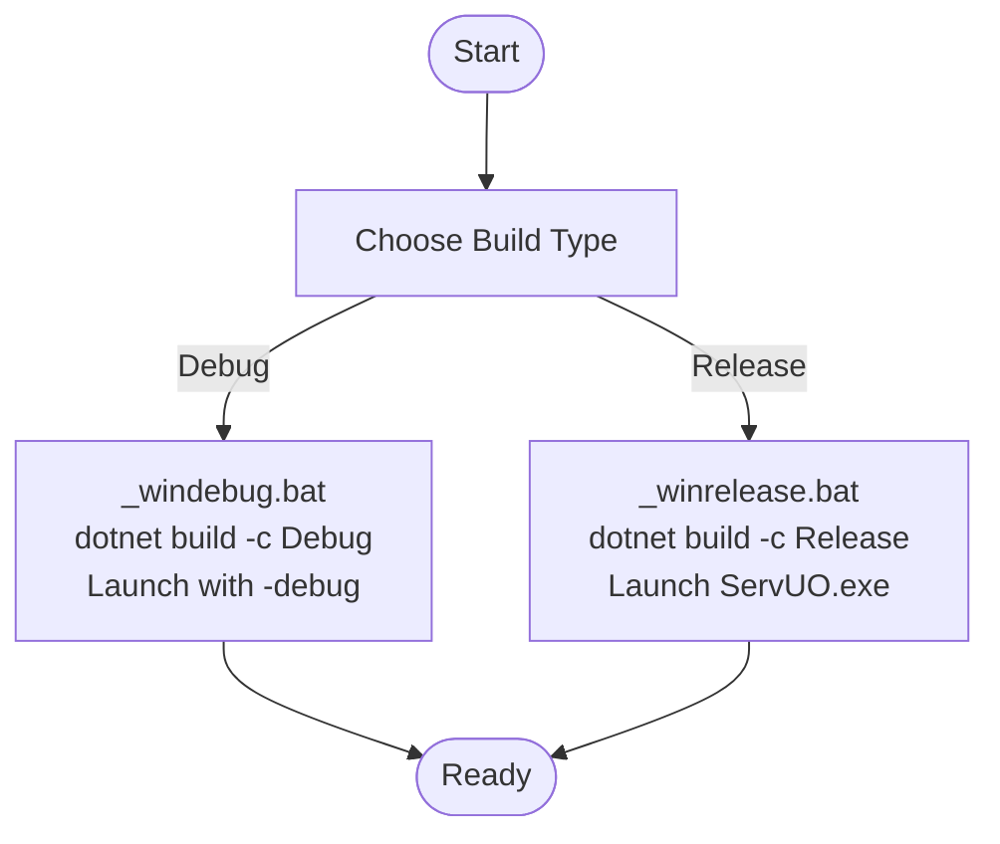
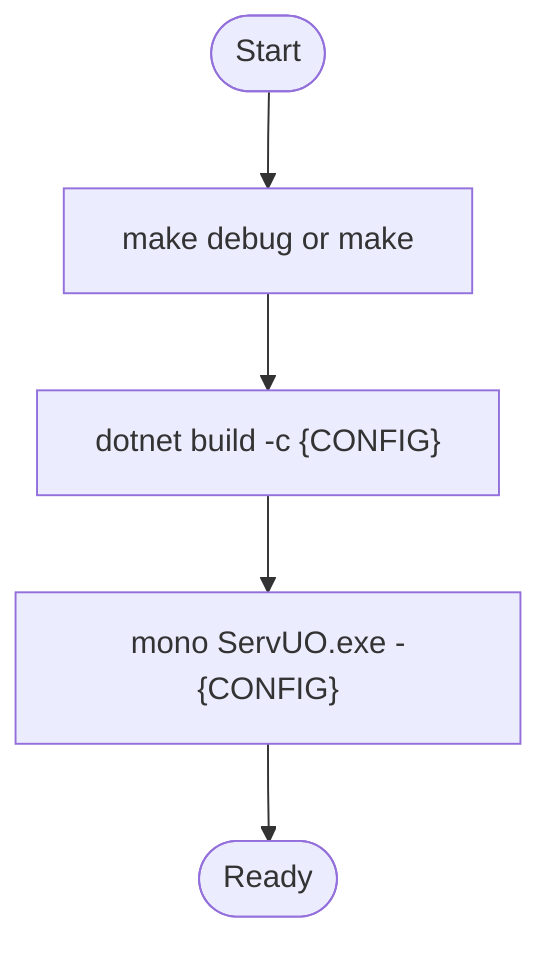
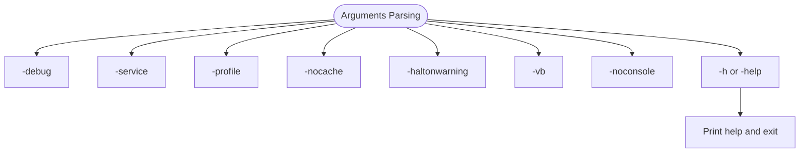
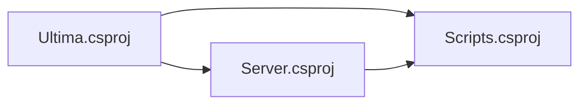

# Getting Started

<cite>
**Referenced Files in This Document**
- [README.md](file://README.md)
- [makefile](file://makefile)
- [_winrelease.bat](file://_winrelease.bat)
- [_windebug.bat](file://_windebug.bat)
- [ServUO.sln](file://ServUO.sln)
- [Server.csproj](file://Server/Server.csproj)
- [Ultima.csproj](file://Ultima/Ultima.csproj)
- [Scripts.csproj](file://Scripts/Scripts.csproj)
- [ServUO.exe.config](file://ServUO.exe.config)
- [Main.cs](file://Server/Main.cs)
- [Config.cs](file://Server/Config.cs)
- [Server.cfg](file://Config/Server.cfg)
- [DataPath.cfg](file://Config/DataPath.cfg)
- [General.cfg](file://Config/General.cfg)
- [AutoSave.cfg](file://Config/AutoSave.cfg)
- [Compiler.cfg](file://Config/Compiler.cfg)
</cite>

## Table of Contents
1. [Introduction](#introduction)
2. [Project Structure](#project-structure)
3. [Core Components](#core-components)
4. [Architecture Overview](#architecture-overview)
5. [Detailed Component Analysis](#detailed-component-analysis)
6. [Dependency Analysis](#dependency-analysis)
7. [Performance Considerations](#performance-considerations)
8. [Troubleshooting Guide](#troubleshooting-guide)
9. [Conclusion](#conclusion)
10. [Appendices](#appendices)

## Introduction
ServUO is a community-driven Ultima Online server emulator written in C#. It enables operators to host their own shard by compiling and launching the server executable, then connecting clients to it. This guide focuses on installation, setup, and initial configuration across Windows, Linux, and macOS, covering build processes, platform-specific dependencies, essential configuration steps, and practical launch/testing procedures.

## Project Structure
ServUO is organized into three primary projects and supporting configuration/data assets:
- Server: The main executable project that bootstraps the server runtime, loads configuration, compiles scripts, and starts networking.
- Scripts: The script library project that defines gameplay logic, commands, regions, and systems.
- Ultima: The shared asset and client data abstraction project.
- Config: A directory of .cfg files that define server behavior and options.
- Data: Game data files (items, mobiles, regions, spawns, etc.) consumed by the server.

**Diagram sources**
- [ServUO.sln](file://ServUO.sln#L20-L28)
- [Server.csproj](file://Server/Server.csproj#L1-L28)
- [Scripts.csproj](file://Scripts/Scripts.csproj#L1-L34)
- [Ultima.csproj](file://Ultima/Ultima.csproj#L1-L21)

**Section sources**
- [ServUO.sln](file://ServUO.sln#L20-L28)

## Core Components
- Build system:
  - Windows: Provided batch files for Debug and Release builds.
  - Linux/macOS: Provided make targets for Debug and Release builds.
- Executable: ServUO.exe (Server project) is the entry point.
- Configuration loader: Reads Config/*.cfg files and exposes typed getters/setters.
- Script compilation: Compiles scripts at startup; errors halt startup unless configured otherwise.
- Networking: Initializes listeners and network message pumps after configuration and world loading.

**Section sources**
- [makefile](file://makefile#L1-L34)
- [_winrelease.bat](file://_winrelease.bat#L1-L31)
- [_windebug.bat](file://_windebug.bat#L1-L31)
- [Server.csproj](file://Server/Server.csproj#L1-L28)
- [Config.cs](file://Server/Config.cs#L220-L322)
- [Main.cs](file://Server/Main.cs#L520-L565)

## Architecture Overview
The server initializes by parsing arguments, setting console output, detecting runtime environment, loading configuration, compiling scripts, loading world data, and starting the networking loop.

**Diagram sources**
- [makefile](file://makefile#L16-L30)
- [_winrelease.bat](file://_winrelease.bat#L15-L30)
- [_windebug.bat](file://_windebug.bat#L15-L30)
- [Main.cs](file://Server/Main.cs#L520-L565)
- [Config.cs](file://Server/Config.cs#L220-L322)

## Detailed Component Analysis

### Build and Launch (Windows)
- Development build:
  - Run the Debug batch file to compile in Debug configuration and launch with debug flags.
- Production build:
  - Run the Release batch file to compile in Release configuration and launch the built executable.

**Diagram sources**
- [_windebug.bat](file://_windebug.bat#L15-L30)
- [_winrelease.bat](file://_winrelease.bat#L15-L30)

**Section sources**
- [README.md](file://README.md#L20-L32)
- [_windebug.bat](file://_windebug.bat#L15-L30)
- [_winrelease.bat](file://_winrelease.bat#L15-L30)

### Build and Launch (Linux/macOS)
- Development build:
  - Use the makefile’s debug target to build and run under Mono with debug output.
- Production build:
  - Use the makefile’s release target to build and run under Mono.

**Diagram sources**
- [makefile](file://makefile#L10-L30)

**Section sources**
- [README.md](file://README.md#L27-L32)
- [makefile](file://makefile#L10-L30)

### Platform Dependencies
- Windows:
  - .NET runtime and SDK sufficient for building via dotnet CLI.
- Linux:
  - Requires make, Mono runtime and compiler, and .NET SDK/runtime.
- macOS:
  - Requires make, Mono runtime and compiler, and .NET SDK/runtime.

**Section sources**
- [README.md](file://README.md#L34-L47)

### Essential Configuration Steps
- Server.cfg
  - Set shard name, listening IP, advertised address, and port.
- DataPath.cfg
  - On non-Windows systems, set a custom path to client data if not installed in default locations.
- General.cfg
  - Configure metrics, help system, default item decay time, and red player restrictions.
- AutoSave.cfg
  - Enable automatic saving, set frequency and warning time, and configure archive retention and merging.
- Compiler.cfg
  - Controls whether scripts are compiled at runtime.

Practical example of successful server launch and initial testing:
- After building, run ServUO.exe with optional flags (e.g., -debug).
- Connect a local client to the configured Address and Port.
- Verify logs indicate successful configuration load, script compilation, world load, and network initialization.

**Section sources**
- [Server.cfg](file://Config/Server.cfg#L1-L19)
- [DataPath.cfg](file://Config/DataPath.cfg#L1-L6)
- [General.cfg](file://Config/General.cfg#L1-L20)
- [AutoSave.cfg](file://Config/AutoSave.cfg#L1-L47)
- [Compiler.cfg](file://Config/Compiler.cfg#L1-L4)
- [Main.cs](file://Server/Main.cs#L520-L565)

### Command-Line Arguments
ServUO supports several command-line flags that influence startup behavior and diagnostics.

**Diagram sources**
- [Main.cs](file://Server/Main.cs#L339-L383)

**Section sources**
- [Main.cs](file://Server/Main.cs#L339-L383)

## Dependency Analysis
- Project references:
  - Scripts depends on Server and Ultima.
  - Server depends on Ultima.
- Target framework and platform:
  - All projects target net48 and x64.
- Runtime configuration:
  - The executable manifest specifies .NET Framework 4.8.

**Diagram sources**
- [Scripts.csproj](file://Scripts/Scripts.csproj#L24-L30)
- [Server.csproj](file://Server/Server.csproj#L25-L28)

**Section sources**
- [Scripts.csproj](file://Scripts/Scripts.csproj#L1-L34)
- [Server.csproj](file://Server/Server.csproj#L1-L28)
- [Ultima.csproj](file://Ultima/Ultima.csproj#L1-L21)
- [ServUO.exe.config](file://ServUO.exe.config#L1-L6)

## Performance Considerations
- Use Release builds for production to minimize overhead.
- On Unix-like systems, ServUO detects the environment and adjusts runtime behavior accordingly.
- Profiling can be enabled via command-line flag for diagnostics, with a note that it increases server load.

**Section sources**
- [Main.cs](file://Server/Main.cs#L471-L510)

## Troubleshooting Guide
Common setup issues and resolutions:
- Missing client data path on non-Windows systems:
  - Set CustomPath in DataPath.cfg to the client installation directory.
- Configuration load failures:
  - Review Config/*.cfg formatting and keys; invalid values trigger warnings and may require correction.
- Script compilation errors:
  - Compilation failures prevent startup; fix script errors or adjust Compiler.cfg if applicable.
- Port binding or firewall:
  - Ensure the configured Port is open and not blocked by firewall rules.
- Runtime environment:
  - On Unix-like systems, confirm Mono and .NET runtime availability.

**Section sources**
- [DataPath.cfg](file://Config/DataPath.cfg#L1-L6)
- [Config.cs](file://Server/Config.cs#L220-L322)
- [Main.cs](file://Server/Main.cs#L520-L565)
- [README.md](file://README.md#L34-L47)

## Conclusion
You now have the essentials to install ServUO, build it for your platform, configure core settings, and launch a working server. Start with Server.cfg and DataPath.cfg, build using the provided tools, and validate connectivity with a local client. Refer to the troubleshooting section for common issues.

## Appendices

### Quick Start Checklist
- Install platform dependencies (Windows: dotnet; Linux/macOS: make, Mono, dotnet).
- Build:
  - Windows: run the Debug or Release batch file.
  - Linux/macOS: run make debug or make.
- Configure:
  - Edit Server.cfg (name, listen address, advertised address, port).
  - Edit DataPath.cfg (non-Windows systems).
  - Review General.cfg, AutoSave.cfg, Compiler.cfg.
- Launch:
  - Run ServUO.exe (optionally with -debug).
- Test:
  - Connect a client to the configured Address and Port.

**Section sources**
- [README.md](file://README.md#L20-L32)
- [makefile](file://makefile#L10-L30)
- [_winrelease.bat](file://_winrelease.bat#L15-L30)
- [_windebug.bat](file://_windebug.bat#L15-L30)
- [Server.cfg](file://Config/Server.cfg#L1-L19)
- [DataPath.cfg](file://Config/DataPath.cfg#L1-L6)
- [General.cfg](file://Config/General.cfg#L1-L20)
- [AutoSave.cfg](file://Config/AutoSave.cfg#L1-L47)
- [Compiler.cfg](file://Config/Compiler.cfg#L1-L4)
- [Main.cs](file://Server/Main.cs#L520-L565)