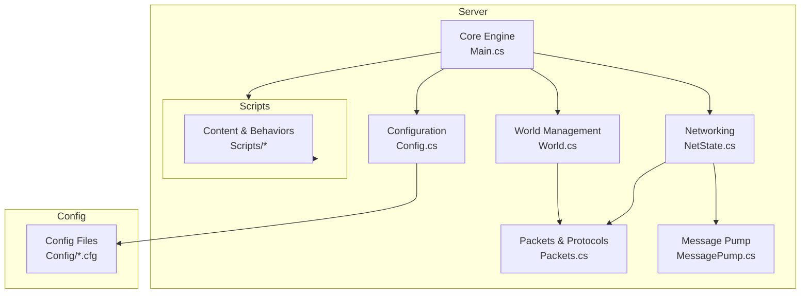
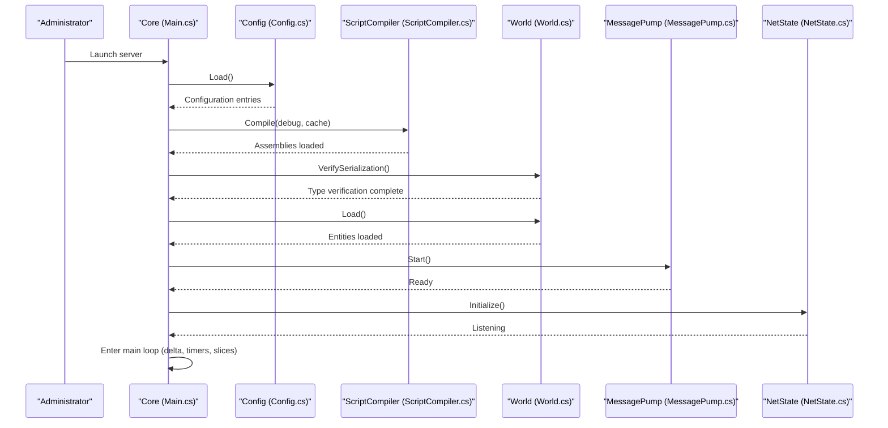
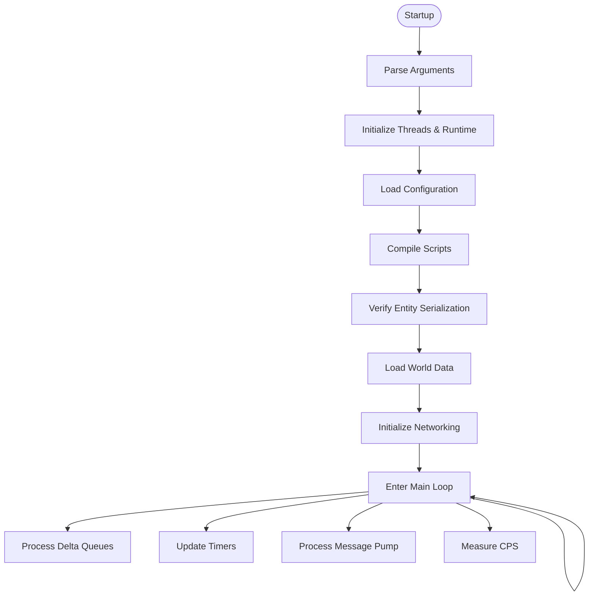
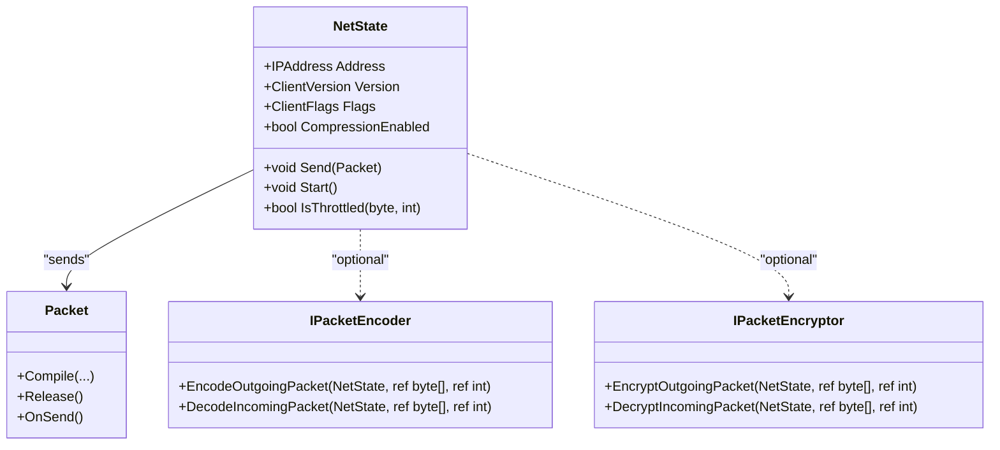
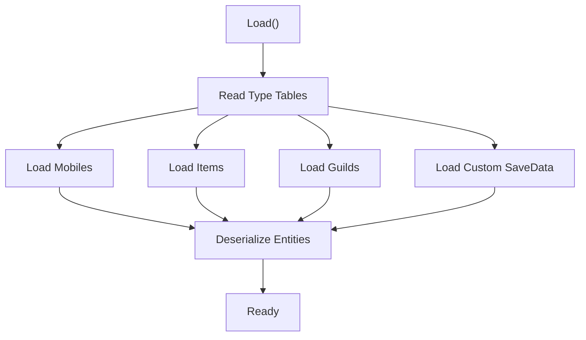
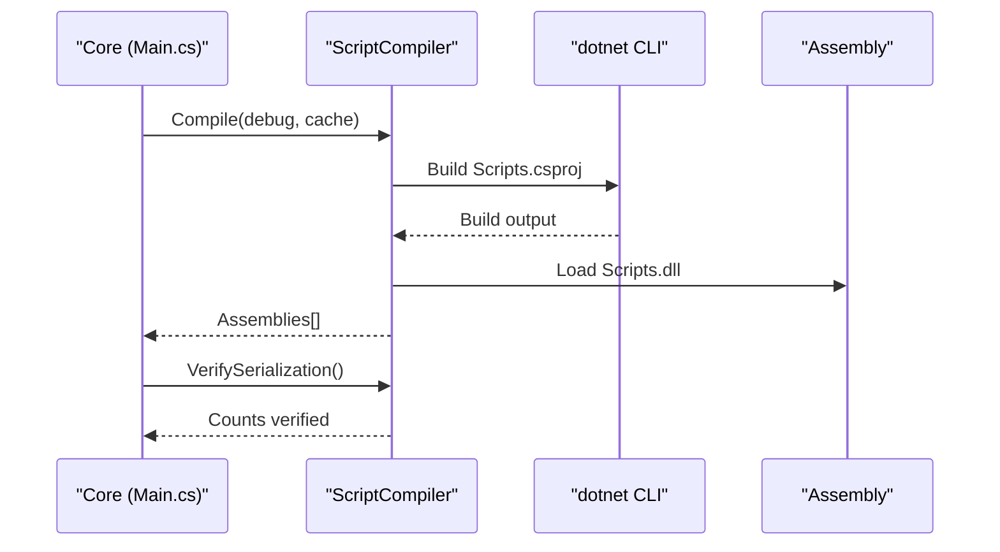
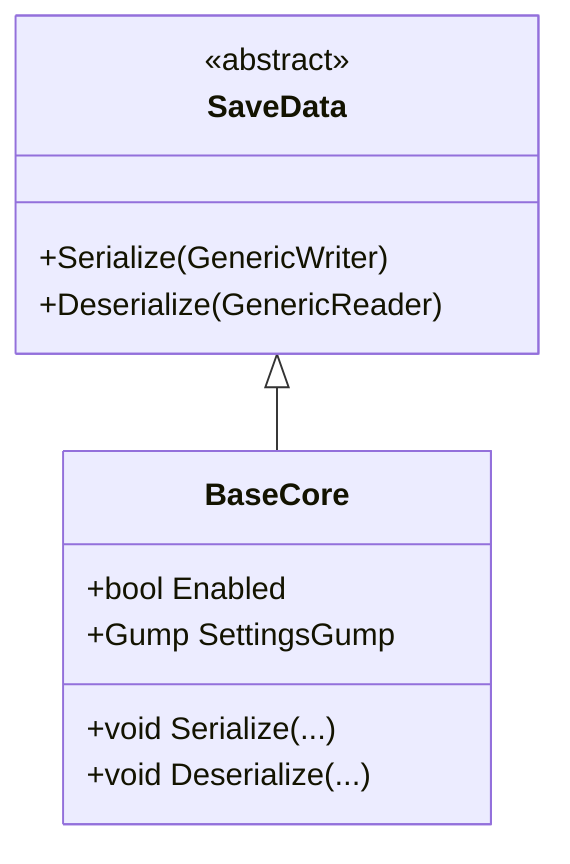
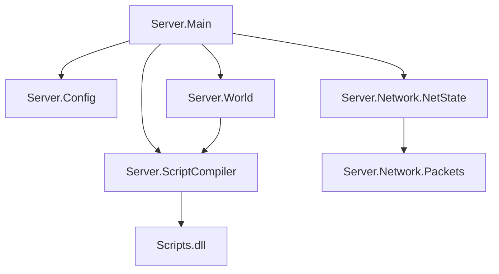

# Project Overview

<cite>
**Referenced Files in This Document**
- [README.md](file://README.md)
- [Main.cs](file://Server/Main.cs)
- [Config.cs](file://Server/Config.cs)
- [ScriptCompiler.cs](file://Server/ScriptCompiler.cs)
- [World.cs](file://Server/World.cs)
- [NetState.cs](file://Server/Network/NetState.cs)
- [MessagePump.cs](file://Server/Network/MessagePump.cs)
- [Packets.cs](file://Server/Network/Packets.cs)
- [BaseCore.cs](file://Server/Customs Framework/Central Core/Base Types/BaseCore.cs)
- [Mobile.cs](file://Server/Mobile.cs)
- [Item.cs](file://Server/Item.cs)
- [Map.cs](file://Server/Map.cs)
- [SpawnEntry.cs](file://Scripts/Regions/Spawning/SpawnEntry.cs)
- [WeakEntityCollection.cs](file://Scripts/Misc/WeakEntityCollection.cs)
</cite>

## Table of Contents
1. [Introduction](#introduction)
2. [Project Structure](#project-structure)
3. [Core Components](#core-components)
4. [Architecture Overview](#architecture-overview)
5. [Detailed Component Analysis](#detailed-component-analysis)
6. [Dependency Analysis](#dependency-analysis)
7. [Performance Considerations](#performance-considerations)
8. [Troubleshooting Guide](#troubleshooting-guide)
9. [Conclusion](#conclusion)
10. [Appendices](#appendices)

## Introduction
ServUO is a community-driven Ultima Online server emulator written in C# and built on the .NET ecosystem. It implements a complete game server, including network protocol handling, entity-based world management, dynamic script compilation, and an extensible Custom Framework. The project targets administrators, content developers, and contributors who want to operate or extend a feature-rich, standards-aligned UO server.

Key characteristics:
- Purpose: Complete game server implementation for Ultima Online, supporting modern platforms and multi-client protocol variants.
- Architecture: C#/.NET-based core with a modular entity system, robust networking pipeline, and configurable runtime.
- Relationship to the original game: Implements the Ultima Online client protocol and world mechanics, enabling gameplay aligned with the UO experience.

Practical outcomes for users:
- Administrators can deploy and tune a production-grade server with extensive configuration controls.
- Content developers can rapidly iterate on scripts, behaviors, and systems via dynamic compilation and modular frameworks.
- Contributors can extend core systems, integrate new features, and maintain compatibility across client versions.

## Project Structure
ServUO is organized into three primary areas:
- Server: Core engine, networking, persistence, and entity systems.
- Scripts: Extensible content and behaviors compiled dynamically at runtime.
- Config: Hierarchical configuration system driving runtime behavior.

**Diagram sources**
- [Main.cs](file://Server/Main.cs#L329-L606)
- [NetState.cs](file://Server/Network/NetState.cs#L595-L780)
- [World.cs](file://Server/World.cs#L348-L587)
- [ScriptCompiler.cs](file://Server/ScriptCompiler.cs#L18-L85)
- [Config.cs](file://Server/Config.cs#L220-L322)
- [Packets.cs](file://Server/Network/Packets.cs#L1-L120)
- [MessagePump.cs](file://Server/Network/MessagePump.cs#L111-L216)

**Section sources**
- [README.md](file://README.md#L12-L60)
- [Main.cs](file://Server/Main.cs#L329-L606)

## Core Components
- Core Engine (Server.Main): Initializes runtime, loads configuration, compiles scripts, loads world data, starts networking, and runs the main loop.
- Networking (Server.Network): Handles client connections, packet encoding/encryption, throttling, and per-client state.
- World Management (Server.World): Manages entity persistence, loading, saving, and safe deletion queues.
- Script Compilation (Server.ScriptCompiler): Dynamically builds and loads content assemblies, verifies entity serialization, and exposes reflection-based type discovery.
- Configuration (Server.Config): Loads, validates, and persists configuration entries across scopes and files.
- Entity System (Server.Mobile, Server.Item, Server.Map): Provides the foundation for player/mobile and item behaviors, spatial queries, and property lists.
- Custom Framework (CustomsFramework): Extensible core for modular systems, save data, and lifecycle hooks.

Practical examples:
- Administrators configure server behavior via Config/*.cfg and launch with platform-specific scripts.
- Content developers write scripts in Scripts/* and rely on dynamic compilation to apply changes quickly.
- Contributors extend the server by adding new packets, regions, or modules within the Custom Framework.

**Section sources**
- [Main.cs](file://Server/Main.cs#L329-L606)
- [NetState.cs](file://Server/Network/NetState.cs#L595-L780)
- [World.cs](file://Server/World.cs#L348-L587)
- [ScriptCompiler.cs](file://Server/ScriptCompiler.cs#L18-L85)
- [Config.cs](file://Server/Config.cs#L220-L322)
- [Mobile.cs](file://Server/Mobile.cs#L531-L620)
- [Item.cs](file://Server/Item.cs#L674-L723)
- [Map.cs](file://Server/Map.cs#L699-L747)
- [BaseCore.cs](file://Server/Customs Framework/Central Core/Base Types/BaseCore.cs#L1-L80)

## Architecture Overview
ServUO’s runtime architecture follows a deterministic initialization and event-driven loop:
- Startup: Core loads configuration, compiles scripts, verifies serialization, loads world, initializes networking, and begins the main loop.
- Runtime: Delta queues for mobiles/items, timers, message pump, and periodic cycle sampling.
- Networking: Per-client NetState manages protocol versioning, packet encoding/encryption, throttling, and send/receive pipelines.
- Persistence: World handles type tables, binary saves/loads, and safe deletion during save/load.

**Diagram sources**
- [Main.cs](file://Server/Main.cs#L520-L606)
- [Config.cs](file://Server/Config.cs#L220-L322)
- [ScriptCompiler.cs](file://Server/ScriptCompiler.cs#L18-L85)
- [World.cs](file://Server/World.cs#L348-L587)
- [MessagePump.cs](file://Server/Network/MessagePump.cs#L111-L134)
- [NetState.cs](file://Server/Network/NetState.cs#L595-L636)

## Detailed Component Analysis

### Core Engine Initialization
Responsibilities:
- Parse arguments, set runtime flags, initialize threads, and log environment details.
- Load configuration, compile scripts, verify entity serialization, and initialize world and networking.
- Run the main loop: process delta queues, timers, message pump, and periodic cycle sampling.

Operational highlights:
- Argument parsing supports debug, service, profile, cache, halt-on-warning, VB.NET script compilation, and console modes.
- Script compilation invokes dotnet build on Scripts.csproj and loads the resulting assembly.
- World loading reads type tables and binary data, invoking constructors and deserialization safely.

**Diagram sources**
- [Main.cs](file://Server/Main.cs#L329-L606)
- [ScriptCompiler.cs](file://Server/ScriptCompiler.cs#L18-L85)
- [World.cs](file://Server/World.cs#L348-L587)

**Section sources**
- [Main.cs](file://Server/Main.cs#L329-L606)

### Networking and Protocol Support
Responsibilities:
- Manage per-client NetState, including address, version, flags, and protocol changes.
- Encode/encrypt outgoing/incoming packets, throttle packet rates, and queue sends.
- Support multiple client protocol versions and expansion-aware features.

Key mechanisms:
- ClientVersion and ProtocolChanges track supported features per client version.
- PacketEncoder/PacketEncryptor enable optional encoding/encryption.
- Packet throttling prevents abuse and maintains stability.

**Diagram sources**
- [NetState.cs](file://Server/Network/NetState.cs#L35-L110)
- [NetState.cs](file://Server/Network/NetState.cs#L177-L289)
- [NetState.cs](file://Server/Network/NetState.cs#L642-L773)
- [Packets.cs](file://Server/Network/Packets.cs#L1-L120)

**Section sources**
- [NetState.cs](file://Server/Network/NetState.cs#L1296-L1341)
- [MessagePump.cs](file://Server/Network/MessagePump.cs#L111-L216)
- [Packets.cs](file://Server/Network/Packets.cs#L1-L120)

### Entity-Based World Management
Responsibilities:
- Persist and load entities (items, mobiles, guilds, customs save data).
- Maintain type tables and safe deletion queues during save/load.
- Provide spatial queries and client enumeration for visibility.

Highlights:
- World.Load reads type tables and binary streams, constructs entities via serialization constructors, and deserializes state.
- Safe deletion queues ensure consistency during save operations.
- Spatial queries leverage Map enumerators to compute visibility ranges.

**Diagram sources**
- [World.cs](file://Server/World.cs#L348-L587)

**Section sources**
- [World.cs](file://Server/World.cs#L348-L587)
- [Map.cs](file://Server/Map.cs#L699-L747)

### Dynamic C# Script Compilation
Responsibilities:
- Build Scripts.csproj using dotnet CLI, load the generated assembly, and expose types for runtime invocation.
- Verify entity serialization across all loaded assemblies and maintain type caches for fast lookup.

Key behaviors:
- Compile method orchestrates building and loading, then verifies serialization counts.
- TypeCache organizes types by name and full name hashes for efficient retrieval.
- Invoke method discovers and executes static methods across all loaded assemblies.

**Diagram sources**
- [ScriptCompiler.cs](file://Server/ScriptCompiler.cs#L18-L85)
- [Main.cs](file://Server/Main.cs#L520-L542)

**Section sources**
- [ScriptCompiler.cs](file://Server/ScriptCompiler.cs#L18-L85)
- [Main.cs](file://Server/Main.cs#L520-L542)

### Extensible Custom Framework
Responsibilities:
- Provide a base class for modular systems, lifecycle events, and save data persistence.
- Enable content developers to create custom systems with settings gumps and controlled activation.

Highlights:
- BaseCore defines an Enabled flag, lifecycle events, and basic serialization for framework modules.
- Modules can be attached to entities (e.g., Mobile/Item) to extend behavior.

**Diagram sources**
- [BaseCore.cs](file://Server/Customs Framework/Central Core/Base Types/BaseCore.cs#L1-L80)

**Section sources**
- [BaseCore.cs](file://Server/Customs Framework/Central Core/Base Types/BaseCore.cs#L1-L80)

### Multi-Client Protocol Support
ServUO tracks client protocol versions and applies feature flags accordingly:
- ClientVersion and ProtocolChanges enumerate supported features per client version.
- NetState.Version updates ProtocolChanges to enable/disable features like spellbooks, damage packets, and secure trading.

Operational impact:
- Ensures compatibility across client versions while enabling newer features progressively.
- Allows administrators to tailor protocol behavior per shard needs.

**Section sources**
- [NetState.cs](file://Server/Network/NetState.cs#L177-L289)
- [NetState.cs](file://Server/Network/NetState.cs#L1296-L1341)

### Practical Examples and Use Cases
- Administrators:
  - Configure Server.cfg and related *.cfg files under Config/.
  - Launch with platform scripts and monitor logs for startup and runtime diagnostics.
  - Use profiling flags (-profile) to analyze packet and timer performance.
- Content Developers:
  - Add or modify scripts in Scripts/, relying on dynamic compilation to apply changes.
  - Use WeakEntityCollection and SpawnEntry patterns for persistent collections and region-based spawning.
- Contributors:
  - Extend NetState and Packet implementations for new protocol features.
  - Introduce new modules via the Custom Framework and integrate with BaseCore lifecycle.

**Section sources**
- [README.md](file://README.md#L12-L60)
- [WeakEntityCollection.cs](file://Scripts/Misc/WeakEntityCollection.cs#L1-L121)
- [SpawnEntry.cs](file://Scripts/Regions/Spawning/SpawnEntry.cs#L291-L334)

## Dependency Analysis
ServUO exhibits layered dependencies:
- Server.Core depends on Server.Config, Server.ScriptCompiler, Server.World, and Server.Network.
- Server.Network depends on Server.Packets and implements NetState.
- Server.World depends on Server.ScriptCompiler for type resolution and persistence.
- Scripts depend on Server.* APIs and are compiled into a separate assembly consumed by Core.

**Diagram sources**
- [Main.cs](file://Server/Main.cs#L520-L606)
- [Config.cs](file://Server/Config.cs#L220-L322)
- [ScriptCompiler.cs](file://Server/ScriptCompiler.cs#L18-L85)
- [World.cs](file://Server/World.cs#L348-L587)
- [NetState.cs](file://Server/Network/NetState.cs#L595-L636)
- [Packets.cs](file://Server/Network/Packets.cs#L1-L120)

**Section sources**
- [Main.cs](file://Server/Main.cs#L520-L606)
- [ScriptCompiler.cs](file://Server/ScriptCompiler.cs#L18-L85)
- [World.cs](file://Server/World.cs#L348-L587)
- [NetState.cs](file://Server/Network/NetState.cs#L595-L636)

## Performance Considerations
- Threading and timers: Dedicated timer thread and main loop with periodic cycle sampling.
- Buffering and pooling: Send/Receive buffer pools reduce allocations for packet transmission.
- Serialization verification: Ensures entity constructors and serialization methods exist to prevent runtime errors.
- Packet throttling: Limits excessive packet bursts to maintain stability.
- Garbage collection: Server GC mode and high-resolution timing can improve responsiveness on supported platforms.

Recommendations:
- Use -profile judiciously in development to gather diagnostics.
- Monitor cycle-per-second metrics and adjust update ranges for large worlds.
- Keep scripts minimal and avoid heavy reflection in hot paths.

**Section sources**
- [Main.cs](file://Server/Main.cs#L560-L606)
- [NetState.cs](file://Server/Network/NetState.cs#L586-L636)

## Troubleshooting Guide
Common scenarios:
- Script compilation failures: The server loops until compilation succeeds or exits in service mode. Use -debug and -haltonwarning to diagnose issues.
- World load errors: Type mismatches or missing serialization constructors cause exceptions; the loader can delete problematic entries after prompting (non-service).
- Network issues: Encrypted clients unsupported; invalid seeds lead to disconnections; throttling prevents flooding.

Actions:
- Review logs under Logs/ when running as a service.
- Validate configuration entries and ensure required files exist.
- Confirm dotnet SDK availability for dynamic compilation.

**Section sources**
- [Main.cs](file://Server/Main.cs#L520-L542)
- [World.cs](file://Server/World.cs#L348-L587)
- [MessagePump.cs](file://Server/Network/MessagePump.cs#L177-L204)

## Conclusion
ServUO delivers a robust, extensible, and community-driven implementation of a Ultima Online server. Its entity system, dynamic script compilation, and multi-client protocol support enable administrators to operate reliable servers and developers to rapidly prototype and ship content. The Custom Framework further enhances extensibility, while the networking stack ensures compatibility and performance across diverse environments.

## Appendices
- Getting started:
  - Read Config/README.md and Server.cfg.
  - Edit *.cfg files to match your shard’s needs.
  - Build and run using platform scripts or make targets.

**Section sources**
- [README.md](file://README.md#L12-L60)
- [Config.cs](file://Server/Config.cs#L220-L322)