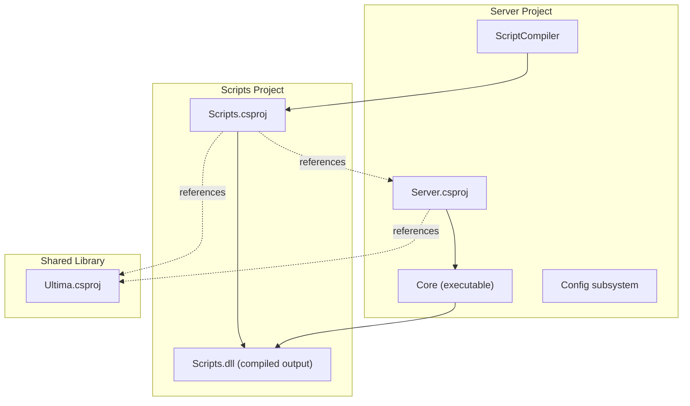
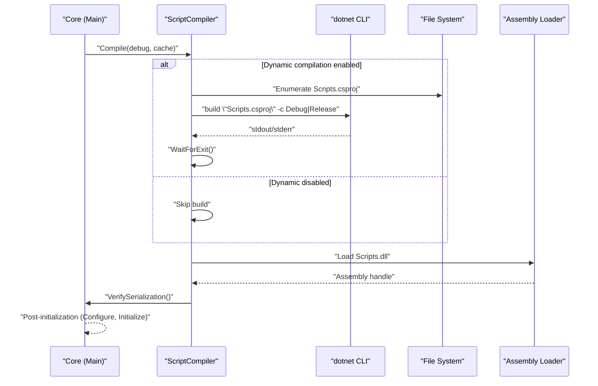
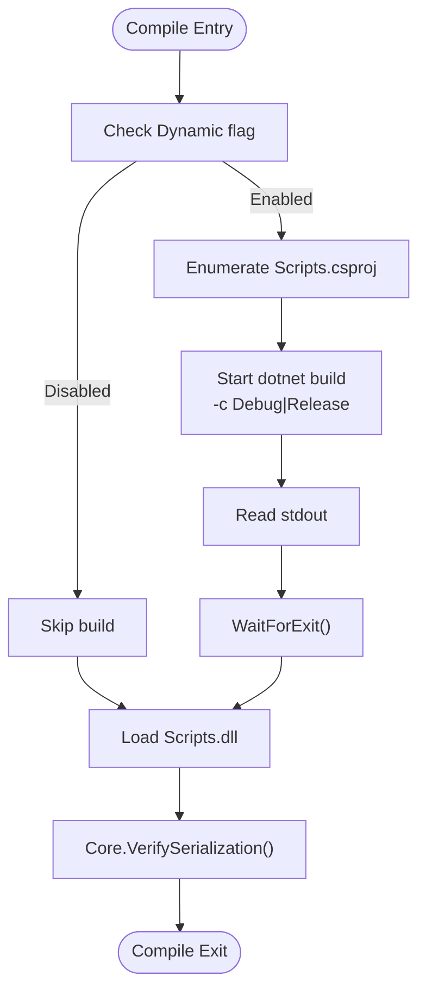
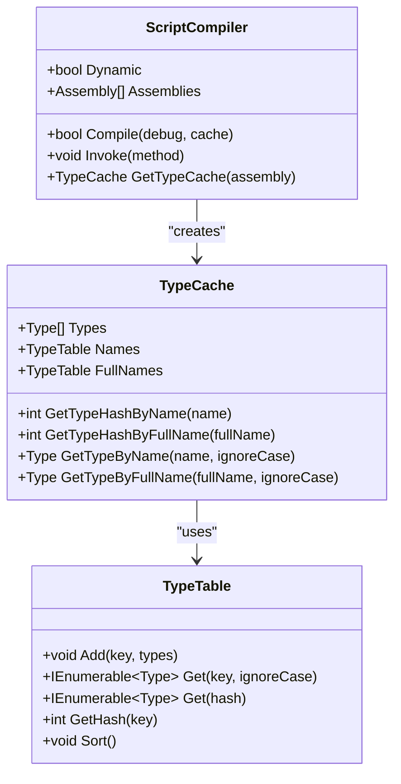
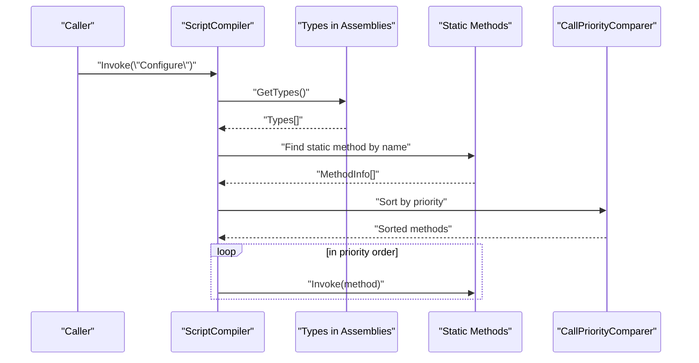
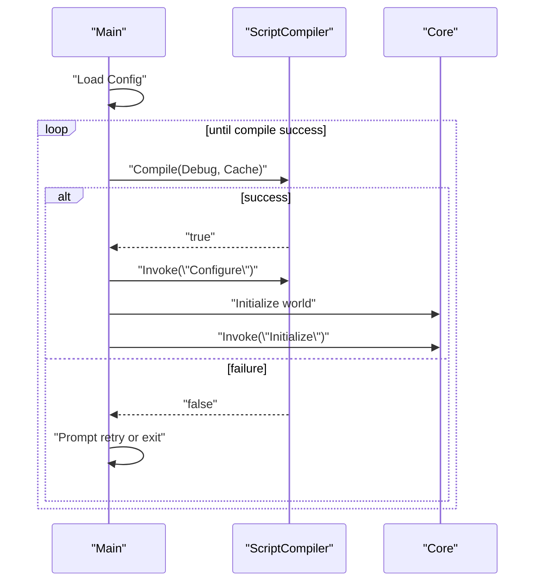
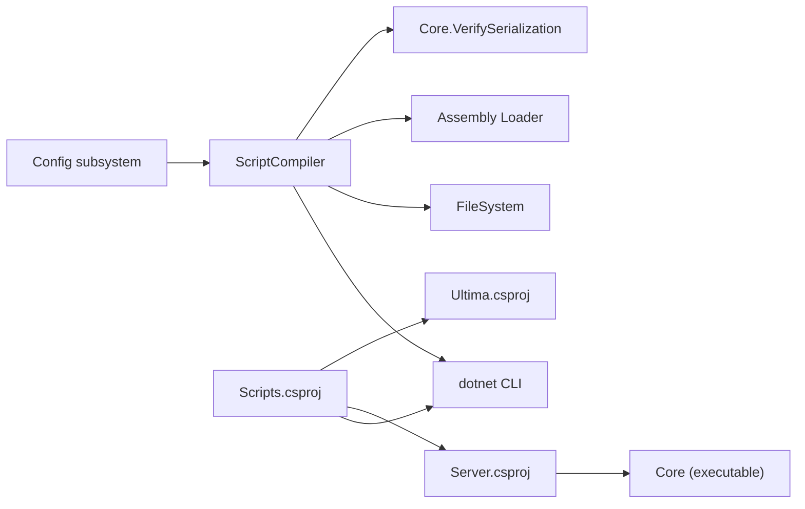

# Dynamic Compilation

<cite>
**Referenced Files in This Document**
- [ScriptCompiler.cs](file://Server/ScriptCompiler.cs)
- [Main.cs](file://Server/Main.cs)
- [Scripts.csproj](file://Scripts/Scripts.csproj)
- [Server.csproj](file://Server/Server.csproj)
- [Compiler.cfg](file://Config/Compiler.cfg)
- [Config.cs](file://Server/Config.cs)
- [Attributes.cs](file://Server/Attributes.cs)
</cite>

## Table of Contents
1. [Introduction](#introduction)
2. [Project Structure](#project-structure)
3. [Core Components](#core-components)
4. [Architecture Overview](#architecture-overview)
5. [Detailed Component Analysis](#detailed-component-analysis)
6. [Dependency Analysis](#dependency-analysis)
7. [Performance Considerations](#performance-considerations)
8. [Troubleshooting Guide](#troubleshooting-guide)
9. [Conclusion](#conclusion)

## Introduction
This document explains ServUO’s dynamic C# compilation system with a focus on the ScriptCompiler implementation and its integration with the dotnet CLI. It covers how the system detects script changes, invokes dotnet build, loads the generated Scripts.dll assembly, verifies type serialization, and prepares the runtime for hot-reloading without restarting the server. It also documents build configuration handling (Debug vs Release), error handling during compilation, and the relationship between compilation and assembly loading. Practical examples illustrate discovery of Scripts.csproj, command-line invocation, output capture, and failure handling. Guidance is included for performance tuning, memory management during hot-reloads, and troubleshooting common compilation issues.

## Project Structure
ServUO organizes the compilation pipeline across three primary projects:
- Server: The executable hosting the runtime and the ScriptCompiler entry point.
- Scripts: The script library project that compiles into Scripts.dll.
- Ultima: A shared library referenced by both Server and Scripts.

Build outputs are directed to the repository root so the Server process can load Scripts.dll after compilation.

**Diagram sources**
- [Server.csproj](file://Server/Server.csproj#L1-L28)
- [Scripts.csproj](file://Scripts/Scripts.csproj#L1-L34)
- [ScriptCompiler.cs](file://Server/ScriptCompiler.cs#L18-L85)

**Section sources**
- [Server.csproj](file://Server/Server.csproj#L1-L28)
- [Scripts.csproj](file://Scripts/Scripts.csproj#L1-L34)

## Core Components
- ScriptCompiler: Orchestrates dynamic compilation, invokes dotnet build, loads Scripts.dll, and performs type verification.
- Main: Drives startup, calls ScriptCompiler.Compile, and coordinates post-compilation initialization hooks.
- Build Projects: Scripts.csproj defines the script library and output path; Server.csproj defines the host executable.
- Configuration: Compiler.cfg toggles dynamic compilation; Config subsystem manages runtime configuration.

Key responsibilities:
- Discovery and build: Enumerates Scripts.csproj under the Scripts directory and runs dotnet build with Debug or Release.
- Assembly loading: Loads Scripts.dll into the AppDomain and updates ScriptCompiler.Assemblies.
- Type verification: Iterates loaded assemblies to verify serialization support for items, mobiles, and save data.
- Invocation: Invokes static methods across assemblies with priority ordering.

**Section sources**
- [ScriptCompiler.cs](file://Server/ScriptCompiler.cs#L18-L85)
- [Main.cs](file://Server/Main.cs#L520-L560)
- [Scripts.csproj](file://Scripts/Scripts.csproj#L1-L34)
- [Server.csproj](file://Server/Server.csproj#L1-L28)
- [Compiler.cfg](file://Config/Compiler.cfg#L1-L4)
- [Config.cs](file://Server/Config.cs#L1-L200)

## Architecture Overview
The dynamic compilation workflow integrates the Server runtime with the dotnet CLI to produce Scripts.dll, which is then loaded and verified for type serialization.

**Diagram sources**
- [ScriptCompiler.cs](file://Server/ScriptCompiler.cs#L18-L85)
- [Main.cs](file://Server/Main.cs#L520-L560)

## Detailed Component Analysis

### ScriptCompiler: Discovery, Build, Load, and Verification
ScriptCompiler.Compile controls the entire dynamic compilation lifecycle:
- Dynamic toggle: Controlled via Config.Get/Set("Compiler.Dynamic", true).
- Project discovery: Searches the Scripts directory for Scripts.csproj.
- Build invocation: Executes dotnet build with arguments derived from the debug flag (-c Debug or Release).
- Output capture: Reads stdout from the dotnet process and prints it to console.
- Assembly loading: Loads Scripts.dll from the configured output path and adds it to Assemblies.
- Type verification: Calls Core.VerifySerialization to validate serialization support across loaded assemblies.

**Diagram sources**
- [ScriptCompiler.cs](file://Server/ScriptCompiler.cs#L18-L85)

**Section sources**
- [ScriptCompiler.cs](file://Server/ScriptCompiler.cs#L18-L85)

### Build Configuration Handling (Debug vs Release)
Build configuration is selected based on the debug parameter passed to ScriptCompiler.Compile:
- Debug builds: Passes -c Debug to dotnet build.
- Release builds: Passes -c Release to dotnet build.

Scripts.csproj sets output paths to the repository root for both configurations, ensuring Scripts.dll is placed where the Server process expects to load it.

**Section sources**
- [ScriptCompiler.cs](file://Server/ScriptCompiler.cs#L36-L41)
- [Scripts.csproj](file://Scripts/Scripts.csproj#L13-L23)

### Assembly Loading and Type Caching
After loading Scripts.dll, ScriptCompiler maintains a cache of types for efficient lookup:
- Assemblies array: Stores the Server assembly plus Scripts.dll.
- TypeCache: Builds name and full-name indices for types, including aliases.
- Hash-based lookups: Supports fast retrieval by name or full name hashes.

**Diagram sources**
- [ScriptCompiler.cs](file://Server/ScriptCompiler.cs#L87-L319)

**Section sources**
- [ScriptCompiler.cs](file://Server/ScriptCompiler.cs#L87-L319)

### Method Invocation Across Assemblies
ScriptCompiler.Invoke locates static methods by name across all loaded assemblies, sorts them by priority using CallPriorityComparer, and invokes them in order.

**Diagram sources**
- [ScriptCompiler.cs](file://Server/ScriptCompiler.cs#L87-L112)
- [Attributes.cs](file://Server/Attributes.cs#L36-L90)

**Section sources**
- [ScriptCompiler.cs](file://Server/ScriptCompiler.cs#L87-L112)
- [Attributes.cs](file://Server/Attributes.cs#L36-L90)

### Startup and Hot-Reload Loop
Main drives the server startup and retries compilation until successful:
- Loads configuration.
- Enters a loop calling ScriptCompiler.Compile(debug, cache).
- On success, invokes Configure and Initialize hooks, then continues server operation.

**Diagram sources**
- [Main.cs](file://Server/Main.cs#L520-L560)
- [ScriptCompiler.cs](file://Server/ScriptCompiler.cs#L87-L112)

**Section sources**
- [Main.cs](file://Server/Main.cs#L520-L560)

## Dependency Analysis
- ScriptCompiler depends on:
  - Config subsystem for dynamic compilation toggle.
  - dotnet CLI for building Scripts.csproj.
  - FileSystem for discovering Scripts.csproj.
  - Assembly Loader for Scripts.dll.
  - Core.VerifySerialization for type verification.
- Scripts.csproj depends on:
  - Server.csproj (host assembly).
  - Ultima.csproj (shared library).
- Output path configuration ensures Scripts.dll is produced in the expected location for immediate loading.

**Diagram sources**
- [ScriptCompiler.cs](file://Server/ScriptCompiler.cs#L18-L85)
- [Scripts.csproj](file://Scripts/Scripts.csproj#L1-L34)
- [Server.csproj](file://Server/Server.csproj#L1-L28)

**Section sources**
- [ScriptCompiler.cs](file://Server/ScriptCompiler.cs#L18-L85)
- [Scripts.csproj](file://Scripts/Scripts.csproj#L1-L34)
- [Server.csproj](file://Server/Server.csproj#L1-L28)

## Performance Considerations
- Build configuration:
  - Debug builds embed symbols and enable tracing constants; Release builds disable debug symbols and reduce overhead.
  - Choose Debug for development iterations; Release for production-like performance.
- Output path:
  - Both configurations emit to the repository root, minimizing IO overhead during hot-reloads.
- Type verification:
  - Core.VerifySerialization iterates types in all loaded assemblies; keep the number of script types reasonable to avoid prolonged verification times.
- Memory management during hot-reloads:
  - Loading Scripts.dll replaces previous script assembly instances; ensure no lingering references to old types to allow GC to reclaim memory.
  - Avoid retaining static caches keyed by types across reloads; rebuild caches after reload.
- Concurrency:
  - The compiler waits for dotnet build to complete; consider running builds asynchronously if extending the pipeline to avoid blocking startup.

[No sources needed since this section provides general guidance]

## Troubleshooting Guide
Common issues and resolutions:
- dotnet CLI not found:
  - Ensure dotnet SDK is installed and available in PATH. The compiler spawns "dotnet" with build arguments.
- No Scripts.csproj found:
  - Verify the Scripts directory contains Scripts.csproj. The compiler enumerates Scripts/*.csproj.
- Build failures:
  - Review console output captured from dotnet build stdout. Fix compilation errors in scripts and retry.
- Scripts.dll not found:
  - Confirm Scripts.csproj OutputPath targets the repository root so the Server process can load Scripts.dll.
- Dynamic compilation disabled:
  - Check Compiler.cfg and Config entries controlling the Dynamic flag. Ensure it is enabled for runtime compilation.
- Serialization warnings:
  - Core.VerifySerialization reports missing constructors or Serialize methods for items/mobiles/save data. Add required members to resolve warnings.

Operational tips:
- Retry loop:
  - On initial startup, Main loops until compilation succeeds. Press Enter to exit or R to retry when prompted.
- Priority invocation:
  - Use CallPriorityAttribute to control initialization order for static methods invoked by ScriptCompiler.Invoke.

**Section sources**
- [ScriptCompiler.cs](file://Server/ScriptCompiler.cs#L18-L85)
- [Main.cs](file://Server/Main.cs#L520-L560)
- [Compiler.cfg](file://Config/Compiler.cfg#L1-L4)
- [Config.cs](file://Server/Config.cs#L1-L200)

## Conclusion
ServUO’s dynamic compilation system integrates the Server runtime with the dotnet CLI to compile Scripts.csproj into Scripts.dll, load it into the AppDomain, and verify type serialization. The ScriptCompiler orchestrates discovery, build, load, and verification, while Main coordinates startup and retries. Build configuration supports Debug and Release modes, and the system provides robust error reporting and invocation prioritization. Following the troubleshooting steps and performance recommendations enables smooth hot-reloading without server restarts.

[No sources needed since this section summarizes without analyzing specific files]