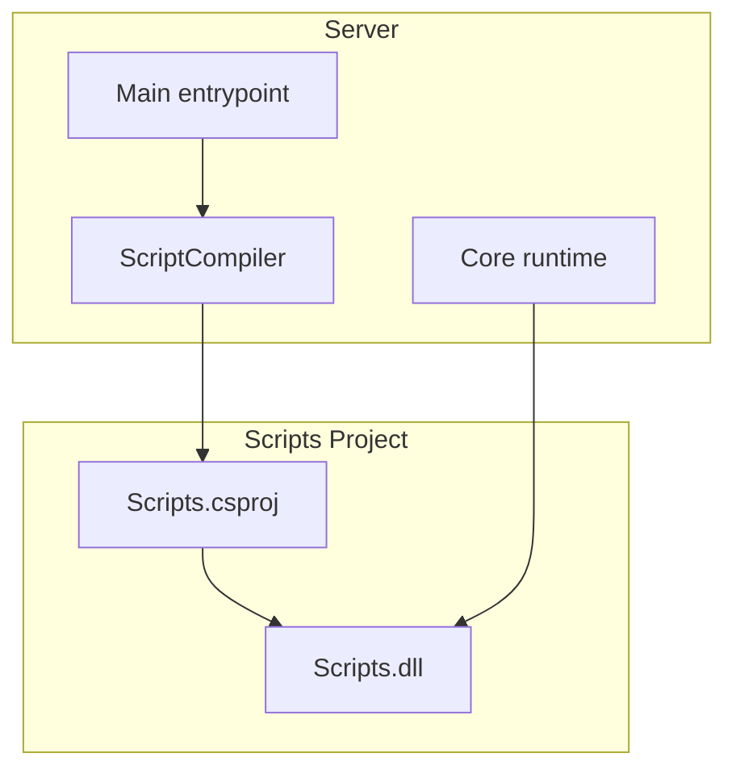
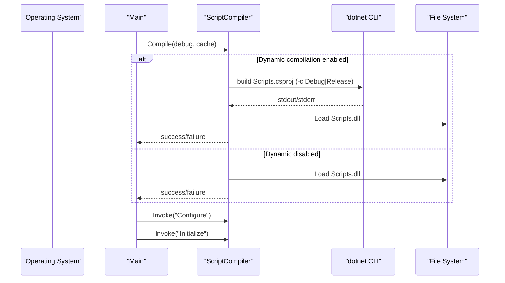
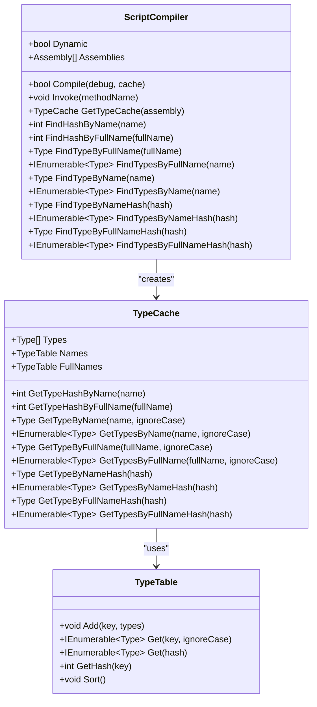
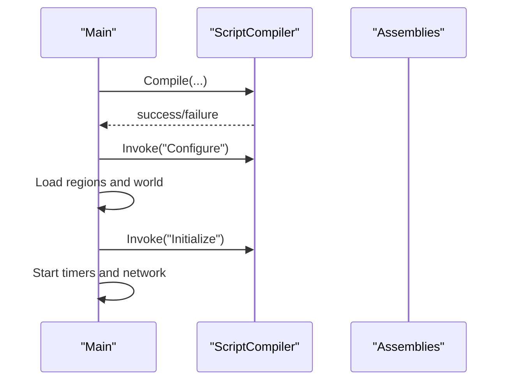
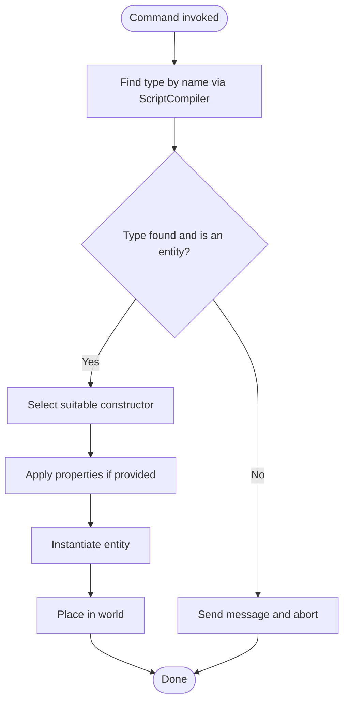
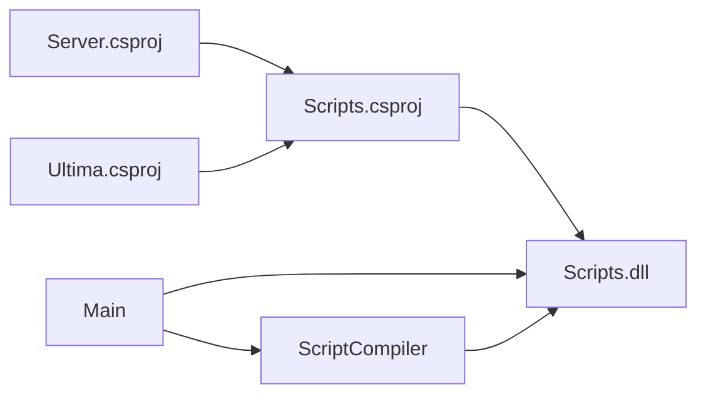

# Scripting System

<cite>
**Referenced Files in This Document**
- [ScriptCompiler.cs](file://Server/ScriptCompiler.cs)
- [Scripts.csproj](file://Scripts/Scripts.csproj)
- [Main.cs](file://Server/Main.cs)
- [Compiler.cfg](file://Config/Compiler.cfg)
- [Config.cs](file://Server/Config.cs)
- [Add.cs](file://Scripts/Commands/Add.cs)
- [Timer.cs](file://Server/Timer.cs)
</cite>

## Table of Contents
1. [Introduction](#introduction)
2. [Project Structure](#project-structure)
3. [Core Components](#core-components)
4. [Architecture Overview](#architecture-overview)
5. [Detailed Component Analysis](#detailed-component-analysis)
6. [Dependency Analysis](#dependency-analysis)
7. [Performance Considerations](#performance-considerations)
8. [Troubleshooting Guide](#troubleshooting-guide)
9. [Conclusion](#conclusion)

## Introduction
This document explains ServUO’s dynamic C# scripting system with emphasis on script compilation, hot-reloading, and assembly loading. It covers how the server compiles scripts at startup, loads the resulting assembly, verifies entity serialization, and invokes script-defined lifecycle methods. It also documents the Scripts.csproj project structure, script organization patterns, and integration with the main server assembly. Practical examples from the codebase illustrate the compilation workflow, error handling, and runtime execution. Finally, it addresses common scripting issues, performance optimization, and debugging techniques.

## Project Structure
ServUO separates the server runtime from the scripts:
- Server runtime: compiled into the main executable and core libraries
- Scripts: a separate .NET library project that compiles into Scripts.dll and is loaded at runtime

Key characteristics:
- Scripts project targets a desktop framework and references the server and Ultima projects
- Output is directed to the repository root so the server can load Scripts.dll directly
- The server controls whether dynamic compilation occurs via configuration

**Diagram sources**
- [Main.cs](file://Server/Main.cs#L524-L542)
- [ScriptCompiler.cs](file://Server/ScriptCompiler.cs#L18-L85)
- [Scripts.csproj](file://Scripts/Scripts.csproj#L1-L34)

**Section sources**
- [Scripts.csproj](file://Scripts/Scripts.csproj#L1-L34)
- [Main.cs](file://Server/Main.cs#L524-L542)
- [ScriptCompiler.cs](file://Server/ScriptCompiler.cs#L18-L85)

## Core Components
- ScriptCompiler: orchestrates dynamic compilation, assembly loading, type caching, and invoking script lifecycle methods
- Scripts.csproj: defines the scripts project build configuration and references
- Main: drives the server startup, invokes compilation, and triggers script initialization
- Config: provides configuration access for toggling dynamic compilation

Key responsibilities:
- Dynamic compilation: executes dotnet build against Scripts.csproj when enabled
- Assembly loading: loads Scripts.dll and maintains an assembly list for later reflection
- Type discovery and caching: builds fast lookup tables for types by name, full name, and hashes
- Lifecycle invocation: finds and invokes static methods named Configure and Initialize across all loaded assemblies

**Section sources**
- [ScriptCompiler.cs](file://Server/ScriptCompiler.cs#L18-L112)
- [Scripts.csproj](file://Scripts/Scripts.csproj#L1-L34)
- [Main.cs](file://Server/Main.cs#L524-L549)
- [Config.cs](file://Server/Config.cs#L160-L200)
- [Compiler.cfg](file://Config/Compiler.cfg#L1-L4)

## Architecture Overview
The server initializes by compiling scripts (when dynamic mode is enabled), loading the generated Scripts.dll, verifying entity serialization, and then invoking script-defined lifecycle methods. Scripts can define static Configure and Initialize methods that the server discovers and executes.

**Diagram sources**
- [Main.cs](file://Server/Main.cs#L524-L549)
- [ScriptCompiler.cs](file://Server/ScriptCompiler.cs#L18-L85)

## Detailed Component Analysis

### ScriptCompiler: dynamic compilation, assembly loading, and type caching
ScriptCompiler encapsulates the entire scripting pipeline:
- Dynamic toggle: controlled by configuration
- Compilation: spawns dotnet build for Scripts.csproj and captures output
- Assembly loading: loads Scripts.dll and tracks all loaded assemblies
- Serialization verification: iterates types in loaded assemblies to validate serialization constructors and methods
- Reflection-based invocation: scans all loaded assemblies for static methods by name and invokes them in priority order
- Type cache: maintains efficient lookups by name, full name, and hashes; supports aliases and case-insensitive matching

**Diagram sources**
- [ScriptCompiler.cs](file://Server/ScriptCompiler.cs#L12-L112)
- [ScriptCompiler.cs](file://Server/ScriptCompiler.cs#L321-L416)
- [ScriptCompiler.cs](file://Server/ScriptCompiler.cs#L418-L657)

**Section sources**
- [ScriptCompiler.cs](file://Server/ScriptCompiler.cs#L12-L112)
- [ScriptCompiler.cs](file://Server/ScriptCompiler.cs#L114-L133)
- [ScriptCompiler.cs](file://Server/ScriptCompiler.cs#L134-L318)
- [ScriptCompiler.cs](file://Server/ScriptCompiler.cs#L321-L657)

### Scripts.csproj: project structure and integration
The scripts project:
- Targets a desktop framework and outputs a library
- Defines the Scripts assembly name and root namespace
- References the server and Ultima projects
- Uses platform x64 and allows unsafe blocks
- Emits debug symbols in Debug configuration

Integration with the server:
- OutputPath is set to the repository root so the server can load Scripts.dll directly
- The server loads Scripts.dll after compilation completes

**Section sources**
- [Scripts.csproj](file://Scripts/Scripts.csproj#L1-L34)

### Startup and lifecycle invocation
During server startup:
- Main repeatedly attempts compilation until successful or user cancels
- On success, the server invokes static methods named Configure and Initialize across all loaded assemblies
- After initialization, world and region data are loaded, timers start, and the server runs

**Diagram sources**
- [Main.cs](file://Server/Main.cs#L524-L563)

**Section sources**
- [Main.cs](file://Server/Main.cs#L524-L563)

### Example: command-driven script type discovery and construction
The Add command demonstrates runtime type discovery and construction:
- Finds a type by name using ScriptCompiler
- Validates it implements the entity interface
- Locates appropriate constructors and sets properties
- Instantiates and places entities in the world

**Diagram sources**
- [Add.cs](file://Scripts/Commands/Add.cs#L115-L131)
- [Add.cs](file://Scripts/Commands/Add.cs#L198-L200)

**Section sources**
- [Add.cs](file://Scripts/Commands/Add.cs#L115-L131)
- [Add.cs](file://Scripts/Commands/Add.cs#L198-L200)

### Relationship with the entity system and event system
- Entity verification: the server validates that script-defined items and mobiles have proper serialization constructors and methods
- Event system integration: after initialization, the server starts timers and network processing, enabling scripted events and behaviors to run

Practical implications:
- Ensure all script-defined entities have a constructor accepting the appropriate serialization parameter
- Implement static Configure and Initialize methods to register commands, events, and systems

**Section sources**
- [Main.cs](file://Server/Main.cs#L662-L762)
- [Timer.cs](file://Server/Timer.cs#L225-L295)

## Dependency Analysis
The server depends on the scripts assembly for game logic, while the scripts project depends on the server and Ultima projects. The server dynamically compiles and loads the scripts assembly at runtime.

**Diagram sources**
- [Scripts.csproj](file://Scripts/Scripts.csproj#L24-L33)
- [Main.cs](file://Server/Main.cs#L524-L549)
- [ScriptCompiler.cs](file://Server/ScriptCompiler.cs#L63-L65)

**Section sources**
- [Scripts.csproj](file://Scripts/Scripts.csproj#L24-L33)
- [Main.cs](file://Server/Main.cs#L524-L549)
- [ScriptCompiler.cs](file://Server/ScriptCompiler.cs#L63-L65)

## Performance Considerations
- Dynamic compilation overhead: enabling dynamic compilation triggers a dotnet build process; consider disabling for production deployments or when rapid iteration is not required
- Assembly loading cost: loading Scripts.dll and scanning types incurs overhead; keep scripts organized to minimize unnecessary types
- Type cache: ScriptCompiler caches type lookups by name and hash; leverage this when performing frequent lookups
- Serialization verification: performed after load; keep entity constructors and serialization methods minimal and consistent to reduce warnings and errors

[No sources needed since this section provides general guidance]

## Troubleshooting Guide
Common issues and resolutions:
- Scripts fail to compile or no script files found:
  - The server loops until compilation succeeds or the user cancels
  - Check that Scripts.csproj exists under the Scripts directory and that dotnet CLI is available
- Dynamic compilation disabled:
  - Ensure the dynamic compilation setting is enabled in configuration
  - Verify the Scripts.dll exists in the output directory
- Missing serialization constructors or methods:
  - The server validates entity serialization during verification; add required constructors and methods to avoid warnings or runtime errors
- Hot-reloading limitations:
  - The current implementation compiles and reloads the Scripts.dll assembly at startup; there is no runtime hot-swapping of assemblies documented in the analyzed files

**Section sources**
- [Main.cs](file://Server/Main.cs#L524-L542)
- [Compiler.cfg](file://Config/Compiler.cfg#L1-L4)
- [ScriptCompiler.cs](file://Server/ScriptCompiler.cs#L63-L65)
- [Main.cs](file://Server/Main.cs#L662-L762)

## Conclusion
ServUO’s scripting system centers on a dedicated scripts project that compiles into a library and is dynamically loaded by the server. ScriptCompiler manages compilation, assembly loading, type caching, and lifecycle method invocation. Scripts integrate with the entity and event systems by implementing standard constructors and static initialization hooks. While the current implementation focuses on startup-time compilation and loading, understanding the pipeline enables developers to write robust, maintainable scripts and troubleshoot common issues effectively.