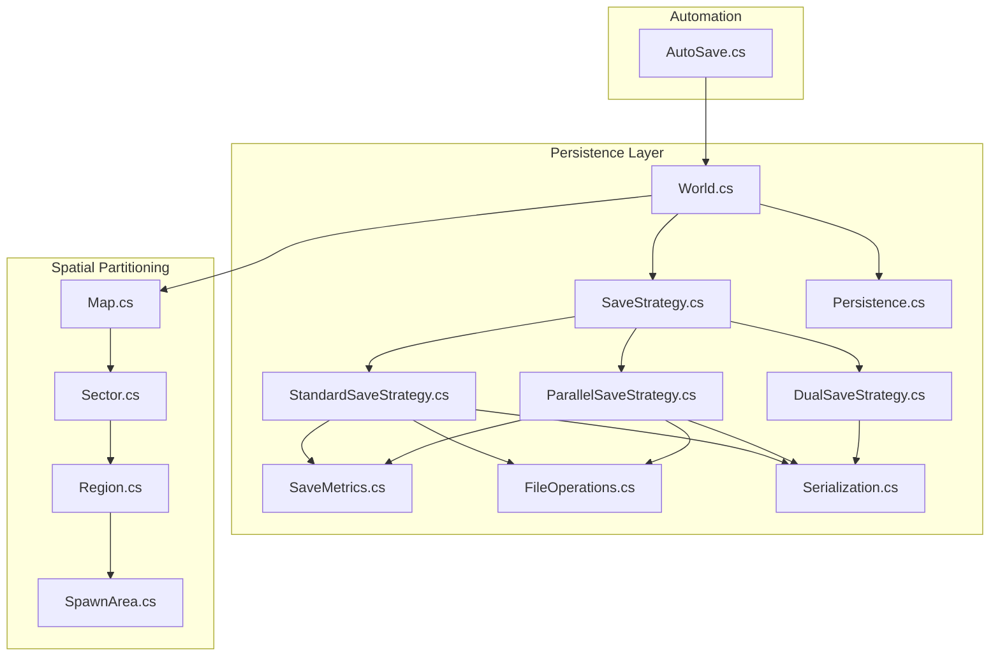
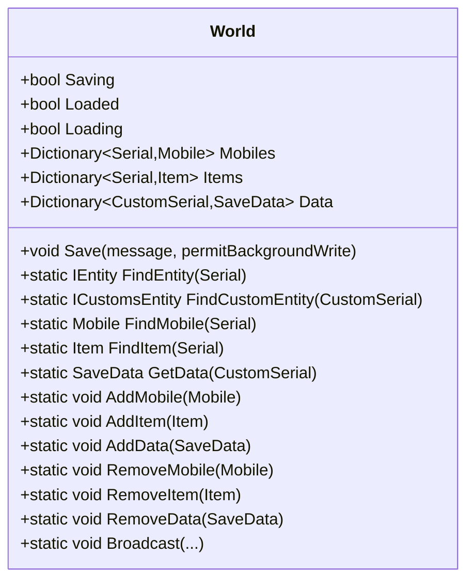
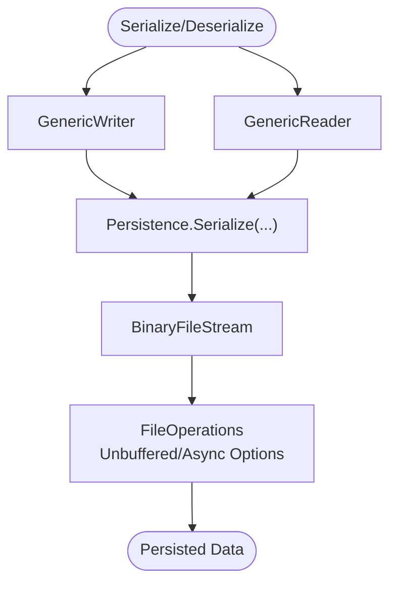
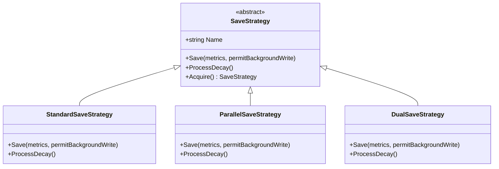
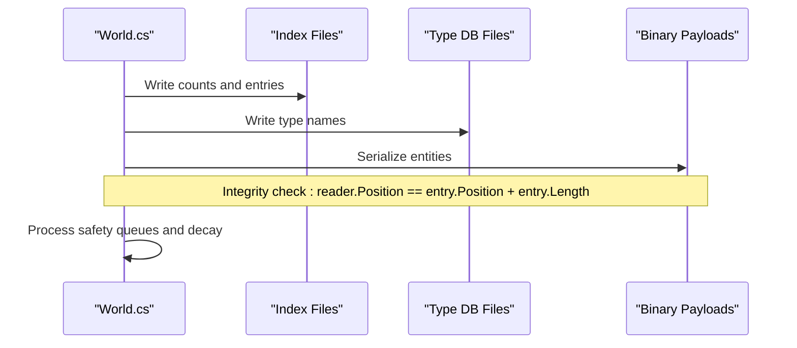
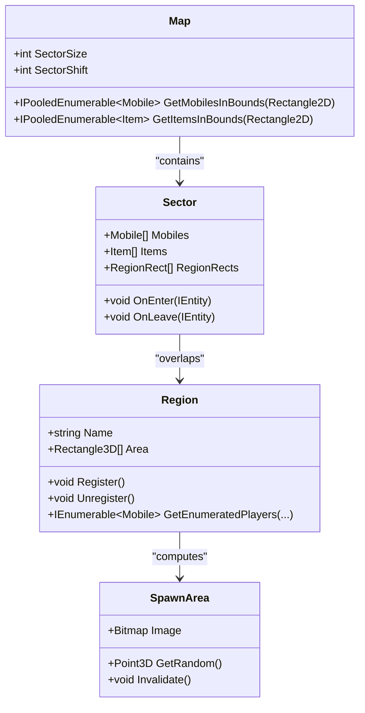
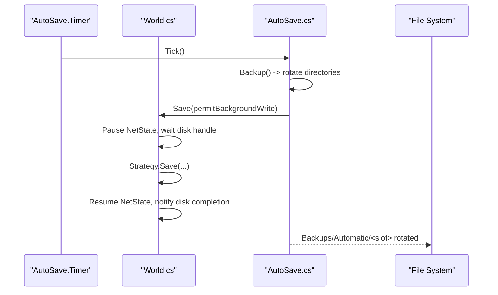
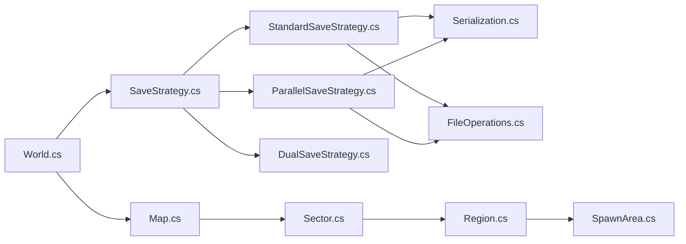

# World Management

<cite>
**Referenced Files in This Document**
- [World.cs](file://Server/World.cs)
- [Serialization.cs](file://Server/Serialization.cs)
- [Persistence.cs](file://Server/Persistence.cs)
- [SaveStrategy.cs](file://Server/Persistence/SaveStrategy.cs)
- [StandardSaveStrategy.cs](file://Server/Persistence/StandardSaveStrategy.cs)
- [ParallelSaveStrategy.cs](file://Server/Persistence/ParallelSaveStrategy.cs)
- [DualSaveStrategy.cs](file://Server/Persistence/DualSaveStrategy.cs)
- [SaveMetrics.cs](file://Server/Persistence/SaveMetrics.cs)
- [FileOperations.cs](file://Server/Persistence/FileOperations.cs)
- [Map.cs](file://Server/Map.cs)
- [Sector.cs](file://Server/Sector.cs)
- [Region.cs](file://Server/Region.cs)
- [SpawnArea.cs](file://Server/SpawnArea.cs)
- [AutoSave.cs](file://Scripts/Misc/AutoSave.cs)
</cite>

## Table of Contents
1. [Introduction](#introduction)
2. [Project Structure](#project-structure)
3. [Core Components](#core-components)
4. [Architecture Overview](#architecture-overview)
5. [Detailed Component Analysis](#detailed-component-analysis)
6. [Dependency Analysis](#dependency-analysis)
7. [Performance Considerations](#performance-considerations)
8. [Troubleshooting Guide](#troubleshooting-guide)
9. [Conclusion](#conclusion)
10. [Appendices](#appendices)

## Introduction
This document explains ServUO’s world management, focusing on the World class and its persistence subsystem. It covers entity indexing and lookup, spatial partitioning via sectors and regions, save/load workflows, multiple save strategies, backup/recovery, data integrity, and performance tuning. Guidance is provided for spawn area management, region-based world organization, and world state synchronization.

## Project Structure
ServUO organizes world persistence and runtime management primarily under Server/World.cs and Server/Persistence/*. The persistence pipeline serializes entities to binary files with separate index/type databases, and strategies coordinate concurrent or sequential writes. Spatial partitioning is handled by Map, Sector, and Region, while SpawnArea provides spawn point generation and filtering.



**Diagram sources**
- [World.cs](file://Server/World.cs#L1097-L1208)
- [SaveStrategy.cs](file://Server/Persistence/SaveStrategy.cs#L1-L40)
- [StandardSaveStrategy.cs](file://Server/Persistence/StandardSaveStrategy.cs#L1-L270)
- [ParallelSaveStrategy.cs](file://Server/Persistence/ParallelSaveStrategy.cs#L1-L385)
- [DualSaveStrategy.cs](file://Server/Persistence/DualSaveStrategy.cs#L1-L41)
- [SaveMetrics.cs](file://Server/Persistence/SaveMetrics.cs#L1-L140)
- [FileOperations.cs](file://Server/Persistence/FileOperations.cs#L1-L134)
- [Serialization.cs](file://Server/Serialization.cs#L1-L200)
- [Persistence.cs](file://Server/Persistence.cs#L1-L119)
- [Map.cs](file://Server/Map.cs#L367-L800)
- [Sector.cs](file://Server/Sector.cs#L1-L368)
- [Region.cs](file://Server/Region.cs#L120-L220)
- [SpawnArea.cs](file://Server/SpawnArea.cs#L1-L200)
- [AutoSave.cs](file://Scripts/Misc/AutoSave.cs#L1-L183)

**Section sources**
- [World.cs](file://Server/World.cs#L1097-L1208)
- [Map.cs](file://Server/Map.cs#L367-L800)
- [Sector.cs](file://Server/Sector.cs#L1-L368)
- [Region.cs](file://Server/Region.cs#L120-L220)
- [SpawnArea.cs](file://Server/SpawnArea.cs#L1-L200)
- [AutoSave.cs](file://Scripts/Misc/AutoSave.cs#L1-L183)

## Core Components
- World: Central persistence coordinator managing entity dictionaries, save/load orchestration, safety queues, and broadcast messaging.
- Save Strategies: Pluggable strategies for writing Saves/Mobiles, Saves/Items, Saves/Guilds, and Saves/Customs with distinct concurrency models.
- Serialization: GenericReader/GenericWriter abstractions for binary serialization and typed collections.
- Persistence helpers: Unified Serialize/Deserialize wrappers and file operation tuning.
- Spatial Partitioning: Map, Sector, Region, and SpawnArea for efficient spatial queries and spawn point computation.

**Section sources**
- [World.cs](file://Server/World.cs#L1097-L1208)
- [SaveStrategy.cs](file://Server/Persistence/SaveStrategy.cs#L1-L40)
- [StandardSaveStrategy.cs](file://Server/Persistence/StandardSaveStrategy.cs#L1-L270)
- [ParallelSaveStrategy.cs](file://Server/Persistence/ParallelSaveStrategy.cs#L1-L385)
- [Serialization.cs](file://Server/Serialization.cs#L1-L200)
- [Persistence.cs](file://Server/Persistence.cs#L1-L119)
- [FileOperations.cs](file://Server/Persistence/FileOperations.cs#L1-L134)
- [Map.cs](file://Server/Map.cs#L367-L800)
- [Sector.cs](file://Server/Sector.cs#L1-L368)
- [Region.cs](file://Server/Region.cs#L120-L220)
- [SpawnArea.cs](file://Server/SpawnArea.cs#L1-L200)

## Architecture Overview
The world lifecycle integrates save/load orchestration, event hooks, and spatial indexing. During save, strategies serialize entities to binary streams, maintain index/type databases, and optionally process decay. During load, indices are read to construct typed constructors, then binary payloads are deserialized with integrity checks.

```mermaid
sequenceDiagram
participant CLI as "Client"
participant AUT as "AutoSave.cs"
participant W as "World.cs"
participant STR as "SaveStrategy"
participant STD as "StandardSaveStrategy"
participant PAR as "ParallelSaveStrategy"
participant BIN as "Binary Writers"
participant IDX as "Index/Type Databases"
CLI->>AUT : Trigger scheduled save
AUT->>W : Save(permitBackgroundWrite)
W->>W : Pause NetState, wait disk handle
W->>STR : Acquire strategy
alt Multi-core
STR->>PAR : Save(...)
PAR->>BIN : Serialize entities concurrently
PAR->>IDX : Write type databases
else Single-core or dual subset
STR->>STD : Save(...)
STD->>BIN : Serialize entities sequentially
STD->>IDX : Write type databases
end
W->>W : Invoke save events
W->>W : Resume NetState, notify disk completion
W->>W : Process safety queues, decay
```

**Diagram sources**
- [AutoSave.cs](file://Scripts/Misc/AutoSave.cs#L56-L104)
- [World.cs](file://Server/World.cs#L1125-L1208)
- [SaveStrategy.cs](file://Server/Persistence/SaveStrategy.cs#L1-L40)
- [StandardSaveStrategy.cs](file://Server/Persistence/StandardSaveStrategy.cs#L41-L120)
- [ParallelSaveStrategy.cs](file://Server/Persistence/ParallelSaveStrategy.cs#L36-L118)

## Detailed Component Analysis

### World: Entity Indexing, Lookup, and Safety Queues
- Maintains dictionaries for Mobiles, Items, and SaveData (custom entities).
- Provides Find/Add/Remove APIs for fast lookup by Serial/CustomSerial.
- Coordinates save/load with safety queues to defer add/delete during persistence.
- Broadcasts world messages and manages disk-write synchronization via ManualResetEvent.



**Diagram sources**
- [World.cs](file://Server/World.cs#L1097-L1208)
- [World.cs](file://Server/World.cs#L1214-L1414)

**Section sources**
- [World.cs](file://Server/World.cs#L1097-L1208)
- [World.cs](file://Server/World.cs#L1214-L1414)

### Persistence Pipeline: Serialization and File I/O
- GenericReader/GenericWriter define the serialization contract for primitives, collections, and typed references.
- Persistence helpers wrap file operations with ensure-create semantics and safe reads/writes.
- FileOperations exposes unbuffered/asynchronous streaming options for throughput tuning.



**Diagram sources**
- [Serialization.cs](file://Server/Serialization.cs#L1-L200)
- [Persistence.cs](file://Server/Persistence.cs#L1-L119)
- [FileOperations.cs](file://Server/Persistence/FileOperations.cs#L1-L134)

**Section sources**
- [Serialization.cs](file://Server/Serialization.cs#L1-L200)
- [Persistence.cs](file://Server/Persistence.cs#L1-L119)
- [FileOperations.cs](file://Server/Persistence/FileOperations.cs#L1-L134)

### Save Strategies: Sequential, Parallel, Dual
- Strategy selection depends on multi-processor availability and configuration.
- Standard: Sequential writes for all categories; supports optional background write signaling.
- Parallel: Producer-consumer model with memory buffering and concurrent consumers; writes type databases post-enqueue.
- Dual: Runs item save on a dedicated thread while other categories save on the main thread.



**Diagram sources**
- [SaveStrategy.cs](file://Server/Persistence/SaveStrategy.cs#L1-L40)
- [StandardSaveStrategy.cs](file://Server/Persistence/StandardSaveStrategy.cs#L1-L270)
- [ParallelSaveStrategy.cs](file://Server/Persistence/ParallelSaveStrategy.cs#L1-L385)
- [DualSaveStrategy.cs](file://Server/Persistence/DualSaveStrategy.cs#L1-L41)

**Section sources**
- [SaveStrategy.cs](file://Server/Persistence/SaveStrategy.cs#L1-L40)
- [StandardSaveStrategy.cs](file://Server/Persistence/StandardSaveStrategy.cs#L41-L120)
- [ParallelSaveStrategy.cs](file://Server/Persistence/ParallelSaveStrategy.cs#L36-L118)
- [DualSaveStrategy.cs](file://Server/Persistence/DualSaveStrategy.cs#L19-L41)

### Save Workflows: Save/Load Indexing and Integrity
- Save: Iterates dictionaries, writes index entries (type id, serial, position, length), serializes payload, updates metrics, and closes writers.
- Load: Reads type databases to resolve constructors, constructs entities, then deserializes payloads with position/length checks; handles failures gracefully and logs recovery options.



**Diagram sources**
- [World.cs](file://Server/World.cs#L1097-L1208)
- [World.cs](file://Server/World.cs#L348-L800)
- [StandardSaveStrategy.cs](file://Server/Persistence/StandardSaveStrategy.cs#L74-L180)
- [ParallelSaveStrategy.cs](file://Server/Persistence/ParallelSaveStrategy.cs#L119-L242)

**Section sources**
- [World.cs](file://Server/World.cs#L348-L800)
- [World.cs](file://Server/World.cs#L1097-L1208)
- [StandardSaveStrategy.cs](file://Server/Persistence/StandardSaveStrategy.cs#L74-L180)
- [ParallelSaveStrategy.cs](file://Server/Persistence/ParallelSaveStrategy.cs#L119-L242)

### Spatial Partitioning: Map, Sector, Region, SpawnArea
- Map defines sector grid size and enumerables for spatial queries; Region registers areas and priorities; Sector tracks entities and region rectangles; SpawnArea computes valid spawn points with filters and validators.



**Diagram sources**
- [Map.cs](file://Server/Map.cs#L367-L800)
- [Sector.cs](file://Server/Sector.cs#L1-L368)
- [Region.cs](file://Server/Region.cs#L120-L220)
- [SpawnArea.cs](file://Server/SpawnArea.cs#L1-L200)

**Section sources**
- [Map.cs](file://Server/Map.cs#L367-L800)
- [Sector.cs](file://Server/Sector.cs#L1-L368)
- [Region.cs](file://Server/Region.cs#L120-L220)
- [SpawnArea.cs](file://Server/SpawnArea.cs#L1-L200)

### Backup and Recovery Procedures
- AutoSave orchestrates periodic saves, rotates backups, and triggers World.Save with background write support.
- Backup moves Saves to Backups/Automatic with rotation and archives via ArchivedSaves.



**Diagram sources**
- [AutoSave.cs](file://Scripts/Misc/AutoSave.cs#L56-L167)
- [World.cs](file://Server/World.cs#L1125-L1208)

**Section sources**
- [AutoSave.cs](file://Scripts/Misc/AutoSave.cs#L56-L167)
- [World.cs](file://Server/World.cs#L1125-L1208)

### Data Integrity Measures
- Load-time integrity checks compare deserialized position against expected length; failures log recovery prompts and allow selective cleanup.
- Safety queues defer add/delete during save to prevent inconsistent state; warnings are logged to a persistent file.

**Section sources**
- [World.cs](file://Server/World.cs#L348-L800)
- [World.cs](file://Server/World.cs#L919-L1030)

### World State Synchronization
- During save, NetState is paused to prevent concurrent modifications; after save completes, NetState resumes and safety queues are processed to reconcile pending adds/deletes.

**Section sources**
- [World.cs](file://Server/World.cs#L1125-L1208)

## Dependency Analysis
- World depends on SaveStrategy implementations and invokes event sinks around save lifecycle.
- Strategies depend on Serialization for entity serialization and FileOperations for optimized I/O.
- Spatial components are orthogonal to persistence but integrate with World via entity enumeration and region registration.



**Diagram sources**
- [World.cs](file://Server/World.cs#L1097-L1208)
- [SaveStrategy.cs](file://Server/Persistence/SaveStrategy.cs#L1-L40)
- [StandardSaveStrategy.cs](file://Server/Persistence/StandardSaveStrategy.cs#L1-L270)
- [ParallelSaveStrategy.cs](file://Server/Persistence/ParallelSaveStrategy.cs#L1-L385)
- [DualSaveStrategy.cs](file://Server/Persistence/DualSaveStrategy.cs#L1-L41)
- [Serialization.cs](file://Server/Serialization.cs#L1-L200)
- [FileOperations.cs](file://Server/Persistence/FileOperations.cs#L1-L134)
- [Map.cs](file://Server/Map.cs#L367-L800)
- [Sector.cs](file://Server/Sector.cs#L1-L368)
- [Region.cs](file://Server/Region.cs#L120-L220)
- [SpawnArea.cs](file://Server/SpawnArea.cs#L1-L200)

**Section sources**
- [World.cs](file://Server/World.cs#L1097-L1208)
- [SaveStrategy.cs](file://Server/Persistence/SaveStrategy.cs#L1-L40)
- [StandardSaveStrategy.cs](file://Server/Persistence/StandardSaveStrategy.cs#L1-L270)
- [ParallelSaveStrategy.cs](file://Server/Persistence/ParallelSaveStrategy.cs#L1-L385)
- [DualSaveStrategy.cs](file://Server/Persistence/DualSaveStrategy.cs#L1-L41)
- [Serialization.cs](file://Server/Serialization.cs#L1-L200)
- [FileOperations.cs](file://Server/Persistence/FileOperations.cs#L1-L134)
- [Map.cs](file://Server/Map.cs#L367-L800)
- [Sector.cs](file://Server/Sector.cs#L1-L368)
- [Region.cs](file://Server/Region.cs#L120-L220)
- [SpawnArea.cs](file://Server/SpawnArea.cs#L1-L200)

## Performance Considerations
- Choose strategy based on hardware:
  - ParallelSaveStrategy leverages multiple cores and asynchronous I/O for large worlds.
  - StandardSaveStrategy offers simplicity and deterministic ordering.
  - DualSaveStrategy splits item serialization onto a dedicated thread.
- Tune I/O:
  - FileOperations supports unbuffered I/O and asynchronous flags; adjust buffer sizes and concurrency for storage characteristics.
- Metrics:
  - SaveMetrics exposes performance counters for items/mobiles/data rates and serialized/written bytes per second.
- Serialization:
  - GenericWriter minimizes allocations with buffered writes; ensure entities free caches after serialization to reduce overhead.

[No sources needed since this section provides general guidance]

## Troubleshooting Guide
- Common issues:
  - Type resolution failures during load: the loader attempts to locate types and may prompt deletion of affected entries; verify type names and constructors.
  - Corruption or mismatched lengths: integrity checks raise exceptions; review logs and consider backup restoration.
  - Concurrent add/delete during save: World defers operations to safety queues and logs warnings; scripts should avoid mutating world state during save.
- Recovery steps:
  - Use AutoSave backup rotation to restore prior snapshots.
  - Investigate world-save-errors.log for safety queue warnings.
  - Validate type databases and re-run load to rebuild indices.

**Section sources**
- [World.cs](file://Server/World.cs#L348-L800)
- [World.cs](file://Server/World.cs#L919-L1030)
- [AutoSave.cs](file://Scripts/Misc/AutoSave.cs#L105-L167)

## Conclusion
ServUO’s world management combines robust persistence with spatial partitioning and flexible save strategies. The World class coordinates save/load lifecycles, maintains entity indices, and enforces data integrity. Strategies balance throughput and determinism, while spatial components optimize lookups and spawn generation. Proper backup and metrics practices ensure reliability and performance for large worlds.

[No sources needed since this section summarizes without analyzing specific files]

## Appendices

### Entity Serialization Formats
- Index entries record type id, serial, position, and length for each entity category.
- Type databases enumerate full type names for constructor resolution.
- Binary payloads are written via GenericWriter with position tracking and metrics.

**Section sources**
- [World.cs](file://Server/World.cs#L1031-L1093)
- [StandardSaveStrategy.cs](file://Server/Persistence/StandardSaveStrategy.cs#L116-L180)
- [ParallelSaveStrategy.cs](file://Server/Persistence/ParallelSaveStrategy.cs#L119-L242)
- [Serialization.cs](file://Server/Serialization.cs#L1-L200)

### Spawn Area Management
- SpawnArea builds a filtered, validated spawn map from Region bounds, supporting validators and tile filters.
- Supports random spawn point selection with Z-height lookup and validator checks.

**Section sources**
- [SpawnArea.cs](file://Server/SpawnArea.cs#L1-L200)
- [SpawnArea.cs](file://Server/SpawnArea.cs#L312-L464)
- [Region.cs](file://Server/Region.cs#L120-L220)