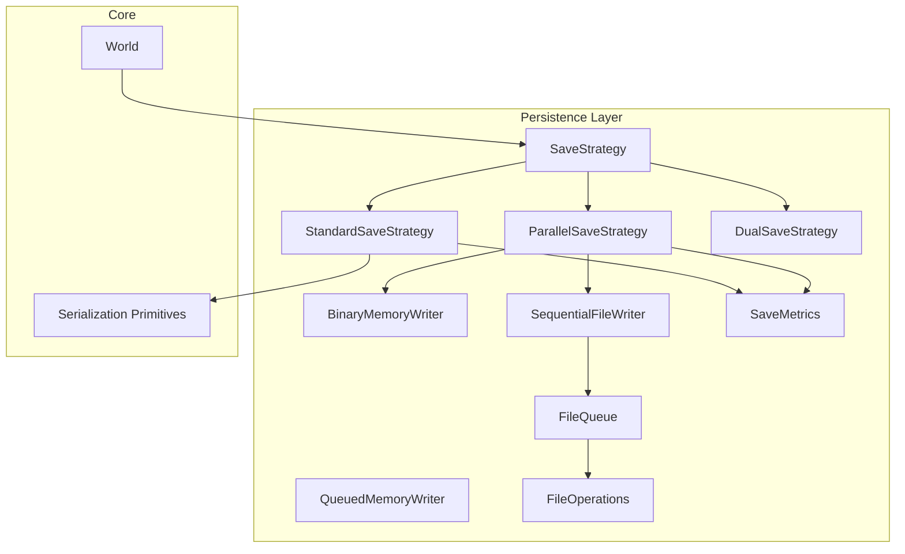
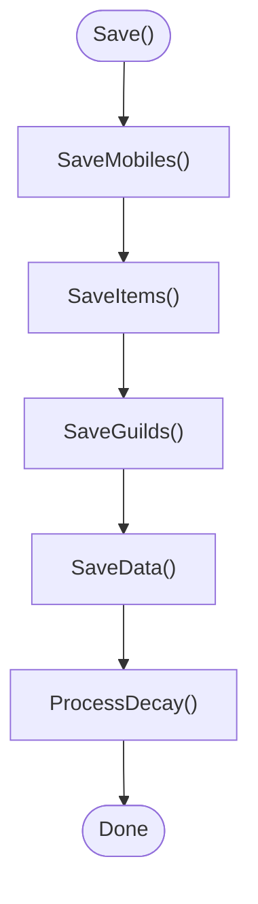
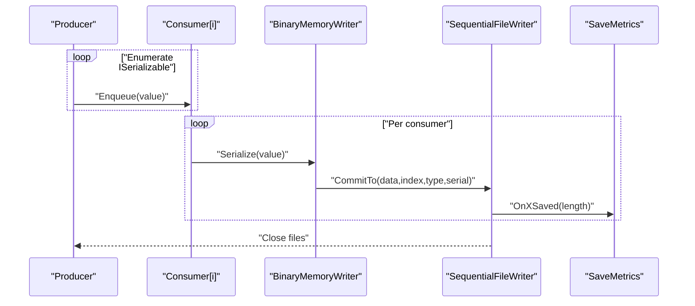
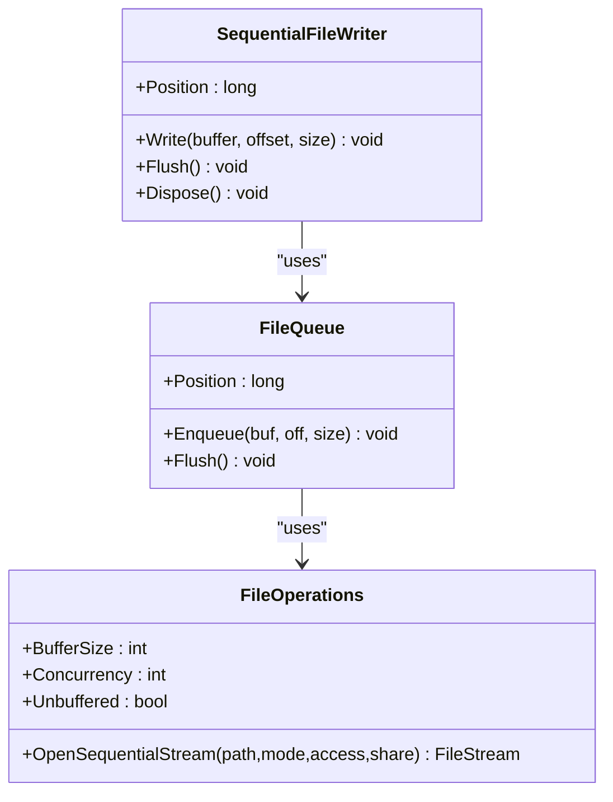
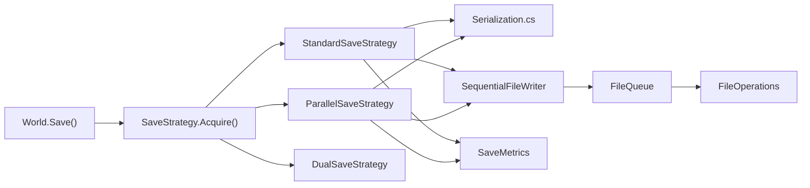
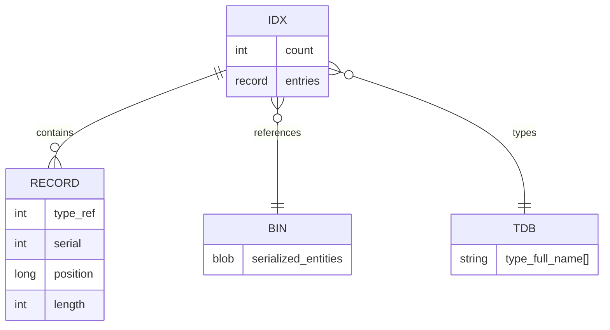

# World Persistence

<cite>
**Referenced Files in This Document**
- [Persistence.cs](file://Server/Persistence/Persistence.cs)
- [SaveStrategy.cs](file://Server/Persistence/SaveStrategy.cs)
- [StandardSaveStrategy.cs](file://Server/Persistence/StandardSaveStrategy.cs)
- [ParallelSaveStrategy.cs](file://Server/Persistence/ParallelSaveStrategy.cs)
- [DualSaveStrategy.cs](file://Server/Persistence/DualSaveStrategy.cs)
- [BinaryMemoryWriter.cs](file://Server/Persistence/BinaryMemoryWriter.cs)
- [QueuedMemoryWriter.cs](file://Server/Persistence/QueuedMemoryWriter.cs)
- [SequentialFileWriter.cs](file://Server/Persistence/SequentialFileWriter.cs)
- [FileOperations.cs](file://Server/Persistence/FileOperations.cs)
- [FileQueue.cs](file://Server/Persistence/FileQueue.cs)
- [SaveMetrics.cs](file://Server/Persistence/SaveMetrics.cs)
- [World.cs](file://Server/World.cs)
- [Serialization.cs](file://Server/Serialization.cs)
</cite>

## Table of Contents
1. [Introduction](#introduction)
2. [Project Structure](#project-structure)
3. [Core Components](#core-components)
4. [Architecture Overview](#architecture-overview)
5. [Detailed Component Analysis](#detailed-component-analysis)
6. [Dependency Analysis](#dependency-analysis)
7. [Performance Considerations](#performance-considerations)
8. [Troubleshooting Guide](#troubleshooting-guide)
9. [Conclusion](#conclusion)
10. [Appendices](#appendices)

## Introduction
This document explains ServUO’s world persistence system: how the server serializes and persists world data, the save strategies used, and the binary file layout. It covers the save workflow from World.Save() through to file output, including entity enumeration, property serialization, and data integrity checks. It also documents backup strategies, recovery procedures, corruption detection, performance optimizations for large worlds, memory management during saves, concurrent save operations, common issues, error handling, and monitoring save health. Finally, it provides examples of customizing save strategies and serialization.

## Project Structure
The persistence subsystem resides under Server/Persistence and integrates with core world management in Server/World.cs and serialization primitives in Server/Serialization.cs. The key areas are:
- Save strategy selection and execution
- File writing pipeline (sequential, asynchronous, buffering)
- Binary serialization primitives
- Metrics and diagnostics
- World-level save orchestration



**Diagram sources**
- [SaveStrategy.cs](file://Server/Persistence/SaveStrategy.cs#L1-L40)
- [StandardSaveStrategy.cs](file://Server/Persistence/StandardSaveStrategy.cs#L1-L270)
- [ParallelSaveStrategy.cs](file://Server/Persistence/ParallelSaveStrategy.cs#L1-L385)
- [DualSaveStrategy.cs](file://Server/Persistence/DualSaveStrategy.cs#L1-L41)
- [BinaryMemoryWriter.cs](file://Server/Persistence/BinaryMemoryWriter.cs#L1-L96)
- [QueuedMemoryWriter.cs](file://Server/Persistence/QueuedMemoryWriter.cs#L1-L131)
- [SequentialFileWriter.cs](file://Server/Persistence/SequentialFileWriter.cs#L1-L173)
- [FileOperations.cs](file://Server/Persistence/FileOperations.cs#L1-L134)
- [FileQueue.cs](file://Server/Persistence/FileQueue.cs#L1-L263)
- [SaveMetrics.cs](file://Server/Persistence/SaveMetrics.cs#L1-L140)
- [World.cs](file://Server/World.cs#L1097-L1129)
- [Serialization.cs](file://Server/Serialization.cs#L1-L200)

**Section sources**
- [SaveStrategy.cs](file://Server/Persistence/SaveStrategy.cs#L1-L40)
- [World.cs](file://Server/World.cs#L1097-L1129)

## Core Components
- Persistence: High-level serialize/deserialize helpers that open files, construct writers/readers, and handle basic IO exceptions.
- SaveStrategy family: Strategy selection and implementations for Standard, Parallel, and Dual saves.
- Serialization primitives: GenericReader/GenericWriter and BinaryFileWriter for binary encoding of properties and entities.
- File pipeline: SequentialFileWriter, FileQueue, and FileOperations for buffered, asynchronous, and unbuffered writes.
- Memory writers: BinaryMemoryWriter and QueuedMemoryWriter for staging serialized data before committing to disk.
- Metrics: SaveMetrics for performance counters and throughput monitoring.

**Section sources**
- [Persistence.cs](file://Server/Persistence/Persistence.cs#L1-L119)
- [SaveStrategy.cs](file://Server/Persistence/SaveStrategy.cs#L1-L40)
- [StandardSaveStrategy.cs](file://Server/Persistence/StandardSaveStrategy.cs#L1-L270)
- [ParallelSaveStrategy.cs](file://Server/Persistence/ParallelSaveStrategy.cs#L1-L385)
- [BinaryMemoryWriter.cs](file://Server/Persistence/BinaryMemoryWriter.cs#L1-L96)
- [QueuedMemoryWriter.cs](file://Server/Persistence/QueuedMemoryWriter.cs#L1-L131)
- [SequentialFileWriter.cs](file://Server/Persistence/SequentialFileWriter.cs#L1-L173)
- [FileOperations.cs](file://Server/Persistence/FileOperations.cs#L1-L134)
- [FileQueue.cs](file://Server/Persistence/FileQueue.cs#L1-L263)
- [SaveMetrics.cs](file://Server/Persistence/SaveMetrics.cs#L1-L140)
- [Serialization.cs](file://Server/Serialization.cs#L1-L200)

## Architecture Overview
The save architecture centers around World.Save(), which:
- Pauses network activity and waits for any in-progress disk writes
- Selects a save strategy based on hardware and configuration
- Enumerates entities (mobiles, items, guilds, custom data)
- Serializes each entity to memory via BinaryMemoryWriter or QueuedMemoryWriter
- Commits serialized blocks to sequential index/data files
- Updates metrics and notifies completion

```mermaid
sequenceDiagram
participant World as "World"
participant Strat as "SaveStrategy"
participant Std as "StandardSaveStrategy"
participant Par as "ParallelSaveStrategy"
participant Mem as "BinaryMemoryWriter/QueuedMemoryWriter"
participant Seq as "SequentialFileWriter"
participant FQ as "FileQueue"
participant FO as "FileOperations"
participant Met as "SaveMetrics"
World->>World : "Pause networking, wait for disk"
World->>Strat : "Acquire()"
Strat-->>World : "Strategy instance"
World->>Strat : "Save(metrics, permitBackground)"
alt "Standard/Dual"
Strat->>Std : "Save(...)"
Std->>Mem : "Serialize entities to memory"
Std->>Seq : "Write index and data"
Seq->>FQ : "Enqueue buffers"
FQ->>FO : "Write to disk"
Std->>Met : "OnXSaved(...)"
else "Parallel"
Strat->>Par : "Save(...)"
Par->>Mem : "Per-thread memory serialization"
Par->>Seq : "CommitTo(index,data) batches"
Seq->>FQ : "Enqueue buffers"
FQ->>FO : "Write to disk"
Par->>Met : "OnXSaved(...)"
end
World->>World : "NotifyDiskWriteComplete()"
```

**Diagram sources**
- [World.cs](file://Server/World.cs#L1097-L1129)
- [SaveStrategy.cs](file://Server/Persistence/SaveStrategy.cs#L1-L40)
- [StandardSaveStrategy.cs](file://Server/Persistence/StandardSaveStrategy.cs#L1-L270)
- [ParallelSaveStrategy.cs](file://Server/Persistence/ParallelSaveStrategy.cs#L1-L385)
- [BinaryMemoryWriter.cs](file://Server/Persistence/BinaryMemoryWriter.cs#L1-L96)
- [QueuedMemoryWriter.cs](file://Server/Persistence/QueuedMemoryWriter.cs#L1-L131)
- [SequentialFileWriter.cs](file://Server/Persistence/SequentialFileWriter.cs#L1-L173)
- [FileQueue.cs](file://Server/Persistence/FileQueue.cs#L1-L263)
- [FileOperations.cs](file://Server/Persistence/FileOperations.cs#L1-L134)
- [SaveMetrics.cs](file://Server/Persistence/SaveMetrics.cs#L1-L140)

## Detailed Component Analysis

### Persistence Helper
- Provides Serialize(path, serializer) and Deserialize(path, deserializer) helpers.
- Ensures directories exist, creates missing files, and opens appropriate streams.
- Uses BinaryFileWriter for writing and BinaryFileReader for reading.
- Handles EndOfStream and generic exceptions during load with contextual messages.

**Section sources**
- [Persistence.cs](file://Server/Persistence/Persistence.cs#L1-L119)

### Save Strategy Selection and Execution
- SaveStrategy.Acquire selects strategy based on Core.MultiProcessor and processor count:
  - ParallelSaveStrategy for multi-core systems
  - DualSaveStrategy for dual-threaded subset saves
  - StandardSaveStrategy otherwise
- SaveStrategy defines Save(metrics, permitBackgroundWrite) and ProcessDecay() hooks.

**Section sources**
- [SaveStrategy.cs](file://Server/Persistence/SaveStrategy.cs#L1-L40)

### Standard Save Strategy
- Saves entities in order: Mobiles → Items → Guilds → Custom Data.
- Uses BinaryFileWriter for index (.idx), type database (.tdb), and binary data (.bin).
- Writes counts, type references, serials, positions, and lengths per record.
- Supports background write mode via AsyncWriter (not used here) when configured.
- Tracks decay queue and frees caches after writing.



**Diagram sources**
- [StandardSaveStrategy.cs](file://Server/Persistence/StandardSaveStrategy.cs#L1-L270)

**Section sources**
- [StandardSaveStrategy.cs](file://Server/Persistence/StandardSaveStrategy.cs#L1-L270)

### Parallel Save Strategy
- Uses producer-consumer threads to serialize entities concurrently.
- Producer enumerates World.Mobiles, World.Items, BaseGuild.List, and World.Data.
- Consumers write to per-type BinaryMemoryWriter instances, then commit to SequentialFileWriter via CommitTo().
- Maintains a decay queue for items due for decay.
- Waits for all consumers to finish, then closes files and notifies completion.



**Diagram sources**
- [ParallelSaveStrategy.cs](file://Server/Persistence/ParallelSaveStrategy.cs#L1-L385)
- [BinaryMemoryWriter.cs](file://Server/Persistence/BinaryMemoryWriter.cs#L1-L96)
- [SequentialFileWriter.cs](file://Server/Persistence/SequentialFileWriter.cs#L1-L173)
- [SaveMetrics.cs](file://Server/Persistence/SaveMetrics.cs#L1-L140)

**Section sources**
- [ParallelSaveStrategy.cs](file://Server/Persistence/ParallelSaveStrategy.cs#L1-L385)
- [BinaryMemoryWriter.cs](file://Server/Persistence/BinaryMemoryWriter.cs#L1-L96)

### Dual Save Strategy
- Runs a dedicated thread to save items while the main thread saves mobiles, guilds, and custom data.
- Joins the worker thread before finishing.
- Honors permitBackgroundWrite semantics similar to Standard.

**Section sources**
- [DualSaveStrategy.cs](file://Server/Persistence/DualSaveStrategy.cs#L1-L41)

### Memory Writers
- BinaryMemoryWriter: In-memory staging with CommitTo() to write serialized bytes and append index entries.
- QueuedMemoryWriter: Stages multiple entities and writes them as a batch with ordered index entries.

**Section sources**
- [BinaryMemoryWriter.cs](file://Server/Persistence/BinaryMemoryWriter.cs#L1-L96)
- [QueuedMemoryWriter.cs](file://Server/Persistence/QueuedMemoryWriter.cs#L1-L131)

### File Writing Pipeline
- SequentialFileWriter wraps a FileStream opened via FileOperations.OpenSequentialStream with FileOptions.SequentialScan and optional Asynchronous/NoBuffering.
- FileQueue aggregates buffers, manages concurrency, and commits chunks to disk.
- FileOperations exposes BufferSize, Concurrency, Unbuffered toggles and platform-specific unbuffered FileStream.



**Diagram sources**
- [SequentialFileWriter.cs](file://Server/Persistence/SequentialFileWriter.cs#L1-L173)
- [FileQueue.cs](file://Server/Persistence/FileQueue.cs#L1-L263)
- [FileOperations.cs](file://Server/Persistence/FileOperations.cs#L1-L134)

**Section sources**
- [SequentialFileWriter.cs](file://Server/Persistence/SequentialFileWriter.cs#L1-L173)
- [FileQueue.cs](file://Server/Persistence/FileQueue.cs#L1-L263)
- [FileOperations.cs](file://Server/Persistence/FileOperations.cs#L1-L134)

### Serialization Primitives
- GenericReader/GenericWriter define the serialization contract for primitives, collections, and entity references.
- BinaryFileWriter implements efficient binary encoding with buffered writes, variable-length integers, and UTF-8 string handling.
- Entities implement Serialize(GenericWriter) to persist properties and nested collections.

**Section sources**
- [Serialization.cs](file://Server/Serialization.cs#L1-L200)
- [Serialization.cs](file://Server/Serialization.cs#L198-L800)

### World Save Orchestration
- World.Save() coordinates save lifecycle: pause networking, wait for disk, set flags, broadcast messages, select strategy, and notify completion.
- Paths for Saves/Mobiles, Saves/Items, Saves/Guilds, Saves/Customs are defined statically.

**Section sources**
- [World.cs](file://Server/World.cs#L1097-L1129)
- [World.cs](file://Server/World.cs#L38-L52)

## Dependency Analysis
- World depends on SaveStrategy.Acquire() to choose the save implementation.
- Save strategies depend on Serialization primitives and file pipeline components.
- File pipeline depends on FileOperations for OS-level file handles and buffering.
- Metrics are integrated across strategies to track throughput and bytes.



**Diagram sources**
- [World.cs](file://Server/World.cs#L1097-L1129)
- [SaveStrategy.cs](file://Server/Persistence/SaveStrategy.cs#L1-L40)
- [StandardSaveStrategy.cs](file://Server/Persistence/StandardSaveStrategy.cs#L1-L270)
- [ParallelSaveStrategy.cs](file://Server/Persistence/ParallelSaveStrategy.cs#L1-L385)
- [SequentialFileWriter.cs](file://Server/Persistence/SequentialFileWriter.cs#L1-L173)
- [FileQueue.cs](file://Server/Persistence/FileQueue.cs#L1-L263)
- [FileOperations.cs](file://Server/Persistence/FileOperations.cs#L1-L134)
- [SaveMetrics.cs](file://Server/Persistence/SaveMetrics.cs#L1-L140)
- [Serialization.cs](file://Server/Serialization.cs#L1-L200)

**Section sources**
- [World.cs](file://Server/World.cs#L1097-L1129)
- [SaveStrategy.cs](file://Server/Persistence/SaveStrategy.cs#L1-L40)
- [Serialization.cs](file://Server/Serialization.cs#L1-L200)

## Performance Considerations
- Concurrency tuning:
  - Adjust FileOperations.Concurrency to balance throughput and latency.
  - ParallelSaveStrategy spawns threads based on processor count minus one; tune for workload.
- Buffering:
  - FileOperations.BufferSize controls per-chunk buffer size; larger buffers reduce syscalls on high-throughput systems.
  - Unbuffered I/O can improve sequential throughput on some storage stacks; ensure filesystem supports it.
- Memory staging:
  - BinaryMemoryWriter minimizes per-entity allocations by reusing MemoryStream and flushing only when committing.
  - QueuedMemoryWriter batches multiple entities to reduce index overhead.
- Metrics:
  - SaveMetrics tracks items/mobiles/customs saved per second and serialized/written bytes per second; use to validate tuning.
- Background writes:
  - StandardSaveStrategy supports background write mode; when disabled, it still flushes and completes promptly.

[No sources needed since this section provides general guidance]

## Troubleshooting Guide
- Corruption detection:
  - During load, EndOfStream is treated as truncation when file length > 0; generic exceptions during deserialization are wrapped with context.
  - Verify index lengths match recorded sizes and that type databases (.tdb) align with actual types.
- Backup and recovery:
  - Keep pre-save backups of Saves/Mobiles, Saves/Items, Saves/Guilds, and Saves/Customs directories.
  - After a crash, restore the latest complete backup; if partial, remove truncated .bin/.idx pairs and regenerate types from the game state.
- Monitoring save health:
  - Use SaveMetrics to observe rates and detect stalls or excessive serialization times.
  - Watch for frequent NotifyDiskWriteComplete() calls indicating rapid successive saves.
- Common issues:
  - Serialization errors: ensure all types are registered in type databases and that entity references resolve to existing objects.
  - Disk stalls: check FileQueue idle state and FileOperations concurrency settings.
  - Memory pressure: reduce concurrency or increase buffer sizes; monitor GC pressure during large saves.

**Section sources**
- [Persistence.cs](file://Server/Persistence/Persistence.cs#L91-L117)
- [SaveMetrics.cs](file://Server/Persistence/SaveMetrics.cs#L1-L140)
- [SequentialFileWriter.cs](file://Server/Persistence/SequentialFileWriter.cs#L93-L173)
- [FileQueue.cs](file://Server/Persistence/FileQueue.cs#L69-L118)

## Conclusion
ServUO’s persistence system combines flexible save strategies, efficient binary serialization, and a robust file pipeline to reliably persist large worlds. Standard, Parallel, and Dual strategies offer trade-offs between simplicity, throughput, and resource usage. The binary format organizes entities by type with index files pointing to contiguous data blocks, enabling fast random access. With metrics and careful tuning of concurrency and buffering, servers can maintain high save throughput while ensuring data integrity.

[No sources needed since this section summarizes without analyzing specific files]

## Appendices

### Binary Serialization Format Overview
- Index (.idx): Contains counts followed by records of type reference, serial, start position, and length for each entity.
- Data (.bin): Concatenated serialized entity blobs; each entity writes its own header and payload.
- Type database (.tdb): Lists full type names for each type reference used in the index.
- Custom data follows the same pattern under Saves/Customs.



[No sources needed since this diagram shows conceptual structure]

### Save Workflow From World.Save()
- Pause networking, wait for disk, set flags, broadcast message.
- Acquire strategy and execute Save().
- For Standard: enumerate and serialize in order; write counts, indices, and data; update metrics.
- For Parallel: enqueue entities, serialize in parallel, commit batches, update metrics.
- Close files and notify completion.

**Section sources**
- [World.cs](file://Server/World.cs#L1097-L1129)
- [StandardSaveStrategy.cs](file://Server/Persistence/StandardSaveStrategy.cs#L74-L180)
- [ParallelSaveStrategy.cs](file://Server/Persistence/ParallelSaveStrategy.cs#L29-L118)

### Custom Save Strategies and Serialization Customization
- Custom strategy:
  - Derive from SaveStrategy and implement Save() and ProcessDecay().
  - Use BinaryMemoryWriter or QueuedMemoryWriter to stage serialization.
  - Commit to SequentialFileWriter for index/data files.
- Serialization customization:
  - Override entity Serialize(GenericWriter) to add/remove fields.
  - Use WriteEncodedInt, WriteString, Write(Item/Mobile/Guild/Data) for references.
  - Maintain index consistency by recording type references and lengths.

**Section sources**
- [SaveStrategy.cs](file://Server/Persistence/SaveStrategy.cs#L1-L40)
- [BinaryMemoryWriter.cs](file://Server/Persistence/BinaryMemoryWriter.cs#L1-L96)
- [QueuedMemoryWriter.cs](file://Server/Persistence/QueuedMemoryWriter.cs#L1-L131)
- [Serialization.cs](file://Server/Serialization.cs#L198-L800)